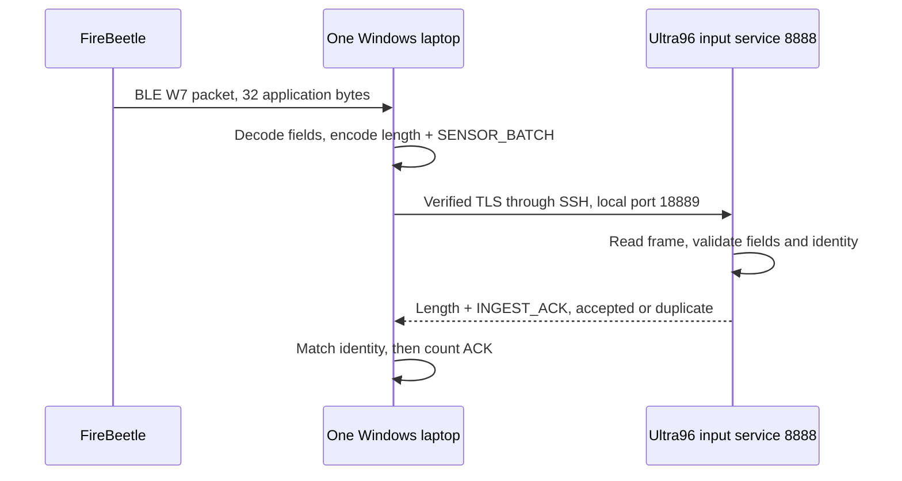
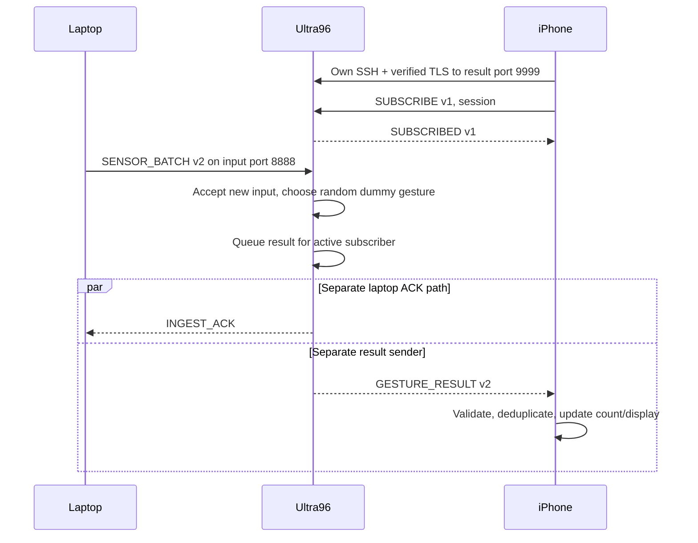
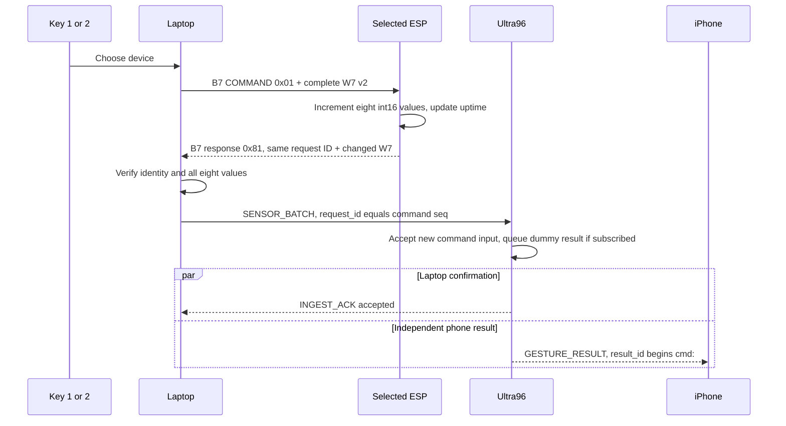
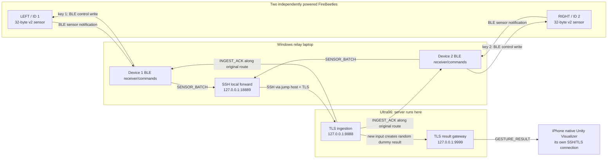
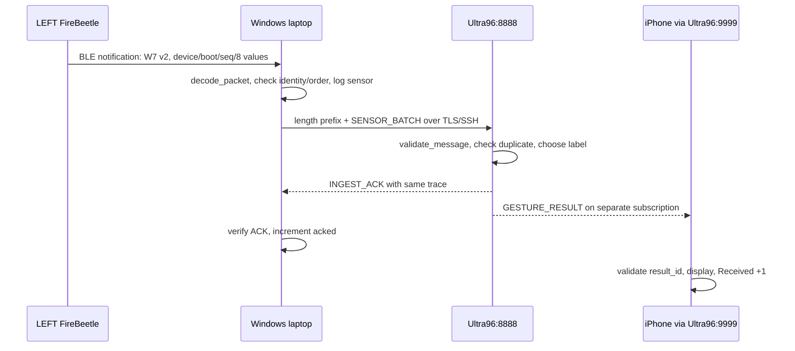
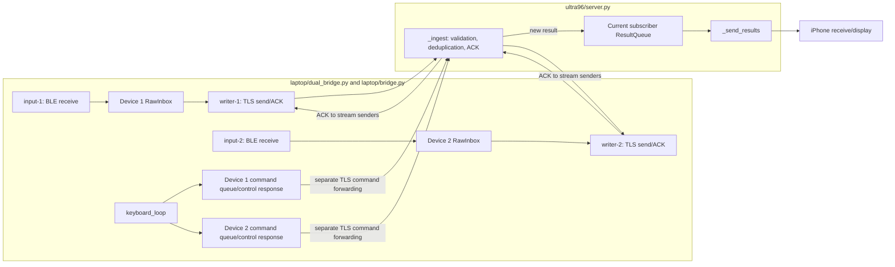
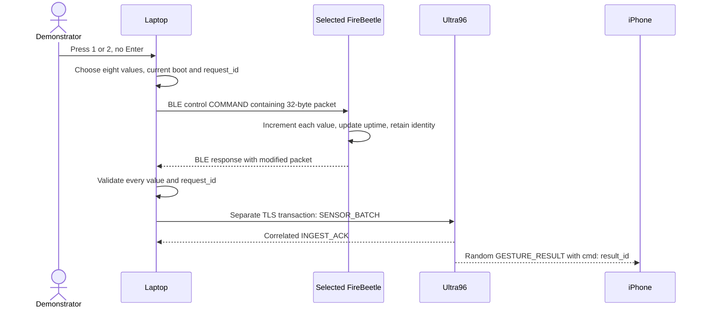

# B07 Communications: live demonstration in the instructor's exact order

**Deployment note:** `D:\LetThemCook`, the default SSH account, `demo.py service`, and the installed phone's **Week 7 Connect** label describe the original B07 demonstration. In another checkout, use its actual repository root and the explicit SSH/CA options in the [communications quickstart](communications-quickstart.md). A different Ultra96 also needs a verified iPhone trust update and rebuilt app.

**Protocol navigation:** [1. Laptop ↔ Ultra96](#live-protocol-laptop) · [2. Ultra96 ↔ iPhone](#live-protocol-phone) · [4.1 FireBeetle IDs, packet types, and layouts](#live-protocol-firebeetle) · [Appendix B: file roles and source jumps](#appendix-file-map) · [Optional Chinese beginner protocol explanation](B07-CO-protocol-explained.zh-CN.md)

**How to use this document:** Work through **1 → 2 → 3 → 4 → 5 → 6 → 7 → General Guidelines 1–10** below. Every applicable item has actions, observations, explanation, and a pass condition. Items 3, 6, and 7 retain their numbers and are marked **Video only**. Three empty “1.” entries before the General Guidelines in the pasted source appear to be formatting artifacts; the ten substantive guidelines are numbered 1–10 here. Appendix A contains beginner explanations, five diagrams, detailed source navigation, and likely instructor questions.

**Live explanation scope:** Be ready to explain the protocol, packet fields, data route, and visible evidence for items 1, 2, 4.1, and 5. Items 6 and 7 are explicitly Video only, so a line-by-line encryption or concurrency source walkthrough need not be volunteered live. If the instructor asks how it works internally, open the linked key lines and explain their role.

**Deployment scope:** The commands below describe the original deployed B07 station. For a teammate checkout, use the [communications quickstart](communications-quickstart.md) to supply an authorized `--jump`, `--target` and public-CA `--ca`; `demo.py service` is fixed to the original deployment. The installed Unity app shows **Week 7 Connect**; the source-only `CommsNative` UI for a future build says **Communications Connect**. The Unity Xcode export is not in this handoff.

**Common setup, performed once:** The two v2-firmware FireBeetles have independent power and no USB connection to the relay laptop. Windows Bluetooth and both Windows/iPhone VPN routes work. Ultra96 runs ingestion port 8888 and result port 9999. In both Windows PowerShell terminals run `Set-Location 'D:\LetThemCook'`. In terminal B run `python flash.py --boards` to verify LEFT/ID 1 and RIGHT/ID 2, then `python demo.py service` to check the current Ultra96 process and ports. In terminal A run `python demo.py tunnel`, complete interactive SSH prompts, and keep A open. In the updated native Unity app tap **Week 7 Connect**, wait for `Subscribed`, and record the starting `Received` count. Keep desktop result subscribers closed. If any prerequisite fails, fix that endpoint before starting the numbered demonstration. See the [launcher](../demo.py#L36), [server check](../tools/demo_service.py#L44), and [SSH forward](../tools/ssh_tunnel.py#L12).

**Network question (no separate live item):** NUS VPN can route local hotspot addresses outside `192.168.x.x` (for example iPhone `172.x.x.x` or Android `10.x.x.x`) through the campus network. Devices on the same hotspot may then fail to reach each other. If this setup does not use a phone hotspot or direct access by hotspot IP, that warning alone does not show this project has the problem; check the actual BLE link, SSH tunnel, Ultra96 ACKs, and phone `Subscribed` state. Tailscale offers an alternative remote SSH route; **this script still uses the configured campus SSH tunnel** and does not require installing it live.

<a id="live-protocol-laptop"></a>

## 1. Laptop ↔ Ultra96 communication [Live + Video]

**Original requirement: explain the protocol and demonstrate successful communication between ONE laptop and Ultra96 with dummy data.**

### 1.1 Read aloud: follow one input from the laptop to its ACK

> “I am using one Windows laptop and one Ultra96. Both FireBeetles can supply data to this one laptop. In this demonstration, the boards send dummy data: complete packets containing eight example channel values. These values have the intended sensor format, but they are not live motion measurements.”
>
> “A protocol is an agreement about how to connect, what each message contains, and what the receiver does with it. The laptop decodes a FireBeetle packet and creates a JSON message called SENSOR_BATCH. JSON is text with named fields, so the receiver can identify the device, its boot, its sequence number, its uptime, and its eight values.”
>
> “The laptop connects to port 18889 on its own loopback address, 127.0.0.1. An SSH tunnel carries that connection through the campus route to port 8888 on the Ultra96's loopback address. Loopback means this machine itself, so these two copies of 127.0.0.1 refer to different machines. SSH provides the route to the private service. Inside that route, our application also uses TLS, which checks the trusted certificate and the service name ultra96.week7.internal before exchanging application data.”
>
> “TCP delivers an ordered stream of bytes. It does not tell our application where one JSON message ends. We therefore put a four-byte length before each JSON body. The receiver first reads the length, then exactly that many body bytes. It checks the JSON fields, session and identity before accepting the input.”
>
> “Ultra96 returns an INGEST_ACK with the same input identity. The laptop checks that identity before increasing its acknowledged count. Accepted means a new input was accepted; duplicate means the same already accepted input arrived again while covered by the server's deduplication state. A conflicting message with the same identity is rejected. This ACK proves acceptance by the Ultra96 application. I check phone reception separately in the next item.”

**Operator reference — which part is standard and which part is ours:**

| Part | Job in this project | Key source |
|---|---|---|
| Custom JSON messages | Define `SENSOR_BATCH`, `INGEST_ACK`, their fields and responses | [Message validation](../ultra96/protocol.py#L28) |
| Custom application framing | Four-byte length followed by UTF-8 JSON | [Frame codec](../common/wire.py#L35) |
| Standard TLS | Encrypt application traffic and verify the service certificate/name; minimum TLS 1.2 | [Trust settings](../common/tls.py#L7) |
| Standard TCP | Carry ordered bytes; message boundaries still need application framing | [Laptop connection](../laptop/bridge.py#L349) |
| Standard SSH port forwarding | Carry the connection through the campus SSH route to Ultra96 loopback | [Forward arguments](../tools/ssh_tunnel.py#L26), [demo port selection](../demo.py#L115) |



### 1.2 Framing and fields: explain a complete example

**Read aloud:**

> “A byte contains eight bits. The four bytes at the front contain the number of bytes in the JSON body. Big-endian means the most significant byte comes first. For example, a body length of 256 is written as 00 00 01 00. UTF-8 is the rule that converts the JSON text to bytes. We count those bytes, rather than characters, and the length does not include the four-byte prefix itself.”

The following is a **teaching example, not a recorded packet**. This exact compact body is 157 UTF-8 bytes; adding spaces changes its length.

```text
00 00 00 9D | UTF-8 JSON body below
4-byte length: 157 | exactly 157 body bytes
```

```json
{"v":2,"type":"SENSOR_BATCH","session_id":"week7-demo","device_id":1,"boot_id":42,"seq":7,"uptime_ms":1234,"values":[0,0,1000,0,0,0,10,20],"request_id":null}
```

| Field | Example | Explain aloud |
|---|---|---|
| `v` | `2` | “This message follows version two of our application schema.” |
| `type` | `SENSOR_BATCH` | “This is an input message. Here it holds one sample with eight channels.” |
| `session_id` | `week7-demo` | “This is the configured demonstration session, shared by laptop, Ultra96 and phone. It is not a password and is not newly randomized on every run.” |
| `device_id` | `1` | “One means LEFT; two means RIGHT.” |
| `boot_id` | `42` | “This identifies the board's current boot. The firmware normally generates a random unsigned 32-bit value at startup.” |
| `seq` | `7` | “This tracks a sample in this board's stream. Each board has its own sequence.” |
| `uptime_ms` | `1234` | “The board has been running for this many milliseconds; this is not a calendar timestamp.” |
| `values` | Eight integers | “These are signed 16-bit channel values, from minus 32768 to 32767, selected from the dummy fixture table.” |
| `request_id` | `null` | “Null means automatic telemetry. A keyboard command has a nonzero request ID equal to its command packet's sequence.” |

The v2 schema requires the `request_id` key even when its value is `null`. Identity fields let us distinguish equal channel values from different devices, different boots or different samples. JSON represents these integers as text; their numeric limits come from the schema, not fixed JSON byte offsets.

The matching **illustrative ACK body**, carried with its own four-byte length, is:

```json
{"v":2,"type":"INGEST_ACK","session_id":"week7-demo","device_id":1,"boot_id":42,"seq":7,"request_id":null,"status":"accepted"}
```

**Read aloud:**

> “The ACK repeats version, session, device, boot, sequence and request ID, so the laptop can match it to the input it sent. Its status tells us whether this was newly accepted or already accepted. It does not repeat all eight channel values. A new accepted v2 input also creates a dummy result for the result service, but the ACK and the phone result travel on separate connections and can arrive in either order.”

The frame reader permits bodies of 1–16384 bytes and rejects invalid lengths, incomplete frames, invalid UTF-8, duplicate JSON keys, invalid numbers and non-object JSON. The message validator then checks the exact allowed fields and ranges. A framing error ends the connection rather than guessing the next boundary. Server deduplication state belongs to the current process/configured session; it is not permanent storage across server restarts. See [frame limits](../common/wire.py#L49), [schema](../ultra96/protocol.py#L28), and [v2 identity handling](../ultra96/server.py#L277).

### 1.3 Operator steps: demonstrate, then show the evidence

1. Complete the common setup. Terminal A keeps `python demo.py tunnel` running. The two boards have separate power. For one continuous demonstration of items 1 and 2, connect the phone first, wait for `Subscribed`, and record its starting `Received` count. Close other result subscribers and other input runs.
2. In terminal B, run the normal physical dummy-data capture:

   ```powershell
   python demo.py run --duration 75
   ```

   If necessary, add `--ca 'the actual full path to your trusted CA certificate'`. The existing firmware already produces dummy values, so this command satisfies the dummy-data demonstration while using the real BLE and network paths. The observation period starts after both boards are ready.
3. Point to `mode=physical`, `device=1` and `device=2`, and their rising `received` and `acked` counters. Say: “Received records the laptop's sensor input; acknowledged records Ultra96's checked application reply.” Wait for the run to finish normally and retain the folder printed after `Saved in:`.
4. Open that run's report and readable packet log. Enter the actual printed folder when prompted:

   ```powershell
   $runDir = Read-Host 'Paste this run''s full Saved in folder'
   python demo.py report $runDir
   Select-String -LiteralPath (Join-Path $runDir 'packets.log') -Pattern 'type=sensor ', 'type=sensor_ack ' | Select-Object -First 12
   ```

5. Find a `type=sensor` row and a `type=sensor_ack` row with the same `device_id`, `boot_id` and `seq`; do this for both devices. The report command also prints matched examples. The sensor row has `values`, `uptime_ms`, `raw_hex` and `validation=decoded`. The ACK evidence row has `direction=Ultra96->laptop` and `validation=accepted` or `duplicate`. It is written after the full ACK has been validated; it is **not a raw JSON or hexadecimal dump of the ACK**. Session context comes from `session_id` in the same capture folder's `report.json`, not an invented field in that log row. See [sensor logging](../laptop/bridge.py#L284), [ACK logging](../laptop/bridge.py#L624), and [matched examples](../tools/video_evidence.py#L58).
6. In `report.json`, inspect each `devices["1"]` / `devices["2"]`: `received`, `sent`, `acked`, `ack_errors`, `transport_errors`, and the `source` reconciliation. A clean physical baseline has `source.generated = source.source_submitted = source.received = source.acked`, with missing/error counts zero. The report command prints `Generated / Received / ACKed / MissingBLE / MissingACK`. Before treating the saved packet ledger as complete, also check `evidence.dropped=0`, `evidence.write_errors=0` and `evidence.unfinished=0`; console sampling does not discard the corresponding disk records. Use the current run's exit status and `CAPTURE PASSED` result; preserve failures rather than replacing them with old successful output. [Report gate](../demo.py#L139), [source fields](../laptop/source_audit.py#L149), [evidence writer](../laptop/evidence.py#L49).

**Pass statement to read aloud, only after checking:**

> “In this run, both device streams reached the laptop and received matching Ultra96 application acknowledgements. The report reconciles the source, receive and ACK counts. This confirms the path up to Ultra96 ingestion. I will now show the phone's own reception evidence.”

**Optional network-only isolation:** The existing lower-level module can simulate two logical devices on the same laptop for 20 seconds. Stop other producers first, retain terminal A's tunnel, and use the trusted CA's actual path:

```powershell
$demoCa = Join-Path $HOME '.codex/private/cg4002-week7-20260906/ca-cert.pem'
python -m laptop.dual_bridge --mock --ca $demoCa --port 18889 --duration 20 --expected-rate 10 --progress-interval 1
```

Expect `mode=synthetic` and `mock_input=true`; inspect final JSON, matching ACKs, errors and exit status. These are real laptop–Ultra96 exchanges with synthetic input, not physical BLE evidence. **`demo.py` has no `--mock` option.** Return to the primary physical command for the remaining board demonstrations.

### 1.4 Code walkthrough: open the small pieces that explain the protocol

These are exact source excerpts. Each is intentionally short; open its link for surrounding validation.

**A. [`common/sensor.py`](../common/sensor.py#L41) translates the decoded board packet into the network message.** Point to `type`, the identity fields and `values` at lines 48–56. Then show this exact version-specific part at [line 58](../common/sensor.py#L58):

```python
        if self.version == 2:
            result["request_id"] = request_id
        return result
```

**Read aloud:**

> “The same decoded packet object supplies the device, boot, sequence, uptime and values. For version two, this function always adds request ID, including null for an automatic sample. It preserves the identity while changing the representation from binary BLE data to JSON.”

**B. [`common/wire.py`](../common/wire.py#L46) creates the application boundary:**

```python
    return struct.pack("!I", len(body)) + body
```

**Read aloud:**

> “The exclamation mark selects network byte order, which is big-endian. Capital I means a four-byte unsigned integer. The code writes the body's byte length and then appends the body. At the receiver, readexactly at lines 53 and 62 waits for all four header bytes and then the whole body, even if TCP delivers them in pieces.”

**C. [`common/tls.py`](../common/tls.py#L9) establishes certificate verification:**

```python
    context.minimum_version = ssl.TLSVersion.TLSv1_2
    context.verify_mode = ssl.CERT_REQUIRED
    context.check_hostname = True
    context.load_verify_locations(cafile=str(ca_file))
```

**Read aloud:**

> “This loads the trusted CA and requires both certificate and hostname checks. The laptop connection supplies ultra96.week7.internal as the server name, even though the tunnel entrance is a loopback address.”

Open the corresponding [connection call](../laptop/bridge.py#L349) and [SSH forward destination](../tools/ssh_tunnel.py#L38) if asked about the route.

**D. [`ultra96/server.py`](../ultra96/server.py#L273) returns the checked identity:**

```python
            ack = dict(v=message["v"], type="INGEST_ACK", **trace_fields(message))
            ack["status"] = "duplicate" if duplicate else "accepted"
            await write_frame(writer, ack)
```

**Read aloud:**

> “This builds the ACK from the accepted input's trace fields. The laptop's check_ack function compares those fields before updating its ACK counter. A TCP write succeeding by itself would not tell us that the Ultra96 application accepted this particular message.”

Show [server input validation](../ultra96/server.py#L248), [trace field selection](../ultra96/protocol.py#L87), and [laptop ACK comparison](../laptop/bridge.py#L375).

### 1.5 Likely questions and ready answers

| Instructor question | Answer to read aloud |
|---|---|
| Why use both SSH and TLS? | “SSH gives us the route to the private Ultra96 port. TLS separately verifies the application service's certificate and name and protects its messages.” |
| TCP is reliable; why add an ACK? | “TCP delivers bytes. Our application ACK tells the sender that this exact message passed the receiver's application checks.” |
| Is the network message also 32 bytes? | “The BLE sensor packet is 32 bytes. The network representation is variable-length JSON plus a four-byte length, so the receiver needs framing.” |
| Is this still one laptop if there are two boards? | “Yes. Both logical device streams use this one physical Windows laptop.” |
| Does dummy mean no real communication? | “No. In the physical run, the boards send example values over real BLE, and the laptop exchanges real TLS messages with Ultra96.” |
| Can I prove phone receipt from an ACK? | “No. The phone is on a separate connection. I check its Received count and result identity directly.” |

<a id="live-protocol-phone"></a>

## 2. Ultra96 ↔ iPhone Visualizer communication [Live + Video]

**Original requirement: explain the protocol and demonstrate successful Ultra96–phone Visualizer communication with dummy data.**

### 2.1 Read aloud: the phone opens its own result connection

> “The laptop supplies input to Ultra96's port 8888. The iPhone opens a separate connection to the result service on port 9999. The phone creates its own campus SSH route and verified TLS connection; it does not collect these results from Windows port 18889.”
>
> “After the TLS handshake succeeds, the phone sends SUBSCRIBE with the configured session. Ultra96 checks that request and returns SUBSCRIBED. Only when the phone validates that reply does its status become Subscribed. This means the result connection is ready; it does not mean any gesture result has arrived yet.”
>
> “For each newly accepted version-two sensor input, Ultra96 randomly chooses REST, FIST, OPEN or POINT and places that label in a GESTURE_RESULT. This is a dummy inference result for testing communication. It does not run a trained model, and confidence one point zero is a fixed demonstration value, not a measured prediction accuracy.”
>
> “If a subscriber is active, the server puts the result into its bounded queue. A separate task sends queued results to the phone. Meanwhile, the ingestion task returns the laptop's ACK. Those two replies have no guaranteed arrival order. The phone reconstructs each full frame, checks its fields and result identity, filters repeated result IDs, and updates its Received count and displayed result.”



The queue holds **32 results**; on overflow it removes the oldest waiting result. Results aged **two seconds or more** are discarded. With no subscriber, results are not saved for later replay. One current subscriber owns the stream, and a new subscriber replaces the previous one. These choices support a current display, but do not guarantee every generated result reaches the phone. [Queue policy](../ultra96/server.py#L32), [no subscriber](../ultra96/server.py#L268), [ownership](../ultra96/server.py#L309), [send deadline](../ultra96/server.py#L366).

### 2.2 Framing and message fields on the phone path

**Read aloud:**

> “This connection uses the same four-byte big-endian body length followed by UTF-8 JSON. The subscription envelopes still use version one; the current dummy gesture results use version two. Version is attached to each message, so a version-one subscription can legitimately receive a version-two result.”

The following three bodies are **teaching examples**, each carried in its own length-prefixed frame:

Phone → Ultra96:

```json
{"v":1,"type":"SUBSCRIBE","session_id":"week7-demo"}
```

Ultra96 → phone, confirming subscription:

```json
{"v":1,"type":"SUBSCRIBED","session_id":"week7-demo"}
```

Ultra96 → phone, corresponding to item 1's example input:

```json
{"v":2,"type":"GESTURE_RESULT","session_id":"week7-demo","device_id":1,"boot_id":42,"seq":7,"request_id":null,"result_id":"1:42:7","gesture":"OPEN","confidence":1.0}
```

| Result field | What to explain |
|---|---|
| `v`, `type`, `session_id` | “These identify the message schema, its purpose and the configured session.” |
| `device_id`, `boot_id`, `seq` | “These copy the original input identity, so I can trace a result back to one board sample.” |
| `request_id` | “Null means ordinary telemetry. A nonzero ID identifies a keyboard command result.” |
| `result_id` | “Ordinary telemetry uses device:boot:sequence, such as 1:42:7. Commands add cmd:, such as cmd:1:42:1001. The identity is derived from the input, not randomly chosen.” |
| `gesture` | “This version randomly selects one of REST, FIST, OPEN and POINT. The label may repeat even while fresh results arrive.” |
| `confidence` | “This is fixed at 1.0 in the dummy protocol.” |

The result contains identity and a label; it does not echo `values` or `uptime_ms`. In the example, `OPEN` is one allowed random outcome, not a prediction implied by the example's eight values. The phone validates exact fields, session, the derived `result_id`, allowed gestures and dummy confidence. [Result schema and ID](../ultra96/protocol.py#L76), [phone validation](../ios-visualizer/CommsNative/Sources/CommsCore/Protocol.swift#L36).

### 2.3 Operator steps: prove receipt on the phone

1. Before the primary `python demo.py run --duration 75` capture, tap **Week 7 Connect** in the native Unity app. Film `Subscribed`, the starting `Received` count, and the displayed result area. Keep other subscribers closed; opening one can replace the phone's connection.
2. Use the same continuous physical run as item 1. If that run has already ended, note a new phone count and start a new 75-second run. Keep the observation window and evidence folder explicit. The optional 20-second synthetic run may also demonstrate the network path, but label it synthetic.
3. Point to the rising `Received` count and an actual `result_id`. Read its device/boot/sequence and compare it with a matching input in that run's laptop log. Show one of `REST/FIST/OPEN/POINT`; repeated labels alone do not indicate a stuck connection. `Received` can increase faster than the screen refreshes, so the display is not a complete visible history of every result.
4. Record the final phone count. Compare final minus initial with newly accepted results in the **same observation window**; exclude duplicate ACKs and account for command results if commands were used. Equal totals support an aggregate count match. The displayed ID or phone-side ID records provide evidence for a particular result. Do not substitute a laptop ACK or server `result_write_complete` for phone receipt; the latter records a server write, not a phone acknowledgement.
5. If `Received` does not rise, check phone `Subscribed`, the phone's own route and TLS configuration, input acceptance, and whether another subscriber took ownership. Reconnect before starting a new observation window. The current result stream does not replay inputs from an offline period.
6. During item 4.6's file transfer, explain that background sensor inputs can continue producing phone gesture results. An increasing phone count alone does not prove both boards continued; inspect each device's sensor/ACK progression or result IDs for that claim. File chunks travel to the selected ESP. Verify file receipt with the returned digest and `file_transfer.verified`, separately from the phone count.

**Operator note on the phone counters:** Starting an explicit new user connection session resets `Received` and the remembered result IDs; automatic reconnects within that session retain them. The phone retains up to 4096 IDs for duplicate filtering. The displayed label expires after two seconds measured locally since its acceptance and becomes `No live result`, even if the subscription remains active. This is a display freshness rule, not a measured end-to-end latency guarantee. [Session reset](../ios-visualizer/CommsNative/Sources/CommsCore/DisplayState.swift#L29), [4096-ID history](../ios-visualizer/CommsNative/Sources/CommsCore/DisplayState.swift#L69), [display expiry](../ios-visualizer/CommsNative/Sources/CommsCore/DisplayState.swift#L105).

**Pass statement to read aloud, with the actual counts filled in:**

> “The phone was subscribed before this input run. Its Received count rose from the starting value to the final value, and this displayed result ID matches this run's input identity. That demonstrates reception by the phone. Where the totals match over the same window, I can also report an aggregate count match. These labels demonstrate communication with dummy results.”

### 2.4 Code walkthrough: subscription, generation and display

**A. [`Subscriber.swift`](../ios-visualizer/CommsNative/Sources/CommsTransport/Subscriber.swift#L24) waits for the verified handshake:**

```swift
        if case TLSUserEvent.handshakeCompleted = event {
            guard !sentSubscribe, !failed else { return }
            sentSubscribe = true
```

This excerpt stops before the body that calls `CommsProtocol.subscribe`, writes it, and arms the frame timeout. **Read aloud:**

> “The subscriber starts its application request only after the TLS handshake completes. CommsClient supplies full certificate verification and the service name. The subscription reply is checked before the phone reports Subscribed.”

Open [TLS verification](../ios-visualizer/CommsNative/Sources/CommsTransport/CommsClient.swift#L88), [own SSH destination and TLS handler](../ios-visualizer/CommsNative/Sources/CommsTransport/CommsClient.swift#L139), [9999 default](../ios-visualizer/CommsNative/Sources/CommsTransport/SSHRoute.swift#L33), and [SUBSCRIBED handling](../ios-visualizer/CommsNative/Sources/CommsTransport/Subscriber.swift#L45).

**B. [`ultra96/server.py`](../ultra96/server.py#L264) builds the dummy result:**

```python
                result = dict(v=message["v"], type="GESTURE_RESULT", **trace_fields(message))
                result.update(result_id=result_identity(message),
                              gesture=(self._rng.choice(GESTURES) if message["v"] == 2
                                       else GESTURES[message["seq"] % 4]), confidence=1.0)
```

**Read aloud:**

> “For the current version two, choice selects a random allowed gesture. The trace fields and result ID still come from the exact input. The other branch preserves the older deterministic version-one demonstration.”

**C. [`ultra96/server.py`](../ultra96/server.py#L334) creates the separate sender:**

```python
            sender = asyncio.create_task(self._send_results(writer, queue))
```

**Read aloud:**

> “The sender drains the active subscriber's queue independently of laptop ingestion. This explains why a laptop ACK is not a phone delivery acknowledgement, and why either side may update first.”

**D. [`Protocol.swift`](../ios-visualizer/CommsNative/Sources/CommsCore/Protocol.swift#L135) emits a frame only after all body bytes are present:**

```swift
            if let length = bodyLength, buffer.count == length + 4 {
                complete.append(Array(buffer.dropFirst(4)))
                buffer.removeAll(keepingCapacity: true)
                bodyLength = nil
            }
```

**Read aloud:**

> “The phone buffers partial TCP data until the length and body are complete. Then it validates the result. DisplayState checks the current user-session generation and repeated IDs before increasing Received and replacing the latest displayed result.”

Show [display acceptance and count](../ios-visualizer/CommsNative/Sources/CommsCore/DisplayState.swift#L60) and [visible text](../ios-visualizer/CommsNative/Sources/CommsBridge/DisplayMailbox.swift#L10).

### 2.5 Likely questions and ready answers

| Instructor question | Answer to read aloud |
|---|---|
| Does the laptop forward directly to the phone? | “No. It uploads to Ultra96. The phone independently subscribes to Ultra96's result port.” |
| Does Subscribed prove a gesture arrived? | “It proves the subscription reply was accepted. Received and the result ID show actual result reception.” |
| Why do v1 and v2 appear together? | “The small subscription envelope remains version one. Current sensor and gesture messages are version two; the phone supports that combination.” |
| Does confidence 1.0 mean perfect AI? | “No. It is a constant in the dummy protocol. The current label is randomly selected.” |
| Can the phone catch up after being offline? | “This is a live stream with a bounded queue and stale-result removal. There is no offline result replay.” |
| Why do I still see results while transferring a file? | “Sensor streams continue, so Ultra96 continues generating their gesture results. Those are separate from the file bytes sent to the ESP.” |

## 3. FireBeetle setup [Video only]

The source explicitly assigns this to video. Live, show only existing LEFT/RIGHT labels, independent power, and `python flash.py --boards`; do not spend the live slot on first-time flashing or pairing. The video should show both firmware profiles, sequential flashing, and authenticated pairing while keeping passkeys off camera. See the [flash entry](../flash.py#L90) and the existing [video script](B07-CO-video-operator-script.zh-CN.md).

## 4. Two-way communications with FireBeetle

<a id="live-protocol-firebeetle"></a>

### 4.1 Device IDs, packet types, and format [Live + Video]

#### 4.1.1 Read aloud: identify the device and the particular message

> “LEFT and RIGHT are two separate FireBeetles connected to one laptop by Bluetooth Low Energy, or BLE. The LEFT firmware is configured as device one and the RIGHT firmware as device two. Their Bluetooth addresses help the laptop find the physical boards. The device ID inside each packet tells the application which logical source sent the data, and the laptop checks that it matches the expected board.”
>
> “Device ID identifies the board's role. Boot ID identifies its current startup. Sequence identifies a sample within that boot's automatic stream. We need all three: a board can restart and begin a new sequence, and both boards can independently produce the same sequence number.”
>
> “A keyboard operation is a separate transaction. The laptop gives it a request ID, and its command packet uses that ID as its sequence number. This does not consume the automatic sensor sequence. The configured session joins the laptop, Ultra96 and phone's network messages. The phone's result ID is derived from the original input identity so we can trace one result back to one input.”

**Operator reference:** Run `python flash.py --boards` and show the existing LEFT/RIGHT labels. Do not flash or re-pair during this explanation.

| Identity | Meaning | Scope/change |
|---|---|---|
| BLE address | Which physical peripheral to connect to | Laptop's saved address mapping |
| `device_id` | `1=LEFT`, `2=RIGHT` | Firmware build configuration; checked inside received packets |
| `boot_id` | Which startup of that board | Random unsigned 32-bit value at startup; not a mathematical guarantee of global uniqueness |
| Automatic `seq` | Which automatically generated sample | Separate counter per board/boot |
| `request_id` | Which control request or file transaction | Nonzero unsigned 32-bit ID allocated by laptop; network automatic telemetry uses `null` |
| `session_id` | Which configured network session | Current launcher and phone use `week7-demo`; not automatically new each run |
| `result_id` | Which input produced this phone result | `device:boot:seq`; command result adds `cmd:` |

Code: [LEFT/RIGHT builds](../firmware/esp32/platformio.ini#L18), [firmware ID](../firmware/esp32/src/main.cpp#L33), [boot creation](../firmware/esp32/src/main.cpp#L406), [command construction](../laptop/bridge.py#L256), [result identity](../ultra96/protocol.py#L94).

#### 4.1.2 The W7 sensor packet: all 32 bytes

**Read aloud:**

> “The ordinary sensor packet is a fixed binary structure called W7. Binary means we place values directly into agreed byte positions, instead of writing their decimal digits as JSON text. An offset is a byte position counted from zero. The first sixteen bytes form the header, and the last sixteen bytes hold eight channel values. The complete application packet is thirty-two bytes.”
>
> “The first two bytes spell W7 and identify our format. The next byte is the packet version and the next is the device ID. They are separate fields: the seven in W7 is not the version number. Three four-byte unsigned integers then carry boot ID, sequence and uptime. Eight two-byte signed integers carry the channel values. Multi-byte numbers use little-endian order, which places the least significant byte first.”

The exact Python layout is `struct.Struct("<2sBBIII8h")` in [the sensor codec](../common/sensor.py#L11). The 32-byte total is **2 + 1 + 1 + 4 + 4 + 4 + 8×2**. The example below represents the same sample as section 1's JSON, not a live capture.

| Byte offset, starting at 0 | Width | Field/type | Teaching example | Bytes in hexadecimal |
|---|---:|---|---|---|
| 0–1 | 2 bytes | Magic, two literal ASCII bytes | `W7` | `57 37` |
| 2 | 1 byte | Version, unsigned 8-bit | `2` | `02` |
| 3 | 1 byte | Device ID, unsigned 8-bit | LEFT / `1` | `01` |
| 4–7 | 4 bytes | `boot_id`, unsigned 32-bit, little-endian | `42` | `2A 00 00 00` |
| 8–11 | 4 bytes | `seq`, unsigned 32-bit, little-endian | `7` | `07 00 00 00` |
| 12–15 | 4 bytes | `uptime_ms`, unsigned 32-bit, little-endian | `1234` | `D2 04 00 00` |
| 16–17 | 2 bytes | `values[0]`, signed 16-bit | `0` | `00 00` |
| 18–19 | 2 bytes | `values[1]`, signed 16-bit | `0` | `00 00` |
| 20–21 | 2 bytes | `values[2]`, signed 16-bit | `1000` | `E8 03` |
| 22–23 | 2 bytes | `values[3]`, signed 16-bit | `0` | `00 00` |
| 24–25 | 2 bytes | `values[4]`, signed 16-bit | `0` | `00 00` |
| 26–27 | 2 bytes | `values[5]`, signed 16-bit | `0` | `00 00` |
| 28–29 | 2 bytes | `values[6]`, signed 16-bit | `10` | `0A 00` |
| 30–31 | 2 bytes | `values[7]`, signed 16-bit | `20` | `14 00` |

```text
57 37 02 01 | 2A 00 00 00 | 07 00 00 00 | D2 04 00 00 |
00 00 00 00 E8 03 00 00 00 00 00 00 0A 00 14 00
```

| Part of `<2sBBIII8h` | How to read it |
|---|---|
| `<` | Little-endian with the specified sizes and no alignment padding |
| `2s` | One two-byte byte string, the `W7` magic |
| `B`, `B` | Two unsigned one-byte integers: version, device |
| `I`, `I`, `I` | Three unsigned four-byte integers: boot, sequence, uptime |
| `8h` | Eight signed two-byte integers: the channels |

**Read aloud:**

> “Hexadecimal is just a compact way of writing bytes: two hex digits represent one byte. One thousand is hexadecimal 03E8, so little-endian stores E8 before 03. The network JSON length uses big-endian, while this BLE binary structure uses little-endian. They are different fields with separately defined formats.”
>
> “Signed means negative values are allowed. An int16 value ranges from minus 32768 to 32767. Unsigned means only nonnegative values: a uint32 ranges from zero to 4294967295. The same sixteen bits FFFF represent minus one when interpreted as signed, or 65535 when interpreted as unsigned. Our channel fields are always interpreted as signed int16.”

`W7` is a marker, not a checksum. This layout has no independent CRC field. The 32 bytes exclude BLE radio overhead. A GATT notification can carry up to **ATT MTU − 3** application bytes; this implementation therefore requires **MTU ≥ 35** for a complete W7 packet. Default MTU 23 would allow only 20 application bytes. Current firmware suppresses sensor submission when the packet will not fit, and the laptop rejects MTU below 35; it does **not** split W7 into two application notifications and reassemble them. That differs from the TCP stream framing in sections 1 and 2. See [firmware fit check](../firmware/esp32/include/comms_security.h#L19), [single sensor submission](../firmware/esp32/src/main.cpp#L500), and [laptop MTU check](../laptop/bridge.py#L719).

#### 4.1.3 Packet families and the BLE GATT channels

**Read aloud:**

> “GATT is the BLE way of organizing application data into a service with named characteristics. A characteristic is an addressable data endpoint. A read asks for its current value, a write sends a value to the board, and a notification lets the board push a value after the laptop subscribes. UUIDs identify the service and characteristics.”
>
> “Our firmware creates one service with seven characteristics. The ordinary W7 sensor structure has no extra packet-type byte. We distinguish sensor data, controls and statistics by their format and characteristic. B7 control frames also contain an opcode, which selects the requested operation. These are our application formats carried by standard BLE GATT.”

All UUIDs below use the suffix `-7a45-4dc4-b678-3f2d5a9c1001`; the table shows their full first group. For example, sensor data uses `6e1c0005-7a45-4dc4-b678-3f2d5a9c1001`. The service is `6e1c0001-7a45-4dc4-b678-3f2d5a9c1001`.

| Characteristic UUID first group | GATT operation and direction | Application data | Purpose |
|---|---|---|---|
| `6e1c0002` | Notify, ESP → laptop | Four-byte counter | Early link/counter test; not a full sensor sample |
| `6e1c0003` | Write, laptop → ESP | MTU probe control | Configure a payload-size test |
| `6e1c0004` | Notify, ESP → laptop | MTU probe payload | Observe test payloads at the negotiated size |
| `6e1c0005` | Notify, ESP → laptop | W7, 32 bytes | Automatic dummy sensor stream |
| `6e1c0006` | Read, laptop requests ESP value | W7S1, 24 bytes | Source boot, sequence and BLE submission counters |
| `6e1c0007` | Write, laptop → ESP | B7 request | Keyboard commands, source rate and file operations |
| `6e1c0008` | Notify, ESP → laptop | B7 response | Correlated status and operation-specific response data |

The normal protected firmware requires authenticated BLE access; UUIDs choose data endpoints and are not passwords. [UUID definitions](../firmware/esp32/src/main.cpp#L42), [actual service and seven characteristics](../firmware/esp32/src/main.cpp#L429).

| Format family | Where it travels | How its purpose is identified |
|---|---|---|
| W7 | Sensor notification or payload inside a COMMAND | Magic/version plus its fixed sensor layout |
| B7 | Control write / response notification | Magic/version and operation code |
| W7S1 | Source-statistics read | Four-byte magic plus fixed statistics layout |
| Length-prefixed JSON | Laptop ↔ Ultra96 and Ultra96 ↔ phone | JSON `type`: `SENSOR_BATCH`, `INGEST_ACK`, `SUBSCRIBE`, `SUBSCRIBED`, `GESTURE_RESULT` |

**There is no network message type named `COMMAND_RESULT` in this implementation.** The BLE command reply is a B7 response with opcode `0x81`. Its verified W7 payload becomes a `SENSOR_BATCH` with a non-null `request_id`, and the phone still receives `GESTURE_RESULT`. Log event names such as `command_modified` and `command_ingested` describe observations, not additional wire message types.

#### 4.1.4 B7 controls: the 14-byte header, responses and source statistics

**Read aloud:**

> “A control request starts with a fourteen-byte B7 header, followed by the payload for that operation. The opcode tells the board what to do. Device ID selects the board, request ID matches the reply to the request, and offset locates a file chunk. A response sets the opcode's highest bit and reports a status. Status zero means success; a nonzero status is an error and must not be decoded as a successful reply.”

The exact header layout is `struct.Struct('<2sBBBBII')`: two magic bytes, four one-byte fields, and two four-byte unsigned integers, all without padding. The binary multi-byte fields are little-endian. B7 control version **1** and embedded W7 sensor version **2** belong to different formats.

| Byte offset | Width | Header field | Meaning |
|---|---:|---|---|
| 0–1 | 2 | Magic | `B7` / hex `42 37` |
| 2 | 1 | Control version | `1` |
| 3 | 1 | Opcode | Operation; response is request opcode OR `0x80` |
| 4 | 1 | Device ID | `1` or `2` |
| 5 | 1 | Status | Request uses `0`; response uses the result status |
| 6–9 | 4 | Request ID, uint32 | Nonzero transaction ID; file chunks share one transfer ID |
| 10–13 | 4 | Offset, uint32 | File position/progress; COMMAND and SET_RATE require zero |
| 14 onward | Variable | Payload | Data defined by the opcode |

| Request → response opcode | Operation | Request payload and successful response |
|---|---|---|
| `0x01` (1) → `0x81` (129) | COMMAND | Request carries a complete 32-byte W7 v2 packet; reply carries the modified W7 packet |
| `0x02` (2) → `0x82` (130) | SET_RATE | Two-byte little-endian uint16 rate, 1–200 Hz; reply confirms the rate |
| `0x10` (16) → `0x90` (144) | FILE_BEGIN | Four-byte file length plus 32-byte SHA-256; reply reports progress |
| `0x11` (17) → `0x91` (145) | FILE_CHUNK | File bytes at the request offset; reply offset is total bytes received |
| `0x12` (18) → `0x92` (146) | FILE_END | Ask receiver to check completion and SHA-256; successful reply carries actual length and computed digest |
| `0x13` (19) → `0x93` (147) | FILE_ABORT | Abort the matching transfer and release its RAM buffer |

Status values are **0 OK, 1 INVALID, 2 BUSY, 3 ORDER, 4 INTEGRITY, 5 CONFLICT, 6 UNSUPPORTED**. Respectively these mean success, invalid content, busy/allocation failure, wrong transaction/order, digest failure, conflicting content or an invalid/reused command identity, and unsupported format/operation. A command ID outside the response cache that is no greater than the command high-water mark also receives CONFLICT. Error responses contain no success payload. A COMMAND frame is **14 + 32 = 46 bytes**. The control implementation requires MTU at least 64, and a file chunk holds at most `min(180, MTU − 3 − 14)` data bytes. [Constants and validation](../common/control.py#L8), [firmware dispatch](../firmware/esp32/include/comms_control.h#L59), [command identity checks](../firmware/esp32/include/comms_control.h#L126).

The file receiver currently stores bytes in an **ESP RAM buffer**, not a persistent filesystem file. `FILE_END` verifies the actual assembled bytes; a successful digest comparison is the evidence. Disconnect/cleanup releases the buffer. Item 4.6 demonstrates that operation in detail. [Allocation](../firmware/esp32/include/comms_control.h#L162), [receiving and verification](../firmware/esp32/include/comms_control.h#L182).

**Read aloud:**

> “The separate W7S1 statistics record lets us ask how many samples the board generated and how many notifications it submitted to its BLE stack. Submission is only the board handing data to the stack. It does not prove the laptop received it or that Ultra96 acknowledged it. We read snapshots at the start and end and compare their differences with the laptop's receive and ACK records.”

| W7S1 offset | Width | Field/type |
|---|---:|---|
| 0–3 | 4 | Literal magic `W7S1` |
| 4 | 1 | Device ID |
| 5–7 | 3 | Reserved zero bytes |
| 8–11 | 4 | Boot ID, little-endian uint32 |
| 12–15 | 4 | Next automatic sample sequence, little-endian uint32 |
| 16–19 | 4 | Successful BLE stack submissions, little-endian uint32 |
| 20–23 | 4 | Failed BLE stack submissions, little-endian uint32 |

Total: **24 bytes**. `generated` is calculated from the change in next sequence; the other two counters yield `source_submitted` and `source_failures`. The report separately measures `received` and `acked`. [Statistics encoding](../firmware/esp32/include/comms_source_stats.h#L33), [submission accounting](../firmware/esp32/include/comms_source_stats.h#L25), [report reconciliation](../laptop/source_audit.py#L149).

#### 4.1.5 Operator steps: follow a keyboard request all the way back

**Read aloud before pressing a key:**

> “The automatic sensor streams continue while I press keys. Pressing one or two chooses the target ESP and adds a separate command. The laptop chooses eight dummy values and sends a complete W7 packet inside B7 COMMAND. The ESP increments all eight values with sixteen-bit wraparound, updates uptime, and returns a matching B7 response. The laptop checks the identity and every returned value before uploading the modified packet to Ultra96.”



1. Keep terminal A's tunnel open, both boards powered and the phone `Subscribed`. In terminal B run:

   ```powershell
   python demo.py live --duration 75
   ```

2. Wait for both physical streams to progress. Press **1**, then **2**, without Enter. Avoid rapid repeated keys while explaining: each device has a bounded command queue, so a key can be queued or rejected. Count actual accepted/completed/rejected/failed operations rather than assuming every key completed.
3. Point to `command_original`, `command_modified`, and `command_ingested`. The first shows original and expected values; the second has returned values with `validation=verified`; the third means the independent command upload obtained a checked `INGEST_ACK` with status `accepted`. It is not an additional packet type and does not prove phone receipt.
4. On the phone, show an actual result ID beginning `cmd:` and compare its device, boot and request sequence with this command's evidence. The phone's latest result may quickly be replaced by an ordinary telemetry result; recording the screen makes that brief ID easier to inspect. If the specific command ID was not observed, report only the reception evidence actually available.
5. After the run ends, select its own `Saved in:` folder and inspect its command evidence:

   ```powershell
   $runDir = Read-Host 'Paste this keyboard run''s full Saved in folder'
   python demo.py report $runDir
   Select-String -LiteralPath (Join-Path $runDir 'packets.log') -Pattern 'type=command_original ', 'type=command_modified ', 'type=command_ingested ', 'type=command_failed '
   ```

6. Match `device_id` and `request_id` through those events. The original and modified rows also record boot and values; `command_ingested` has `validation=board_ACK` and does not itself dump every ACK field. Inspect each device's `commands.accepted`, `completed`, `rejected`, and `failed` in the report. Automatic sensor counts remain separate. Also show one device-1 and one device-2 `sensor`/`sensor_ack` pair from a physical run to establish the ordinary packet format.

**Teaching example:** A device-1 command with boot 42 and request ID 1001 uses `seq=1001` and input uptime 0. Values `[32767,-32768,-1,0,1,123,-456,789]` return as `[-32768,-32767,0,1,2,124,-455,790]`, with updated uptime. If uptime is 2345, the upload is:

```json
{"v":2,"type":"SENSOR_BATCH","session_id":"week7-demo","device_id":1,"boot_id":42,"seq":1001,"uptime_ms":2345,"values":[-32768,-32767,0,1,2,124,-455,790],"request_id":1001}
```

Its phone result ID is `cmd:1:42:1001`. An automatic sample with the same numeric sequence would use `1:42:1001` and `request_id:null`; the server tracks automatic and command identities separately. This example is not a prediction of the next randomly selected fixture.

#### 4.1.6 Code walkthrough: layout, packing, command modification and verification

**A. [`common/sensor.py`](../common/sensor.py#L11) fixes the agreed byte layout:**

```python
_PACKET = struct.Struct("<2sBBIII8h")
PACKET_SIZE = _PACKET.size
```

**Read aloud:**

> “This declaration gives the widths and order from the table. Encoding packs the fields into those positions. Decoding first requires exactly thirty-two bytes, then unpacks the same layout and checks magic, version and value ranges. Both ends must use the same rules.”

Open [pack](../common/sensor.py#L63) and [unpack and validation](../common/sensor.py#L72).

**B. [`comms_packet.h`](../firmware/esp32/include/comms_packet.h#L31) writes the same offsets in firmware:**

```cpp
  writeUint32Le(output + 4, bootId);
  writeUint32Le(output + 8, seq);
  writeUint32Le(output + 12, uptimeMs);
```

**Read aloud:**

> “Output plus four means begin writing at byte offset four. This matches the boot, sequence and uptime rows. The channel loop then writes each value's low byte followed by its high byte at offsets sixteen onward. Converting temporarily to uint16 preserves the sixteen-bit pattern for byte extraction; the receiver's eight lowercase h fields still decode signed values.”

Open [channel byte loop](../firmware/esp32/include/comms_packet.h#L34). The shared serializer initially writes `output[2] = 1`; the current dummy-fixture wrapper [at line 54](../firmware/esp32/include/comms_packet.h#L54) selects the fixture and then changes `output[2] = 2`. Explain this wrapper if the instructor notices version 1 in the shared function. [Actual current source branch](../firmware/esp32/src/main.cpp#L505).

**C. [`common/control.py`](../common/control.py#L10) names the operations and header:**

```python
COMMAND, SET_RATE = 1, 2
FILE_BEGIN, FILE_CHUNK, FILE_END, FILE_ABORT = 16, 17, 18, 19
RESPONSE_FLAG = 128
OK, INVALID, BUSY, ORDER, INTEGRITY, CONFLICT, UNSUPPORTED = range(7)
MIN_CONTROL_MTU, MAX_FILE_SIZE, MAX_CHUNK_SIZE = 64, 65536, 180
HEADER_SIZE = 14
_HEADER = struct.Struct('<2sBBBBII')
```

**Read aloud:**

> “These constants are the packet-type rules for the control family. Response flag 128 is hexadecimal 80. Setting that bit turns command opcode 01 into response opcode 81. The status field separately tells us whether that response succeeded.”

**D. [`comms_control.h`](../firmware/esp32/include/comms_control.h#L142) changes each channel's bit pattern:**

```cpp
      const uint16_t previous = static_cast<uint16_t>(payload[position]) |
          (static_cast<uint16_t>(payload[position + 1]) << 8);
      const uint16_t changed = static_cast<uint16_t>(previous + 1u);
      cached.output[position] = static_cast<uint8_t>(changed);
      cached.output[position + 1] = static_cast<uint8_t>(changed >> 8);
```

This exact excerpt is inside the eight-channel loop; [the preceding line](../firmware/esp32/include/comms_control.h#L137) updates uptime. **Read aloud:**

> “The first two lines combine the low and high bytes into an unsigned sixteen-bit pattern. The next line adds one and keeps sixteen bits. The final two lines split it back into bytes. When the laptop decodes those bits as signed int16, 32767 wraps to minus 32768, and minus one becomes zero. The wire channel type has stayed signed throughout; unsigned arithmetic just defines the wraparound precisely.”

| Signed input | 16-bit pattern before → after | Signed output |
|---:|---|---:|
| `-1` | `FFFF → 0000` | `0` |
| `0` | `0000 → 0001` | `1` |
| `32767` | `7FFF → 8000` | `-32768` |
| `-32768` | `8000 → 8001` | `-32767` |

**E. [`laptop/controls.py`](../laptop/controls.py#L193) verifies the returned W7:**

```python
            modified = decode_packet(response.payload)
            if (response.offset != 0 or modified.version != 2 or
                    modified.device_id != packet.device_id or modified.boot_id != packet.boot_id
                    or modified.seq != packet.seq
                    or modified.values != transformed_values(packet.values)):
                raise ProtocolError("ESP command transformation or identity mismatch")
```

**Read aloud:**

> “This checks the actual ESP reply, including every expected changed value. Only after it succeeds does the command pipeline upload the modified data and wait for Ultra96's matched ACK. That is why the log separates original, modified and ingested stages.”

Open [independent command upload](../laptop/bridge.py#L263) and [completion log](../laptop/controls.py#L303). For source counts, open [W7S1 byte layout](../firmware/esp32/include/comms_source_stats.h#L40) and [source reconciliation](../laptop/source_audit.py#L149).

#### 4.1.7 Likely follow-ups and ready answers

| Instructor question | Answer to read aloud |
|---|---|
| Why not identify boards only by Bluetooth name? | “They share a service and can share a name. The address chooses the physical board, and the packet's device ID is checked against the expected logical source.” |
| Is W7 itself the version or packet type byte? | “W7 is a two-byte format marker. Version is byte two, device is byte three. Sensor packets have no extra packet-type field; B7 controls use opcodes.” |
| Are the eight values signed or unsigned? | “They are signed int16 on the wire. Firmware uses unsigned bit patterns temporarily to pack bytes and define wraparound.” |
| Does pressing a key advance the normal sensor sequence? | “It starts a separate request with its own ID. The automatic stream continues with its own sequence.” |
| Is 32 bytes the header size? | “It is the whole W7 application packet: sixteen header bytes and sixteen bytes of channel values.” |
| Why can a text log line be much longer? | “The log prints field names and decimal text. It describes the fixed binary packet; it is not that packet's byte representation.” |
| Can this W7 work in a 20-byte notification? | “This implementation requires a negotiated ATT MTU of at least thirty-five to carry all thirty-two bytes plus three ATT bytes. It has no application split-and-reassemble path for W7.” |
| Does source_submitted prove delivery? | “It records successful handoff to the board's BLE stack. We separately reconcile laptop reception and Ultra96 acknowledgement.” |
| Where did the dummy values come from? | “The ESP chooses automatic samples from a table compiled into firmware. The laptop chooses keyboard and mock inputs from its fixture table. Ultra96 separately chooses the random gesture label.” |
| Did the transferred file become a file on ESP storage? | “The receiver assembles it in RAM and returns its computed SHA-256 and length. This firmware does not persist it to a browsable filesystem.” |

### 4.2 Concurrent connections from two FireBeetles [unmarked in source; demonstrate live]

1. Keep both separately powered boards near the laptop and the phone `Subscribed`. In B run `python demo.py run --duration 75`. `run` defaults to 10 Hz without keyboard commands, making ordinary two-board uplink easy to inspect.
2. Point to alternating `mode=physical device=1` and `device=2` progress rows, both with rising received/acked counts. Explain that [DualBridge.run](../laptop/dual_bridge.py#L65) creates separate BLE input, holding queue, and network send/ACK work per board. This is I/O concurrency; it does not assert simultaneous radio transmission.
3. Let the program finish and record its `Saved in:` folder. Call this run clean only if **each** board has `generated=received=acked` with no missing/drop/error. Judge phone count separately under item 2. If only one board progresses, this item fails; check power, address mapping, authenticated bond, and its BLE log.

### 4.3 Dummy sensor traffic for over one minute [Live only]

1. Item 4.2's `--duration 75` begins observation after both connections are ready, so the **same run** provides more than one minute of evidence. Show the actual `sensor_goodput.elapsed_seconds` or observation duration in the report rather than timing from Enter by hand.
2. Watch both devices' received/acked and sequence values advance; the queue should not grow persistently and drops/errors should stay at zero for a clean run. Afterward open that folder's `report.json` and compare generated, source_submitted, received, and acked **per board**, not just combined. Explain why a source submission failure, missing sequence, and missing ACK indicate different stages.
3. Show nonadjacent records in `packets.log` to establish sustained reception beyond the first few packets. Keep the phone `Subscribed` and record its total change. Historical reports are backup only; use this fresh run for live evidence. If it disconnects or fails reconciliation, preserve it as a fault run and repeat a clean baseline.
4. **Interpret the four counts.** Board-side `generated` is the number of sensor samples produced; `source_submitted` is the number handed to the BLE stack; laptop `received` counts notifications; `acked` counts Ultra96 ingestion confirmations. In one saved keyboard rehearsal, LEFT was `752/752/752/752` and RIGHT was `753/753/753/753`. All four stages matched for each board in **that run**. These are neither fixed counts for every run nor “one sensor packet per key press.” Keyboard commands have separate `commands.accepted/completed` counters. See [source reconciliation](../laptop/source_audit.py#L152).

### 4.4 Transmission speed in kbps [Live only]

1. Use the same 4.2/4.3 run. Point to each board's `BLE_sensor_kbps_rolling` and `BLE_sensor_kbps_average`, plus the combined line; then inspect `sensor_goodput` in `report.json`. Do not blend keyboard/file bytes into this measure.
2. Explain **kbps = unique valid sensor packets in observation × 32 bytes × 8 ÷ observation seconds ÷ 1000**. The boundary is application sensor bytes received at the laptop, including the full 32-byte application packet (16-byte header plus 16-byte values) but excluding BLE/TLS/SSH overhead. At nominal 10 Hz, 2.56 kbps per device and 5.12 combined are calculated references; quote this run's measured numbers and duration. See [counting and formula](../laptop/goodput.py#L45).
3. Pass when measured rates for both boards and combined total appear alongside received/ACK and drop/error counts. If one device reads zero, do not call the other device's rate a dual-board rate.
4. **Separate the two speeds.** `--rate 70` requests **70 sensor packets per second per ESP (70 Hz)**; it is neither the file-transfer speed nor a measured 70 kbps. If the display says roughly 30 kbps combined, `30,000 ÷ (32×8)≈117` means about 117 valid sensor packets/s across both boards, or about 59 per board if evenly split. File throughput is a different field: `file_transfer.file_payload_kbps = file bytes×8÷transfer seconds÷1000`. It is excluded from sensor goodput. `demo.py` has no direct “file kbps” setting; after trying a different payload size, read the measured value rather than treating `--rate` as a file speed limiter.

### 4.5 Highest tested sustainable two-board speed [unmarked; demonstrate live]

1. Preserve item 4.2's clean 10 Hz baseline. Record a new phone starting count and keep board placement/power stable. In B run `python demo.py run --duration 65 --rate 70`. `--rate` really commands **both ESPs** over BLE; `--expected-rate` would only change expectation/synthetic behavior. See [SET_RATE/response](../laptop/controls.py#L204) and [firmware pacing](../firmware/esp32/src/main.cpp#L484).
2. Watch both measured rates while running; do not call the requested “70” a measured 70 packets/s. Afterward check each device's `source_rate_confirmed_hz`, generated/source_submitted/received/acked, missing, source failures, and `clean`; require at least 65 seconds of common observation and full reconciliation. Compare the phone separately rather than treating ACK as phone proof.
3. Explain the recorded boundary accurately: on 28 September 2026 two 70 Hz trials were clean; the repeat measured about 66 packets/s per board and 33.792 kbps combined. The next tested setting, 75 Hz, saw 260 rejected RIGHT source submissions. Thus 70 Hz is the **highest tested clean setting under those recorded conditions**, not a guaranteed pass today or an absolute physical maximum. Show the [measured table](co-live-deployment-2026-09-28.md#fine-rate-sweep-and-final-reset). Preserve any fresh failure.
4. Finally run `python demo.py run --duration 65 --rate 10`; confirm both boards returned to baseline with clean packet/ACK reconciliation before later file/fault demonstrations.
5. **Label an intentional interruption correctly.** If a run deliberately disconnected a board, roughly 30 kbps or `clean=false` includes the interruption and cannot alone show that an uninterrupted 70 Hz run is limited to 30 kbps. Inspect its disconnect events, source submission failures, and `generated/source_submitted/received/acked` gaps, then compare with a separate uninterrupted clean run under the same conditions. State units when distinguishing requested Hz from measured kbps.

### 4.6 Transfer a file to verify the data path [unmarked; demonstrate live]

1. In the repository root, create a 4096-byte test file and show its laptop SHA-256. This is a **file payload**, not one sensor packet:

   ```powershell
   New-Item -ItemType Directory -Force '.week7-local' | Out-Null
   $demoFile = Join-Path (Get-Location) '.week7-local/demo-file-4096.bin'
   [byte[]]$demoBytes = 0..4095 | ForEach-Object { [byte]($_ % 256) }
   [IO.File]::WriteAllBytes($demoFile, $demoBytes)
   (Get-Item -LiteralPath $demoFile).Length
   Get-FileHash -Algorithm SHA256 $demoFile
   ```

2. Confirm phone `Subscribed`. In B run `python demo.py run --duration 75 --file .week7-local/demo-file-4096.bin --file-device 1`. Laptop sends the file to LEFT's RAM over protected BLE control while RIGHT continues ordinary sensor traffic. Begin carries length and SHA-256, then ordered offset chunks carry actual bytes; at most 180 bytes per chunk means 23 chunks for 4096 bytes. See [sender](../laptop/controls.py#L218) and [ESP chunk receiver](../firmware/esp32/include/comms_control.h#L182).
3. **Open this run's evidence after it ends.** Copy the **local laptop folder** printed after `Saved in:`. Run `python demo.py report '<full Saved in folder>'`; under `BLE file result`, require `verified=True`, `sender_bytes=receiver_bytes=4096`, and `sender_sha256=receiver_sha256`. In that folder's `packets.log`, find `type=file_begin` and `type=file_complete` with the same `transfer_id`, with no matching `type=file_failed`. `file_begin` alone proves only that sending started. Check that RIGHT's received/acked counters continued to advance.
4. **A real source file is also a valid payload.** Another command used in the rehearsal was `python demo.py run --duration 75 --file 'firmware/esp32/include/comms_packet.h' --file-device 1`. `--file` selects bytes from a file on the laptop; `--file-device 1` selects the **LEFT ESP** as recipient. The 1 is not an Ultra96 identity, a phone identity, or a file number. Sending these source-file bytes does not compile or execute them on the ESP. Use `--file-device 2` for RIGHT.
5. **Explain SHA-256 and where the file goes.** SHA-256 maps any content to a 256-bit (64-hex-character) digest for comparing the two copies; the digest is not the file contents. The ESP reconstructs all bytes in RAM, computes its own digest, and returns digest and length to the laptop. The laptop sets `verified=True` only after matching them. See [ESP chunk reception and digest](../firmware/esp32/include/comms_control.h#L182). `Saved in:` identifies **laptop logs and reports**, not an ESP filesystem path. This firmware has no API to read back, open, or persist that file on the ESP; disconnect clears the RAM copy. “Open it on the ESP” is therefore not this demo's proof.
6. **Show a saved example only as past evidence.** In `B07-20260929T181947664307Z-64f3ecef`, ESP 1 returned `receiver_bytes=2455` and the same SHA-256 as the sender, `3381dd97d56a703b524bb4523a97210a8f0dfb9ecef5eb1446bd3262cfa4c8d1`, with `verified=True`; measured file payload speed was about `10.22 kbps`. Its `packets.log` includes `file_complete`. During the actual live demonstration, use the **new run's** evidence rather than presenting this saved run as fresh.

### 4.7 Reliability features of the communication protocol

**Explain first:** Each board has separate queues and reconnect logic. Packets carry device/boot/sequence identities; network framing/schema validation and correlated ACKs detect invalid or unconfirmed input; duplicate command/input identities do not create extra independent events. There is no lossless outage replay promise. See [disconnect handling](../laptop/bridge.py#L677) and [Ultra96 deduplication](../ultra96/server.py#L277). Save fault runs separately from clean baselines.

#### 4.7.1 Power reset/power failure [Live only]

1. Keep independent power. Run `python demo.py live --duration 120`; wait for both received/acked counts to advance steadily. Point out RIGHT's current boot ID and record LEFT's count.
2. Unplug **only RIGHT's power**, leaving LEFT, laptop, Ultra96, and phone alone. Wait for an actual RIGHT BLE disconnect event and note its time. This is a power fault, not powering the board through relay-laptop USB.
3. Restore RIGHT power; wait for advertising, authenticated reconnection, subscription, and fresh packets. Point out its new boot ID and post-recovery sequence/ACKs, and compare LEFT's count/ACK progress through the interval.
4. Retain fault-run `report.json/live.log/packets.log`; `clean=false` or a nonzero exit can coexist with visibly recovered traffic. Do not claim zero packets lost during outage. Then run a separate `python demo.py run --duration 65 --rate 10` clean post-fault baseline. On 28 September RIGHT recovered while LEFT received and ACKed 111 packets in the detected 11.047-second disconnect-to-reconnect interval; quote today's measured values for the live run.

#### 4.7.2 Move out of laptop BLE range [Live only]

1. Move RIGHT **with its independent power, still powered**; keep LEFT and the other supply near the laptop. Run `python demo.py live --duration 180`; first confirm both streams near the laptop, then walk RIGHT away gradually.
2. Require an actual BLE disconnect; lower RSSI or slower traffic alone is insufficient. Note location/distance and approximate disconnect time. Return, wait for RIGHT reconnection and fresh packets/ACKs, and check LEFT kept advancing.
3. Retain the fault report and state actual missing/drop and recovery observations. If no disconnect occurs, this run did not demonstrate the required range fault. Then run `python demo.py run --duration 65 --rate 10`. As of 28 September 2026, this project had no passing physical range-test evidence.

## 5. One complete pipeline [Live only]

**The original sequence is keyboard → random dummy packet → FireBeetle modifies it → laptop sends it to Ultra96 → Ultra96 creates random AI event → phone displays it.** Film one continuous run; do not combine screenshots from different captures into one claimed pipeline. This may also demonstrate channels 1/2, but item 4.5's maximum-speed two-board run remains required by the original guideline.

1. Complete common setup for both boards, tunnel, Ultra96, and phone. Film phone `Subscribed` and starting `Received`. Run `python demo.py live --duration 75` so ordinary two-board sensor streams also continue.
2. **Keyboard input.** Press `1` in terminal B, no Enter. [Single-key reading](../laptop/controls.py#L346) maps key 1 immediately to ID 1 rather than waiting for a text line. Allow it to complete, then press `2` for ID 2. Do not fill a board's eight waiting command slots.
3. **Random legal packet on each key.** [submit_command](../laptop/bridge.py#L256) randomly selects one eight-channel fixture and adds target device, current boot, and request ID; the embedded payload remains a 32-byte v2 sensor packet. Show `command_original` values and request ID. Random selection can choose the same row twice.
4. **Board modification and return.** Laptop writes BLE control. The [firmware command handler](../firmware/esp32/include/comms_control.h#L121) increments all eight values, wraps 32767 to -32768, updates uptime, and preserves device/boot/request identity; BLE response carries it back. Laptop [checks each value](../laptop/controls.py#L180). Match `command_modified` with `command_original`. A rejection, timeout, or validation error is not a successful key press.
5. **Laptop forwards to Ultra96.** [CommandPipeline](../laptop/controls.py#L284) sends the verified modified packet in a **separate TLS transaction** and checks the same request ID in `INGEST_ACK`; ordinary sensor streams continue. Show `command_ingested`/`commands.completed`. ACK proves Ultra96 ingestion only. Ambiguous timeouts are not blindly retried into duplicate events.
6. **Ultra96 to phone.** [Ultra96](../ultra96/server.py#L264) chooses one of `REST/FIST/OPEN/POINT`; `confidence=1.0` is a dummy constant. If the phone shows a `cmd:device:boot:request_id` result ID, match it to the earlier command identity. After the run, phone count increase should match both boards' generated sensor totals plus completed commands from **this same run**. If you see only aggregate counts and no individual command IDs on the phone, claim only an **aggregate match**.
7. **Find the packet caused by your key.** In this run's `Saved in:` folder, search `packets.log` for `type=command_accepted`, then the `command_original`, `command_modified`, and `command_ingested` entries sharing its `device_id/request_id`. `command_original` holds the laptop's eight values and expected incremented values; `command_modified` is the ESP's actual returned values; `command_ingested` means Ultra96 ACKed it. Fast typing need not cause packet loss: each board has a queue of up to eight pending commands, which are processed in order, while the ordinary sensor stream is counted separately. Check `accepted/completed/rejected/failed/pending` instead of inferring loss from typing speed. A rejected or failed key is not completed and does not imply phone receipt.

## 6. Encryption code walkthrough for each channel [Video only]

Prepare this for video rather than repeating every code line live. Cover authenticated BLE bonding/protected GATT, strict SSH host trust plus CA/hostname-verified TLS on Windows–Ultra96, and the phone's independent SSH/TLS trust. For live questions jump to [BLE GATT access](../firmware/esp32/src/main.cpp#L435), [strict SSH](../tools/ssh_tunnel.py#L26), and [TLS client checks](../common/tls.py#L7). A failed peer identity check is not successful communication.

## 7. Laptop/Ultra96 concurrency code walkthrough [Video only]

Use the detailed task/block diagram in video. Live, the Appendix A internal architecture diagram supports a short explanation: Laptop has per-board BLE input, queue, and send/ACK work; Ultra96 has separate ingestion and phone-result connection tasks. These are chiefly Python `asyncio` tasks; do not call each task a separate OS thread. See [two-board tasks](../laptop/dual_bridge.py#L93) and [Ultra96 listeners](../ultra96/server.py#L136).

## General Guidelines (original order 1–10)

### 1. Definition of Dummy Data and live edits

**Demonstrate:** Eight values in items 4/5 use the actual 32-byte protocol format; firmware randomly chooses from at least two fixture rows. If the instructor requests a change, finish the current run; edit one eight-`int16` row in `common/dummy_fixtures.json`; validate with `python -c "from common.sensor import load_fixtures; print(load_fixtures())"`; run `python flash.py` to regenerate the header, build, and flash LEFT then RIGHT; check `python flash.py --boards` and if needed `python flash.py --pair`; unplug relay-laptop USB, independently power both boards, rerun `python demo.py live --duration 75`, and find the new values in the **new run's** `packets.log`. **Explain:** The [fixture table is built into firmware](../flash.py#L90); changing laptop JSON alone does not update a running ESP. `--seed` does not control normal firmware randomness. Keep exactly eight values per row in -32768..32767; do not replace the packet with plain text/numbers.

### 2. Threads/Concurrency block diagram and interactions

**Show:** Appendix A's internal diagram: LEFT/RIGHT each traverse BLE input → RawInbox → writer/ACK; keyboard/file tasks join separately; Ultra96 `_ingest` sends a result to the current subscriber queue and returns an ACK to laptop. **Explain:** Paths progress while awaiting I/O; one board's reconnect should not intentionally block the other. Queues and the ACK window bound backlog. Dependencies are “receive/validate before send; Ultra96 accepts before ACK; phone separately takes a result.” Jump to [laptop tasks](../laptop/dual_bridge.py#L93), [inbox](../laptop/bridge.py#L87), [Ultra96 result queue](../ultra96/server.py#L32).

### 3. Decluttering the display and connection colors

**Show:** During item 4.2, terminal B distinguishes device 1 in cyan and device 2 in magenta; failures/disconnects are yellow. High-rate output is sampled rather than printing every sensor packet. Open the same folder's uncolored `live.log` and structured `packets.jsonl` afterward. **Explain:** Sampling reduces console noise only, not reception/ACK/evidence accounting. An evidence logger with dropped/unfinished entries cannot support a complete-record claim. See [terminal colors](../demo.py#L100) and [evidence sampling/writing](../laptop/evidence.py#L13).

### 4. Video Recording: FSM and readable code

This is the general video requirement. Explain protocol state machines on screen: BLE advertising → connect → authenticate → subscribe → stream → disconnect/reconnect; network connect → TLS → send/ACK → recovery; phone connect → SUBSCRIBE → SUBSCRIBED → results/pause. Show code large enough to read, using slides if needed. Appendix A's flow diagrams help live explanation; the existing [video script](B07-CO-video-operator-script.zh-CN.md) covers recording. A state diagram itself is not evidence a physical fault passed.

### 5. Powering the FireBeetles

**Show:** Neither board's USB connects to the relay laptop; each has a separate supply proven to stay on at low current. Carry RIGHT and its supply out of range in item 4.7.2 while LEFT and its supply stay near the laptop. **Explain:** Relay USB could hide a power failure or prevent movement; some power banks shut off when current is too low. Film the arrangement without exposing pairing passkeys.

### 6. Source code comments

**Show/explain:** If the instructor opens source, navigate [launcher arguments](../demo.py#L36) → [BLE receipt](../laptop/bridge.py#L284) → [framing](../common/wire.py#L49) → [Ultra96 ingestion](../ultra96/server.py#L246) → [phone dedup/count](../ios-visualizer/CommsNative/Sources/CommsCore/DisplayState.swift#L60). For each, explain inputs, outputs, and failure handling before pointing to comments; do not read a large file line by line from its start. The video-only detailed walkthroughs remain items 6/7.

### 7. Packet format and readable logs

**Show:** Item 4.1's 32-byte layout, decoded `packets.log` device/boot/sequence/eight values/ACK, and `packets.jsonl`. **Explain:** BLE packets are not plain integers or text. Network JSON retains source identity and values. The current sensor packet has no application CRC field, so do not invent one; actual protections include BLE/TLS, sequence/ACK, and file SHA-256. See [layout](../common/sensor.py#L11) and [log writer](../laptop/evidence.py#L13).

### 8. TCP packet fragmentation

**Show/explain:** In the [full frame reader](../common/wire.py#L49), identify `readexactly(4)` for big-endian body length, its 1..16384 check, and `readexactly(length)` for the full body. A 1000-byte message may arrive as n1+n2+n3=1000; one `recv()` cannot be assumed to return the whole message. The next message can then be parsed from the same stream. A 32-byte BLE notification and TCP JSON framing are different protocol layers. See also [frame encoding](../common/wire.py#L35) and its tests; “TCP is reliable” does not solve application boundaries.

### 9. Data Broker location

This project has **no extra local broker**. `ultra96.server` on Ultra96 itself provides services on 8888/9999; Windows does not host an application server. If asked why no laptop broker, the source guideline says a non-whitelisted laptop should put a broker on Ultra96, and adding a broker may affect response time. Show [server loopback binding](../ultra96/server.py#L136) and the remote process from `python demo.py service`; the Windows 18889 local forward is not a broker.

### 10. Relay Laptop and Ultra96 TCP route

The source allows no tunnel when an Ultra96 TCP server is directly reachable. **This deployment has a different network exposure:** Ultra96 application ports bind only to `127.0.0.1`; externally SSH port 22 is reachable, so Windows runs `python demo.py tunnel` from local 18889 to Ultra96 8888. The phone has its own SSH/TLS route to 9999. Show terminal A's live tunnel and item 1's ACKs. Do not say the instructor requires every project to tunnel. See [forward parameters](../tools/ssh_tunnel.py#L31) and [server binding](../ultra96/server.py#L136).

## Appendix A: beginner architecture, code, and operation details

The following material retains extended diagrams, file-by-file explanations, troubleshooting, and code-line links. Use the instructor-numbered main guide above as the live running order; consult this appendix while explaining.

### A.0. Start here if you are new to the project

#### A.0.1 What the demonstration does

Think of the system as a four-stop delivery route: **two small boards → Windows relay laptop → Ultra96 computer board → iPhone screen**. A FireBeetle is a small ESP32-based wireless board. Here the two boards stand in for left and right hand data sources. They send **dummy values in the real packet format** so we can test communication; this does not mean real IMUs are connected. Windows receives their Bluetooth data and relays it to Ultra96. Ultra96 acknowledges input and creates a random simulated gesture event. The iPhone Visualizer receives and displays that event.

There are two input directions. First, each FireBeetle **spontaneously streams** sensor-format packets at its configured rate. Second, when the demonstrator presses `1` or `2`, Windows **sends a command down** to a selected FireBeetle. The board modifies the embedded data and sends a response back, proving two-way communication. Both directions use real devices and protocols, while the values and gesture labels remain dummy data.

#### A.0.2 Terms to learn first

| Term | Meaning here | Common confusion |
|---|---|---|
| BLE | Bluetooth Low Energy, the radio link between each FireBeetle and Windows | It is neither Wi-Fi nor the USB power cable. |
| GATT characteristic | A named data endpoint within a BLE service | `sensor` notifies upward; `control` accepts writes; `response` notifies back. |
| Notification | Data the board pushes after connection and subscription | The receiver need not request every sample individually. |
| TCP | The network byte stream on the laptop–Ultra96 and Ultra96–phone routes | It does not preserve application-message boundaries. |
| SSH tunnel | A secure forwarding route through the campus jump host | Laptop port 18889 leads only to Ultra96 port 8888; the phone has its own route to 9999. |
| TLS | An application security connection that checks server certificate and name | Having an SSH tunnel alone does not mean TLS identity verification passed. |
| ACK | Acknowledgement | Ultra96's `INGEST_ACK` is proof of ingestion, not a phone read receipt. |
| `boot_id` | Identifier for this particular board boot | It changes on reboot. `seq=1` alone does not say which boot produced it. |
| `seq` | A stream sequence within one boot; for a command it equals request ID | It exposes missing or repeated records; each board has its own stream. |
| `Received` | The iPhone screen's count of accepted results | It is measured at a different point from laptop `received` and Ultra96 ACKs. |
| Hz / kbps | Requested generation events per second / measured useful kilobits per second | A 70 Hz setting is an instruction; kbps is measured afterward. |

#### A.0.3 Three questions for every result

1. **Did the board actually send it?** Check source counters, a laptop-decoded sensor packet, device ID, and sequence.
2. **Did Ultra96 accept it?** Check an `INGEST_ACK` with the same `device_id:boot_id:seq` and the report's `acked` count. A laptop BLE receipt alone is insufficient.
3. **Did the phone display a result?** Check `Subscribed`, a displayed result ID/label, and an increasing iPhone `Received` count. An Ultra96 ACK alone is insufficient.

These are separate checks because each connection can fail independently. BLE may work while ingestion fails; ingestion may work while the phone has lost its subscription.

### A.1. Prepare the real endpoints

| Endpoint | Preparation | What to show |
|---|---|---|
| LEFT FireBeetle / ID 1 | `firebeetle32-left` firmware; its own power source | Laptop identifies device 1. Get the current BLE address with `python flash.py --boards`; the 28 September record used `38:18:2B:19:82:AE`. |
| RIGHT FireBeetle / ID 2 | `firebeetle32-right` firmware; a **different independent power source** | Laptop identifies device 2; it can be taken away or powered down while LEFT stays near the laptop. The recorded address was `38:18:2B:18:9D:6A`. |
| Windows relay laptop | Bluetooth, Python dependencies, NUS VPN; two PowerShell terminals | Terminal A owns the SSH forward; B runs `demo.py`. Neither board may have a USB cable connected to the relay laptop during the assessed live demonstration. |
| Ultra96 | Running `ultra96.server` deployment | The actual board process owns loopback ingestion port 8888 and result port 9999. Check the current process and working directory instead of relying on an old PID. |
| iPhone | Installed native Unity app compatible with v2, VPN; tap **Week 7 Connect** | `Subscribed`, starting `Received` count, changing result IDs/labels, and final count. |

Run commands from the repository root, `D:\LetThemCook`. Use `python demo.py service` to inspect the Ultra96 service and `python flash.py --boards` to check the board mapping. Resolve a missing service before the demonstration; `python demo.py service --start` is an interactive foreground start path only when both ports are free and versions match. Pairing, flashing, and Mac installation belong in rehearsal. Check that the two independent power banks keep the low-current boards powered.

Windows PowerShell terminal A:

```powershell
python demo.py tunnel
```

Complete the interactive SSH prompts and leave this terminal open. It forwards laptop `127.0.0.1:18889` to Ultra96 `127.0.0.1:8888`. The iPhone uses its **own** SSH/TLS connection to Ultra96 port 9999; it does not use the laptop's 18889 forward. Wait for `Subscribed` before starting the sender. During the native-phone demo, do not start a desktop result subscriber, `phone.receiver`, or `tools.rehearse_remote_comms`: the server keeps one current result subscriber and a new one replaces the phone.

### A.2. Protocol and code you should be able to explain

#### A.2.1 Links, directions, and what each observation proves

Start with where each component runs. Both Ultra96 boxes in this picture are **ports on the same physical board**, not two Ultra96 machines.



Read each **box** as a running place and each **arrow** as who sends what to whom. The boards have separate BLE connections and processing state, so LEFT should continue when RIGHT is moved away. Windows is a relay; it does not choose the simulated AI label. Ultra96 chooses that label for a new v2 input. The phone is an independent result subscriber; its display is not forwarded through Windows.

```text
LEFT/RIGHT --authenticated, encrypted BLE GATT notifications--> Windows laptop
Windows --SSH local forward + CA/hostname-verified TLS, SENSOR_BATCH--> Ultra96:8888
Windows <--INGEST_ACK on that TLS connection------------------------- Ultra96
Ultra96:9999 --iPhone's own SSH + TLS, GESTURE_RESULT--------------> iPhone Visualizer

Key 1/2: Windows --BLE control write--> selected FireBeetle
         Windows <--BLE control response: modified 32-byte packet-- FireBeetle
         Windows --separate TLS transaction--> Ultra96 --result--> iPhone
```

Explain that the sensor GATT characteristic notifies upstream, the control characteristic accepts a downlink write, and the response characteristic notifies back. The authenticated BLE link protects all three. Laptop–Ultra96 uses TLS over TCP inside an SSH local forward to a loopback-only service. Ultra96–phone is a separate result subscription. An `INGEST_ACK` proves **Ultra96 accepted input**, not that the phone rendered it; film the phone for delivery evidence. Relevant code: `firmware/esp32/src/main.cpp`, `laptop/bridge.py`, `laptop/controls.py`, `ultra96/server.py`, and `ios-visualizer/CommsNative/`.

#### A.2.1.1 Follow one ordinary sensor record end to end

The numbers below are an **illustrative example, not a measured capture**: LEFT is device 1; this boot is `boot_id=42`; its current `seq=7`; `uptime_ms=1234`; and the randomly selected eight values are `[0,0,1000,0,0,0,10,20]`.



1. `setup()` in `firmware/esp32/src/main.cpp` generates the boot ID, creates the BLE service, and advertises it. `ble_loop()` in `laptop/bridge.py` finds the expected BLE address/service, connects, checks authenticated bonding and MTU, and subscribes to sensor notifications. **Connection alone is not proof of traffic**; look for notifications and increasing sequences.
2. The board's `loop()` uses `controls->rateHz()` to pace samples, allocates a new `seq`, and calls `serializeFixturePacket()` to select one compiled-in dummy row and encode 32 bytes. `submitNotification()` hands it to the BLE stack. Source counters distinguish generated samples from successfully submitted notifications; under overload these can differ.
3. `enqueue()` in `laptop/bridge.py` receives BLE bytes. `decode_packet()` checks exact size, `W7`, version, device ID, and value ranges, then logs a `sensor` event and reception time. `_prepare_item()` also checks the expected source, duplicates/gaps, and freshness before constructing JSON `SENSOR_BATCH`.
4. The laptop opens TLS through the Windows 18889 SSH forward; `encode_frame()` in `common/wire.py` prefixes JSON with its four-byte length. `_ingest()` in `ultra96/server.py` reads a complete frame and calls `validate_message()` in `ultra96/protocol.py`. For a new identity it queues a random `GESTURE_RESULT` for the phone and sends a matching `INGEST_ACK` back to the laptop. **The result queue and ACK are separate outlets**; screen and terminal events need not appear in a fixed order.
5. `_check_ack()` on the laptop verifies session, device, boot, sequence, version, request ID, and status before incrementing `acked`. Ultra96's result sender uses the phone's separate connection. The iPhone's v2 decoder checks result ID/gesture; its display state updates the label and `Received` after accepting a new ID. If no phone is subscribed, Ultra96 can still ACK the laptop without any phone result appearing.

The following is **simplified message content** for this example. Real transport adds a four-byte length prefix before each JSON message:

```json
{"v":2,"type":"SENSOR_BATCH","session_id":"week7-demo","device_id":1,"boot_id":42,"seq":7,"uptime_ms":1234,"values":[0,0,1000,0,0,0,10,20],"request_id":null}
{"v":2,"type":"INGEST_ACK","session_id":"week7-demo","device_id":1,"boot_id":42,"seq":7,"request_id":null,"status":"accepted"}
{"v":2,"type":"GESTURE_RESULT","session_id":"week7-demo","device_id":1,"boot_id":42,"seq":7,"request_id":null,"result_id":"1:42:7","gesture":"OPEN","confidence":1.0}
```

`OPEN` is only one possible random label in the example. Do not predict the next live label. `result_id=1:42:7` is a traceable name built from device, boot, and sequence; it is **not encrypted data**.

#### A.2.1.2 Read the code in execution order

Follow the launcher down rather than beginning at line one of the largest file:

| Step | File / function | What this layer does | Symptom if it fails |
|---:|---|---|---|
| 1 | `demo.py::_parser()`, `run_tunnel()`, `capture_command()`, `run_capture()` | Defines `tunnel/run/live/report/service`, invokes `laptop.dual_bridge`, and saves each capture to a separate folder. The launcher is not the BLE protocol. | Bad arguments/CA prevent startup; no physical capture is created. |
| 2 | `firmware/esp32/src/main.cpp::setup()` and `loop()` | Initializes BLE/security/service/advertising; paces and emits 32-byte packets using the fixture table. | No advertising or notification; one device's laptop count stays still. |
| 3 | `firmware/esp32/include/comms_packet.h::serializeFixturePacket()` and `common/sensor.py::decode_packet()` | ESP packs fields; laptop unpacks them. Both must agree on the 32-byte layout. | Malformed/validation errors instead of credible sensor values. |
| 4 | `laptop/dual_bridge.py::DualBridge.run()` and `laptop/bridge.py::ble_loop()/enqueue()` | Creates device-specific input tasks; receives, counts, queues, and logs BLE notifications. | One board can fail separately; the other should still progress. |
| 5 | `laptop/bridge.py::_prepare_item()`, `writer_loop()`, `_check_ack()` | Checks identity/order/freshness, forwards legal records over TLS, and validates the matching Ultra96 ACK. | `received` can rise without `acked`; ingestion has not been confirmed. |
| 6 | `common/wire.py::encode_frame/read_frame()` and `ultra96/protocol.py::validate_message()` | Preserves message boundaries in TCP and rejects invalid fields/version/session/ranges. | Rejection, disconnection, or missing valid ACK. |
| 7 | `ultra96/server.py::_ingest()`, `_gateway()`, `_send_results()` | Deduplicates/accepts input, returns ACK, maintains one current phone subscriber, and sends random results separately. | ACK may succeed even while the phone count does not rise. |
| 8 | `ios-visualizer/CommsNative/Sources/CommsTransport/Subscriber.swift`, `CommsCore/Protocol.swift`, `CommsCore/DisplayState.swift`, `CommsBridge/DisplayMailbox.swift` | Phone subscribes, receives length-framed results, validates/deduplicates them, then makes the on-screen text and `Received` count. | Phone may not say `Subscribed` or accept a result even when laptop report is clean. |

`DualBridge.run()` creates two `input-*` and two `writer-*` asynchronous tasks. Optional command, keyboard, and file tasks are created only for the relevant demonstration. They can progress while other tasks wait for I/O; this **does not mean two radios transmit in the same microsecond**. Ultra96 likewise has separate ingestion and phone listeners. The key live explanation is independent board paths and separate ACK/result paths.

Open the actual source in this order: [demo launcher](../demo.py) → [two-device coordinator](../laptop/dual_bridge.py) → [one-device bridge](../laptop/bridge.py) → [32-byte format](../common/sensor.py) and [firmware sender](../firmware/esp32/src/main.cpp) → [network framing](../common/wire.py) → [Ultra96 server](../ultra96/server.py) → [phone subscriber](../ios-visualizer/CommsNative/Sources/CommsTransport/Subscriber.swift) and [display count](../ios-visualizer/CommsNative/Sources/CommsCore/DisplayState.swift). For keys and files also read the [laptop control channel](../laptop/controls.py) and [firmware control engine](../firmware/esp32/include/comms_control.h).

This diagram shows the **internal code paths**. Each device has a bounded `RawInbox`, so the BLE callback can hand over data without waiting for the network. Its `writer_loop` takes data and checks ACKs. Keyboard commands have their own queue and TLS transaction, preserving the ordinary sensor stream's sequence and ACK accounting. Ultra96's result queue belongs to the current phone subscriber.



The one `_ingest` box represents a function type: the server actually creates separate processing tasks for distinct ingestion connections. The two `RawInbox` queues and device command queues are separate, so reconnecting one device does not intentionally clear the other's data. The phone result queue has capacity and freshness limits; it is not a durable history database.

#### A.2.2 Device IDs, packet types, and exact format

The central code line is `_PACKET = struct.Struct("<2sBBIII8h")` in `common/sensor.py`. `<` means little-endian: two bytes `W7`, one version byte, one device-ID byte, three unsigned 32-bit fields (`boot_id`, `seq`, `uptime_ms`), and eight signed 16-bit channels. Total: **32 bytes**. ID 1/2 is the logical LEFT/RIGHT source; a BLE MAC identifies physical hardware, and a COM port is neither. A reboot produces a new boot ID, while `seq` increments within one boot; `device:boot:seq` therefore names one sensor record. The eight values have the intended sensor field format but are dummy values, not real IMU measurements. Version 2 selects a whole eight-value row randomly from `common/dummy_fixtures.json`; selecting the same row twice is possible. The current file has four rows, including signed-16-bit boundary values.

If asked to identify bytes in a hexadecimal packet, use this map:

| Zero-based offset | Bytes | Field | Purpose |
|---|---:|---|---|
| 0–1 | 2 | `W7` | Recognizes this protocol packet. |
| 2 | 1 | `version=2` | Selects the parsing rules. |
| 3 | 1 | `device_id=1/2` | Separates left/right sources. |
| 4–7 | 4 | `boot_id` | Separates different boots of one board. |
| 8–11 | 4 | `seq` | Exposes order, duplicates, and gaps. |
| 12–15 | 4 | `uptime_ms` | Milliseconds since board startup. |
| 16–31 | 16 | Eight `int16` values | Dummy sensor channels. |

For example, `boot_id=42` is `2A 00 00 00` in little-endian order; `seq=7` is `07 00 00 00`. A signed `int16` allows -32768 through 32767. Endianness changes **byte arrangement**, not the number's value. Python's `encode_packet/decode_packet` and ESP's `firmware/esp32/include/comms_packet.h` implement the same layout.

`common/control.py` defines the **14-byte BLE control header** with `_HEADER = struct.Struct('<2sBBBBII')`: `B7`, control version 1, opcode, device ID, status, request/transfer ID, and offset. Opcode 1 is a command, 2 sets source rate, and 16/17/18/19 begin/chunk/end/abort a file. A response sets opcode bit 7. A keyboard command carries a **full 32-byte v2 sensor packet**, rather than a plain integer or text. A file payload is capped by `min(180, MTU-3-14)` bytes per write.

`SENSOR_BATCH` to Ultra96, `INGEST_ACK` back, and `GESTURE_RESULT` to the phone are JSON messages. In v2 each has `request_id`: `null` for telemetry and a nonzero ID for a keyboard command, where `seq == request_id`. A telemetry result ID is `device:boot:seq`; a command result ID is `cmd:device:boot:request_id`. The default `session_id` is `week7-demo`. Subscription messages `SUBSCRIBE` and `SUBSCRIBED` retain v1 envelopes.

**Explain TCP framing precisely.** `common/wire.py` puts a **four-byte big-endian length** before each UTF-8 JSON object, with a maximum body size of 16,384 bytes. `read_frame()` calls `readexactly(4)` for the prefix and `readexactly(length)` for the body. TCP is a byte stream: one receive may contain a partial message or bytes from several messages. Reading the declared length prevents this from corrupting parsing. `ultra96/protocol.py` then validates fields, version, numeric ranges, session, identities, and result format. The 32-byte BLE sensor packet has **no application CRC field**. Show its real sequence, values, transport protection, and file SHA-256 instead of inventing a CRC.

A beginner-friendly example: the sender writes “length 120 + 120 JSON bytes.” The network may first deliver 2 bytes, later 30, then the rest; or it may place the following message's bytes in the same receive. `readexactly(4)` first assembles the whole length, then `readexactly(120)` assembles the whole body. The 32-byte BLE sensor packet is a **different binary format**; it does not carry this TCP length prefix.

#### A.2.3 Explain the complete keyboard loop



For input `[32767,-32768,-1,0,1,123,-456,789]`, the expected board output is `[-32768,-32767,0,1,2,124,-455,790]`. This is why “add one” needs a boundary rule: signed `int16` wraps after 32767. `ControlChannel.command()` checks **all eight values, device, boot, sequence/request ID, and version**, so a response from the wrong board cannot pass. The board's `comms_control.h::command()` caches recent responses so an identical repeated command does not produce an independently modified result.

Run `python demo.py live`; press `1` for LEFT and `2` for RIGHT, **without Enter**. `keyboard_loop()` in `laptop/controls.py` uses Windows `msvcrt.kbhit()/getwch()` without blocking the event loop. `submit_command()` in `laptop/bridge.py` picks a random fixture, current device and boot identity, and a fresh request ID. Each device has a queue of up to eight waiting commands; overload or disconnection is explicitly rejected.

`ControlChannel.command()` writes a control frame through `_exchange()` and waits for a response with the same device, opcode, and request ID. The ESP increments **each of the eight values by one**, wrapping `32767` to `-32768`, and replaces uptime with its own clock. The laptop checks every value with `transformed_values()`. `CommandPipeline.run()` calls `forward_command()` to send the modified packet in a separately owned TLS transaction and checks the Ultra96 ACK. For each new v2 input Ultra96 randomly selects a **simulated AI event** from `REST/FIST/OPEN/POINT` and sends it to the phone. `confidence=1.0` is a dummy constant, not a model confidence. An exact repeated identity does not create another independent event; a conflicting payload for that identity is rejected. A timed-out command is not automatically retried because the original operation may have succeeded.

Suggested narration: “After I press 1, the laptop records the original eight values. Board 1 returns the incremented packet. The laptop validates it and obtains Ultra96's ACK; the phone receives a simulated gesture result. I repeat on board 2 while both normal sensor streams continue.” `packets.jsonl`/`packets.log` and command counts document the early stages. A matching phone count proves an **aggregate** total, not individual command-ID receipt; compare a visible `cmd:` result ID if available.

#### A.2.4 Rate, file, and recovery criteria

`laptop/goodput.py` measures sensor goodput as:

```text
unique valid 32-byte sensor packets × 32 × 8 / observation seconds / 1000
    = decimal kbps
```

The boundary is **BLE sensor-packet reception at the laptop**. It includes the application header but excludes BLE/TLS/SSH overhead, keyboard controls, and file bytes. Monotonic observation time includes zero-traffic periods, excluding startup and drain. At nominal 10 Hz, the calculated reference is 2.56 kbps per device / 5.12 combined; quote the measured report for the live run. `--rate` sends a real pacing command to both ESPs. `--expected-rate` only affects expectation/synthetic mode and cannot prove physical speed improvement.

The file direction is laptop → ESP RAM over BLE, size 1..65536 bytes. `common/control.py` supplies the length and SHA-256 at begin; ordered chunks have explicit offsets and return the next expected offset. At end the ESP calculates SHA-256 over the reconstructed file and returns length/digest for the laptop to compare. `transfer_file()` in `laptop/controls.py` may retry an **identical** chunk twice after a timeout, then aborts on failure. A disconnect or 30 seconds of inactivity discards an unfinished transfer. There is no power-loss resume or persistent ESP file. Show `verified: true`, equal sender/receiver sizes and hashes, and continuing peer traffic.

On BLE disconnection, the bridge attempts reconnection and security/identity checks; the other board has its own queue, ACK tracking, and TLS path. Input queues and ACK windows are bounded. Stale or ambiguous packets remain visible as drops/errors. The system **does not guarantee replay of data produced during an outage**. A fault capture can rightly have `clean=false`; report the disconnect, reconnect, new boot, healthy peer's traffic, and new post-recovery data, then perform a fresh clean baseline.

#### A.2.5 Four code locations to point to during explanation

**A. Firmware chooses one full dummy row.** The key expression in `firmware/esp32/include/comms_packet.h::serializeFixturePacket()` is `kDummyFixtures[randomWord % kDummyFixtureCount]`. `kDummyFixtures` is a table compiled into the board; the count is its number of rows; modulo selects a valid index. It picks all eight values together, preserving the protocol's eight-channel format, then sets the version byte to 2. `loop()` in `firmware/esp32/src/main.cpp` supplies device, boot, sequence, and uptime. Changing the JSON requires rebuilding/reflashing because the table is **compiled into the board**.

**B. The laptop validates before forwarding.** `enqueue()` in `laptop/bridge.py` receives `data` and calls `decode_packet(data)`. `decode_packet()` in `common/sensor.py` requires `len(data)==32`, verifies `W7` and the version, then creates a `SensorPacket` with eight validated values. `_prepare_item()` checks that this is the expected device, sequence/order is sound, and data is fresh. The network sender passes `packet.to_message(session_id)` to `write_frame()`. Thus laptop `received` means “BLE arrived”; `acked` rises only after `_check_ack()` validates the returned identity.

**C. Network code collects an entire frame.** This is the core of `read_frame()` in `common/wire.py`, with error handling omitted:

```python
header = await reader.readexactly(4)
length = struct.unpack("!I", header)[0]
body = await reader.readexactly(length)
message = json.loads(body.decode("utf-8"), object_pairs_hook=_object,
                     parse_constant=_constant, parse_float=_float)
```

Line one assembles four bytes; line two reads a **big-endian** body length; line three waits for the full body; only line four parses JSON. The actual function also rejects zero/oversized lengths, truncation, duplicate JSON keys, and non-finite numbers, with one deadline covering prefix plus body. A fragmented TCP delivery cannot masquerade as a complete JSON message.

**D. Ultra96 separates ACK from phone result.** `_ingest()` in `ultra96/server.py` validates `SENSOR_BATCH` and checks duplicate identity. For new input it constructs a `GESTURE_RESULT`; v2 chooses `gesture` through `self._rng.choice(GESTURES)`. With a phone subscriber, the result enters its queue; without one, the server records that no subscriber received it. It then constructs `INGEST_ACK` with `accepted` or `duplicate` status and sends it back on the laptop connection. **That ACK does not wait for a phone display acknowledgement.** On the iPhone, `Subscriber.swift` sends `SUBSCRIBE` after verified TLS, waits for `SUBSCRIBED`, then hands results to `Protocol.swift` for validation and `DisplayState.swift` for deduplication/counting. That code relationship is why both laptop and phone must be observed.

#### A.2.6 Likely instructor questions, answers, and exact code jumps

The `#L...` links refer to line numbers in this checkout. If a Markdown viewer opens only the file, search for the named function. Open the likely questions before the demonstration so navigation is quick.

| Likely question | Suggested answer | Jump to code |
|---|---|---|
| “Why two boards? How do you know they differ?” | LEFT and RIGHT have different logical IDs and the capture requires two BLE addresses. Every packet contains its device ID. Flashing reads physical MACs and rejects reusing the first board for RIGHT. | [Packet fields](../common/sensor.py#L11), [physical mapping/reuse check](../flash.py#L110), [capture device setup](../laptop/dual_bridge.py#L499) |
| “How do you get 32 bytes? Which bytes hold sequence?” | `2+1+1+4+4+4+8×2=32`. Offset 8–11 is little-endian `seq`; boot plus sequence avoids ambiguity across reboots. | [Python codec](../common/sensor.py#L11), [firmware layout](../firmware/esp32/include/comms_packet.h#L22), [fresh boot ID](../firmware/esp32/src/main.cpp#L406) |
| “Is dummy selection random? Why reflash after changing JSON?” | Firmware uses a random word modulo the number of fixture rows compiled into it. JSON becomes a C++ header during build; a laptop JSON edit alone cannot change already flashed firmware. | [Firmware choice](../firmware/esp32/include/comms_packet.h#L53), [generation/build](../flash.py#L90), [fixture validation](../common/sensor.py#L89) |
| “Why are these real-format packets rather than plain numbers?” | The BLE packet includes marker, version, source, boot, time, and eight values; the network uses a strictly validated `SENSOR_BATCH` JSON schema. Both endpoints can check identity and format. | [BLE decoder](../common/sensor.py#L72), [network conversion](../common/sensor.py#L41), [server schema](../ultra96/protocol.py#L28) |
| “Is BLE two-way? What exactly does pressing 1 do?” | Laptop writes a control characteristic; board increments the eight values and notifies a response. Laptop verifies device/request/content before forwarding to Ultra96. Key 2 targets the other board. | [Single-key input](../laptop/controls.py#L346), [random command](../laptop/bridge.py#L256), [firmware change](../firmware/esp32/include/comms_control.h#L121), [laptop verification](../laptop/controls.py#L180) |
| “What happens when 32767 increases by one?” | The signed 16-bit channel explicitly wraps to -32768. Laptop and firmware implement the same rule. | [Laptop rule](../common/control.py#L119), [firmware byte operation](../firmware/esp32/include/comms_control.h#L138) |
| “Why can't one TCP recv equal one message?” | TCP is a byte stream; header/body can be split or messages combined. Read the four-byte big-endian length, then exactly that many bytes; reject truncated/invalid frames. | [Prefix writer](../common/wire.py#L35), [full frame reader](../common/wire.py#L49) |
| “If ACK arrived, why might the phone receive nothing?” | `_ingest()` queues the result for a **separate** phone connection and replies with ACK on the laptop connection. A missing subscriber or expired result can coexist with a valid laptop ACK. | [ACK/result separation](../ultra96/server.py#L246), [no-subscriber case](../ultra96/server.py#L268), [result freshness/send](../ultra96/server.py#L366) |
| “Why does the phone count prove reception? Could duplicates inflate it?” | Phone validates `result_id`; `DisplayState.accept()` checks current session, freshness, and seen IDs. `receivedCount += 1` runs only for an accepted new result ID. It is a phone-side observation. | [Result schema](../ios-visualizer/CommsNative/Sources/CommsCore/Protocol.swift#L44), [dedup/count](../ios-visualizer/CommsNative/Sources/CommsCore/DisplayState.swift#L60), [display text](../ios-visualizer/CommsNative/Sources/CommsBridge/DisplayMailbox.swift#L10) |
| “Is random AI a trained prediction?” | No. Ultra96 chooses one of four allowed labels for each new v2 input and sets a dummy `confidence=1.0`. This evaluates event communication, not model accuracy. | [Allowed labels](../ultra96/protocol.py#L4), [random choice/constant](../ultra96/server.py#L265) |
| “Can a retry create a second event?” | Ultra96 tracks v2 identities and content fingerprints. An identical identity gets a `duplicate` ACK with no new event; conflicting content is rejected. The state belongs to the current server session in memory. | [Identity ledger](../ultra96/server.py#L277), [duplicate/accepted reply](../ultra96/server.py#L246) |
| “Is kbps the total over-the-air BLE bitrate?” | No. It is unique valid 32-byte sensor-packet goodput at laptop reception, including application header but excluding BLE/TLS/SSH overhead. Average uses observed elapsed time. | [Reception boundary](../laptop/goodput.py#L45), [rate formula](../laptop/goodput.py#L80), [console line](../laptop/dual_bridge.py#L548) |
| “Is 70 Hz the absolute maximum?” | 70 Hz is a requested setting. Historical full two-board trials were clean at roughly 66 packets/s per board; 75 Hz had source submission failures. Call 70 the **highest tested clean setting under those conditions**, not an absolute limit. | [SET_RATE response](../laptop/controls.py#L204), [firmware pacing](../firmware/esp32/src/main.cpp#L484), [measured table](co-live-deployment-2026-09-28.md#fine-rate-sweep-and-final-reset) |
| “Did the file reach the ESP, or did you only send its hash?” | Begin sends length/hash, then chunks carry the **actual file bytes** at ordered offsets. ESP reconstructs bytes in RAM and computes its own digest; laptop marks verified only when length/hash match. | [Sender chunks/verification](../laptop/controls.py#L218), [ESP chunk storage](../firmware/esp32/include/comms_control.h#L182), [ESP digest](../firmware/esp32/include/comms_control.h#L200) |
| “Why can one board continue during another's disconnect? Is outage data replayed?” | Each board has its own BLE input, RawInbox, and send/ACK state. A disconnected board later receives fresh packets; uncertain old-connection frames are accounted as errors/drops. There is no cross-outage replay guarantee. | [Two task paths](../laptop/dual_bridge.py#L93), [per-device queue](../laptop/bridge.py#L87), [disconnect accounting](../laptop/bridge.py#L798) |
| “Can desktop and iPhone watch together?” | The Gateway has one current result subscriber; a new `SUBSCRIBE` replaces the old one. Keep desktop receivers closed during the native-phone demo. | [Subscriber ownership/replacement](../ultra96/server.py#L309) |
| “Where is the CRC, and what protects data?” | The 32-byte sensor format has no application CRC field. BLE requires protected authenticated GATT access; the network uses strict SSH host trust and certificate/hostname-verified TLS. File transfer separately uses SHA-256. | [Packet layout](../common/sensor.py#L11), [protected GATT](../firmware/esp32/src/main.cpp#L435), [SSH trust](../tools/ssh_tunnel.py#L26), [TLS trust](../common/tls.py#L7) |

### A.3. Live commands and expected observations

Run these from PowerShell terminal B in the repository root, with terminal A's `python demo.py tunnel` and the phone subscription active. Every `demo.py run/live` creates a fresh `.week7-local/B07-*` folder containing `live.log`, `packets.jsonl`, readable `packets.log`, `report.json`, and `exit-code.txt`. It prints matched sensor/ACK examples at the end. Use the exact `Saved in:` path from **this run**. `CAPTURE PASSED` means physical BLE → Ultra96 ACK and source reconciliation; it **does not by itself prove phone reception**.

#### A.3.1 Your first complete live run, without skipped steps

1. **Place the equipment.** Power LEFT and RIGHT from separate sources that will stay on. Keep both within the Windows laptop's BLE range. Unplug both boards from the relay laptop's USB. Label LEFT/RIGHT so the key and fault actions target the intended device.
2. **Open terminal B at the repository.** Run `Set-Location 'D:\LetThemCook'` and `python --version`. Run later commands from here. Resolve a missing Python executable before the demonstration.
3. **Check board identities.** Run `python flash.py --boards`. Read the saved LEFT/RIGHT BLE addresses and confirm two distinct physical boards. If the mapping is wrong, follow the pairing/flashing setup; do not guess which board is LEFT.
4. **Check network and server.** Connect both Windows and iPhone to the VPN needed for the campus jump host. In B, run `python demo.py service` and verify the current `ultra96.server` process plus listeners on 8888/9999. Enter credentials only at interactive SSH prompts and keep them out of the recording. Resolve absent service or wrong deployment before proceeding.
5. **Open terminal A at the same repository.** Run `Set-Location 'D:\LetThemCook'`, then `python demo.py tunnel`. Complete the SSH prompts and leave A open. If A exits, B cannot reach Ultra96; that is a network-route problem, not proof of BLE failure.
6. **Prepare the phone.** Open the updated Unity app, tap **Week 7 Connect**, wait for `Subscribed`, and record/film the starting `Received` count, perhaps 0. If it remains `Connecting`/`Disconnected` or repeatedly reconnects, fix the phone route first; a later laptop ACK cannot substitute for phone delivery. Keep desktop subscribers closed.
7. **Start at least 75 seconds of physical capture.** In B run `python demo.py live --duration 75`. Startup may wait for two authenticated BLE connections. The program's observation stage, rather than the instant you press Enter, defines the requested 75 seconds.
8. **Watch both boards.** Find `progress mode=physical`; device 1 and device 2 `received`/`acked` should rise, as should the phone's `Received`. A briefly nonzero `queue` need not mean failure, but steadily growing queues or `drops/errors` must be recorded. Random phone labels may repeat.
9. **Press both command keys.** Press `1` once and allow its device-1 response to appear; press `2` once and allow device 2 to respond. Repeat only with enough time for processing, staying below each board's eight waiting commands. **Do not press Enter.** If possible, film the keys, laptop output, and phone screen together.
10. **Let the program finish itself.** Do not press Ctrl+C during observation. At the end it saves evidence and prints each device's `Generated/Received/ACKed/Missing`, kbps, command summary, matched sensor/ACK examples, and a `Saved in:` path. Copy that exact path. Ctrl+C produces an interrupted attempt, not a complete run.
11. **Check laptop → Ultra96.** Look for `CAPTURE PASSED`, then verify per-device `Generated=Received=ACKed` and zero MissingBLE/MissingACK. Count only `commands.completed`, not rejected or failed keys. Require `mock_input=false`. If the capture did not pass, explain its actual counters even if the phone count rose.
12. **Check the phone.** After the final in-flight results settle, film `Subscribed, Received: N`. Compute `N - starting count` and compare it with the printed `Phone expected increase`. Equality supports an **aggregate result-count match**. If unequal, keep both original readings and the capture folder; inspect subscription, network, and queue evidence rather than changing report numbers.
13. **Show one traceable record.** In this folder's `packets.log`, identify a device-1 or device-2 sensor row with boot, sequence, eight values, and the matching ACK. For a command, find `command_original` and `command_modified` with the same request ID and changed values. If the phone currently displays the same `result_id`, you can point out an individual match; otherwise claim only the aggregate count match.
14. **Retain the evidence.** `report.json` is the machine-readable summary; `live.log` is uncolored console output; `packets.jsonl` records structured events; `packets.log` is readable decoded evidence; `exit-code.txt` records process completion. Keep files from the **same** `Saved in:` folder together instead of mixing separate dates/runs.

To reopen saved evidence, replace the example in the first line with the **exact path printed by this run**, then execute each line:

```powershell
$runDir = 'D:\LetThemCook\.week7-local\B07-replace-with-the-full-printed-folder-name'
python demo.py report $runDir
Get-Content -LiteralPath (Join-Path $runDir 'packets.log') -TotalCount 30
Select-String -LiteralPath (Join-Path $runDir 'packets.log') -Pattern 'command_original|command_modified'
```

`demo.py report` reads saved evidence; it sends no new packets. `Get-Content` displays the first 30 readable records; `Select-String` finds original and modified keyboard-command values. If there are no command lines, inspect that run's `commands` summary to determine whether the keys were accepted and completed.

To read a progress example, `device=1 received=100 processed=99 acked=98 queue=1 drops=0 errors=0` means the laptop BLE callback has received 100 items, 99 were processed, 98 have Ultra96 ACKs, one is in the raw input queue, and another may still await an ACK. **These are teaching numbers, not a measured current run.** Judge final reconciliation after shutdown, not a temporary mid-run `acked<received`. The phone's `Received=...` is a separate counter.

| Item | File/command or physical action | Expected observation and reason |
|---|---|---|
| Complete pipeline; two concurrent boards; >1 minute dummy stream; two-way keyboard path | Film starting phone `Received`. Run `python demo.py live --duration 75`; press `1` and `2` several times. | Both devices' `received/acked` advance at once; `commands.completed` matches accepted keys; `command_original`/`command_modified` values differ by one. A clean baseline requires `generated=received=acked` and zero missing per board. The phone count increase should equal actual generated telemetry plus completed commands. Startup/drain can make counts differ from `75×10×2`. |
| Live transmission statistics | Read the preceding progress lines and `report.json`, or reopen using `python demo.py report "<Saved in folder>"`. | Per-device `BLE_sensor_kbps_rolling/average` and combined kbps appear. About 2.56/2.56/5.12 at 10 Hz is a reference; use measured values and `sensor_goodput.elapsed_seconds`, together with queue/drop/error counters. |
| Highest tested sustainable dual-device rate | Keep boards nearby and independently powered. Run `python demo.py run --duration 65 --rate 70`; subscribe/record phone count first. | Requested 70 Hz is not 70 received packets/s. Require complete generated/received/ACK reconciliation for **both** boards, no source submission failures, and at least 65 seconds of common observation. The 28 September repeat measured about 66 packets/s per board and 33.792 kbps combined. At 75 Hz the right board rejected 260 source submissions. Say “highest tested clean setting under these conditions,” not an absolute hardware maximum. If the fresh run fails, report it and restore 10 Hz. |
| BLE file transfer | Prepare a 4096-byte file such as `.week7-local/demo-file-4096.bin`. Run `python demo.py run --duration 75 --file .week7-local/demo-file-4096.bin --file-device 1`. | `file_transfer.verified=true`; sender and receiver byte counts are both 4096 and SHA-256 digests match. RIGHT sensor/ACK traffic continues. Repeat with `--file-device 2` if asked. At 180 bytes per chunk, 4096 bytes spans 23 chunks, proving actual fragmentation. |
| One-board power failure and recovery | Run `python demo.py live --duration 120`. Once steady, remove **only RIGHT's independent power**, wait for an actual BLE disconnect, and restore power. Leave LEFT running. | RIGHT disconnects, authenticates/reconnects, gets a new boot ID, and resumes new sequence/ACK traffic; LEFT progresses during the outage. Preserve the fault report even if exit code is nonzero or `clean=false`. Do not claim zero lost data across RIGHT's power cut. Then run a separate `python demo.py run --duration 65` clean baseline. |
| Walk one board out of range and return | Keep separate board power. Run `python demo.py live --duration 180`; carry RIGHT and its power source away until an **actual BLE disconnect**, then return. LEFT stays near the laptop. | RIGHT disconnects and later receives/ACKs new data; LEFT continues. Lower RSSI or throughput alone does not establish an out-of-range disconnect. Record times, actual location/distance, healthy-peer counts, and any loss. If no disconnect is observed, this item has not passed. Follow with a 65-second clean baseline. This physical range test was still outstanding in the 28 September record. |

#### A.3.2 Run each special demonstration step by step

**Highest tested rate.** First complete and save a clean 10 Hz baseline using 3.1. Keep board positions, power, laptop, and phone conditions stable. Record the phone's starting count; run `python demo.py run --duration 65 --rate 70`. `--rate 70` sends SET_RATE to both ESPs; capture begins after they respond. When it ends, read both devices' `source_rate_confirmed_hz`, `sensor_goodput.average_kbps`, generated/submitted/received/ACKed totals, and errors. Explain received packets per second as `actual packet count ÷ 65 seconds`. As an arithmetic example, 650 packets in 65 seconds gives `650×32×8÷65÷1000=2.56 kbps`. The historical 70 Hz setting delivered about 66 packets/s per board because real link scheduling affects measured rate. Finally run `python demo.py run --duration 65 --rate 10` to restore and verify baseline. You need not repeat the known failing 75 Hz setting live; cite the saved failed run if comparison is requested.

**File transfer.** Create the file with the commands below and leave the `Get-FileHash` SHA-256 visible. Confirm exactly 4096 bytes and `Subscribed` on the phone. Run `python demo.py run --duration 75 --file .week7-local/demo-file-4096.bin --file-device 1`. Inspect `file_transfer.sender_bytes`, `receiver_bytes`, `sender_sha256`, `receiver_sha256`, and `verified`. `4096÷180` is 22 full chunks plus a last 136-byte chunk; each has an offset and acknowledgement. Only `verified=true` with matching lengths/digests supports the claim that the board reconstructed the same content. Check device 2's sensor/ACK progress during this work. The ESP holds the file in RAM; the phone does not receive the file.

**Power failure.** Start a 120-second `live` run and wait until both board counts advance steadily. Point out RIGHT's current boot ID and LEFT's counter. Remove **only RIGHT's independent power**, observe an actual RIGHT BLE disconnect, and note its approximate time. Restore RIGHT power and wait for advertising, authenticated reconnection, subscription, a new boot ID, and new packets/ACKs. Compare LEFT's counts over the same interval. A fault report may show `clean=false`: the strict uninterrupted-run criterion failed, while recovery may still have been observed. Start a **new** 65-second 10 Hz clean run to demonstrate normal operation after recovery.

**Out of range.** The procedure is similar, but RIGHT and its independent power remain together and powered throughout. LEFT stays near the laptop. Start 180-second `live`, confirm both streams near the laptop, then move RIGHT away gradually until an **actual BLE disconnect** appears. Return and wait for fresh data. Record time and location/distance. Lower RSSI without a disconnect proves only weaker signal, not this required fault. Run a new 65-second clean baseline afterward. No passing physical range observation was recorded as of 28 September.

To prepare a 4096-byte payload once in PowerShell before the demo:

```powershell
$demoFile = Join-Path (Get-Location) '.week7-local/demo-file-4096.bin'
New-Item -ItemType Directory -Force '.week7-local' | Out-Null
[byte[]]$bytes = 0..4095 | ForEach-Object { [byte]($_ % 256) }
[IO.File]::WriteAllBytes($demoFile, $bytes)
Get-FileHash -Algorithm SHA256 $demoFile
```

This is a file-transfer payload, not a sensor packet. After a high-rate or fault run, set and verify the baseline with `python demo.py run --duration 65 --rate 10`. This creates a new physical stream and ACK evidence; keep the old failed/fault report. `demo.py` colors device 1 cyan, device 2 magenta, and disconnect/failure yellow in the operator's terminal; saved logs remain plain. The console samples at high rates, while `packets.jsonl`/`packets.log` and evidence counters retain accounting.

### A.4. If the instructor asks for each channel separately

#### Laptop ↔ Ultra96 with format-correct synthetic data


1. Confirm `python demo.py service` finds the Ultra96 service and terminal A still runs `python demo.py tunnel`.
2. Enter `D:\LetThemCook` in terminal B. `$ca` below points to the project's public CA certificate; use the actual verified path if your machine differs.
3. Run both lines below, wait for the 20-second observation to finish, and read each synthetic device's sent/ACK count and final report. This command creates two **laptop synthetic sources**, requiring no physical FireBeetle.

```powershell
$ca = Join-Path $HOME '.codex/private/cg4002-week7-20260906/ca-cert.pem'
python -m laptop.dual_bridge --mock --ca $ca --port 18889 --duration 20 --expected-rate 10 --progress-interval 1
```

`--mock` builds complete v2 sensor messages, sends them through the real SSH/TLS route, and checks `INGEST_ACK`; it **does not prove physical BLE**. If the phone is subscribed, it should receive the corresponding simulated results. Label the report synthetic. Use `common/sensor.py`, `common/wire.py`, and `ultra96/protocol.py` to explain the validity of the dummy payload and framing.

4. Say explicitly: “This isolates the Windows–Ultra96 protocol path. The later `demo.py live` run uses both real boards to test BLE.” Keep synthetic counts out of the physical two-board conclusion.

#### Ultra96 ↔ iPhone Visualizer


1. Tap **Week 7 Connect** on the iPhone, wait for `Subscribed`, and record the starting `Received` count. Ensure no other result subscriber is running.
2. Keep terminal A's tunnel. Use the preceding synthetic command or run a physical `python demo.py run --duration 20` in B; identify which source mode you chose before starting.
3. Watch the phone's `Received` increase, displayed result ID, and random label. Ultra96 pushes `GESTURE_RESULT` to its port-9999 subscriber after accepting a new `SENSOR_BATCH`; random labels may repeat.
4. After the sender ends, record the final phone count. Show that laptop ACK and phone count are **two different observations**. A laptop ACK cannot substitute for phone display; retain any actual phone failure.

### A.5. Editing dummy packets on demand and interpreting evidence

The instructor may ask for a live data change. Edit one row of **`common/dummy_fixtures.json`** as eight integers in -32768..32767, keeping 2..64 rows. Then run `python flash.py`: it invokes `tools.generate_dummy_fixtures` to regenerate `firmware/esp32/include/comms_fixtures.h`, builds LEFT and RIGHT, and prompts for sequential physical flashing. Record old/new values, confirm the board mapping and pairing, then unplug both boards from the relay laptop and use two independent power supplies. Rerun the live capture and show the new decoded values. `--seed` controls laptop mock/keyboard fixture selection, **not** the firmware's normal random sensor stream. Editing JSON or restarting Python alone does not change the flashed ESP fixture table. Rehearse the rebuild time and label any older capture as older evidence.

If this must be done during the session, follow each action rather than skipping the reflash:

1. Finish the current capture normally. Open `common/dummy_fixtures.json`, for example with `notepad common\dummy_fixtures.json` from the repository root. Pick one eight-value row, change one value, record old and new values, and save. Preserve brackets, commas, and eight integers.
2. Run `python -c "from common.sensor import load_fixtures; print(load_fixtures())"` to check JSON parsing and signed-16-bit ranges. Fix invalid data before flashing.
3. Run `python flash.py`. It regenerates the fixture header and builds both profiles. Only when it explicitly asks for LEFT, connect that physical board with the programming USB and press Enter. Confirm successful upload and its LEFT label. When prompted, unplug LEFT, connect the **different** RIGHT board, and upload it. Do not flash the same board twice.
4. Run `python flash.py --boards` to confirm LEFT/RIGHT mapping. If authenticated BLE pairing is missing, run `python flash.py --pair` through the private pairing procedure; keep passkeys off the screen recording.
5. Unplug both boards from the relay laptop's programming USB. Give each its own independent power supply. Confirm the phone still says `Subscribed`; if you reconnect it, record a fresh starting phone count.
6. Run `python demo.py live --duration 75`; check that both boards still send, then find the changed eight-value row in this run's `packets.log`. Firmware chooses randomly, so the **first** row need not be the changed one. Search the saved folder with `Select-String -LiteralPath (Join-Path $runDir 'packets.log') -Pattern 'your new number'`, using the new run directory and the actual changed value. Do not show a hit from an older log.

#### A.5.1 Troubleshoot by the observed symptom

| Observation | Inspect first | Accurate explanation |
|---|---|---|
| Neither board progresses | Is terminal A still running? Check `demo.py service` process/ports, Windows Bluetooth, and both power sources. | Distinguish missing tunnel, server, or BLE source before claiming a protocol failure. |
| Only one board progresses | `flash.py --boards` mapping, that board's power, BLE/authentication events in `live.log`. | The healthy peer should continue; one-board success is not two-board concurrency. |
| Laptop `received` rises but `acked` does not | TLS/ACK errors in `live.log`, tunnel, and Ultra96 service. | BLE reached the laptop but Ultra96 ingestion is unconfirmed. |
| Both laptop paths are clean; phone count stays still | Phone `Subscribed` status, its own VPN/SSH/TLS, and whether a desktop subscriber replaced it. | Ingestion ACK and phone result are separate evidence. |
| `No live result` while `Subscribed` and count remain | Has the last displayed result aged by roughly two seconds? | The old label expires by design; stopped sending does not itself mean the subscription failed. |
| `CAPTURE NOT PASSED` or nonzero exit | This folder's `report.json`, `live.log`, `exit-code.txt`, specific missing/drop/error/cleanup fields. | Preserve failure evidence. A fault can show recovery, while a normal clean baseline needs a fresh pass. |
| Device kbps differs at high rate | Per-device generated/submitted/received/ACKed and connection settings. | Requested Hz is a target; source congestion or link capacity changes measured throughput. |
| File lacks `verified=true` | `file_transfer`, `file_failed/file_abort`, endpoint lengths and SHA-256. | An incomplete or mismatched transfer is not successful. |

Read evidence by layer:

1. To call physical uplink clean, check `report.json` for `mock_input=false`, `protected_ble=true`, `complete/clean=true` for both sources, `generated=source_submitted=received=acked`, and zero missing/error/evidence-overflow counters. Interpret a fault run on its fault observations rather than forcing clean status.
2. `packets.log` shows readable device, boot, sequence, eight sensor values, and ACK; `packets.jsonl` is structured evidence. The sensor format carries no application CRC.
3. Film and record the iPhone's starting/final `Received` and `Subscribed` status. A delta equal to generated sensors plus completed commands proves an **aggregate count match**. Per-result identity proof needs visible phone IDs or a separately saved phone-side identity ledger. Labels are random simulated events, not trained-model predictions.
4. Saved 28 September evidence is useful as a fallback: the updated native iPhone's aggregate observation matched 1314 sensors + 6 commands = 1320 results at 10 Hz; a clean repeated two-board 70 Hz run reached 33.792 kbps; in the RIGHT power-loss trial LEFT received and ACKed 111 packets during the detected 11.047-second disconnect-to-reconnect interval. These are **historical captures**, never fresh live readings. The range trial has no recorded pass.

Sources: [`co-protocol-v2.md`](co-protocol-v2.md), [`co-live-deployment-2026-09-28.md`](co-live-deployment-2026-09-28.md), and [`communications-quickstart.md`](communications-quickstart.md).

### A.6. Follow-up discussion: live operations, evidence, and instructor questions

This is a **quick reference for items 1–5**, not an additional instructor item. During the live session, state the route, packet format, and success criteria in plain terms. The source marks detailed line-by-line encryption and concurrency walkthroughs, items 6/7, as Video only. If the instructor asks for code, use the direct jumps below.

#### A.6.1 What `run`, `live`, startup, and keys mean

| Question | Direct explanation | Action/source |
|---|---|---|
| How do `run` and `live` differ? | Both launch the same physical two-board capture. `run` defaults to 60 seconds with no keyboard; `live` defaults to 120 seconds and enables single-key `1/2` input. `--duration 75` overrides either default. Both measure sensor kbps, and either can use `--file`. | See [CLI arguments](../demo.py#L47). Use `python demo.py run --duration 75` for the ordinary stream; use `python demo.py live --duration 75` for the keyboard chain. |
| Why does traffic not start immediately after Enter? | The program first scans, connects to and authenticates both BLE boards, subscribes to notifications, reads source state, and sets/confirms the rate. Only when both are active does `phase=observation` begin. `--duration` measures that shared observation; queue/ACK draining and saving follow it. | See [shared observation start](../laptop/dual_bridge.py#L162). Point to `phase=startup` and then `phase=observation` on screen. |
| What do keys `1` and `2` do? | `1` selects LEFT/ID 1; `2` selects RIGHT/ID 2, without Enter. Each key submits **one command**: the laptop randomly chooses a valid eight-value row and writes it to that ESP; the ESP increments each value and returns it; the laptop checks and separately forwards it to Ultra96, which can emit one phone result. The ordinary automatic sensor streams continue at their set rate. | See [single-key reading](../laptop/controls.py#L346), [random command submission](../laptop/bridge.py#L256), and [ESP modification](../firmware/esp32/include/comms_control.h#L121). |
| Why did fast typing cause no loss? | Input enters a queue of up to eight pending commands per board; a background worker processes them sequentially. A short burst can drain successfully. Full queues or disconnections can cause `rejected/failed`, so use the recorded counts. Ordinary sensor losses and command results are separate metrics. | See [command queue and five counters](../laptop/controls.py#L284). In one saved rehearsal LEFT completed 7 and RIGHT completed 5 commands; that is one run's result only. |

#### A.6.2 Where to check board send, Ultra96 receipt, and phone display

1. Wait for the run to finish and copy its **full** `Saved in:` path into `$runDir`. The following is a saved older run; replace it with the newly printed path during the live demo. Do not treat an unfinished run's interim counts as final.

   ```powershell
   $runDir = 'D:\LetThemCook\.week7-local\B07-20260929T175821468657Z-73ab26d3'
   python demo.py report $runDir
   $r = Get-Content -Raw -LiteralPath (Join-Path $runDir 'report.json') | ConvertFrom-Json
   $r.devices.'1'.source | Select-Object generated, source_submitted, received, acked, clean
   $r.devices.'2'.source | Select-Object generated, source_submitted, received, acked, clean
   $r.devices.'1'.commands
   $r.devices.'2'.commands
   ```

2. **First layer: did the boards send?** Compare each board's `generated` and `source_submitted`. Find `type=sensor` in that folder's `packets.log`; it should show `device_id`, `boot_id`, `seq`, `values`, and `raw_hex`. If `generated>source_submitted`, loss occurred as the ESP submitted notifications to the BLE stack, before laptop receipt.
3. **Second layer: did Ultra96 ingest it?** For one sensor record, find `type=sensor_ack` with the **same device ID, boot ID, and sequence**. Its `direction=Ultra96->laptop` and accepted/valid deduplication status, together with final `acked`, support ingestion. A sensor row alone proves BLE reached the laptop, not Ultra96.
4. **Third layer: did the phone display it?** Film `Subscribed` and starting `Received` before the run, then the final count and visible result ID/label. Compare the phone delta with this run's generated sensor totals plus `commands.completed`. Equality supports only an aggregate match. To identify a specific key press on the phone, find its `cmd:device:boot:request_id` there. `python demo.py report` **does not** check the phone later.

   ```powershell
   Select-String -LiteralPath (Join-Path $runDir 'packets.log') -Pattern 'type=sensor device_id=1','type=sensor_ack device_id=1' | Select-Object -First 8
   Select-String -LiteralPath (Join-Path $runDir 'packets.log') -Pattern 'type=command_(accepted|original|modified|ingested|rejected|failed)' | Select-Object -First 24
   notepad (Join-Path $runDir 'packets.log')
   ```

5. **Locate your key press.** Near the time you pressed it, find `command_accepted device_id=1/2 request_id=...` and note that ID. Search the ID and read `command_original → command_modified → command_ingested`. Automatic `type=sensor` lines may interleave; they are not the command packet. In the saved run above, the sensor stages were LEFT `752/752/752/752`, RIGHT `753/753/753/753`, with 7 and 5 completed keyboard commands separately. If the phone subscribed for the entire run with no result drops, its **expected** delta is `752+753+7+5=1517`; without recorded phone observation, do not say it actually displayed 1517.

#### A.6.3 How a file reaches the ESP, how to verify it, and where to see its speed

```mermaid
sequenceDiagram
    participant PC as Laptop original file
    participant ESP as Selected ESP RAM
    PC->>ESP: FILE_BEGIN: length + expected SHA-256
    PC->>ESP: FILE_CHUNK: offset + real bytes (repeated)
    ESP-->>PC: Next offset after each chunk
    PC->>ESP: FILE_END
    ESP->>ESP: Recompute SHA-256 over all received bytes
    ESP-->>PC: Actual length + actual SHA-256
    PC->>PC: Compare with original; set verified=True / file_complete
```

1. Beforehand, `Get-FileHash -Algorithm SHA256 'firmware/esp32/include/comms_packet.h'` shows the laptop original's digest. Then run the item 4.6 command `python demo.py run --duration 75 --file 'firmware/esp32/include/comms_packet.h' --file-device 1`. This does not reflash firmware: it sends ordinary file bytes into ESP RAM. `--file-device 1` selects LEFT; RIGHT's sensor stream continues.
2. Set `$runDir` to this **new** capture folder, then inspect the result and events:

   ```powershell
   python demo.py report $runDir
   $r = Get-Content -Raw -LiteralPath (Join-Path $runDir 'report.json') | ConvertFrom-Json
   $r.file_transfer | Format-List transfer_id,sender_bytes,receiver_bytes,sender_sha256,receiver_sha256,file_payload_kbps,verified
   Select-String -LiteralPath (Join-Path $runDir 'packets.log') -Pattern 'type=file_begin ','type=file_complete ','type=file_failed '
   ```

3. `file_begin` marks a start. `file_complete` with `verified=True`, equal byte counts, and equal **64-character hexadecimal digests** shows that the ESP reconstructed the same content as the laptop file. SHA-256 has **256 bits**, displayed as **64 hex characters**; do not call it “64 bits.” See [sender comparison](../laptop/controls.py#L218) and [independent ESP calculation](../firmware/esp32/include/comms_control.h#L201).
4. `file_payload_kbps` is file payload bits divided by the file-transfer elapsed seconds; see [the calculation](../laptop/controls.py#L258). `BLE_sensor_kbps_average` measures the separate sensor stream. `--rate` sets an ESP sensor frequency, not a file speed. Different file lengths change chunk count, time, and measured average; quote the actual result rather than promising a fixed throughput.
5. `Saved in:` points to `report.json/packets.log/live.log` on the **Windows laptop**. ESP `file_` is a **RAM byte array** allocated with `new uint8_t[total]`; [disconnect cleanup](../firmware/esp32/include/comms_control.h#L45) releases it. There is currently no ESP filename, filesystem, or command to open/read the file back. `notepad firmware\esp32\include\comms_packet.h` opens the **laptop original**, not a copy read from ESP. If asked “how do you prove it got there?”, show the actual length/digest computed and returned by the ESP plus `file_complete`, not the laptop original or phone count.

#### A.6.4 Variable-length log lines, randomness, unsigned bits, and source locations

| Instructor question | Beginner explanation and code jump |
|---|---|
| “Some lines include `raw_hex`; are BLE packets changing size?” | `type=sensor` records the full 32-byte BLE sensor frame: its `raw_hex` contains **64 hex characters**, plus separately decoded eight values. `type=sensor_ack`, `command_ingested`, and `file_complete` are **different event types** with fields relevant to them; they are not more 32-byte sensor frames. Different text line lengths do not establish variable sensor frame length. The console samples every tenth sensor/ACK; use `packets.log/jsonl` for the complete ledger if evidence `dropped=0`. See [sensor logging](../laptop/bridge.py#L290) and [disk/console handling](../laptop/evidence.py#L53). |
| “Where are dummy sensor values and random AI gestures generated?” | For the ordinary automatic sensor stream, the **ESP** chooses a random eight-value row from a fixture table compiled into firmware and forms the real 32-byte format. For a keyboard command, the **laptop** chooses a random row and sends it to the ESP. For each newly accepted input, **Ultra96** randomly chooses `REST/FIST/OPEN/POINT` and sends the result to the phone. All three are dummy logic: there is no real IMU measurement or trained model; `confidence=1.0` is constant. See [ESP fixture choice](../firmware/esp32/include/comms_packet.h#L53), [laptop command](../laptop/bridge.py#L256), and [Ultra96 label choice](../ultra96/server.py#L264). |
| “Why does the code mention `unsigned bits`?” | The protocol's eight values are signed `int16`, but ESP first assembles each value's **two raw bytes** as a `uint16_t`, increments in unsigned 16-bit space, and writes the two bytes back. Thus 32767's bit pattern `0x7FFF` becomes `0x8000` (read as signed -32768), while -1's `0xFFFF` increments to `0x0000`. This explicitly defines wraparound and avoids C++ signed-overflow undefined behavior. It does **not** change the protocol field to unsigned. See [ESP channel operation](../firmware/esp32/include/comms_control.h#L138) and [laptop verification rule](../common/control.py#L119). |
| “Which machine runs `firmware/` and `ultra96/`?” | Both folders begin as **source code on the laptop**. `python flash.py` uses PlatformIO to build LEFT/RIGHT images from `firmware/esp32`, then **flashes** each ESP over programming USB; the whole source folder is not copied to ESP. See [flashing order](../flash.py#L90). The `ultra96/` Python sources must be installed and run on Ultra96 through the team deployment process; the [communications quickstart](communications-quickstart.md) explains how to verify the already configured service; editing the local folder does not automatically update its running service. Item 4.6 is a third operation: sending selected ordinary file bytes to ESP RAM via BLE, neither flashing firmware nor deploying Ultra96. |

**One-sentence live narration:** “Both ESPs continuously send BLE frames carrying device, boot, sequence, and eight values; the laptop validates and forwards them through SSH/TLS to Ultra96 and checks matching ACKs; Ultra96 generates a random simulated result for new inputs, and the phone subscribes separately. On key 1/2, the laptop also commands the chosen ESP to increment eight values and return them. For the file test, length, chunks, and ESP-computed SHA-256 prove board receipt. Each stage has its own evidence: laptop ACKs do not substitute for phone display or file verification.”


<a id="appendix-file-map"></a>

## Appendix B: File roles and source jumps

Use this map to answer “which file should I open, and what does it do?” **Continue to run `demo.py` directly; no additional `.cmd` launcher is needed.** The tables distinguish laptop code, firmware compiled into ESPs, code deployed to Ultra96, and code running inside the iPhone app. A file's presence in the repository does not mean it is already running on that device.

The optional [Chinese beginner protocol explanation](B07-CO-protocol-explained.zh-CN.md) expands instructor items 1, 2, and 4.1. This appendix adds no instructor demonstration items.

Links are relative to this guide's `docs/` directory. A `#Lnumber` suffix records the inspected source line; viewers with line-anchor support jump there. If a local viewer only opens the file, use `Ctrl+G` and enter that line number. Preserve the repository directory structure when copying files, and recheck line numbers after source edits.

**Suggested reading order:** `demo.py` → `laptop/dual_bridge.py` → `laptop/bridge.py` → `common/sensor.py` and `common/wire.py` → `ultra96/server.py` → the phone's `Subscriber.swift` and `DisplayState.swift`. Use `comms_packet.h` for the firmware layout and `controls.py/comms_control.h` for the two ends of commands/file transfer.

Rows link to individual first-party source/configuration files or explicitly named directories. Tests and the large generated/third-party Unity tree are grouped by purpose. Runtime `.week7-local/` evidence, caches, and build products are not source files to memorize; evidence reading is covered in A.6.

### B.1 Laptop entry points and dependencies

| File / source jump | Role and main contents | Demo item / when to inspect |
|---|---|---|
| [demo.py](../demo.py#L36) | Main live entry point: parses `service/tunnel/run/live/report`, launches the dual capture, and saves evidence under `.week7-local`. `live` enables keyboard input; `run` normally observes automatic streams. | All live commands; begin here and follow imported modules. |
| [flash.py](../flash.py#L90) | Laptop flashing entry: generates the fixture header, builds/flashes LEFT and RIGHT, reads physical BLE addresses, and saves their mapping; also displays mappings and pairs boards. | Preparation/item 3; distinct from transferring an ordinary file over BLE. |
| [laptop/requirements.txt](../laptop/requirements.txt#L1) | Laptop runtime dependency: pins `bleak==3.0.1` for BLE access. | Preparing the laptop environment. |
| [requirements-dev.txt](../requirements-dev.txt#L1) | Dependencies for local tests, certificate provisioning, and serial tooling: pytest, cryptography, and pyserial; Ultra96 runtime uses the Python standard library. | Development/provisioning; not an Ultra96 runtime installation list. |

### B.2 common/: shared laptop and Ultra96 contracts

| File / source jump | Role and main contents | Demo item / when to inspect |
|---|---|---|
| [common/__init__.py](../common/__init__.py#L1) | Marks/documents the shared Python package; contains no standalone demonstration logic. | Understanding package structure. |
| [common/sensor.py](../common/sensor.py#L22) | Defines `SensorPacket`, encodes/decodes the 32-byte `W7` frame, validates device/eight int16 values, and converts it to network `SENSOR_BATCH`; also loads and randomly selects dummy fixtures. | Items 1/4.1: byte layout and BLE-to-JSON conversion. |
| [common/control.py](../common/control.py#L21) | Defines the 14-byte `B7` control header, opcode/status, request ID, and offset; encodes commands/rate/file frames and defines int16 increment wraparound. | Items 4.1/4.5/4.6/5. |
| [common/dummy_fixtures.json](../common/dummy_fixtures.json#L1) | Editable rows of eight dummy channels; laptop/mock code reads them, while ESP uses a generated array compiled into firmware. | Dummy-data source; editing this file does not update a flashed ESP. |
| [common/wire.py](../common/wire.py#L35) | Network framing: four-byte big-endian length plus UTF-8 JSON; reads complete frames and rejects invalid JSON, excessive length, truncation, and timeout. | Items 1/2: why TCP needs message framing. |
| [common/tls.py](../common/tls.py#L7) | Creates TLS client/server contexts; the client verifies the CA and `ultra96.week7.internal`, while the server loads its certificate and key. | Security explanation for items 1/2; item 6 follow-up. |

### B.3 laptop/: BLE reception, forwarding, control, and evidence

| File / source jump | Role and main contents | Demo item / when to inspect |
|---|---|---|
| [laptop/__init__.py](../laptop/__init__.py#L1) | Laptop package marker/documentation; no independent startup flow. | Package structure. |
| [laptop/dual_bridge.py](../laptop/dual_bridge.py#L23) | Coordinates two independent `Bridge` instances, waits for both before the shared observation, schedules keyboard/file work, and produces per-device/combined progress and reports. | Items 4.2–4.7: concurrency, startup wait, reporting. |
| [laptop/bridge.py](../laptop/bridge.py#L212) | Owns one device path: BLE scan/authentication/notifications → bounded inbox → sensor decoding → TLS JSON forwarding → matching ACKs; also tracks sequences, reconnection, and synthetic input. | Core of items 1/4/5; trace `enqueue`, `_check_ack`, and `ble_loop`. |
| [laptop/controls.py](../laptop/controls.py#L26) | `ControlChannel` serializes BLE transactions: eight-value commands, rate changes, file begin/chunk/end, and length/SHA-256 verification; also contains the command queue and keyboard reader. | Items 4.5/4.6/5: key dispatch and file verification. |
| [laptop/source_audit.py](../laptop/source_audit.py#L60) | Decodes the ESP's 24-byte source counters and reconciles generated/submitted/received/ACKed, sequence gaps, and submission failures across a finite capture. | Items 4.3/4.5: meaning of reconciliation counts. |
| [laptop/goodput.py](../laptop/goodput.py#L19) | Calculates average/rolling kbps from unique valid 32-byte sensor frames received; startup/drain are excluded, but silence during observation stays in the denominator. | Items 4.4/4.5: requested Hz versus measured kbps. |
| [laptop/evidence.py](../laptop/evidence.py#L13) | Writes `packets.jsonl` and readable `packets.log` via a bounded background queue; console sampling is separate from disk evidence, and evidence overflow is counted. | Inspecting key/ACK/file evidence and differing log fields. |
| [laptop/reporting.py](../laptop/reporting.py#L13) | Exclusively reserves a report path and finalizes it after capture; records relevant source fingerprints and Git revision when available without requiring Git. | Report creation and provenance when running an extracted tree. |
| [laptop/ble_connection.py](../laptop/ble_connection.py#L5) | Creates Bleak clients with Windows GATT caching disabled to avoid stale service/MTU data after bonding. | Connection/MTU follow-up. |
| [laptop/ble_parameters.py](../laptop/ble_parameters.py#L109) | Requests Windows throughput-oriented connection parameters above 10 Hz, records observed parameters, and releases its handles; an accepted request does not guarantee throughput. | Item 4.5: why measured rate can differ from the request. |
| [laptop/ble_shutdown.py](../laptop/ble_shutdown.py#L5) | During Windows cleanup, disables the remote notification switch while retaining local callbacks for bounded draining; the connection owner later stops notifications and disconnects. | Why cleanup continues after observation ends. |
| [laptop/windows_pairing.py](../laptop/windows_pairing.py#L54) | Windows authenticated pairing: requests PIN-based authenticated encryption and checks existing bonds; secrets are entered through hidden input. | Item 3 preparation and pairing diagnosis. |
| [laptop/phone_simulator.py](../laptop/phone_simulator.py#L13) | Independent desktop result subscriber for testing `SUBSCRIBE` and `GESTURE_RESULT`; useful for diagnostics but not physical-phone evidence. | Do not run beside the phone demo: a new subscriber replaces the current one. |
| [laptop/ble_counter_receiver.py](../laptop/ble_counter_receiver.py#L193) | Earlier Gate B diagnostic receiver for a four-byte little-endian counter; measures gaps, duplicates, ordering, and reconnection rather than the current sensor flow. | BLE diagnostics, not the main current demo. |
| [laptop/mtu_probe.py](../laptop/mtu_probe.py#L130) | Gate D diagnostic tool: requests test notifications of different lengths and checks ATT MTU boundaries and received bytes; not full application evidence. | Dedicated MTU diagnosis. |
| [laptop/bounded_telemetry_queue.py](../laptop/bounded_telemetry_queue.py#L19) | Generic bounded FIFO that evicts the oldest item when full; foundational/test code. The current `Bridge` uses its own `RawInbox`. | Queue-design follow-up. |

### B.4 ultra96/: ingestion and the phone gateway

| File / source jump | Role and main contents | Demo item / when to inspect |
|---|---|---|
| [ultra96/__init__.py](../ultra96/__init__.py#L1) | Documents the Ultra96 Python package; the runtime entry is `server.py`. | Deployment structure. |
| [ultra96/server.py](../ultra96/server.py#L246) | One service listens on ingestion port 8888 and result port 9999; validates/deduplicates input, ACKs the laptop, chooses a dummy gesture for new v2 input, and sends it to the current subscriber. | Core of items 1/2: separate ACK and phone-result paths. |
| [ultra96/protocol.py](../ultra96/protocol.py#L28) | Defines allowed message schemas and `REST/FIST/OPEN/POINT`; strictly checks session, ranges, device/boot/sequence, and command identity. | Items 1/2: the exact application contract. |
| [ultra96/diagnostics.py](../ultra96/diagnostics.py#L53) | Optional server event logger using a bounded background queue so slow disk writes do not directly block the network loop. | Board-side diagnostics and item 7 follow-up. |

### B.5 firmware/esp32/: compiled for the FireBeetles

| File / source jump | Role and main contents | Demo item / when to inspect |
|---|---|---|
| [firmware/esp32/platformio.ini](../firmware/esp32/platformio.ini#L18) | PlatformIO configuration with LEFT/RIGHT build environments and their device IDs; also retains an explicitly unprotected diagnostic environment. | Items 3/4.1: two identities from one source tree. |
| [firmware/esp32/src/main.cpp](../firmware/esp32/src/main.cpp#L404) | ESP entry: `setup()` initializes BLE services/security/characteristics and boot ID; `loop()` paces sensors, handles queued controls/files, and maintains counters. | Items 4/5: what the board does after power-on. |
| [firmware/esp32/include/comms_packet.h](../firmware/esp32/include/comms_packet.h#L22) | C++ serialization of the 32-byte `W7` frame, with explicit little-endian fields/eight int16 channels and random fixture-row selection. | Item 4.1; also the laptop source file used as file-transfer payload. |
| [firmware/esp32/include/comms_control.h](../firmware/esp32/include/comms_control.h#L35) | Board `ControlEngine`: validates `B7` requests, increments channels/sets rate, caches duplicate command results, assembles file chunks in RAM, and computes SHA-256. | Items 4.5/4.6/5: evidence that file bytes reached the board. |
| [firmware/esp32/include/comms_fixtures.h](../firmware/esp32/include/comms_fixtures.h#L7) | Generated C++ array of eight-value fixture rows; compiled and flashed into the ESP. | Dummy data; JSON changes require regeneration, build, and flash. |
| [firmware/esp32/include/comms_source_stats.h](../firmware/esp32/include/comms_source_stats.h#L12) | Source-counter structure and 24-byte encoding; distinguishes generated samples from successful/failed BLE submissions for laptop reconciliation. | Items 4.3/4.5: how source-side sending is checked. |
| [firmware/esp32/include/comms_security.h](../firmware/esp32/include/comms_security.h#L10) | Central checks for connection, subscription, authentication, and MTU eligibility; the sensor frame requires MTU at least 35. | Items 3/4.1: connection alone does not enable notifications. |
| [firmware/esp32/include/comms_gatts_control.h](../firmware/esp32/include/comms_gatts_control.h#L23) | Parses GATTS writes only for actual write events, matching characteristics, and valid length/offset; serves application controls and the MTU probe. | Control-write and event-callback follow-up. |

### B.6 tools/: demo helpers and focused rehearsals

| File / source jump | Role and main contents | Demo item / when to inspect |
|---|---|---|
| [tools/demo_boards.py](../tools/demo_boards.py#L21) | Loads/saves the LEFT/RIGHT-to-BLE-MAC mapping shared by flashing, pairing, and capture; handles default and local mappings. | Where `python flash.py --boards` gets its mapping. |
| [tools/demo_service.py](../tools/demo_service.py#L28) | SSH status/start helper for `demo.py service`; inspects listeners, processes, and working directories. Current `BOARD_SOURCE` still names the older deployment; uploading a ZIP does not retarget it. | Service checks; a fresh upload must be started from its actual new directory. |
| [tools/ssh_tunnel.py](../tools/ssh_tunnel.py#L12) | Builds the SSH route through the campus jump host to Ultra96 with loopback-only forwarding and strict host-key checks; can supervise its own tunnel process. | Item 1: how 18889 reaches 8888. |
| [tools/generate_dummy_fixtures.py](../tools/generate_dummy_fixtures.py#L6) | Validates `common/dummy_fixtures.json` and generates the ESP's `comms_fixtures.h`, keeping the fixture source shared. | Changing dummy data and preparing a firmware build. |
| [tools/generate_comms_pki.py](../tools/generate_comms_pki.py#L24) | Provisioning utility that generates a CA and server certificate/key; refuses overwrites and requires storage outside Git worktrees. | Certificate provisioning; do not regenerate identities for each demo. |
| [tools/comms_demo.py](../tools/comms_demo.py#L17) | Teaching packet examples, display of validated sender ACKs, and identity auditing for saved logs; not the current simplified `demo.py` entry. | Packet examples or saved-log audits. |
| [tools/video_evidence.py](../tools/video_evidence.py#L58) | Extracts matched sensor/ACK examples for both boards from one explicitly selected capture folder. | Recording/packet explanation; phone display remains separate evidence. |
| [tools/rehearse_comms.py](../tools/rehearse_comms.py#L17) | Starts a temporary local TLS server and independent subscriber for synthetic/BLE software rehearsals. | Local development checks; not physical Ultra96/iPhone evidence. |
| [tools/rehearse_remote_comms.py](../tools/rehearse_remote_comms.py#L140) | Correlates input ACKs with independently subscribed results over existing forwards; starts neither an Ultra96 service nor an SSH tunnel. | Focused remote audit; its subscriber competes with the phone. |

### B.7 iOS CommsNative: actual phone communication and display code

| File / source jump | Role and main contents | Demo item / when to inspect |
|---|---|---|
| [ios-visualizer/CommsNative/Sources/CommsCore/Protocol.swift](../ios-visualizer/CommsNative/Sources/CommsCore/Protocol.swift#L17) | Swift protocol implementation: builds `SUBSCRIBE`, validates `SUBSCRIBED/GESTURE_RESULT`, and reconstructs frames from the four-byte big-endian length. | Item 2: how Swift and Python share the wire contract. |
| [ios-visualizer/CommsNative/Sources/CommsCore/DisplayState.swift](../ios-visualizer/CommsNative/Sources/CommsCore/DisplayState.swift#L60) | Lock-protected session/status/result state; deduplicates result IDs, increments `Received` only for accepted new results, and expires stale labels. | Item 2: counts, duplicates, and `No live result`. |
| [ios-visualizer/CommsNative/Sources/CommsTransport/SSHRoute.swift](../ios-visualizer/CommsNative/Sources/CommsTransport/SSHRoute.swift#L6) | Defines the board/optional jump-host SSH route, host keys, credentials, CA, timeouts, retry settings, and transport errors. | Item 2: the phone owns its SSH route. |
| [ios-visualizer/CommsNative/Sources/CommsTransport/Credentials.swift](../ios-visualizer/CommsNative/Sources/CommsTransport/Credentials.swift#L4) | Stores SSH passwords in a revocable memory vault; asynchronous attempts keep secret-free endpoints, and stopping revokes later password access. | Where phone credentials live and security follow-up. |
| [ios-visualizer/CommsNative/Sources/CommsTransport/Trust.swift](../ios-visualizer/CommsNative/Sources/CommsTransport/Trust.swift#L4) | Checks pinned SSH host keys, provides password authentication, and adapts SSH-channel data into a byte stream for TLS. | Items 2/6: SSH trust. |
| [ios-visualizer/CommsNative/Sources/CommsTransport/CommsClient.swift](../ios-visualizer/CommsNative/Sources/CommsTransport/CommsClient.swift#L74) | Owns the real phone route: DNS/TCP, jump SSH, board SSH, channel to 9999, TLS, subscription, and reconnection; rejects callbacks from obsolete connection epochs. | Core of item 2: the phone's independent Ultra96 connection. |
| [ios-visualizer/CommsNative/Sources/CommsTransport/Subscriber.swift](../ios-visualizer/CommsNative/Sources/CommsTransport/Subscriber.swift#L24) | Sends `SUBSCRIBE` after TLS, waits for `SUBSCRIBED`, then parses results; times out incomplete frames while allowing an established subscription to be idle. | Item 2: subscription readiness and quiet intervals. |
| [ios-visualizer/CommsNative/Sources/CommsBridge/Configuration.swift](../ios-visualizer/CommsNative/Sources/CommsBridge/Configuration.swift#L7) | Holds enrolled SSH host keys/CA fingerprint, validates an imported CA, and persists public settings and the CA file. | Phone settings and CA import. |
| [ios-visualizer/CommsNative/Sources/CommsBridge/SetupViewController.swift](../ios-visualizer/CommsNative/Sources/CommsBridge/SetupViewController.swift#L5) | Native setup UI for usernames, passwords/visibility, CA selection, and Connect/Disconnect; passes validated input to its controller. | Configuring the phone on site. |
| [ios-visualizer/CommsNative/Sources/CommsBridge/IntegrationController.swift](../ios-visualizer/CommsNative/Sources/CommsBridge/IntegrationController.swift#L20) | Supplies the source-only Communications Connect UI for a future Unity integration (the deployed app says Week 7 Connect), owns client start/stop, routes results into display state, and disconnects/clears passwords on backgrounding or lock. | Item 2: why returning from lock needs Connect again. |
| [ios-visualizer/CommsNative/Sources/CommsBridge/DisplayMailbox.swift](../ios-visualizer/CommsNative/Sources/CommsBridge/DisplayMailbox.swift#L10) | Formats status, Received, result ID, and gesture into display text; exports `CommsStart/CommsCopyDisplay/CommsStop` for new integrations and legacy `Week7*` wrappers for the deployed Unity export. | Item 2: how received data becomes visible. |

### B.8 iOS source-only integration

This handoff includes the [`CommsNative` Swift package](../ios-visualizer/CommsNative/Package.swift), [preview source and tests](../ios-visualizer/NativePreview/project.yml), and [native integration instructions](../ios-visualizer/NATIVE-INTEGRATION.md). The team's exported Unity Xcode project, generated Unity C++ and signing inputs are separate. The installed app shown in the live demo is the deployed build; this repository alone cannot rebuild it. New integrations use `CommsStart/CommsCopyDisplay/CommsStop`, while `Week7*` C wrappers preserve the deployed export's ABI.
