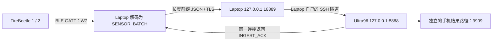
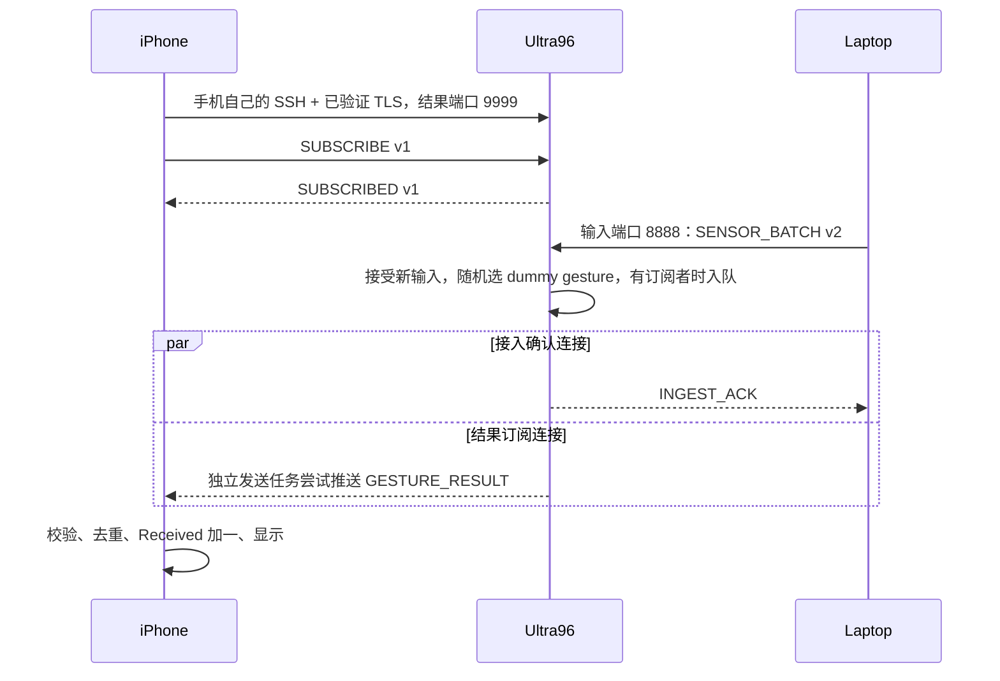
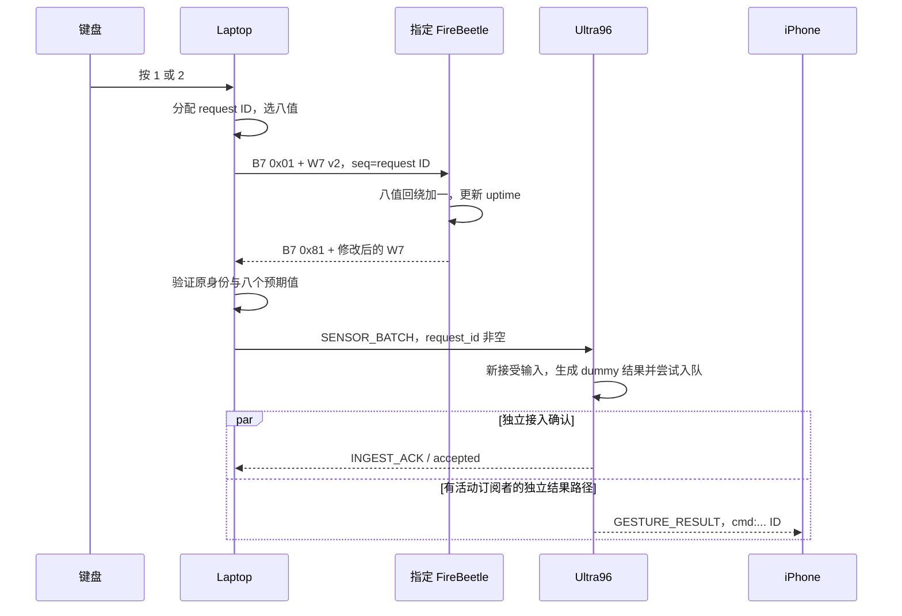
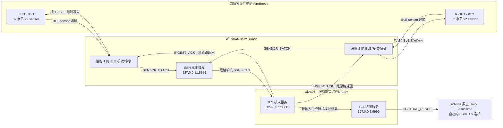
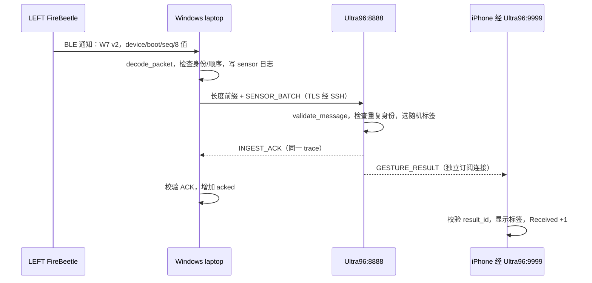
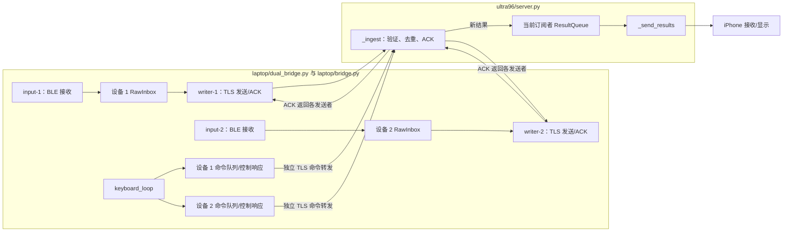
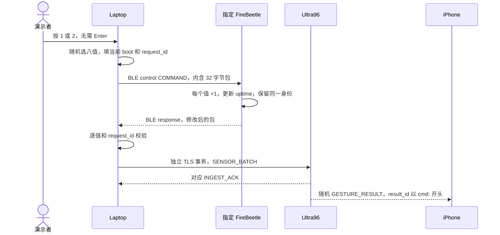
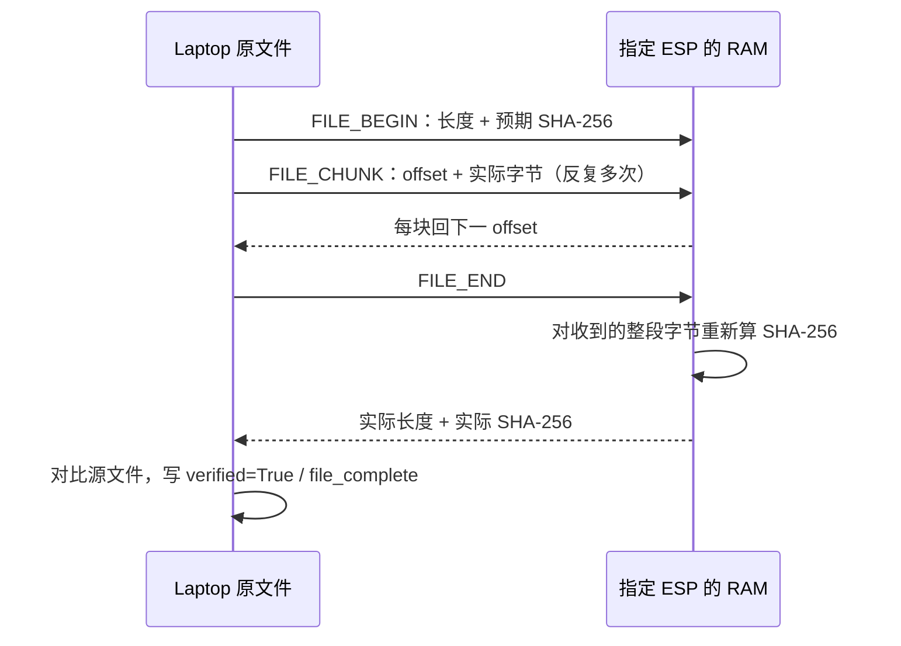

# B07 通信子系统：按教师原编号的 Live 演示稿

**标识更新（2026-10-08）：** 下文的 `W7`/`W7S1` 字节和 `week7-demo` 消息示例对应原来已部署的小板、Ultra96 服务与 iPhone 应用。本次源码重新编译的固件发送 `LC`/`LCS1`，源码默认会话为 `ltc-comms`；更新后的 Laptop 仍可读取旧包。按本稿连接原服务和手机时，先在终端 B 执行 `$env:LTC_COMMS_SESSION = 'week7-demo'`。若重新刷入本仓库固件，现场展示的 magic 应按新值讲解。详见[标识对照表](communications-quickstart.md#source-and-deployment-identifiers)。

**部署说明：** 文中的 `D:\LetThemCook`、默认 SSH 账号、`demo.py service` 和手机上的 **Week 7 Connect** 是原 B07 实体演示环境。其他检出目录请使用实际仓库根目录，并按[通信快速上手](communications-quickstart.md)明确设置 SSH 和公有 CA；更换 Ultra96 还需核验手机端信任信息并重建安装应用。

**现场协议导航：** [1 Laptop ↔ Ultra96](#live-protocol-laptop) · [2 Ultra96 ↔ iPhone](#live-protocol-phone) · [4.1 FireBeetle ID、包类型和布局](#live-protocol-firebeetle) · [附录 B：全部演示文件的作用与代码跳转](#appendix-file-map) · [独立协议详解](B07-CO-protocol-explained.zh-CN.md)

**使用方法：** 从下面的 **1 → 2 → 3 → 4 → 5 → 6 → 7 → General Guidelines 1–10** 顺序读和演示。每项均写明“做什么、看什么、解释什么、通过条件”。原文标注 **Video only** 的 3、6、7 保留编号并指出视频准备，不当作 Live 现场项目。附件 General Guidelines 前三个空白“1.”为排版残留；有内容的十项在这里按 1–10 列出。具体术语、五张图、逐文件代码解释及教师问答在附录 A。

**Live 讲解边界：** 现场应能讲清第 1、2、4.1、5 项的通信协议、包字段、数据流向和可见证据；第 6、7 项明确标为 Video only，Live 不必主动逐行讲加密或并发源码。老师如果追问实现，按文中的代码链接展示关键几行并解释其作用。

**部署范围：** 下列命令按原 B07 实体部署编写。团队成员在其他电脑上操作时，应先看[通信快速上手](communications-quickstart.md)，显式提供自己的 `--jump`、`--target` 和公有 CA `--ca`；`demo.py service` 固定检查原部署。已安装的 Unity 应用按钮显示 **Week 7 Connect**，本次源码交接中的 `CommsNative` 后续重建界面显示 **Communications Connect**。本仓库不含 Unity 导出的 Xcode 工程。

**统一开场准备（只做一次，后续步骤引用它）：** 两块已刷 v2 固件的 FireBeetle 分别用独立电源供电，不接 relay laptop 的 USB；Windows 蓝牙与 Windows/iPhone VPN 可用；Ultra96 已运行接入服务 8888 和结果服务 9999。Windows 两个 PowerShell 均先 `Set-Location 'D:\LetThemCook'`。在终端 B 执行 `python flash.py --boards` 核对 LEFT/ID 1 与 RIGHT/ID 2，再执行 `python demo.py service` 核对 Ultra96 当前服务进程及端口。在终端 A 运行 `python demo.py tunnel`，完成 SSH 提示并保持终端 A 开着。手机打开更新后的原生 Unity 应用，点 **Week 7 Connect**，待 `Subscribed` 后记下 `Received` 起点。不要同时运行桌面结果订阅者。任一前提不满足，先处理相应设备/网络，再进入编号演示。见[启动入口](../demo.py#L36)、[服务检查](../tools/demo_service.py#L44)、[SSH 转发](../tools/ssh_tunnel.py#L12)。

**网络追问（不占用单独演示项）：** NUS VPN 可能把不属于 `192.168.x.x` 的本地热点地址流量（例如 iPhone 热点的 `172.x.x.x`、Android 热点的 `10.x.x.x`）送入校园路由，造成设备虽在同一热点却互相访问不了。本次若没有用手机热点，也没有让 Laptop 通过该热点 IP 直接访问 ESP/Ultra96，就不能仅凭这条提醒断定自己遇到了该问题；仍要以现场的 BLE 连接、SSH 隧道、Ultra96 ACK 和手机 `Subscribed` 实测为准。Tailscale 是可选的另一种远程 SSH 路线，**本稿命令仍使用当前已配置的校园 SSH 隧道**，不需要现场安装它。

<a id="live-protocol-laptop"></a>

## 1. Laptop ↔ Ultra96 通信 [Live + Video]

**原文要求：解释协议；用假数据展示一台 Laptop 与 Ultra96 成功通信。** 本节先照读 1.1，再沿 1.2 的消息示例讲字段，按 1.3 操作；1.4 是老师指到源码时可直接展开的说明。

### 1.1 现场照读：一条数据怎样走到 Ultra96 再得到确认

> 我的 Windows Laptop 是中继电脑，Ultra96 是运行接入服务的服务器。两块 FireBeetle 通过蓝牙把完整数据包交给这一台电脑；电脑解码后，把设备、启动标识、序号、时间和八个数值组成一条名为 SENSOR_BATCH 的消息。当前实体板发的是格式完整的假数据，用于检验通信流程。
>
> 这里有几层不同的协议。TCP 提供有序的字节流，但不会告诉应用每条消息在哪里结束；JSON 用带名字的字段表示内容。我们在每段 JSON 前放四个字节，写明正文长度，接收方才能完整读出一条消息。这个长度前缀和 SENSOR_BATCH 字段规则是我们约定的应用协议。
>
> 电脑通过自己的 SSH 隧道访问 Ultra96。入口是电脑上的 127.0.0.1:18889，隧道另一端是 Ultra96 上的 127.0.0.1:8888。两处 127.0.0.1 分别指各自的机器。应用还使用 TLS，加密数据并用受信任的 CA 证书和服务名称验证 Ultra96。SSH 负责建立访问私有服务的路线，TLS 负责应用连接的证书验证和保护。
>
> Ultra96 收齐一条消息后，检查版本、消息类型、会话、字段范围和数据身份。新输入被接受后，它回一条 INGEST_ACK，其中带回同一个设备、boot ID、序号和 request ID。Laptop 逐项核对身份后，才把已确认数加一。
>
> 所以这一项的成功证据是电脑实际发出的数据和匹配的应用 ACK。ACK 表示 Ultra96 应用已经接受这条输入；手机是否收到结果，还要在下一项看手机自己的计数和结果 ID。

**路径图：** 下面的 18889、8888 和 9999 分别是不同入口，手机结果路径在第 2 项展开。



TCP、TLS、SSH、JSON 是已有标准或通用格式；`SENSOR_BATCH`、`INGEST_ACK`、消息字段、四字节长度约定属于本项目应用协议。`8888` 是接入服务端口，`18889` 是本轮配置的本地转发入口，SSH 使用的端口与这两个应用端口不同。

### 1.2 现场照读：分帧和消息字段

> TCP 可以把一次发送分成几次交给接收程序，也可以把多条消息的字节一起交过来。因此接收程序不能把一次 read 当作一条消息。我们先完整读四个字节，得到正文长度，再完整读指定长度的正文，最后才解析 JSON。
>
> 长度头采用大端，也就是高位字节在前。例如长度 256 写成 00 00 01 00。长度数的是 UTF-8 编码后的字节数，不包含前面四字节头。正文当前限制为 1 到 16384 字节。小板的 W7 二进制包用小端；两段链路各自遵守明确的格式。

下面是**教学输入，不是现场采集记录**。这一行紧凑 JSON 的正文为 157 字节，长度头为 `00 00 00 9D`，总应用帧为 161 字节；改变数字或空格后必须重新计算长度。

```text
[4 字节无符号大端正文长度] [UTF-8 JSON 正文]
00 00 00 9D                {"v":2,...}
```

```json
{"v":2,"type":"SENSOR_BATCH","session_id":"week7-demo","device_id":1,"boot_id":42,"seq":7,"uptime_ms":1234,"values":[0,0,1000,0,0,0,10,20],"request_id":null}
```

| 字段 | 示例 | 现场解释 |
|---|---|---|
| `v` | `2` | 本条应用消息遵守 v2 规则 |
| `type` | `SENSOR_BATCH` | 上传输入；目前一条是一个时间点的八通道数据 |
| `session_id` | `week7-demo` | 三端约定的演示会话；不是密码，也不是每次运行自动生成的新 ID |
| `device_id` | `1` | LEFT 为 1，RIGHT 为 2 |
| `boot_id` | `42` | 此设备这次启动的标识；真实固件启动时随机生成 |
| `seq` | `7` | 此设备此启动下的自动流序号；各板独立计数 |
| `uptime_ms` | `1234` | 小板启动后经过的毫秒数，不是日期时间 |
| `values` | 八个整数 | 八个有符号 16 位数，范围 -32768 到 32767；当前来自 dummy 数据表 |
| `request_id` | `null` | 普通自动流；键盘命令时非空，且该命令消息的 `seq` 等于此 ID。v2 不能省略这个键 |

> 这些身份字段使我们能说清楚是哪块板、哪次启动、哪一条数据。相同的八个数可能重复出现，不能只凭数值判断是不是同一条消息。

对应的**教学 ACK**如下，同样带四字节长度头；这里仅显示 JSON 正文：

```json
{"v":2,"type":"INGEST_ACK","session_id":"week7-demo","device_id":1,"boot_id":42,"seq":7,"request_id":null,"status":"accepted"}
```

`accepted` 表示新接受；`duplicate` 表示已接受的相同输入在去重记录中再次到达，不会再生成一个新手势。相同身份配不同内容会被拒绝。Laptop 核对 `v/type/session_id/device_id/boot_id/seq/request_id` 和合法状态，不能把其他会话或另一块板的 ACK 当成成功。去重记录属于当前服务器进程；不能据此声称重启后仍永久保存历史。

### 1.3 操作步骤：用现有入口运行，并指向本轮证据

1. 完成开场准备，在终端 A 保持 `python demo.py tunnel` 运行。Ultra96 服务检查应确认接入端口 8888、结果端口 9999 已工作。
2. 手机先达到 `Subscribed`，记下 `Received` 起点，以便第 2 项沿用同一轮。保持只有这一轮生产者和手机订阅者。
3. 终端 B 在工程根目录运行下面命令。两块实体板的自动输入就是 dummy，因此不需要为“假数据”要求另改程序。默认 10 Hz、不开键盘命令。

   ```powershell
   python demo.py run --duration 75
   ```

4. 等两板准备完成后观察 `mode=physical`，分别指出 device 1 和 device 2 的 `received/acked` 持续增加。观测时间从程序进入共同观测阶段开始，不是从敲命令那一刻开始。
5. 正常等待结束，复制 `Saved in:` 的完整目录，执行下面命令。报告会自动显示每块板一组匹配 sensor/ACK 示例；记事本打开的是同一轮的原始文字记录。

   ```powershell
   $runDir = Read-Host '粘贴本轮 Saved in 的完整目录（不要额外加引号）'
   python demo.py report $runDir
   notepad (Join-Path $runDir 'packets.log')
   ```

   选一条 `type=sensor` 和同一 `device_id/boot_id/seq` 的 `type=sensor_ack`。前者包含 `values`、`uptime_ms`、`raw_hex`、`validation=decoded`；后者包含 `validation=accepted` 或 `duplicate`。ACK 日志不重复打印八值和 session，靠身份关联，并从本轮报告/配置获取会话。见[实际记录 sensor 的代码](../laptop/bridge.py#L293)、[实际记录 ACK 的代码](../laptop/bridge.py#L457)、[报告中的匹配示例](../tools/video_evidence.py#L58)。
6. 执行 `notepad (Join-Path $runDir 'report.json')`，逐板看 `received`、`sent`、`acked`、`ack_errors`、`transport_errors` 和源端对账。仅在该轮满足 clean 检查时称其通过；`CAPTURE PASSED` 的证据边界到 Ultra96 ACK，手机另看第 2 项。

**指着日志照读：**

> 这一条 sensor 是 Laptop 解码后的输入记录，旁边的设备、boot ID 和序号是它的身份。这里的 sensor_ack 与它身份一致，validation 是服务器给出的接入状态。终端只是抽样展示，完整记录写入本轮文件，最终报告另列出接收、发送、确认以及错误计数。

日志由[证据写入器](../laptop/evidence.py#L36)生成：`packets.jsonl` 每行一个 JSON 记录，`packets.log` 是便于读的 `key=value` 行；控制台对常规 sensor/ACK 默认每十条抽样显示。证据写入本身有队列和错误计数；要称磁盘记录完整，还要确认报告 `evidence.dropped=0`、`evidence.write_errors=0`、`evidence.unfinished=0`。不能用屏幕上显示的行数代替完整计数。

**可选：仅隔离网络链路的 20 秒 synthetic 演示。** 若需要保留原来的纯 Laptop 假输入演示，结束其他生产者后运行以下已有模块。它仍使用真实 SSH/TLS 和 Ultra96，但没有实体 BLE；当前 `demo.py` 本身没有 `--mock` 参数。

```powershell
$demoCa = Join-Path $HOME '.codex/private/cg4002-week7-20260906/ca-cert.pem'
$dummyDir = Join-Path (Get-Location) ('.comms-local/dummy-' + [guid]::NewGuid().ToString('N'))
New-Item -ItemType Directory -Path $dummyDir | Out-Null
python -m laptop.dual_bridge --mock --ca $demoCa --port 18889 --session-id week7-demo --duration 20 --expected-rate 10 --progress-interval 1 --report (Join-Path $dummyDir 'report.json') --evidence (Join-Path $dummyDir 'packets.jsonl')
$dummyExit = $LASTEXITCODE
$dummyReport = Get-Content -Raw -LiteralPath (Join-Path $dummyDir 'report.json') | ConvertFrom-Json
$dummyExit
$dummyReport | Select-Object clean, mock_input, report_saved
$dummyReport.devices.'1' | Select-Object received, sent, acked, ack_errors, transport_errors
$dummyReport.devices.'2' | Select-Object received, sent, acked, ack_errors, transport_errors
```

CA 如在其他位置，改成已验证的 CA 文件。预期 `mode=synthetic`、`mock_input=True`、退出码 0、两路有匹配 ACK 且相关错误为 0；实际包数以报告为准。此报告不作为实体 BLE 测试，也不交给要求物理采集证据的 `demo.py report` 来判定。

### 1.4 关键源码：按这几个点解释用途

所有下面标为“源码摘录”的代码均来自当前文件；消息 JSON 示例属于教学例。

| 打开位置 | 负责什么 | 现场重点 |
|---|---|---|
| [demo.py 的隧道入口](../demo.py#L115)、[SSH 转发构造](../tools/ssh_tunnel.py#L12) | 把本地端口转到 Ultra96 私有端口 | 18889 和 8888 是两端的端口 |
| [SensorPacket.to_message](../common/sensor.py#L41) | 把解码后的 W7 字段转换为 `SENSOR_BATCH` | 保留设备、启动、序号和八值；v2 加 `request_id` |
| [encode_frame/read_frame](../common/wire.py#L35) | 网络消息分帧与完整读取 | 字节长度，四字节大端；读取可能分多次完成 |
| [TLS 配置](../common/tls.py#L7)、[Laptop 建连](../laptop/bridge.py#L349) | 校验 CA 和服务名称 | 本地入口是 loopback 也仍检查 `ultra96.week7.internal` |
| [Ultra96 字段校验](../ultra96/protocol.py#L28)、[接入处理](../ultra96/server.py#L246) | 拒绝错误会话、字段、身份冲突，处理新输入 | 去重与 ACK 属于应用逻辑 |
| [Laptop ACK 核对](../laptop/bridge.py#L375) | 验证回执确实属于这一条输入 | 不是“收到任何文字就算成功” |

**源码摘录 A——[JSON 编码](../common/wire.py#L40)和[长度头](../common/wire.py#L46)，分两处展示：**

```python
        body = json.dumps(message, ensure_ascii=False, allow_nan=False,
                          separators=(",", ":")).encode("utf-8")
```

```python
    return struct.pack("!I", len(body)) + body
```

第一段把字段对象写成紧凑 JSON，再转成 UTF-8 字节。第二段的 `len(body)` 数字节；`!` 指大端网络字节序，`I` 指四字节无符号整数；`+ body` 把正文接在长度后。接收端[第 53 行](../common/wire.py#L53)先 `readexactly(4)`，[第 62 行](../common/wire.py#L62)再 `readexactly(length)`；它们之间还验证了长度范围。

**源码摘录 B——[服务端回执](../ultra96/server.py#L273)：**

```python
            ack = dict(v=message["v"], type="INGEST_ACK", **trace_fields(message))
            ack["status"] = "duplicate" if duplicate else "accepted"
            await write_frame(writer, ack)
```

第一行沿用输入身份，第二行明确新接受还是重复，第三行用相同网络分帧发回。再看 [Laptop 第 382 行](../laptop/bridge.py#L382)：它逐字段比较类型和值；不匹配会抛出 `ProtocolError`，不能计作正常 ACK。

### 1.5 老师追问时的短回答

| 追问 | 可以直接回答 |
|---|---|
| TCP 已经可靠，为什么还要 ACK？ | TCP 保证连接中的字节传送规则；应用 ACK 表明 Ultra96 按本项目规则处理了具体这条消息，并带身份让 Laptop 核对。 |
| 为什么要 SSH 加 TLS？ | SSH 提供访问只监听本机的 Ultra96 服务的路线；TLS 验证应用服务证书并保护应用连接。 |
| 为什么 JSON 看起来长短不同？ | 数字位数和编码长度会变，所以网络正文长度可变；固定 32 字节说的是 BLE W7 包。 |
| 两块板是不是用了两台 Laptop？ | 两块板都连同一台 Windows Laptop，电脑按 device ID 区分，再接到同一块 Ultra96。 |
| ACK 有了，手机一定收到吗？ | 还不能这样判断；结果通过另一条连接发送，下一项检查手机的实际 Received 和 result ID。 |

<a id="live-protocol-phone"></a>

## 2. Ultra96 ↔ iPhone Visualizer 通信 [Live + Video]

**原文要求：解释协议；用假数据展示 Ultra96 与手机 Visualizer 成功通信。** 可以沿用第 1 项同一轮数据；手机应在那轮开始前完成订阅。

### 2.1 现场照读：手机自己的连接和订阅过程

> iPhone Visualizer 自己连接 Ultra96 的结果服务。它使用 App 内的 SSH 路线到达 Ultra96 上的 127.0.0.1:9999，再建立验证证书的 TLS。电脑向 8888 上传输入，手机向 9999 订阅结果，这两条连接分别建立。手机不依赖电脑上的 18889 转发端口。
>
> 订阅的意思是手机告诉服务器，我要接收这个会话接下来产生的结果。TLS 建立完成后，手机发送 SUBSCRIBE，服务器核对会话后回复 SUBSCRIBED。手机验证这个回复，画面才显示 Subscribed。这个状态证明订阅握手完成；是否收到了具体结果，还要看 Received。
>
> Ultra96 每新接受一条 v2 输入，就从 REST、FIST、OPEN、POINT 四个标签中随机选一个，组成 GESTURE_RESULT。这个随机选择在 Ultra96 执行，是通信演示中的模拟 AI 输出，当前没有用八个数值做真实模型推理。confidence 固定为 1.0，也只是这套 dummy 协议的值。
>
> 服务器把结果放进当前订阅者的队列，由单独的发送任务推给手机。手机拼完整帧、校验字段和身份、去掉已见的结果 ID，再累计 Received 并更新显示。给 Laptop 的 ACK 和给手机的结果经过不同连接，两者实际到达的先后没有保证。



### 2.2 现场照读：握手、结果字段与实时队列

> 手机和服务器仍使用四字节大端长度加 UTF-8 JSON。订阅请求与订阅确认的版本是 1，当前 sensor 产生的结果版本是 2；这是现有协议的规定。订阅消息只需要声明类型和会话，结果消息再带具体输入的身份及手势内容。

以下是**教学消息正文**，每条实际传输时均另加四字节长度头：

```json
{"v":1,"type":"SUBSCRIBE","session_id":"week7-demo"}
```

```json
{"v":1,"type":"SUBSCRIBED","session_id":"week7-demo"}
```

```json
{"v":2,"type":"GESTURE_RESULT","session_id":"week7-demo","device_id":1,"boot_id":42,"seq":7,"request_id":null,"result_id":"1:42:7","gesture":"OPEN","confidence":1.0}
```

| 字段 | 解释 |
|---|---|
| `v/type/session_id` | 结果遵守 v2、消息类型为 `GESTURE_RESULT`、属于指定会话 |
| `device_id/boot_id/seq/request_id` | 沿用输入身份；普通流 request 为 null，命令为非空 |
| `result_id` | 普通流为 `device:boot:seq`；命令为 `cmd:device:boot:request_id`，便于对照来源 |
| `gesture` | 当前四个合法标签之一，由 Ultra96 为新 v2 输入随机选取 |
| `confidence` | 固定 dummy 值 `1.0`；不代表真实模型有 100% 把握 |

**三种随机行为各发生在哪里：** FireBeetle 选自动流八值；Laptop 在按键时选命令八值；Ultra96 选结果标签。重复标签是允许的。旧 v1 的 `seq % 4` 循环规则不能用来解释当前 v2 随机输出。

> 这是实时结果服务。当前订阅者的队列最多放 32 条，满时丢最旧的；等待达到两秒的旧结果也会被舍弃。没有订阅者时，服务器不会保存结果等手机后来补收。因此我先让手机 Subscribed，再开始这一轮，并用手机自己的 Received 增量证明结果实际到达。

新订阅者会替换旧订阅者，现场不要同时运行桌面 phone simulator。手机显示层也会清除超过两秒的旧标签，显示 `No live result`；这不一定表示订阅已断开。这些是各阶段对积压或显示年龄的限制，结果中没有完整路径的生成时间戳，不能声称已经测得端到端延迟总是小于两秒。见[服务器队列](../ultra96/server.py#L32)、[独立结果发送](../ultra96/server.py#L366)、[手机显示超时](../ios-visualizer/CommsNative/Sources/CommsCore/DisplayState.swift#L105)。

### 2.3 操作步骤：用手机画面证明收到

1. 手机打开当前原生 Unity 应用，点 **Week 7 Connect**。使用已验证的校园 SSH、CA 和会话配置，保持 App 在前台。等状态 `Subscribed`，拍下 `Received` 起点。
2. 在 Laptop 运行第 1 项的 `python demo.py run --duration 75`；若使用该节可选 synthetic 命令，明确说明来源是 Laptop 合成数据。可直接沿用同一连续运行，不必为第 2 项重复跑。
3. 观察 `Received` 增加、手势标签和具体 `result_id` 更新。普通流如 `1:42:7` 对应 device 1、boot 42、seq 7；实际数字以本轮画面为准。画面只显示最新结果，人眼无需看清每一个高速更新的标签。
4. 停发后记录终值，计算“终值－起点”。与同一运行窗口新接受输入对应的结果总数比较；纯自动 clean 运行可对照两板 ACK 计数，并检查是否有 duplicate。加入键盘命令后还要考虑其独立的命令完成数，不能只加 sensor ACK。
5. 总数相等只能证明该窗口总量吻合；逐条对应还应展示具体 `result_id` 或手机端明细。若 Laptop 有 ACK 而手机不增，先查订阅状态、手机连接错误或是否被其他订阅者替换。不要用 Ultra96 “已写出”日志代替手机收到。
6. 若传文件时手机仍收结果，说明仍有输入产生的结果到达手机。要证明两块板都继续工作，还要分别看 device 1/2 的 sensor 与 ACK 进度，或两设备对应的手机 result ID。文件块走 Laptop→指定 ESP 的 BLE 控制路径；文件到板另看 `file_transfer.verified` 和 ESP 回传摘要。

**指着手机照读：**

> Subscribed 表示手机完成了订阅。Received 是手机校验并接纳结果后自己累计的数；它从刚才记录的起点继续增加，说明结果确实到达了手机。这里的 result ID 保留输入身份，所以我还可以把它与电脑上的设备、boot ID 和序号对起来。

手机显式开始一个新的用户连接会话会清零计数；同一会话内自动重连保留计数和去重状态。做增量比较时不要中途手动重新开始会话。手机的已见 ID 集合最多保留 4096 条，不能说成永久无限去重。

### 2.4 关键源码：连接、生成和显示分别在哪里

| 打开位置 | 负责什么 | 现场重点 |
|---|---|---|
| [CommsClient.connect](../ios-visualizer/CommsNative/Sources/CommsTransport/CommsClient.swift#L74) | 手机自己建立 SSH、CA 验证和 TLS | [第 139 行](../ios-visualizer/CommsNative/Sources/CommsTransport/CommsClient.swift#L139)进入板内服务，TLS 校验服务名 |
| [Subscriber](../ios-visualizer/CommsNative/Sources/CommsTransport/Subscriber.swift#L24) | TLS 成功后发订阅；先验证确认，再读结果 | `Subscribed` 有具体协议依据 |
| [手机 FrameDecoder](../ios-visualizer/CommsNative/Sources/CommsCore/Protocol.swift#L109) | 拼出四字节头和完整 JSON 帧 | 可处理一次到一部分或多条消息的 TCP 字节 |
| [Ultra96 生成事件](../ultra96/server.py#L264) | 从合法新输入生成 dummy 结果 | 随机发生在 Ultra96 |
| [Ultra96 Gateway](../ultra96/server.py#L309) | 订阅所有权、确认与独立发送任务 | 新订阅者替换旧的；不保存离线历史 |
| [手机结果校验](../ios-visualizer/CommsNative/Sources/CommsCore/Protocol.swift#L36) | 检查会话、版本、类型、结果身份与内容 | 无效消息不能随意进入 UI |
| [DisplayState.accept](../ios-visualizer/CommsNative/Sources/CommsCore/DisplayState.swift#L60)、[显示文字](../ios-visualizer/CommsNative/Sources/CommsBridge/DisplayMailbox.swift#L10) | 去重、计数、更新显示 | 以手机这一端实际接纳为证据 |

**源码摘录 A——[Ultra96 随机结果](../ultra96/server.py#L264)：**

```python
                result = dict(v=message["v"], type="GESTURE_RESULT", **trace_fields(message))
                result.update(result_id=result_identity(message),
                              gesture=(self._rng.choice(GESTURES) if message["v"] == 2
                                       else GESTURES[message["seq"] % 4]), confidence=1.0)
```

第一行保留输入身份、改成结果类型；第二行生成可追溯的结果 ID；第三行是 v2 随机选标签；第四行保留旧 v1 规则并写固定 confidence。四个标签定义在 [protocol.py 第 4 行](../ultra96/protocol.py#L4)。

**源码摘录 B——[手机先确认订阅再接结果](../ios-visualizer/CommsNative/Sources/CommsTransport/Subscriber.swift#L45)：**

```swift
            let frames = try decoder.feed(bytes)
            for body in frames {
                if !subscribed {
                    try CommsProtocol.subscribed(body, session: session)
                    subscribed = true; onSubscribed()
                } else { onResult(try CommsProtocol.result(body, session: session)) }
            }
```

第一行把收到的字节交给分帧器；第二行逐条处理完整正文；`if` 分支要求第一条是合法订阅确认；`else` 才按结果规则校验并交给显示回调。显示层通过会话和去重检查后，在[第 77 行](../ios-visualizer/CommsNative/Sources/CommsCore/DisplayState.swift#L77)执行 `receivedCount += 1`。

### 2.5 老师追问时的短回答

| 追问 | 可以直接回答 |
|---|---|
| 手势是根据八值推理的吗？ | 当前 v2 由 Ultra96 随机选择四标签之一；这是通信演示用的模拟结果。 |
| 为什么连着几次相同标签？ | 随机选择允许重复；用 result ID 和 Received 判断是否来了新结果。 |
| 手机晚连接能补历史吗？ | 当前没有离线重放，先订阅再开始本轮。 |
| ACK 和手机显示谁先？ | 分别走独立连接，实际到达顺序没有保证。 |
| 手机成功的证据是什么？ | 手机自己的 Received 增量和合法结果 ID；Subscribed 只证明握手，Laptop ACK 只证明接入。 |
| 文件传输时手机为何还在跳？ | 自动 sensor 流同时继续，手机显示其结果；文件内容只通过 BLE 发给所选 ESP。 |

## 3. FireBeetle setup [Video only]

本项原文只要求视频。现场只需展示已经贴好的 LEFT/RIGHT 标识、各自独立供电和 `python flash.py --boards` 的映射；不要占用 Live 时间首次烧录或配对。视频应拍到两种固件配置、顺序烧录与受认证配对，配对口令不要入镜。详细准备见[烧录入口](../flash.py#L90)及现有[视频脚本](B07-CO-video-operator-script.zh-CN.md)。

## 4. FireBeetle 双向通信

<a id="live-protocol-firebeetle"></a>

### 4.1 设备 ID、包类型、包格式 [Live + Video]

本节可直接完成“Explain device IDs, packet types, packet format”，随后用 4.1.5 的按键往返把字段和实际行为联系起来。普通自动数据可沿用第 1 项证据，双板速率和超过一分钟的正式判据继续按 4.2–4.5 执行。

#### 4.1.1 现场照读：设备身份和数据身份

> LEFT 固件配置为设备 1，RIGHT 配置为设备 2。这是数据包里的逻辑设备 ID。BLE 地址帮助电脑找到要连接的实体板；数据包里的 device ID 则告诉程序这份数据属于左板还是右板。两块板可以广播同一个名称，所以不能只凭名称区分它们。
>
> boot ID 是小板本次启动的随机标识，seq 是这次启动下自动 sensor 流的序号。重启后序号可能重新开始，但 boot ID 通常会改变，因此我们结合设备、boot ID 和序号跟踪一条数据。随机 boot ID 不是数学上保证永不碰撞的全球唯一编号。
>
> 普通 sensor 流由小板按自己的节拍持续发送。按键 1 或 2 会额外产生一次控制事务，Laptop 为它分配 request ID。命令内部的 seq 用这个 request ID，但它不会消耗或改变小板自动流的序号。这样能同时跟踪自动数据和每一次按键往返。

| 名称 | 来源/示例 | 用途 |
|---|---|---|
| `device_id` | 固件配置，1=LEFT、2=RIGHT | 区分逻辑设备；重启通常不变 |
| BLE address | `flash.py --boards` 映射 | 连接实体蓝牙设备；不是 W7 的 ID 字节 |
| `boot_id` | 小板启动时随机 uint32 | 区分同一设备的不同启动；教学例为 42 |
| 自动流 `seq` | 小板每生成一条样本分配 | 两板各自计数，可查缺号 |
| `request_id` | Laptop 为控制事务分配的非零 uint32 | 关联命令/响应；普通网络 sensor 为 null |
| `session_id` | 三端配置，原部署为 `week7-demo`，新源码默认 `ltc-comms` | 区分应用演示会话；不在 BLE 二进制包中 |
| `result_id` | Ultra96 由输入身份组成 | 手机结果对应普通 `1:42:7` 或命令 `cmd:1:42:1001` |

代码：[左右构建配置](../firmware/esp32/platformio.ini#L18)、[设备 ID 与 UUID](../firmware/esp32/src/main.cpp#L31)、[启动时生成 boot ID](../firmware/esp32/src/main.cpp#L406)、[分配自动样本序号](../firmware/esp32/include/comms_source_stats.h#L19)、[Laptop 构建命令](../laptop/bridge.py#L256)。

#### 4.1.2 现场照读：32 字节 W7 逐字节布局

> 一个字节有八个二进制位。这种 W7 sensor 包固定为 32 字节，也就是 256 位。数组偏移从零开始，所以第一个字节叫 offset 0，最后一个叫 offset 31。
>
> 前两个字节是文字 W7，用来认出这个包格式；接着是一字节版本和一字节设备 ID。然后是三个四字节无符号整数，分别表示 boot ID、序号和启动毫秒数。最后是八个有符号 16 位数，每个占两字节。总长度就是二加一加一加四加四加四，再加八乘二，等于 32。
>
> 多字节数字使用小端，也就是低位字节在前。例如 1000 的十六进制是 03E8，在包里写成 E8 03。W7 是格式标记，不是设备 ID、加密内容或校验和。这个应用包没有额外的 CRC 字段。

下表沿用教学样本 `device=1, boot=42, seq=7, uptime=1234, values=[0,0,1000,0,0,0,10,20]`；实际现场数值从本轮日志读取。

| 字节偏移（从 0 起） | 宽度 | 字段 | 类型 | 示例字节/数值 |
|---|---:|---|---|---|
| 0–1 | 2 | magic | 两字节 ASCII | `57 37` = `W7` |
| 2 | 1 | version | uint8 | `02` = 当前 v2 |
| 3 | 1 | device_id | uint8 | `01` = LEFT |
| 4–7 | 4 | boot_id | uint32，小端 | `2A 00 00 00` = 42 |
| 8–11 | 4 | seq | uint32，小端 | `07 00 00 00` = 7 |
| 12–15 | 4 | uptime_ms | uint32，小端 | `D2 04 00 00` = 1234 |
| 16–17 | 2 | values[0] | int16，小端 | `00 00` = 0 |
| 18–19 | 2 | values[1] | int16，小端 | `00 00` = 0 |
| 20–21 | 2 | values[2] | int16，小端 | `E8 03` = 1000 |
| 22–23 | 2 | values[3] | int16，小端 | `00 00` = 0 |
| 24–25 | 2 | values[4] | int16，小端 | `00 00` = 0 |
| 26–27 | 2 | values[5] | int16，小端 | `00 00` = 0 |
| 28–29 | 2 | values[6] | int16，小端 | `0A 00` = 10 |
| 30–31 | 2 | values[7] | int16，小端 | `14 00` = 20 |

```text
偏移     0–1    2   3       4–7          8–11         12–15          16–31
内容      W7   版本 ID     boot_id        seq        uptime_ms      八个 int16
宽度      2     1   1         4            4             4            16
教学包：57 37 02 01 | 2A 00 00 00 | 07 00 00 00 | D2 04 00 00 |
        00 00 00 00 E8 03 00 00 00 00 00 00 0A 00 14 00
```

Python 的**实际源码定义**是 [common/sensor.py 第 11 行](../common/sensor.py#L11)：

```python
_PACKET = struct.Struct("<2sBBIII8h")
PACKET_SIZE = _PACKET.size
```

| 格式字符 | 含义 | 本包对应字段 |
|---|---|---|
| `<` | 小端、标准宽度、不自动插入对齐空字节 | 决定下面多字节数的存放顺序 |
| `2s` | 两字节字符串 | `W7` |
| `B`、`B` | 各一字节无符号数 | version、device_id |
| `I`、`I`、`I` | 各四字节无符号数 | boot_id、seq、uptime_ms |
| `8h` | 八个两字节有符号整数 | 八个 values |

> 有符号表示可以解释负数。这里 int16 的范围是负 32768 到正 32767，uint32 则是零到 4294967295。同样的两个字节 FF FF，用无符号方式看是 65535，按本协议 int16 看是负一。发送的比特没有改变，解释规则由协议决定。

32 字节是应用包的长度，不包含蓝牙无线开销。GATT notification 的数据容量是 ATT MTU 减 3：默认 MTU 23 只能放 20 字节。**当前固件要求 MTU 至少 35，才发送完整 32 字节 sensor 包（新 `LC`，原部署 `W7`）**；它没有把 sensor 包拆成两个应用通知再让 Laptop 重组的实现。Laptop 解码也要求正好 32 字节。见[MTU 条件](../firmware/esp32/include/comms_security.h#L19)、[固件发送检查](../firmware/esp32/src/main.cpp#L500)、[Laptop 长度检查](../common/sensor.py#L72)。底层无线分片与这里的应用包边界是不同层次。

#### 4.1.3 现场照读：包家族、GATT service 和七个 characteristics

> BLE 是蓝牙低功耗通信，GATT 是它组织应用数据的一套规则。我们在小板上建立一个 service，可以理解为一组相关功能；里面有七个 characteristics，可以理解为各自有地址和读写权限的数据入口。UUID 就是这些入口的标识。
>
> Laptop 可以读取一个 characteristic，也可以向它写入请求，还可以订阅 notification，让小板有新数据时主动通知。GATT 的 service、characteristic、read、write 和 notification 是现有机制；W7、B7、W7S1 以及内部字段是我们约定的应用格式。
>
> W7 是 sensor 数据包。它内部没有单独的 packet type 字段。B7 是控制帧，内部用 opcode 区分命令、速率和文件操作。W7S1 是读取源端统计时返回的包。这些应用数据由不同 characteristic 承载，因此不会混在同一个输入入口里猜类型。

service UUID 为 `6e1c0001-7a45-4dc4-b678-3f2d5a9c1001`。下表只简写 UUID 第一段的末四位；七个完整 UUID 均采用 `6e1cXXXX-7a45-4dc4-b678-3f2d5a9c1001` 形式。源码：[UUID 定义](../firmware/esp32/src/main.cpp#L42)、[一个 service 与七个特征的创建](../firmware/esp32/src/main.cpp#L429)。

| UUID 简写 | characteristic 及操作 | 数据方向 | 应用内容/用途 |
|---|---|---|---|
| `0002` | Counter，notify | ESP → Laptop | 四字节计数器，早期链路测试；不是完整 sensor 证据 |
| `0003` | MTU probe control，write | Laptop → ESP | 请求 MTU 数据长度测试 |
| `0004` | MTU probe payload，notify | ESP → Laptop | 返回测试 payload |
| `0005` | Sensor，notify | ESP → Laptop | 固定 32 字节 W7 自动 dummy 数据 |
| `0006` | Source stats，read | Laptop 读取 ESP | 固定 24 字节 W7S1 源端统计 |
| `0007` | Control，write | Laptop → ESP | B7 请求；命令、设置速率、文件操作 |
| `0008` | Response，notify | ESP → Laptop | B7 响应；状态和对应操作 payload |

对照网络端，包类型可以归纳为下表。**网络消息名称是 JSON 的 `type`，不是 W7 的额外字段。**

| 所在链路 | 类型/标记 | 用途 |
|---|---|---|
| BLE 数据特征 | W7 | 固定宽度 sensor 结构 |
| BLE 控制/响应特征 | B7 + opcode | 请求/响应控制事务 |
| BLE 统计特征 | W7S1 | 读取生成序号及 BLE 提交计数 |
| Laptop → Ultra96 8888 | `SENSOR_BATCH` | 自动流或已经验证的命令返回数据 |
| Ultra96 → Laptop | `INGEST_ACK` | 具体输入的接入确认 |
| iPhone → Ultra96 9999 | `SUBSCRIBE` | 请求实时结果 |
| Ultra96 → iPhone | `SUBSCRIBED`、`GESTURE_RESULT` | 确认订阅、推送手势结果 |

当前没有名为 `COMMAND_RESULT` 的网络类型。命令从 ESP 回来时是 B7 `0x81` 响应；上传 Ultra96 仍是带非空 `request_id` 的 `SENSOR_BATCH`，手机收到的仍是 `GESTURE_RESULT`。`command_modified`、`command_ingested` 是日志事件名，不是新增网络类型。

#### 4.1.4 现场照读：14 字节 B7 头、操作码和 24 字节源统计

> 控制帧先有一个 14 字节的 B7 头，后面才是 payload，也就是这次操作附带的数据。头里包括版本、操作码、目标设备、状态、request ID 和 offset。offset 表示文件字节偏移或进度，普通命令则必须为零。
>
> opcode 一表示键盘命令。请求带完整的 32 字节 W7 v2 数据，ESP 将八个值分别做 16 位回绕加一，更新 uptime，再返回 B7 响应和修改后的 W7。响应把 opcode 的最高位设为一，所以一变成十六进制 81。双方通过 request ID 知道这是谁的回复。

**B7 实际定义**为 [common/control.py 第 16 行](../common/control.py#L16)的 `struct.Struct('<2sBBBBII')`：两字节字符串、四个一字节无符号数、两个四字节无符号数，共 14 字节；多字节仍用小端。

| 偏移 | 宽度 | 字段 | 类型与含义 | COMMAND 教学例 |
|---|---:|---|---|---|
| 0–1 | 2 | magic | 两字节 ASCII `B7` | `42 37` |
| 2 | 1 | version | uint8；控制版本为 1 | `01`；内部 W7 可以是 v2 |
| 3 | 1 | opcode | uint8；区分操作/响应 | 请求 `01`，响应 `81` |
| 4 | 1 | device_id | uint8；目标或响应设备 | `01` = LEFT |
| 5 | 1 | status | uint8；请求为 0，响应为处理状态 | `00` = OK |
| 6–9 | 4 | request_id | 非零 uint32，小端 | 1001 = `E9 03 00 00` |
| 10–13 | 4 | offset | uint32，小端；文件偏移/进度 | 命令为 `00 00 00 00` |
| 14 起 | 可变 | payload | 由 opcode 决定 | 命令为完整 32 字节 W7 |

| 请求 opcode | 对应响应 opcode | 源码名称 | 请求 payload | 成功响应 payload/offset |
|---|---|---|---|---|
| `0x01`（1） | `0x81`（129） | `COMMAND` | W7 v2，32 字节 | 修改后的 W7，32 字节；offset=0 |
| `0x02`（2） | `0x82`（130） | `SET_RATE` | uint16 小端速率，2 字节，1–200 Hz | 确认的速率，2 字节；offset=0 |
| `0x10`（16） | `0x90`（144） | `FILE_BEGIN` | 4 字节小端长度 + 32 字节 SHA-256 | 无 payload；offset 为已收进度 |
| `0x11`（17） | `0x91`（145） | `FILE_CHUNK` | 当前 offset 对应的真实文件字节 | 无 payload；offset 为已收字节数 |
| `0x12`（18） | `0x92`（146） | `FILE_END` | 无 payload；offset=文件总长度 | 4 字节实收长度 + 32 字节计算摘要 |
| `0x13`（19） | `0x93`（147） | `FILE_ABORT` | 无 payload；offset=0 | 无 payload；终止匹配事务 |

**状态名对应当前源码，不另造 ACK 类型：**

| 值 | Python 名称 | 固件名称 | 意思 |
|---:|---|---|---|
| 0 | `OK` | `ControlOk` | 成功 |
| 1 | `INVALID` | `ControlInvalid` | 字段或内容无效 |
| 2 | `BUSY` | `ControlBusy` | 忙或无法分配内存 |
| 3 | `ORDER` | `ControlOrder` | 顺序、偏移或事务不符 |
| 4 | `INTEGRITY` | `ControlIntegrity` | 文件完整性校验失败 |
| 5 | `CONFLICT` | `ControlConflict` | 同一身份内容冲突或命令身份不合规则 |
| 6 | `UNSUPPORTED` | `ControlUnsupported` | 不支持的版本或操作 |

见 [Python 定义与校验](../common/control.py#L10)、[固件状态枚举](../firmware/esp32/include/comms_control.h#L16)。错误响应不带成功 payload，不能继续按“修改后的 W7”解码。B7 状态值与网络 ACK 的 `accepted/duplicate` 是各自的协议规则。

完整命令帧长度为 `14+32=46` 字节。`FILE_BEGIN` 请求和 `FILE_END` 成功响应各携带 36 字节元数据（4 字节长度加 32 字节摘要）；`FILE_BEGIN` 成功响应没有 payload。当前控制通道要求 MTU 至少 64；文件每块 payload 最大是 `min(180, MTU-3-14)`，不是任何情况下都能放 180 字节。文件传输在 ESP 的临时 RAM 缓冲区中完成，成功后摘要证明实收字节一致；它没有保存为持久文件路径，断线等清理会释放缓冲区。见[块大小计算](../common/control.py#L30)、[RAM 分配](../firmware/esp32/include/comms_control.h#L162)、[摘要校验](../firmware/esp32/include/comms_control.h#L200)。

**W7S1 源统计的实际 24 字节布局：**

| 偏移 | 宽度 | 字段 | 解释 |
|---|---:|---|---|
| 0–3 | 4 | `W7S1` | 统计格式标记 |
| 4 | 1 | device_id | 1 或 2 |
| 5–7 | 3 | reserved | 保留，写零 |
| 8–11 | 4 | boot_id | uint32 小端，本次启动 |
| 12–15 | 4 | nextSequence | uint32 小端，下一个自动样本序号 |
| 16–19 | 4 | submitted | uint32 小端，交给 BLE 栈成功的累计数 |
| 20–23 | 4 | failures | uint32 小端，源端提交失败的累计数 |

> 源统计让我们从小板这一端核对本轮产生和提交了多少条。程序在每板本轮采集开始和结束时读取快照，结合 boot ID 算差值。这个边界不等于两板共同观测的七十五秒窗口。提交成功只是 BLE 栈接下了数据，还要继续对照 Laptop 收到数和 Ultra96 ACK 数，才能知道后面两段是否到达。

布局代码在 [comms_source_stats.h 第 33 行](../firmware/esp32/include/comms_source_stats.h#L33)，本轮对账在 [source_audit.py](../laptop/source_audit.py#L152)。`generated`、`source_submitted`、`received`、`acked` 分别对应不同观察位置。

#### 4.1.5 操作步骤：按一次键，沿同一 request ID 找完整证据

1. 执行 `python flash.py --boards`，指出 LEFT/ID 1、RIGHT/ID 2 与 BLE 地址的对应。两块板独立供电，终端 A 的隧道保持开启，手机先 `Subscribed` 并记起点。
2. 终端 B 运行 `python demo.py live --duration 75`。它启用键盘控制；要观察不带命令的纯自动基线，仍用第 4.2 的 `python demo.py run --duration 75`。两板就绪后按 `1` 发给 LEFT，再按 `2` 发给 RIGHT，无需 Enter。
3. 指出按键前后两板常规 sensor 仍在前进，按键额外触发一条命令。在终端找到 `command_original` 的输入八值和 `expected_values`，再找同设备、同 request ID 的 `command_modified`，查看 `validation=verified`；接着看 `command_ingested` 的 `validation=board_ACK`。
4. 手机如显示对应 `cmd:device:boot:request_id`，指出命令返回数据已产生并到达手机的结果。这个标签仍由 Ultra96 随机选择；命令的“加一”验证看八值，不看手势标签是否变化。
5. 正常等待结束，将 `Saved in:` 的完整路径复制给下面提示。报告会自动显示每块板一组匹配 sensor/ACK 示例；再筛选命令事件，按实际 request ID 对齐。不要把教学例 1001 当成本轮必然出现的 ID。

   ```powershell
   $runDir = Read-Host '粘贴本轮 Saved in 的完整目录（不要额外加引号）'
   python demo.py report $runDir
   Select-String -LiteralPath (Join-Path $runDir 'packets.log') -Pattern 'type=command_original|type=command_modified|type=command_ingested'
   ```

6. 打开同目录 `report.json`，查看每板 `commands.accepted/completed/rejected/failed`；正常演示应完成已接受的命令且没有相关失败。快速按键可能使容量为 8 的命令队列排队或拒绝，不能用按键次数代替成功次数。自动流四项对账另看 source audit，命令不混入自动流 ACK 计数。

**指着日志照读：**

> command_original 记录电脑准备发给指定小板的八值和预期修改值。command_modified 是小板返回后，电脑核对身份和八值通过的记录。command_ingested 表示修改后的输入又得到了 Ultra96 匹配且 accepted 的 ACK。最后手机显示的 cmd 结果 ID，是这一条结果到达手机的独立证据。

上述是程序验证后写入的**日志事件**，不是原始 B7 帧或原始网络 ACK 文本。`command_original/modified` 有 `boot_id` 和 `values`；`command_ingested` 记录 `device_id/request_id/direction/validation`，不重复写八值和 boot，要用前后同事务记录关联。常规 `sensor_ack` 不带 session；会话从同次报告/配置获取。报告展示代码见 [video_evidence.py](../tools/video_evidence.py#L58)。



**教学往返例：** device 1、boot 42、request ID 1001；输入八值为 `[32767,-32768,-1,0,1,123,-456,789]`、uptime=0。ESP 应返回 `[-32768,-32767,0,1,2,124,-455,790]`，保留 device/boot/seq，uptime 改为板上处理时刻。这里的最大值按 16 位回绕，所以 `32767 → -32768`。上传消息仍叫 `SENSOR_BATCH`，其中 `seq=1001, request_id=1001`，手机结果 ID 为 `cmd:1:42:1001`；同数字的自动流 `seq=1001` 则没有 `cmd:` 前缀。

#### 4.1.6 源码逐段讲解：从写字节到验证回执

以下均是**当前源码摘录**。按顺序打开链接，展示几行即可；不用在 Live 逐行展开整个 BLE 框架。

**A. 小板在哪里把字段放进 32 字节数组？** [comms_packet.h 第 27 行](../firmware/esp32/include/comms_packet.h#L27)：

```cpp
  output[0] = 'W';
  output[1] = '7';
  output[2] = 1;
  output[3] = deviceId;
  writeUint32Le(output + 4, bootId);
  writeUint32Le(output + 8, seq);
  writeUint32Le(output + 12, uptimeMs);
```

`output[n]` 是从零数的第 n 个字节；前两行写标记；接着写版本和设备；`output+4/+8/+12` 把三个四字节数写入表中的位置。**这个底层函数先写 v1；正常 dummy v2 的包装函数随后改为 2**，见[第 58 行](../firmware/esp32/include/comms_packet.h#L58)：

```cpp
  if (!serializePacket(output, capacity, deviceId, bootId, seq, uptimeMs,
                       kDummyFixtures[randomWord % kDummyFixtureCount])) return false;
  output[2] = 2;
  return true;
```

这里先从已编入固件的 fixture 表选一组八值，沿用相同布局，再把版本字节设为 2。当前正常固件调用这条路径，不能只看到上一段的 `1` 就说现场发的是 v1。实际选择在 [main.cpp 第 505 行](../firmware/esp32/src/main.cpp#L505)。

**B. 八个数如何变成 16 个字节？** [comms_packet.h 第 34 行](../firmware/esp32/include/comms_packet.h#L34)：

```cpp
  for (size_t channel = 0; channel < 8; ++channel) {
    const uint16_t value = static_cast<uint16_t>(values[channel]);
    output[16 + channel * 2] = static_cast<uint8_t>(value);
    output[17 + channel * 2] = static_cast<uint8_t>(value >> 8);
  }
```

第一行依次处理八通道。第二行用无符号 16 位保存要写出的位模式；第三行取低八位，第四行右移八位后取高八位。因此每个通道占两个字节，低字节先写。数据的语义仍是有符号 int16，Laptop 用 `8h` 解码回正负值；不是把协议改成无符号数。

**C. Laptop 如何知道它真是合法 W7？** [common/sensor.py 第 72 行](../common/sensor.py#L72)检查长度必须 32，再解包并检查 magic/version，构造 `SensorPacket` 时继续验证 ID、三项 uint32 与八个 int16。关键解包行在[第 75 行](../common/sensor.py#L75)：

```python
    magic, version, device_id, boot_id, seq, uptime_ms, *values = _PACKET.unpack(data)
```

这一行按 `<2sBBIII8h` 将连续字节还原成命名字段，`*values` 收集最后八个值。[第 41 行](../common/sensor.py#L41)再把这些字段转成网络 JSON；BLE 32 字节不会原样套上网络长度头后直接当 JSON 发出去。

**D. B7 请求头如何编码，响应怎么认？** [common/control.py 第 90 行](../common/control.py#L90)：

```python
    return _HEADER.pack(b'B7', 1, frame.opcode, frame.device_id, frame.status,
                        frame.request_id, frame.offset) + frame.payload
```

第一行依次写标记、控制版本、操作码、设备与状态；第二行写 request ID 和 offset，再拼上 payload。固件在 [comms_control.h 第 67 行](../firmware/esp32/include/comms_control.h#L67)使用 `opcode | 0x80` 设置响应位，并保留 request ID；`0x01` 因此对应 `0x81`。Laptop 的 [ControlChannel.command](../laptop/controls.py#L180)发送并等待响应，再验证它的设备、boot、seq 与预期八值。

**E. 为什么源码说 unsigned，但我又说有符号？** [comms_control.h 第 142 行](../firmware/esp32/include/comms_control.h#L142)：

```cpp
      const uint16_t previous = static_cast<uint16_t>(payload[position]) |
          (static_cast<uint16_t>(payload[position + 1]) << 8);
      const uint16_t changed = static_cast<uint16_t>(previous + 1u);
      cached.output[position] = static_cast<uint8_t>(changed);
      cached.output[position + 1] = static_cast<uint8_t>(changed >> 8);
```

前两行按小端把低高字节拼成 16 位位模式。第三行加一并明确保留 16 位；后两行再拆回低高字节。这样 `7FFF + 1 = 8000`，Laptop 按 int16 解读为 -32768；`FFFF + 1` 回到 `0000`，从 -1 变为 0。这是有明确定义的回绕运算，不是加密。Laptop 在 [transformed_values](../common/control.py#L119)计算同一个预期规则，逐通道核对。

**F. 命令何时才算完成，源端统计何时增加？** [controls.py 第 307 行](../laptop/controls.py#L307)：

```python
                modified = await self.channel.command(packet, expected_generation=generation)
                await self.forward(modified, packet.seq)
                self.completed += 1
                self.channel.log("command_ingested", direction="laptop->Ultra96",
                                 request_id=packet.seq, validation="board_ACK")
```

第一行先完成 ESP 修改结果验证；第二行通过[独立 TLS 事务](../laptop/bridge.py#L263)上传，要求匹配且 accepted 的 ACK；第三行才加完成数；最后两行记录验证后的接入证据。手机收到仍要另看其显示。

源端的 [submitNotification](../firmware/esp32/src/main.cpp#L105)用 BLE API 的返回状态判断提交是否成功；[recordSensorSubmission](../firmware/esp32/include/comms_source_stats.h#L25)分别增加 submitted 或 failures。[serializeSourceStats](../firmware/esp32/include/comms_source_stats.h#L33)把累计数放进 W7S1，让 Laptop 开始/结束时读取。API 返回成功不能替代接收端的实际计数。

#### 4.1.7 老师追问时的短回答

| 追问 | 可以直接回答 |
|---|---|
| W7 的 W 是 device ID 吗？ | 不是，前两字节 `W7` 是格式标记；device ID 在 offset 3。 |
| W7 的 packet type 在哪里？ | W7 没有单独的 packet_type 字节，承载 characteristic 和 magic 识别包家族；version 表示版本，device_id 表示来源。B7 用 opcode 区分操作，网络 JSON 用 type 字符串区分消息。 |
| 为什么包长 32，但日志行长短不一？ | 32 是 BLE 二进制应用包；日志是带字段名、事件和十进制值的文字。 |
| 32 字节超过默认 20 字节怎么办？ | 当前实现协商并检查 MTU 至少 35 才发完整 sensor 包（新 `LC`、原 `W7`）；没有用两个应用通知重组 sensor 包。 |
| 按 1 是让自动 seq 加一吗？ | 按键产生额外命令和 request ID；自动 sensor 流的序号独立。 |
| 为什么版本有 1 又有 2？ | B7 控制头为 v1；当前内部 sensor 包（新 `LC`、原 `W7`）与网络数据为 v2；订阅握手仍为 v1，各自约定不同。 |
| 八值真来自动作测量吗？ | 本轮来自多组 dummy fixture；实体板真实发送它们，但不能称为实际测量或真实 AI 推理。 |
| uint16 是否表示没有负数？ | uint16 用于字节拼装和回绕计算；包内八值按 int16 解码，允许负数。 |
| 有控制响应是否代表 Ultra96 或手机收到？ | B7 响应只到 Laptop；随后看 command_ingested，再看手机 cmd 结果 ID。 |
| 文件保存在 ESP 哪个路径？ | 当前只存在临时 RAM 缓冲区；以实收长度和 SHA-256 验证，不声称写入持久文件系统。 |
| 所有阶段都能保证零丢包吗？ | 只能对本轮源统计、Laptop 接收、Ultra96 ACK 和手机实际观察分别对账后说明；BLE 提交成功本身不足以证明收到。 |

### 4.2 两块 FireBeetle 并发连接 [原文未单标形式，纳入 Live]

1. 两块独立供电并留在 Laptop 附近；手机先 `Subscribed`。终端 B 执行 `python demo.py run --duration 75`。`run` 默认 10 Hz、无键盘命令，便于观察纯双板上行。
2. 在进度行指出 `mode=physical device=1` 和 `device=2` **交替出现并同时增长**的 received/acked。解释 [DualBridge.run](../laptop/dual_bridge.py#L65) 给两板分别创建 BLE 输入、暂存队列、网络发送/ACK 任务；这指 I/O 并发，不表示两块射频芯片同一瞬间发射。
3. 正常等运行结束，记住 `Saved in:` 路径；最终两板各自 `generated=received=acked`、无 missing/drop/error，才称这一轮 clean。手机计数另按第 2 项判读。若只有一板增长，本项未通过，查供电、地址映射、认证与该设备 BLE 日志。

### 4.3 超过一分钟发送 dummy sensor [Live only]

1. 第 4.2 的 `--duration 75` 从两块连接就绪后的 observation 开始计时，因此可作为同一轮的**超过一分钟**证据；指给老师看 report 中真实的 `sensor_goodput.elapsed_seconds` 或 observation duration，不要从输入命令时开始人工估计。
2. 连续看两板的 received/acked 和 seq 前进、queue 未持续堆积、drops/errors 不增加。结束后打开同目录 `report.json`，对两台分别核对 generated、source_submitted、received、acked，不能只报总和。解释序号缺口、源端提交失败和 ACK 缺失各说明不同阶段的问题。
3. `packets.log` 选两条不相邻的序号证明不是只收开头几个包；手机保持 `Subscribed` 并记录总量变化。历史报告可用于备用说明，但本项应指这次现场运行。若有断线或对账失败，将该轮标为故障观察，重新跑干净基线。
4. **读懂三项对账。** 板端 `generated` 是产生的 sensor 样本数，`source_submitted` 是交给 BLE 栈的数，Laptop `received` 是收到通知的数，`acked` 是 Ultra96 确认接入的数。保存的一轮键盘演练中，LEFT 为 `752/752/752/752`、RIGHT 为 `753/753/753/753`；意思是那一轮两板各自全数对上，**不是**一按键就只发一条 sensor，也不是所有运行都固定会有 752/753 条。按键命令另计在 `commands.accepted/completed`。见[板端源统计对账](../laptop/source_audit.py#L152)。

### 4.4 显示 kbps 传输速率 [Live only]

1. 仍用第 4.2/4.3 的同一轮，指出每板 `BLE_sensor_kbps_rolling`、`BLE_sensor_kbps_average` 与 combined 行；结束打开 `report.json` 的 `sensor_goodput`。不要另外把命令/文件字节混入这个数。
2. 解释 **kbps = 观测期唯一有效 sensor 包数 × 32 字节 × 8 ÷ 观测秒数 ÷ 1000**。边界是 Laptop 收到的应用 sensor 包，包含 32 字节内的包头，不含 BLE/TLS/SSH 空口开销。10 Hz 的理论参考为每板 2.56、合计 5.12 kbps；报告现场实测值和秒数。见[计数边界与公式](../laptop/goodput.py#L45)。
3. 判定：有两板及合计的**实测** kbps，同时显示 dropped/error、接收与 ACK 计数。若某板为零，不把另一板的速率说成“双板速度”。
4. **区分两种速度。** `--rate 70` 的单位是每块 ESP **目标每秒 70 个 sensor 包（70 Hz）**，不是文件速率，也不是实测 70 kbps。若终端显示双板合计约 30 kbps，按 `30,000 ÷ (32×8)≈117` 可估算为两板合计约 117 个有效 sensor 包/秒；每板若大致均分，则约 59 包/秒。文件另看 `file_transfer.file_payload_kbps = 文件字节数×8÷传输秒数÷1000`，它不包含在 sensor goodput 中。当前 `demo.py` 没有直接设置“文件传输 kbps”的参数；更换测试文件大小后应重新读实测值，不能把 `--rate` 当作文件限速器。

### 4.5 最高已测试可持续双板速率 [原文未单标形式，纳入 Live]

1. 保留第 4.2 的 10 Hz clean 基线；手机重新记起点，板子位置和电源保持一致。终端 B 执行 `python demo.py run --duration 65 --rate 70`。`--rate` 经 BLE 控制消息真正修改**两块 ESP** 的发送节拍，不是 `--expected-rate` 那种仅修改预期的选项。见[设速率并查回执](../laptop/controls.py#L204)和[固件节拍](../firmware/esp32/src/main.cpp#L484)。
2. 运行中看两板的 measured kbps 与进度，不用设置的“70”冒充实际收到 70 包/秒。结束看两板 `source_rate_confirmed_hz`、generated/source_submitted/received/acked、missing、源端失败及报告 `clean`；要求至少 65 秒共同观测且两板完整对账。手机增量另核对，不能用 Laptop ACK 代替。
3. 准确解释历史边界：2026-09-28 两次 70 Hz clean，复测约 66 包/秒/板、33.792 kbps 合计；下一测试点 75 Hz 的 RIGHT 曾拒绝 260 个源端提交。因此 70 Hz 是**那些条件下最高已测试的干净设置**，不保证今天环境一定通过，也不是绝对物理最大值。展示[原始测试表](co-live-deployment-2026-09-28.md#fine-rate-sweep-and-final-reset)。现场失败如实保存。
4. 最后运行 `python demo.py run --duration 65 --rate 10`，确认两板已回到基线、数据/ACK 对账 clean。之后才做文件或故障演示。
5. **给故障试验正确命名。** 如果某轮曾主动断开设备，约 30 kbps 或 `clean=false` 是包含断线窗口的实测，不能据此单独推断“70 Hz 正常工作也只能到 30”。在报告中先看该轮有无实际 disconnect、源端提交失败、`generated/source_submitted/received/acked` 缺口，再与另一轮未中断、同条件的 clean 运行比较。讲“请求速率”和“收到速率”时把 Hz 与 kbps 单位一并说出。

### 4.6 传文件验证数据传输 [原文未单标形式，纳入 Live]

1. 在仓库根目录生成 4096 字节测试文件，并显示电脑侧 SHA-256。命令如下；它创建的是**文件 payload**，不是单个 sensor 包：

   ```powershell
   New-Item -ItemType Directory -Force '.comms-local' | Out-Null
   $demoFile = Join-Path (Get-Location) '.comms-local/demo-file-4096.bin'
   [byte[]]$demoBytes = 0..4095 | ForEach-Object { [byte]($_ % 256) }
   [IO.File]::WriteAllBytes($demoFile, $demoBytes)
   (Get-Item -LiteralPath $demoFile).Length
   Get-FileHash -Algorithm SHA256 $demoFile
   ```

2. 确认手机 `Subscribed`，终端 B 运行 `python demo.py run --duration 75 --file .comms-local/demo-file-4096.bin --file-device 1`。Laptop 通过受保护的 BLE control 把文件从 Laptop 发到 LEFT 的 RAM；RIGHT 同时继续常规 sensor 流。文件先发长度+SHA-256，再按 offset 发真实字节，4096 字节在最大 180 字节 chunk 下共 23 块。见[发送端](../laptop/controls.py#L218)、[ESP 收块](../firmware/esp32/include/comms_control.h#L182)。
3. **结束后打开本轮证据。** 记下 `Saved in:` 后面的**电脑本地目录**，运行 `python demo.py report '<Saved in 的完整目录>'`；在 `BLE file result` 中核对 `verified=True`、`sender_bytes=receiver_bytes=4096`、`sender_sha256=receiver_sha256`。再打开同目录 `packets.log`，找同一个 `transfer_id` 的 `type=file_begin` 与 `type=file_complete`，确认没有对应的 `type=file_failed`。`file_begin` 只说明开始，不能独立证明板子收完。还要看 RIGHT 的 received/acked 继续增长。
4. **用现成源文件也能演示。** 今天用过的另一种命令是 `python demo.py run --duration 75 --file 'firmware/esp32/include/comms_packet.h' --file-device 1`；这里 `--file` 是电脑上要读出的文件，`--file-device 1` 是接收文件的 **LEFT ESP**，不是 Ultra96 设备、不是手机，也不是文件编号。该文件内容作为普通字节被送到 ESP，不会因此被板子编译或执行。要传 RIGHT 改成 `--file-device 2`。
5. **解释 SHA-256 和保存位置。** SHA-256 是把任意长度内容算成 256 位（64 个十六进制字符）的摘要；它帮助比较两端内容是否一致，不是文件本身。ESP 收完字节后在 RAM 中重建并独立算摘要，再把长度和摘要回给 Laptop；Laptop 对比后才写 `verified=True`。[ESP 收块与计算摘要](../firmware/esp32/include/comms_control.h#L182)。`Saved in:` 是**电脑上的日志和报告目录**，不是板上的文件路径。当前固件没有从 ESP 读回、打开或长期保存此文件的接口；蓝牙断开会清除 RAM 副本，不能靠“在板上打开文件”证明这次传输。
6. **指给老师看一轮已经保存的实例（只作为旧证据）。** `B07-20260929T181947664307Z-64f3ecef` 中，ESP 1 回传 `receiver_bytes=2455`、与发送端相同的 SHA-256 `3381dd97d56a703b524bb4523a97210a8f0dfb9ecef5eb1446bd3262cfa4c8d1`，`verified=True`，实测文件 payload 约 `10.22 kbps`；同目录 `packets.log` 有 `file_complete`。现场演示必须使用**新一轮**的结果，不能把该旧目录称作现场刚跑的传输。

### 4.7 展示通信可靠性功能

**先解释原则：** 每板有独立队列和重连流程；包有 device/boot/seq 身份，网络有严格长度/字段验证和相关 ACK；重复命令/输入不会无故产生第二个事件。故障窗口不保证零丢失或历史重放。见[断线处理](../laptop/bridge.py#L677)、[Ultra96 去重](../ultra96/server.py#L277)。把下面两次故障与 clean 基线分开保存。

#### 4.7.1 断电重置 [Live only]

1. 两板仍独立供电，运行 `python demo.py live --duration 120`；等两板 received/acked 稳定增长，指出 RIGHT 当前 boot ID，记 LEFT 当前计数。
2. **只**拔 RIGHT 电源，保持 LEFT、Laptop、Ultra96 和手机不动；等待 RIGHT 的实际 BLE disconnect 证据并记录时间。解释这是电源故障，不是 USB 从 relay laptop 取电的测试。
3. 恢复 RIGHT 电源；等待重新广播、认证连接、订阅和新包。指出 RIGHT 新 boot ID、恢复后新的 seq/ACK，比较故障期间 LEFT 的计数/ACK 是否继续增长。
4. 保留故障运行的 `report.json/live.log/packets.log`；`clean=false` 或退出码非零可以与“看见恢复”同时成立。不能说断电期间零丢包。再单独运行 `python demo.py run --duration 65 --rate 10`，证明故障后重新得到 clean 基线。9 月 28 日历史记录曾观察 RIGHT 恢复、LEFT 在检测断线至重连的 11.047 秒里收/ACK 111 条，但现场应报告今天的实际数字。

#### 4.7.2 离开 Laptop 蓝牙范围 [Live only]

1. RIGHT 和它的独立电源一起移动，**始终不断电**；LEFT 与另一电源留在 Laptop 附近。运行 `python demo.py live --duration 180`，先确认两板正常，再拿 RIGHT 逐渐远离。
2. 必须等到实际 BLE disconnect，不是 RSSI 降低或延迟增加就算；记位置/距离和大致断线时间。返回覆盖范围，等 RIGHT 重新连接并开始新的包/ACK；看 LEFT 在这期间是否持续增长。
3. 保留故障记录，说明任何 missing/drop 和是否恢复。若没有实际断线，就诚实说本轮未完成“离开范围致断线”。随后再跑 `python demo.py run --duration 65 --rate 10`。截至 2026-09-28，该项目尚无通过的实体范围试验证据。

## 5. 单一完整 Pipeline [Live only]

**原文顺序是键盘 → 随机 dummy 包 → FireBeetle 修改 → Laptop 转交 Ultra96 → Ultra96 生成随机 AI 事件 → 手机显示。** 这一轮应从头到尾连续拍摄，不能把不同运行的截图拼成同一条链。它可同时展示第 1/2 项通道，但原文仍要求第 4.5 的双板最高速率演示。

1. 按统一开场准备保证两板、隧道、Ultra96、手机均已就绪；手机显示 `Subscribed`，拍 `Received` 起点。运行 `python demo.py live --duration 75`，让普通双板 sensor 流也继续工作。
2. **键盘输入。** 在终端 B 按 `1`，无需 Enter。打开[键盘单键处理](../laptop/controls.py#L346)：这不是等一整行文本，而是立即把 key 1 映射到 ID 1。等本次处理完成后再按 `2` 验证 ID 2；不要连按超过每设备八个待处理命令。
3. **每次选随机合法包。** [submit_command](../laptop/bridge.py#L256) 从多组八通道 fixture 随机选择一组，附上目标设备、本次 boot 和 request ID，包仍为 32 字节 v2 sensor 格式。指出 `command_original` 的八值及 request ID；随机可能重复选同一组，不强求每次值不同。
4. **小板修改并回传。** Laptop 经 BLE control characteristic 发命令；[固件 `command()`](../firmware/esp32/include/comms_control.h#L121) 给八值各加一，32767 回绕 -32768，更新 uptime，保持 device/boot/request 身份；从 BLE response 返回。Laptop [逐值校验](../laptop/controls.py#L180)，`command_modified` 与 `command_original` 应可对应。如果拒绝、超时或校验失败，不能算这次按键成功。
5. **Laptop 转交 Ultra96。** [CommandPipeline](../laptop/controls.py#L284) 把已验证的修改包用**独立 TLS 事务**送到 Ultra96，检查相同 request ID 的 `INGEST_ACK`；普通 sensor 流仍在运行。指出 `command_ingested`/`commands.completed`，解释 ACK 只证明 Ultra96 接入。重复或含混超时不会盲目产生第二个事件。
6. **Ultra96 → 手机。** [Ultra96](../ultra96/server.py#L264) 随机选 `REST/FIST/OPEN/POINT` 之一，`confidence=1.0` 是 dummy 常量。手机显示 `cmd:device:boot:request_id` 形式的结果 ID 时，指出它与前面命令的 device/boot/request 对上；结束后手机计数增量应等于同轮两板 sensor generated 总数加完成的命令数。若只能看到总数而看不到每个命令 ID，就只声称**总量吻合**，不声称逐条手机确认。
7. **按键后如何查到“我的那条”。** 在本轮 `Saved in:` 目录的 `packets.log` 搜索 `type=command_accepted` → 同 `device_id/request_id` 的 `command_original` → `command_modified` → `command_ingested`；`command_original` 有电脑选的八值和预期加一值，`command_modified` 有 ESP 实际返回值，`command_ingested` 表示 Ultra96 ACK。若快速连按而未见丢包，解释为每台设备有最多八条待处理命令的队列、命令按顺序处理，同时普通 sensor 流独立计数；要看 `accepted/completed/rejected/failed/pending`，不能仅凭手速推断必丢包。被拒或失败的按键不会算 completed，也不能推断手机收到了结果。

## 6. 各通道加密代码 walkthrough [Video only]

本项由视频讲解，Live 不需重新逐行放大代码。准备视频时应覆盖 BLE 认证配对与受保护 GATT、Windows↔Ultra96 的 SSH 主机校验和 TLS CA/主机名校验、Ultra96↔手机独立 SSH/TLS 信任链。现场如被追问，直接跳[BLE GATT 权限](../firmware/esp32/src/main.cpp#L435)、[SSH 严格信任](../tools/ssh_tunnel.py#L26)、[TLS 客户端验证](../common/tls.py#L7)，并解释未通过身份检查就不能把传输说成成功。

## 7. Laptop/Ultra96 并发代码 walkthrough [Video only]

本项由视频展示详细代码和线程/任务图。Live 可用附录 A 的内部架构图一句话说明：Laptop 对两设备各有 BLE 输入、队列、发送/ACK 路径；Ultra96 有接入和手机结果的独立连接任务。这里主要使用 Python `asyncio` 异步任务，不能把每个任务叫作独立 OS 线程。见[双设备任务建立](../laptop/dual_bridge.py#L93)、[Ultra96 两端监听](../ultra96/server.py#L136)。

## General Guidelines（按原文 1–10）

### 1. Dummy Data 的定义与临场修改

**演示：** 第 4/5 项的八值均采用真实协议的 32 字节格式；至少两组 fixture，由固件随机选择。若老师要改，先结束当前运行；编辑 `common/dummy_fixtures.json` 的一组八个 int16，保存并用 `python -c "from common.sensor import load_fixtures; print(load_fixtures())"` 验证；运行 `python flash.py` 重生头文件、构建并先刷 LEFT 后刷 RIGHT；核对 `python flash.py --boards`，必要时 `python flash.py --pair`；拔掉两板与 relay laptop 的 USB，分别独立供电；重新 `python demo.py live --duration 75`，从**新运行**的 `packets.log` 找新八值。**解释：** [fixture 表在构建时写入固件](../flash.py#L90)，只改电脑 JSON 不会改变板上已有表；`--seed` 不控制实体固件的随机流。值必须保持八个、在 -32768..32767，不能改成纯整数文本包。

### 2. Threads/Concurrency 图和交互

**展示：** 打开附录 A 的内部架构图，沿 LEFT/RIGHT 各自的 BLE input → RawInbox → writer/ACK 两条路径讲，键盘/文件任务如何接入，再指出 Ultra96 `_ingest` 把结果送给当前订阅者队列，同时把 ACK 回 Laptop。**解释：** 两路等待 I/O 时可交替推进；一个设备重连不应故意堵死另一设备；队列和 ACK 窗口限制背压。图中数据依赖是“收到/验证后才发送、Ultra96 接受后才 ACK、手机独立取结果”。代码跳转：[Laptop 任务](../laptop/dual_bridge.py#L93)、[队列](../laptop/bridge.py#L87)、[Ultra96 结果队列](../ultra96/server.py#L32)。

### 3. 终端输出整洁和颜色

**展示：** 运行第 4.2 时使终端 B 同时可见 `device=1` 青色、`device=2` 品红色进度/包事件，断线或失败黄色；高率时输出采用抽样而非每条刷屏。结束打开同目录无 ANSI 颜色码的 `live.log` 和结构化 `packets.jsonl`。**解释：** 抽样只减少屏幕打印，不能改变收包/ACK/证据计数；若 evidence logger 报 dropped/unfinished，不能称记录完整。见[颜色选择](../demo.py#L100)、[证据写入与抽样](../laptop/evidence.py#L13)。

### 4. Video Recording：FSM 与可读画面

这是通用的视频要求。视频中用状态图讲 BLE“广播→连接→认证→订阅→发送→断开→重连”、网络“连接→TLS→发送/ACK→失败重试”和手机“连接→SUBSCRIBE→SUBSCRIBED→结果/暂停”；代码用可读字号或幻灯片放大。Live 现场可用附录 A 的流程图说明，视频素材准备见[现有视频脚本](B07-CO-video-operator-script.zh-CN.md)。不要把状态图当作实体故障实际通过的证据。

### 5. FireBeetle 供电

**展示：** 两板 USB 线均不连 relay laptop，各接一个经过低功耗持续供电验证的电源；在第 4.7.2 项带 RIGHT 和它的电源走远，LEFT 与另一电源保持在 Laptop 附近。**解释：** 否则 USB 可能掩盖断电或限制走远；某些充电宝会因电流过小自动关机，先实测。拍到供电布置和断开的 relay USB，但不要拍配对口令。

### 6. Source Code 注释

**展示/解释：** 老师如果打开源码，从[入口参数](../demo.py#L36)→[BLE 收包](../laptop/bridge.py#L284)→[分帧](../common/wire.py#L49)→[Ultra96 接入](../ultra96/server.py#L246)→[手机去重/计数](../ios-visualizer/CommsNative/Sources/CommsCore/DisplayState.swift#L60)依次跳转；每段先说输入、输出、错误处理，再指向注释，不从一个大文件第一行逐字念。视频的逐行 walkthrough 另见第 6/7 项。

### 7. Packet format 和人类可读日志

**展示：** 第 4.1 的 32 字节布局、`packets.log` 的 device/boot/seq/八值/ACK，另示 `packets.jsonl`。**解释：** BLE 不是发送纯数字/文字；网络 JSON 仍带身份和八值。当前 sensor 包没有应用层 CRC 字段，因此不要虚构 CRC；真实存在的是 BLE/TLS 保护、序号/ACK、文件 SHA-256。见[包结构](../common/sensor.py#L11)、[日志写入](../laptop/evidence.py#L13)。

### 8. TCP packet fragmentation

**展示/解释：** 在[完整读取代码](../common/wire.py#L49)指出 `readexactly(4)` 先读大端长度、校验 1..16384，再 `readexactly(length)` 读正文。举例 1000 字节可被分成 n1+n2+n3=1000；一次 `recv()` 不能假设得到整包。该读法还可连续解析同一 TCP 流中的下一条消息。BLE 32 字节通知与 TCP JSON 分帧是不同层次。可指[帧写入](../common/wire.py#L35)和相关测试，不要只说“TCP 保证可靠”就跳过边界问题。

### 9. Data Broker 的位置

本项目当前**没有额外本地 broker**；运行于 Ultra96 的 `ultra96.server` 自己提供 8888/9999 服务，Windows 不托管服务器。若老师问为何不在 Laptop 开 broker，回答原文要求 Laptop 非白名单设备时 broker 应放 Ultra96；增加 broker 还会影响响应时间。展示[服务端在 Ultra96 绑定回环端口](../ultra96/server.py#L136)及 `python demo.py service` 的远端进程，不把 Windows 18889 本地转发误称为 broker。

### 10. Relay Laptop 与 Ultra96 的 TCP 路由

原文允许“Ultra96 直接运行可达 TCP server 时不需隧道”；**本项目实际部署不同**：Ultra96 应用端口只绑定 `127.0.0.1`，对外经 SSH 22 可达，所以 Windows 用 `python demo.py tunnel` 把本地 18889 转到板端 8888。手机另用自己的 SSH/TLS 到板端 9999。展示终端 A 的隧道和第 1 项成功 ACK，说明为什么当前实现需要隧道；不要说教师规则要求所有项目都必须使用隧道。见[转发参数](../tools/ssh_tunnel.py#L31)和[服务器绑定](../ultra96/server.py#L136)。

## 附录 A：零基础架构、代码和操作细节

以下内容保留扩展图解、逐文件解释、排错和代码行索引。现场演示按上面的教师原编号执行；需要解释时再查本附录。

### A.0. 如果完全不了解项目，先读这里

#### A.0.1 我们到底在演示什么

这套系统可以想成一条有四站的传送链：**两块小板 → Windows 中转电脑 → Ultra96 计算板 → iPhone 画面**。FireBeetle 是装有 ESP32 的小型无线板，本项目把它们当作左右两只手的模拟数据源。它们目前发送的是符合正式包格式的**假传感器数值**，用来检查通信，不代表已经接入真实 IMU。Windows laptop 负责通过蓝牙接收两板的数据，并把数据转交 Ultra96。Ultra96 负责确认收到数据，以及生成一个随机的模拟手势结果。iPhone Visualizer 负责接收和显示结果。

系统里有两种不同的输入：第一种是 FireBeetle 按设定速率**主动连续发送**的 sensor stream；第二种是演示者按 `1` 或 `2` 时，Windows **主动发给某块 FireBeetle** 的一条命令。后者要求小板修改数据再回传，才能证明真正的双向通信。两个方向都经过真实设备与协议，但数值和手势标签仍是 dummy data。

#### A.0.2 零基础术语表

| 词 | 在这里的意思 | 最容易混淆的点 |
|---|---|---|
| BLE | Bluetooth Low Energy，低功耗蓝牙；FireBeetle 和 Windows 之间的无线链路 | 不等于 Wi-Fi，也不等于连接板子的 USB 电源线。 |
| GATT characteristic | BLE 服务中的一个有用途的“数据格” | `sensor` 负责通知上传；`control` 负责接收写入；`response` 负责通知回执。 |
| notification | 小板在已连接、已订阅后主动推送的数据 | 接收端不必每条都发起一次读取。 |
| TCP | Windows/Ultra96 或 Ultra96/iPhone 网络通信的可靠字节流 | TCP 不保留应用包边界，所以必须按长度分帧。 |
| SSH tunnel | 经校园跳板机建立的安全转发通道 | Windows 的 18889 只转到 Ultra96 的 8888；iPhone 有自己到 9999 的连接。 |
| TLS | 应用层加密连接，验证服务端证书和名称 | SSH 和 TLS 都在用；成功建立隧道不等于通过 TLS 身份验证。 |
| ACK | acknowledgement，确认消息 | Ultra96 的 `INGEST_ACK` 证明它接收了输入，不是手机的已读回执。 |
| `boot_id` | FireBeetle 这一次启动的标识 | 断电重启后它会变化；单独的 `seq=1` 不足以辨认是哪次启动。 |
| `seq` | 本次启动内传感器流的序号；命令里等于 request ID | 可用来发现缺号或重复；两个设备各有自己的序号。 |
| `Received` | iPhone 画面上已接受结果的累计数 | 与 Laptop 终端的 `received`、Ultra96 ACK 数是不同观测点。 |
| Hz / kbps | 每秒目标生成次数 / 每秒有效数据千比特数 | 70 Hz 是要求小板尝试的设置，kbps 是事后测到的有效载荷速率。 |

#### A.0.3 先记住三个判断问题

1. **小板真的发了吗？** 看板端 source 统计、Laptop 解码的传感器包、设备 ID 和序号。
2. **Ultra96 真收到了吗？** 看同一 `device_id:boot_id:seq` 的 `INGEST_ACK` 和报告中的 `acked`。Laptop 收到 BLE 包本身还不够。
3. **手机真显示了吗？** 看手机保持 `Subscribed`、结果 ID/标签出现、`Received` 计数增加。Ultra96 发出 ACK 本身还不够。

这样分三层的原因是：任一连接都可能单独出现问题。例如蓝牙正常、Ultra96 没有 ACK；或者 Ultra96 已 ACK、手机订阅却断开。报告不能拿前一层的成功代替后一层。

### A.1. 开始前的设备与软件

| 位置 | 准备/运行 | 现场应看到 |
|---|---|---|
| FireBeetle LEFT / ID 1 | 已刷 `firebeetle32-left`，从独立电源取电 | Laptop 将其识别为设备 1；BLE 地址由 `python flash.py --boards` 给出。9 月 28 日记录为 `38:18:2B:19:82:AE`。 |
| FireBeetle RIGHT / ID 2 | 已刷 `firebeetle32-right`，用**另一独立电源** | Laptop 将其识别为设备 2；当一台被拿走或断电时另一台继续工作。旧记录地址为 `38:18:2B:18:9D:6A`。 |
| Windows relay laptop | 蓝牙、Python 依赖、NUS VPN；两个 PowerShell 终端 | 终端 A 保持 SSH 隧道，终端 B 运行 `demo.py`。演示时两板的 USB 均不得连到 relay laptop。 |
| Ultra96 | 已部署的 `ultra96.server` | 只在板端 `127.0.0.1:8888` 接入、`127.0.0.1:9999` 结果服务监听。服务进程和部署目录需现场复查，不能沿用旧 PID。 |
| iPhone | 安装与 v2 协议相符的原生 Unity 应用、VPN，点击 **Week 7 Connect** | 开始前显示 `Subscribed`，记录 `Received` 起始值；期间可见结果 ID/手势标签，结束后记录终值。 |

工作目录始终为仓库根目录 `D:\LetThemCook`。先运行 `python demo.py service` 查看 Ultra96 服务，再运行 `python flash.py --boards` 检查两板映射。若服务不存在，先按实际部署流程排障；`demo.py service --start` 是交互式前台启动入口，只在确认两个端口空闲且版本匹配时使用。配对、烧录和 Mac 安装属于会前准备。独立电源必须实际保持供电，尤其低功耗 FireBeetle 可能使充电宝自动关闭。

PowerShell 终端 A：

```powershell
python demo.py tunnel
```

按 SSH 提示完成两跳认证，保持终端打开。这把 Windows `127.0.0.1:18889` 送到 Ultra96 `127.0.0.1:8888`。iPhone 使用**自己的** SSH/TLS 连接到 Ultra96 的 9999，不经过 Windows 的 18889。等待手机 `Subscribed` 后才开始发送。演示期间不要运行桌面结果订阅者、`phone.receiver` 或 `tools.rehearse_remote_comms`：Ultra96 同时只保留一个结果订阅者，新的会替换手机。

### A.2. 现场要讲清楚的协议和代码

#### A.2.1 三段链路与两个方向

先看实际运行位置。实线是演示时真的发送应用数据的路径；图中两个 `Ultra96` 框是**同一块板上的两个监听端口**，不是两台 Ultra96。



图的读法：**框**表示在哪里运行；**箭头**表示谁把什么发送给谁。两个 FireBeetle 各自有蓝牙连接与数据处理状态，因此移走 RIGHT 后 LEFT 仍应前进。Windows 是 relay，即“中转者”；它不生成随机 AI 标签。随机结果由 Ultra96 在接受新 v2 输入时生成。手机是结果的独立订阅者，不是把画面通过 Windows 转发过去。

```text
LEFT/RIGHT --认证并加密的 BLE GATT notification--> Windows laptop
Windows --SSH 本地转发 + 经 CA/主机名校验的 TLS，SENSOR_BATCH--> Ultra96:8888
Windows <--同一 TLS 连接的 INGEST_ACK----------------------------- Ultra96
Ultra96:9999 --iPhone 自有 SSH + TLS，GESTURE_RESULT-----------> iPhone Visualizer

按 1/2 键：Windows --BLE control write--> 对应 FireBeetle
             Windows <--BLE control response: 修改后的 32 字节包-- FireBeetle
             Windows --独立 TLS 事务--> Ultra96 --结果--> iPhone
```

口述要点：BLE 的 sensor characteristic 用通知传上行；control characteristic 用写入传命令，response characteristic 用通知返回。BLE 的已认证连接保护这些 characteristic。Laptop 与 Ultra96 之间是 TCP 上的 TLS 数据流，经 SSH 本地转发到只监听回环地址的服务；Ultra96 与手机之间另有独立结果订阅连接。`INGEST_ACK` 只证明 Ultra96 接受了输入，**不证明手机显示**；手机的屏幕和计数才是结果交付的现场证据。相关实现：`firmware/esp32/src/main.cpp`、`laptop/bridge.py`、`laptop/controls.py`、`ultra96/server.py`、`ios-visualizer/CommsNative/`。

#### A.2.1.1 跟着一条普通数据走完整条链

再看时间顺序。图上的 `ACK` 先说明 Ultra96 接入，手机结果是另一条发送任务；现场画面可能先后交错，比较的是身份和最终计数。



以下数字只是**讲解用例子，不是某次实测**：LEFT 是设备 1，本次启动的 `boot_id=42`，当前 `seq=7`，启动后经过 `uptime_ms=1234`，随机选中的八值为 `[0,0,1000,0,0,0,10,20]`。

1. `firmware/esp32/src/main.cpp` 的 `setup()` 生成本次 `bootId`，建立 BLE 服务并广播。Windows 的 `laptop/bridge.py::ble_loop()` 扫描到正确的 BLE 地址和服务，连接、检查认证配对及 MTU，并订阅 sensor notification。**连接成功不等于有数据**；还需看到 notification 和递增序号。
2. 小板的 `loop()` 按 `controls->rateHz()` 决定发送间隔，为新样本分配 `seq`，`serializeFixturePacket()` 从编译进固件的多组假数据中随机选一组，填成 32 字节。`submitNotification()` 把它交给 BLE 栈；板端 source 统计分别记“生成了多少”和“成功提交了多少”。如果速率过高，两者可能不同。
3. `laptop/bridge.py::enqueue()` 收到 BLE 字节，`decode_packet()` 检查恰好 32 字节、`LC` 或兼容的 `W7`、版本、设备 ID 和数值范围，然后记录 `sensor` 证据和接收时间。`_prepare_item()` 再看来源是否正确、序号是否重复或缺号、数据是否超过新鲜度上限。通过后将包变成 JSON `SENSOR_BATCH`。
4. `laptop/bridge.py` 经 Windows 本地 18889 的 SSH 转发建立 TLS 连接；`common/wire.py::encode_frame()` 在 JSON 前写 4 字节长度。Ultra96 的 `ultra96/server.py::_ingest()` 用 `read_frame()` 读完整消息，交 `ultra96/protocol.py::validate_message()` 验证。它对新身份生成一个随机的 `GESTURE_RESULT`，放进手机订阅队列，随后返回匹配身份的 `INGEST_ACK` 给 Laptop。**结果队列与 ACK 是两条不同的出口**，两者到达屏幕/终端的先后顺序不必一致。
5. Laptop 的 `_check_ack()` 比对 session、设备、boot、seq、版本、request ID 和状态，才增加 `acked`。Ultra96 的结果发送任务把事件经手机独立连接送出；iPhone 的 v2 解码器校验结果 ID 和手势值，显示层在接受新的结果 ID 后更新标签和 `Received`。若没有手机订阅者，Ultra96 可以仍然 ACK Laptop，但没有手机结果可显示。

这条示例在网络上的**简化内容**如下；真实传输还要加四字节长度前缀，字段顺序以编码后的 JSON 为准：

```json
{"v":2,"type":"SENSOR_BATCH","session_id":"week7-demo","device_id":1,"boot_id":42,"seq":7,"uptime_ms":1234,"values":[0,0,1000,0,0,0,10,20],"request_id":null}
{"v":2,"type":"INGEST_ACK","session_id":"week7-demo","device_id":1,"boot_id":42,"seq":7,"request_id":null,"status":"accepted"}
{"v":2,"type":"GESTURE_RESULT","session_id":"week7-demo","device_id":1,"boot_id":42,"seq":7,"request_id":null,"result_id":"1:42:7","gesture":"OPEN","confidence":1.0}
```

例子里的 `OPEN` 只代表四个可选标签中的一次随机选择；真实结果也可能是 `REST`、`FIST` 或 `POINT`。演示时不要预报下一条的标签。`result_id=1:42:7` 是把设备、启动和序号拼成可追踪的名字，**不是加密值**。

#### A.2.1.2 打开代码时按什么顺序看

从演示入口往下读，比从最大文件的第一行开始读容易得多：

| 顺序 | 文件 / 函数 | 你应指给老师看的“这一层做什么” | 如果这一层失效，画面可能怎样 |
|---:|---|---|---|
| 1 | `demo.py::_parser()`、`run_tunnel()`、`capture_command()`、`run_capture()` | 定义 `tunnel/run/live/report/service`；将 `live` 变成 `python -m laptop.dual_bridge` 的参数；每次保存独立证据目录。`demo.py` 是操作入口，不是蓝牙协议实现。 | 参数或 CA 错时演示无法启动；不会凭空产生实体采集。 |
| 2 | `firmware/esp32/src/main.cpp::setup()`、`loop()` | 初始化 BLE、安全、服务和广播；循环中按照设定速率分配序号、从 fixture 表取值、发送 32 字节通知。 | 板没有广播或没有通知，Laptop 的对应设备计数不增长。 |
| 3 | `firmware/esp32/include/comms_packet.h::serializeFixturePacket()` 与 `common/sensor.py::decode_packet()` | ESP 负责“装箱”，Laptop 负责“拆箱”；两端必须同意 32 字节布局。 | 格式不合时 `malformed`/验证错误，而不能把垃圾字节当传感器值。 |
| 4 | `laptop/dual_bridge.py::DualBridge.run()` 与 `laptop/bridge.py::ble_loop()/enqueue()` | 给两台设备建立各自的输入任务；接收蓝牙通知，计数、排队和保存可读字段。 | 某一台可单独断线；另一台应继续递增。 |
| 5 | `laptop/bridge.py::_prepare_item()`、`writer_loop()`、`_check_ack()` | 检查设备身份/顺序/时效，把合法包送上 TLS，验证 Ultra96 返回的是同一条消息的 ACK。 | 有 `received` 但没 `acked`，说明后续传输或服务端路径尚未确认。 |
| 6 | `common/wire.py::encode_frame/read_frame()` 与 `ultra96/protocol.py::validate_message()` | 前者解决 TCP 字节流边界，后者拒绝错误字段、版本、会话与范围。 | 消息被拒绝、断线或没有有效 ACK；不能靠打印一段 JSON 宣称已被接入。 |
| 7 | `ultra96/server.py::_ingest()`、`_gateway()`、`_send_results()` | 接入输入并去重、返回 ACK；另一端维护一个当前手机订阅者并推送随机结果。 | ACK 可正常而手机计数不增长，因此一定要看手机。 |
| 8 | `ios-visualizer/CommsNative/Sources/CommsTransport/Subscriber.swift`、`CommsCore/Protocol.swift`、`CommsCore/DisplayState.swift`、`CommsBridge/DisplayMailbox.swift` | 手机先 SUBSCRIBE，按同样长度规则收结果，校验 ID/标签、去重，然后生成画面文字和 `Received`。 | 手机没有 `Subscribed` 或不接受结果时，Laptop 报告仍可能 clean。 |

`DualBridge.run()` 通过两个 `input-*` 和两个 `writer-*` 异步任务让两板都能在等待 I/O 时继续工作；可选的 `commands-*`、键盘和文件任务只在对应演示开启。这里的“并发”是多项 I/O 工作交替推进，**不能解释为两块板一定在同一微秒发射无线电信号**。Ultra96 的接入端口和手机端口也分别接收连接。现场讲解重点是“每块板独立、ACK 与结果分路”，不需要逐行讲完整调度器。

可以直接从这些链接按顺序打开源码：[演示入口](../demo.py) → [双设备调度](../laptop/dual_bridge.py) → [单设备桥接](../laptop/bridge.py) → [32 字节包格式](../common/sensor.py)和[固件发包](../firmware/esp32/src/main.cpp) → [网络分帧](../common/wire.py) → [Ultra96 服务](../ultra96/server.py) → [手机接收](../ios-visualizer/CommsNative/Sources/CommsTransport/Subscriber.swift)与[画面计数](../ios-visualizer/CommsNative/Sources/CommsCore/DisplayState.swift)。按键和文件的代码另看[控制通道](../laptop/controls.py)与[固件处理](../firmware/esp32/include/comms_control.h)。

下面这张图是**代码内部**的关系。`RawInbox` 是各设备自己的有界暂存队列，避免 BLE 回调里直接等待网络；`writer_loop` 从队列取数据并等 ACK。键盘命令有自己的队列与 TLS 事务，因此不占用普通 sensor 的序号或 ACK 计数。Ultra96 的结果队列仅服务当前手机订阅者。



图中画成一个 `_ingest` 框只是表示同一类处理函数；实际服务器为不同的接入连接创建各自的处理任务。两个 `RawInbox`、两个设备控制队列互不共用，因而一个设备重连时不会故意清空另一个设备的数据。手机结果队列有容量/时效限制，超出时会记录丢弃；它不是永久保存历史结果的数据库。

#### A.2.2 设备 ID、数据包类型和实际字节格式

`common/sensor.py` 的 `_PACKET = struct.Struct("<2sBBIII8h")` 是现场最值得打开的一行。`<` 表示小端；2 字节标记（新 `LC`，原 `W7`）、1 字节版本、1 字节设备 ID、3 个 4 字节无符号整数（boot ID、seq、uptime_ms），再加 8 个 2 字节有符号整数，总计 **32 字节**。设备 ID 1/2 表示 LEFT/RIGHT 的逻辑来源；BLE MAC 是实体硬件地址，不能用 COM 口号代替。`boot_id` 每次重启重新生成；同一 boot 中 `seq` 递增，所以 `device:boot:seq` 可辨认一条传感器记录。八个值是模拟 IMU 格式的通道值，不是真实测量。v2 从 `common/dummy_fixtures.json` 随机挑选完整的八值数组，重复选到同一组是正常的。当前 JSON 有四组，包括 `32767/-32768` 边界值；修改时每组必须保持八个 int16。

逐字节看，老师如果指着原始十六进制问“第几位是什么”，可以按这张表回答：

| 从 0 开始的偏移 | 长度 | 字段 | 它解决的问题 |
|---|---:|---|---|
| 0–1 | 2 | `W7` | 识别这是不是项目定义的包。 |
| 2 | 1 | `version=2` | 接收端知道用哪版规则解析。 |
| 3 | 1 | `device_id=1/2` | 区分左右数据源。 |
| 4–7 | 4 | `boot_id` | 区分设备的不同启动周期。 |
| 8–11 | 4 | `seq` | 查顺序、重复和缺失。 |
| 12–15 | 4 | `uptime_ms` | 板子启动后经过的毫秒数。 |
| 16–31 | 16 | 八个 `int16` | 模拟传感器的八个通道。 |

例如 `boot_id=42` 的小端四字节是 `2A 00 00 00`；`seq=7` 是 `07 00 00 00`。`int16` 是 16 位有符号整数，允许 -32768 到 32767。小端只是**多字节整数的排列方式**，不改变数字大小。`common/sensor.py::encode_packet/decode_packet` 和 `firmware/esp32/include/comms_packet.h` 在 Python/ESP 两侧实现同一格式。

`common/control.py` 的 `_HEADER = struct.Struct('<2sBBBBII')` 定义 **14 字节 BLE 控制头**：`B7`、控制版本 1、opcode、设备 ID、状态、request/transfer ID、offset。opcode 1 是键盘命令、2 是设定速率、16/17/18/19 是文件 begin/chunk/end/abort；响应把 opcode 的第 7 位设为 1。命令的 payload 仍是**完整的 32 字节 v2 sensor 包**，不是纯文本或整数。文件块 payload 按协商 MTU 限制，最大 `min(180, MTU-3-14)` 字节。

Windows 发往 Ultra96 的 `SENSOR_BATCH`、返回的 `INGEST_ACK`、发往手机的 `GESTURE_RESULT` 是 JSON 消息；v2 均带 `request_id`。普通传感器流的该字段为 `null`；键盘命令为非零 ID，且 `seq == request_id`。普通结果 ID 为 `device:boot:seq`；命令结果为 `cmd:device:boot:request_id`，避免与连续传感器流混淆。`session_id` 是本次服务会话标识：原部署用 `week7-demo`，更新后源码默认 `ltc-comms`。`SUBSCRIBE`/`SUBSCRIBED` 仍使用 v1 envelope。

**TCP 分帧必须会解释：** `common/wire.py` 把每个 UTF-8 JSON 对象前面放一个 **4 字节大端长度**，最多 16384 字节；`read_frame()` 用 `readexactly(4)` 读头，再用 `readexactly(length)` 读完整正文。TCP 没有应用“包”的边界，一次 `recv` 可以只拿到半个正文或多个消息的字节；按长度循环读才能正确处理拆分和合并。`ultra96/protocol.py` 再检查字段、版本、范围、session、身份和结果格式。当前 32 字节 BLE sensor 包**没有应用层 CRC 字段**；演示日志可讲序列、值、BLE/TLS 的保护和文件 SHA-256，不能虚构 CRC。

可以这样向零基础听众举例：发送方依次写“长度 120 + 120 字节 JSON”，网络可能先交给接收方 2 字节，再交 30 字节，最后交其余字节；也可能把这条和下一条合在同一次读取里。`readexactly(4)` 会先凑齐四字节长度，再按长度凑齐正文，因此不会把半条 JSON 当成完整包。BLE sensor 的 32 字节是另一套二进制格式；它**不是**把 TCP 的 4 字节长度前缀直接搬到蓝牙上。

#### A.2.3 键盘回环逐步讲法



例如输入值为 `[32767,-32768,-1,0,1,123,-456,789]` 时，预期板端输出是 `[-32768,-32767,0,1,2,124,-455,790]`。这组值也说明为什么不能简单地说“所有数都普通加一”：`32767` 已是 int16 最大值，必须回绕。`ControlChannel.command()` 对比的是**八个值、device、boot、seq/request ID 和版本**，所以错误板子的响应不能冒充成功。板端 `comms_control.h::command()` 保存近期命令响应，重复的相同命令不会再次修改出另一份结果。

运行 `python demo.py live` 后，按 `1` 发给 LEFT、按 `2` 发给 RIGHT，**不用 Enter**。`laptop/controls.py` 的 `keyboard_loop()` 用 Windows `msvcrt.kbhit()/getwch()` 非阻塞读取按键；`laptop/bridge.py` 的 `submit_command()` 从 fixture 中随机取八个值，填入当前 device/boot 和新的 request ID。每台设备最多排队八个待处理命令；忙或断线会明确拒绝。

`ControlChannel.command()` 用 `_exchange()` 写 BLE 控制帧，等待同 device/opcode/request ID 的响应。FireBeetle 把**每个通道加 1**，`32767` 回绕为 `-32768`，并更新 uptime；Laptop 用 `transformed_values()` 逐值核验。随后 `CommandPipeline.run()` 调用 `forward_command()`，通过单独的 TLS 事务把修改后的包送到 Ultra96 并核对 ACK。Ultra96 对每个新 v2 输入从 `REST/FIST/OPEN/POINT` 随机选一个**模拟 AI 事件**，发送到手机；`confidence=1.0` 是演示常量，不是模型置信度。重复输入身份不会新生成另一个事件；有冲突的重复内容被拒绝。命令超时不自动重试，因为结果可能已经送达，盲目重试可能产生歧义。

现场可用这句话串起证据：“我按 1，Laptop 记录原始八值；ID 1 的板返回每个值加一的包；Laptop 校验并取得 Ultra96 的 ACK；手机出现相应的模拟手势结果。按 2 对右板重复。两个普通 sensor 流在此期间继续发送。” `packets.jsonl`/`packets.log` 和 `commands` 计数能证明前几步；手机的 `Received` 增量只能证明**总量**，不能单靠计数证明某个特定命令 ID 已在手机逐条出现。若画面显示结果 ID，再当场核对 `cmd:` 前缀。

#### A.2.4 速率、文件与可靠性为什么这样判定

`laptop/goodput.py` 的传感器 goodput 定义为：

```text
唯一、有效的 32 字节 sensor 包数 × 32 × 8 / 观测秒数 / 1000 = decimal kbps
```

边界是 **Laptop 接收到 BLE sensor 包**，含应用包头，不含 BLE/TLS/SSH 开销、键盘控制和文件内容。观测时间用单调时钟，含中途零流量，不含启动和收尾。10 Hz 理论值每板 2.56 kbps、双板 5.12 kbps；现场应读实测值，不能把理论值当作结果。`--rate` 真正向 ESP 下达速率命令；`--expected-rate` 只影响预期/合成模式，不用于证明实体板提速。

文件方向为 Laptop → FireBeetle 的 BLE RAM 接收，长度 1..65536 字节。`common/control.py` 先发长度和 SHA-256，再按 offset 分块，ESP 回下一 offset；最后 ESP 对重建文件计算 SHA-256 并返回长度/摘要，Laptop 对比源文件。`laptop/controls.py` 的 `transfer_file()` 只对相同 chunk 做至多两次超时重试，失败会 abort；断线或 30 秒不活动会丢弃未完成文件，没有断电续传。`verified: true` 要连同双方字节数和摘要一致、另一板仍前进一起展示。ESP 收到后保存在 RAM，不应说已经写入持久文件系统。

断线后桥接会尝试重新连接并重新验证身份/安全，另一板的队列、ACK 和 TLS 路径独立前进。上行有有界队列和 ACK window，过期或不确定的消息会显式计入 drop/error。**没有跨断线的历史数据补发保证。** 故障试验的 `clean=false` 是合理结果；应报告断线、重连、新 boot、健康板在故障窗口内的计数和故障后新数据，再做一轮全新 clean 基线。

#### A.2.5 四处最值得现场指给老师看的代码

**A. 固件从多组 fixture 里挑一组。** `firmware/esp32/include/comms_packet.h::serializeFixturePacket()` 的关键表达式是 `kDummyFixtures[randomWord % kDummyFixtureCount]`。`kDummyFixtures` 是编译进小板的二维表；`kDummyFixtureCount` 是表中组数；随机数取余产生合法下标。整个八值数组一起选，因而始终是协议规定的八通道格式。选完后版本字节设为 2。`firmware/esp32/src/main.cpp::loop()` 调用它并写入 device、boot、seq、uptime。若老师改 JSON，必须重生固件头并烧录，原因就在于表已经**编译进小板**。

**B. Laptop 接收后先验证，再转发。** `laptop/bridge.py::enqueue()` 收到 `data`，调用 `decode_packet(data)`；`common/sensor.py::decode_packet()` 先要求 `len(data)==32`，再检查 `LC` 或兼容的 `W7` 及版本，最后构造含八值的 `SensorPacket`。`_prepare_item()` 检查这条包确实属于本设备、序号没有异常、数据未过期，随后网络发送者将 `packet.to_message(session_id)` 交给 `write_frame()`。所以屏幕上的 `received` 只是“蓝牙来了”；只有 `_check_ack()` 比对返回身份后，`acked` 才增加。

**C. 网络端按长度完整读取。** 下面是 `common/wire.py::read_frame()` 的核心逻辑，省略异常处理：

```python
header = await reader.readexactly(4)
length = struct.unpack("!I", header)[0]
body = await reader.readexactly(length)
message = json.loads(body.decode("utf-8"), object_pairs_hook=_object,
                     parse_constant=_constant, parse_float=_float)
```

第一行凑够 4 字节，第二行按**大端**解出正文长度，第三行等待完整正文，第四行才解析 JSON。原代码还拒绝 0、超过 16384 的长度、截断、重复 JSON key 和非有限数字，并对头+正文使用同一超时期限。这就是为什么一次 TCP 读取只收到半条消息时不会误判成功。

**D. Ultra96 的 ACK 与手机结果分开生成。** `ultra96/server.py::_ingest()` 先验证 `SENSOR_BATCH` 并检查它是否是重复身份；新输入构造 `GESTURE_RESULT`，其中 v2 的 `gesture` 来自 `self._rng.choice(GESTURES)`。有手机订阅者时，结果进入它的队列；无订阅者则记录无接收端。随后构造 `INGEST_ACK`，其状态是 `accepted` 或 `duplicate`，并沿 Laptop 的连接返回。**ACK 不等待手机显示确认**。手机的 `Subscriber.swift` 先完成 TLS 后发 `SUBSCRIBE`；收到 `SUBSCRIBED` 才显示订阅成功，再把结果交给 `Protocol.swift` 校验和 `DisplayState.swift` 去重/计数。这几行之间的关系，正是演示时必须同时看 Laptop 和手机的原因。

#### A.2.6 老师可能追问：答案与精确代码跳转

下列 `#L...` 链接指向当前仓库源码的行号。若所用 Markdown 阅读器只打开文件而不定位行，可在文件中搜索表内的函数名。演示前先打开最可能被问的几处，不必现场盲找。

| 可能的问题 | 你可以怎样回答 | 直接跳转 |
|---|---|---|
| “为什么要两块板、怎么证明不是同一块？” | 固件构建时 LEFT/RIGHT 有不同逻辑 ID，采集入口要求两条不同 BLE 地址；每条包还带设备 ID。烧录工具读取实体 MAC，拒绝把同一块当第二块。 | [包字段定义](../common/sensor.py#L11)、[板映射与拒绝重复](../flash.py#L110)、[采集设备入口](../laptop/dual_bridge.py#L499) |
| “32 字节怎么算出来？哪里是序号？” | `2+1+1+4+4+4+8×2=32`；偏移 8–11 是小端 `seq`。`boot_id` 和 `seq` 合用避免重启后重号。 | [Python 编解码](../common/sensor.py#L11)、[固件相同布局](../firmware/esp32/include/comms_packet.h#L22)、[重启产生 boot ID](../firmware/esp32/src/main.cpp#L406) |
| “dummy 数据真的随机？现场改 JSON 为什么还要刷板？” | 固件从编译进 Flash 的 fixture 表用随机数取余挑一组；JSON 只在构建时转成 C++ 头文件。仅改 Laptop 上 JSON 不会更新已运行的 ESP。 | [固件随机选择](../firmware/esp32/include/comms_packet.h#L53)、[生成并构建](../flash.py#L90)、[JSON 校验](../common/sensor.py#L89) |
| “为什么这些不是普通数字或文本？” | BLE 通知是带标记、版本、身份、时间与八值的固定二进制包；网络侧则是严格字段的 `SENSOR_BATCH` JSON。这样收发双方能核对来源与格式。 | [BLE 解码](../common/sensor.py#L72)、[转换成网络消息](../common/sensor.py#L41)、[服务端字段校验](../ultra96/protocol.py#L28) |
| “BLE 是双向的吗，按 1 究竟发生什么？” | Laptop 写控制 characteristic，板端对八值逐项加一并从 response characteristic 回传；Laptop 校验响应身份/内容后再送 Ultra96。按 2 走另一块的同样流程。 | [键盘单键读取](../laptop/controls.py#L346)、[构造随机命令](../laptop/bridge.py#L256)、[板端修改](../firmware/esp32/include/comms_control.h#L121)、[Laptop 逐值核验](../laptop/controls.py#L180) |
| “值 32767 再加一怎么办？” | 八通道是有符号 16 位整数；此处明确回绕到 -32768，Laptop 与固件按同一规则计算。 | [Laptop 变换规则](../common/control.py#L119)、[固件逐字节回绕](../firmware/esp32/include/comms_control.h#L138) |
| “TCP 的一次 recv 为什么不能当一包？” | TCP 只给字节流，可能拆开头/正文，也可能合并两条消息。先读 4 字节大端长度，再 `readexactly(length)`；无效长度和残包拒绝。 | [长度前缀写入](../common/wire.py#L35)、[完整读取](../common/wire.py#L49) |
| “ACK 到了，为什么手机不一定收到？” | `_ingest()` 把结果放进**独立**手机队列，又在 Laptop 原连接回 ACK。无订阅者或结果过期时，Laptop 仍可能已获得合法 ACK。 | [结果与 ACK 分路](../ultra96/server.py#L246)、[无订阅者记录](../ultra96/server.py#L268)、[结果发送/时效](../ultra96/server.py#L366) |
| “为什么手机计数增加才算收到？重复结果会不会多算？” | 手机先校验 `result_id`，`DisplayState.accept()` 检查活动会话、时效和已见 ID，接受新 ID 时才执行 `receivedCount += 1`。计数是手机侧观察，不是 Laptop 猜测值。 | [手机结果格式校验](../ios-visualizer/CommsNative/Sources/CommsCore/Protocol.swift#L44)、[去重与计数](../ios-visualizer/CommsNative/Sources/CommsCore/DisplayState.swift#L60)、[画面文字](../ios-visualizer/CommsNative/Sources/CommsBridge/DisplayMailbox.swift#L10) |
| “随机 AI 是模型预测吗？” | 不是。Ultra96 对 v2 输入从四个合法标签随机选一个，固定 `confidence=1.0`；这里测试的是事件传输与显示，非模型准确率。 | [允许的四个标签](../ultra96/protocol.py#L4)、[随机选择与常量](../ultra96/server.py#L265) |
| “重发会重复触发事件吗？” | Ultra96 保存 v2 输入身份/内容指纹；完全相同的身份只回 `duplicate` ACK，不新发事件，内容冲突则拒绝。状态在当前服务会话的内存中。 | [服务端去重状态](../ultra96/server.py#L277)、[duplicate 与 accepted ACK](../ultra96/server.py#L246) |
| “kbps 是什么速度，是蓝牙空口总速度吗？” | 不是空口总吞吐；是 Laptop 收到的唯一有效 32 字节 sensor 包的应用 goodput，包含包头、不包含 BLE/TLS/SSH 控制开销。平均值按观测时长计算。 | [接收计数边界](../laptop/goodput.py#L45)、[kbps 公式](../laptop/goodput.py#L80)、[终端显示](../laptop/dual_bridge.py#L548) |
| “70 Hz 是否就是最大速度？” | 70 Hz 是设置值；历史完整双板测试实际约 66 包/秒/板且干净，75 Hz 出现源端提交失败。只能称记录条件下**最高已测试干净设置**，不能宣称绝对上限。 | [SET_RATE 与应答](../laptop/controls.py#L204)、[固件实际节拍](../firmware/esp32/src/main.cpp#L484)、[实测表](co-live-deployment-2026-09-28.md#fine-rate-sweep-and-final-reset) |
| “文件真的到 ESP 了吗？是不是只发了 SHA？” | 先发长度+SHA-256，再按 offset 发送**真实文件字节**；ESP 在 RAM 重建并计算自己的摘要；Laptop 只在长度/摘要全相等时标 `verified=true`。 | [发送方分块与核验](../laptop/controls.py#L218)、[ESP 收字节](../firmware/esp32/include/comms_control.h#L182)、[ESP 计算摘要](../firmware/esp32/include/comms_control.h#L200) |
| “一块断了为什么另一块继续？断线数据会补发吗？” | 两块各有 BLE 输入、RawInbox、发送/ACK 状态；断线设备重新连接后接收新包，旧连接上的不确定包被计入错误/丢弃。系统没有跨断线补发的保证。 | [双任务建立](../laptop/dual_bridge.py#L93)、[分设备队列](../laptop/bridge.py#L87)、[断线标记/清理](../laptop/bridge.py#L798) |
| “可以让桌面和 iPhone 同时看吗？” | 当前 Gateway 只有一个当前结果订阅者；新的 `SUBSCRIBE` 会替换旧的，所以原生手机演示时不能再开桌面 receiver。 | [订阅者所有权与替换](../ultra96/server.py#L309) |
| “有没有 CRC？安全靠什么？” | 32 字节 sensor 格式没有应用 CRC 字段；BLE 使用受认证的加密特征，网络经严格 SSH 主机信任和经证书/主机名验证的 TLS。文件另有 SHA-256 完整性验证。 | [包格式](../common/sensor.py#L11)、[固件受保护 GATT](../firmware/esp32/src/main.cpp#L435)、[SSH 信任](../tools/ssh_tunnel.py#L26)、[TLS 信任](../common/tls.py#L7) |

### A.3. 推荐的现场命令与观测

以下命令均在 relay laptop 的 PowerShell 终端 B、仓库根目录运行；终端 A 的 `python demo.py tunnel` 和手机订阅保持运行。更新后的每条 `demo.py run/live` 都会新建 `.comms-local/B07-*`，保存 `live.log`、`packets.jsonl`、可读的 `packets.log`、`report.json`、`exit-code.txt`，并在结束时打印 matched sensor/ACK 示例。显示结果以**该次** `Saved in:` 路径为准。报告里的 `CAPTURE PASSED` 证明物理 BLE → Ultra96 ACK 与源端对账，**不自动证明手机收到**。

#### A.3.1 第一次完整演示：一步一步照做

1. **摆设备。** 给 LEFT 和 RIGHT 各接一套独立、会持续供电的电源；两板放在 Windows laptop 蓝牙覆盖范围内。拔掉它们与 relay laptop 的 USB 连接。给板子贴 LEFT/RIGHT 标签，避免按键或断电时拿错。
2. **打开终端 B，进入仓库。** 输入 `Set-Location 'D:\LetThemCook'`，再运行 `python --version`。后续命令都在这个目录执行；如果 `python` 找不到，先修好演示环境。
3. **确认身份映射。** 运行 `python flash.py --boards`。读出 LEFT/RIGHT 的 BLE 地址，确认是两块不同板；地址若与现物不符，先按配对/烧录手册处理，不要靠猜测把 LEFT/RIGHT 交换。
4. **检查网络与服务。** Windows 和 iPhone 都接上可访问校园跳板机的 VPN。在终端 B 运行 `python demo.py service`；检查 Ultra96 上确实有 `ultra96.server` 及 8888/9999 监听。命令需要 SSH 交互时按提示输入凭据，不要录到画面里。如果服务不在，先解决部署或版本问题，再继续。
5. **打开终端 A，进入同一仓库。** 输入 `Set-Location 'D:\LetThemCook'`，运行 `python demo.py tunnel`。按 SSH 提示完成认证，保持终端 A 开着。它退出后，终端 B 的数据不能到 Ultra96；这不是蓝牙故障。
6. **准备手机。** 打开安装了更新版的 Unity 应用，点 **Week 7 Connect**。看到 `Subscribed` 后，记录/拍摄 `Received` 的起点，例如 0。若显示 `Connecting`、`Disconnected` 或反复重连，就先处理手机连接，不能用之后的 Laptop ACK 代替手机交付。不要在旁边再启动桌面 subscriber。
7. **开始一轮至少 75 秒的实体采集。** 在终端 B 运行 `python demo.py live --duration 75`。启动阶段可能等待两台 BLE 连接和认证；不要从按 Enter 那一刻就数满 75 秒，程序的 observation 阶段才是计时区间。
8. **确认两板同时前进。** 看到 `progress mode=physical` 且 device 1 和 2 的 `received`、`acked` 逐步增加；手机 `Received` 也应增加。看到 `queue` 短时非零不一定失败，但持续累积、`drops/errors` 上升必须记录。手机标签随机，连续相同可以正常。
9. **在采集期按键。** 按 `1` 一次，等看到对应的设备 1 命令/结果；再按 `2` 一次。可以再按几次，但每次都留时间处理，不要超出每板八个待处理命令。**不按 Enter。** 镜头最好同时拍到按键、Laptop 输出和手机画面。
10. **等程序自己结束。** 不要在 observation 尚未完成时按 Ctrl+C。结束会保存证据，打印每板 `Generated/Received/ACKed/Missing`、kbps、命令摘要、匹配 sensor/ACK 示例和 `Saved in:` 路径。把该路径原样记录；`Ctrl+C` 得到的是中断尝试，不是完成的一轮。
11. **核对 Laptop 到 Ultra96。** 先看 `CAPTURE PASSED`，再看两行 `Generated=Received=ACKed`、MissingBLE/MissingACK 为 0；检查命令 `completed`，不把 `rejected/failed` 算作成功命令。报告里的 `mock_input` 必须是 false。若 `CAPTURE NOT PASSED`，按实际失败指标解释，不能只展示手机计数。
12. **核对手机。** 等最后的在途结果稳定，再拍 `Subscribed, Received: N`。计算 `N - 起点`；与终端显示的 `Phone expected increase` 比较。相等说明**结果总数吻合**。如果不等，保留两边原始读数和该次目录，查订阅/网络/队列，不要改报告数字。
13. **展示一条可追踪记录。** 打开该次目录的 `packets.log`，找一条 device 1 或 2 的 sensor，读出 boot、seq、八个数和相同身份的 ACK。命令则找 `command_original` 与 `command_modified` 的 request ID 和八值变化。手机若正好显示相同 `result_id`，可进一步说明逐条对应；否则只报告总量对应。
14. **保留证据。** `report.json` 是机器可读的总表，`live.log` 是无颜色的现场输出，`packets.jsonl` 是逐事件原始记录，`packets.log` 是便于现场阅读的解码内容，`exit-code.txt` 保存程序退出状态。四者来自同一个 `Saved in:` 目录，不要把不同日期的文件拼成同一次演示。

如果不知道怎样打开保存的结果，先把下面第一行的示例路径换成**终端刚打印的原样路径**，再逐行运行：

```powershell
$runDir = 'D:\LetThemCook\.comms-local\B07-把这里替换成刚才的完整目录名'
python demo.py report $runDir
Get-Content -LiteralPath (Join-Path $runDir 'packets.log') -TotalCount 30
Select-String -LiteralPath (Join-Path $runDir 'packets.log') -Pattern 'command_original|command_modified'
```

`demo.py report` 不会重新发包，只重读这次保存的结果。`Get-Content` 展示前 30 行可读记录；`Select-String` 找键盘命令前后的值。若找不到命令行，回看那次的 `commands` 摘要，确认按键确实被接收和处理。

一个进度行的读法：`device=1 received=100 processed=99 acked=98 queue=1 drops=0 errors=0` 表示 Laptop 蓝牙回调已收 100 条，其中 99 条被处理，98 条有 Ultra96 ACK，另有一条在原始接收队列、一条可能正在等待 ACK；**这是一行讲解用数字，并非当前实测**。运行结束后再看最终对账，不能把某个中间瞬间的 `acked<received` 直接判为丢包。手机的 `Received=...` 是另一套计数。

| 任务/教师条目 | 运行哪个文件/动作 | 应观察什么、为什么 |
|---|---|---|
| 完整链路；双板并发；>1 分钟 dummy sensor；键盘双向通信 | 先拍手机 `Received` 起点；`python demo.py live --duration 75`，期间分别按几次 `1`、`2` | 两板 `received/acked` 同时递增，`commands.completed` 对应按键；`command_original` 与 `command_modified` 的八值逐项相差 1。报告两板 `generated=received=acked`、`missing=0` 才是干净基线；手机终值减起点应等于两板实际 generated 总数加完成的命令数。包数可能因启动/收尾超过简单的 `75×10×2`。 |
| 双板速度统计 | 上一条的进度行和 `report.json`；也可 `python demo.py report "<Saved in 路径>"` | 每板 `BLE_sensor_kbps_rolling/average` 和 combined kbps。正常 10 Hz 约 2.56/2.56/5.12，但以实测值和 `sensor_goodput.elapsed_seconds` 为准；队列、drop、error 同时查看。 |
| 最高已测试可持续速率 | 两板近距离、独立供电，另开 `python demo.py run --duration 65 --rate 70`，手机在开始前订阅并记数 | 设定 70 Hz 不等于实际 70 包/秒。要求两个源的 generated/received/ACKed 对账、无 source submission failures，观测期不少于 65 秒，显示各板实际包/秒和 combined kbps。9 月 28 日的两次干净 70 Hz 约 66 包/秒/板、33.792 kbps；75 Hz 的右板曾拒绝 260 个源端提交，因此“70 是该条件下最高已测试干净设置”，不是绝对物理上限。现场失败需如实报告并回到 10 Hz。 |
| BLE 文件传输 | 预先准备 4096 字节的普通文件，如 `.comms-local/demo-file-4096.bin`；`python demo.py run --duration 75 --file .comms-local/demo-file-4096.bin --file-device 1` | `file_transfer.verified=true`、sender/receiver bytes 均为 4096、两端 SHA-256 完全一致；RIGHT 的 sensor/ACK 继续增加。可换 `--file-device 2` 对右板重复。4096 字节在 MTU 517、最大 180 字节 payload 时需要 23 个 chunk，因此确实测试了分块，不只是一个写入。 |
| 单板断电恢复 | `python demo.py live --duration 120`，稳定后只断开 RIGHT 的独立电源，等待实际 BLE 断线，再恢复；LEFT 不动 | 观察 RIGHT `disconnected`、重新认证连接、新 boot ID 和恢复的新 seq/ACK；LEFT 在同一窗口继续收到并 ACK。保留故障报告，即使退出码非零/`clean=false`。不要声称右板断电期间的数据零丢失。之后独立运行 `python demo.py run --duration 65`，要求新的 clean 基线。 |
| 单板离开范围再回来 | 两板各自独立供电；用 `python demo.py live --duration 180` 观察，携 RIGHT 的电源和板离开直到**实际出现 BLE disconnect**，随后返回；LEFT 留在 laptop 附近 | 应看到 RIGHT 断线及重新连接后的新数据，LEFT 持续前进。仅 RSSI 变弱或包率下降不等于已离开连接范围。记录发生时间、实际位置/距离、健康板计数和任何缺失；未看到断线则该项尚未演示成功。再做 65 秒 clean 基线。此物理范围试验截至 9 月 28 日记录仍未完成。 |

#### A.3.2 专项演示怎样逐步完成

**测最高已测试速率。** 先按 3.1 完成 10 Hz clean 基线并保存路径。保持板子位置、电源、Laptop 和手机状态不变；记手机起点，再运行 `python demo.py run --duration 65 --rate 70`。`--rate 70` 会向两块 ESP 写 SET_RATE，收到确认后才开始正常观测。等结束，查看报告中的两板 `source_rate_confirmed_hz`、`sensor_goodput.average_kbps`、源端生成/提交/接收/ACK 四项和错误数；可以按 `实际包数 ÷ 65 秒` 解释每秒包数。65 秒、650 个包的示例是 `650×32×8÷65÷1000=2.56 kbps`。历史 70 Hz 结果约 66 包/秒/板，是受连接时序影响的**实测率**。最后运行 `python demo.py run --duration 65 --rate 10` 恢复并验证基线。现场无需重复已知会失败的 75 Hz；如被要求比较，明确引用历史失败报告。

**测文件传输。** 先按下方命令生成文件，并把 `Get-FileHash` 的 SHA-256 留在屏幕上。确认文件正好 4096 字节，手机处于 `Subscribed`；运行 `python demo.py run --duration 75 --file .comms-local/demo-file-4096.bin --file-device 1`。结束后看 `file_transfer` 中的 `sender_bytes`、`receiver_bytes`、`sender_sha256`、`receiver_sha256` 和 `verified`。4096÷180 需要 22 个完整 chunk 再加 1 个余下的 136 字节 chunk；每块都有 offset 和应答。报告 `verified=true` 才能说板子收到了与源文件相同的内容。还要看 ID 2 的 received/ACK 在文件传输期间持续增长，说明文件工作没有把另一块板完全堵住。这个文件只在 ESP 内存里，不是让手机接收文件。

**测断电。** 在一轮 120 秒 `live` 开始后先等两板计数稳定，口头指出当前 RIGHT 的 boot ID 和 LEFT 的计数。只拔 RIGHT 的独立供电，持续观察直至日志出现 RIGHT 的 BLE disconnect；记录大致时间。给 RIGHT 恢复供电，等它重新广播、认证、订阅，看到新的 boot ID 和新的包/ACK。对照同时间 LEFT 的计数变化。故障报告可能 `clean=false`，这说明严格无中断条件没通过，**不否认已观察到恢复**。接着新开 65 秒 10 Hz clean 采集，单独证明恢复后的正常状态。

**测离开范围。** 做法与断电类似，但 RIGHT 和它的独立电源始终一起移动，不能在途中关电；LEFT 固定在 Laptop 附近。开始 180 秒 `live` 后，先在近距离确认两板均正常，再逐渐离开，直到记录实际 BLE disconnect，随后返回并等新数据。记录距离/位置和断线时间。若只看见信号减弱、没有断开，本次只证明弱信号行为；不能宣称完成了“离开范围导致断线”。回来后一样再做新 65 秒 clean 采集。截至 9 月 28 日的项目记录，该项尚无实测通过证据。

**文件准备示例：** 只在演示前执行一次下面的 PowerShell 命令，会生成本地 4096 字节测试文件；它是文件传输 payload，不是传感器数据包。

```powershell
$demoFile = Join-Path (Get-Location) '.comms-local/demo-file-4096.bin'
New-Item -ItemType Directory -Force '.comms-local' | Out-Null
[byte[]]$bytes = 0..4095 | ForEach-Object { [byte]($_ % 256) }
[IO.File]::WriteAllBytes($demoFile, $bytes)
Get-FileHash -Algorithm SHA256 $demoFile
```

每次高率或故障后重新设回基线：`python demo.py run --duration 65 --rate 10`。此命令也会产生新的真实流和 ACK，可证明设置与链路恢复；旧故障记录应保留。终端颜色由 `demo.py` 为 ID 1/2 标成青色/品红色，失败/断线为黄色；落盘日志不带颜色。高率时终端只抽样显示，完整包以 `packets.jsonl`/`packets.log` 和证据计数核对。

### A.4. 教师要求逐通道单独展示时

#### Laptop ↔ Ultra96：不需要实体 BLE 的合成输入


1. 确认 `python demo.py service` 显示 Ultra96 服务仍在，终端 A 的 `python demo.py tunnel` 仍在前台。
2. 在终端 B 进入 `D:\LetThemCook`。下面 `$ca` 指向项目使用的公开 CA 证书；若本机位置不同，改成实际已验证的 CA 路径。
3. 执行下面两行；等待 20 秒 observation 结束，读 device 1/2 的发送、ACK 计数和最终报告。此命令会生成两个**Laptop 合成源**，不需要连接实体 FireBeetle。

```powershell
$ca = Join-Path $HOME '.codex/private/cg4002-week7-20260906/ca-cert.pem'
python -m laptop.dual_bridge --mock --ca $ca --port 18889 --session-id week7-demo --duration 20 --expected-rate 10 --progress-interval 1
```

`--mock` 使用符合 v2 格式的完整 sensor 消息，经过真实 SSH/TLS 到 Ultra96，并读回相应 `INGEST_ACK`；它**不证明实体 BLE**。若手机已订阅，也应收到相应模拟结果，但报告属于 synthetic。可用 `common/sensor.py`、`common/wire.py` 和 `ultra96/protocol.py` 解释为何消息有效。

4. 向老师明确说：“这一步只隔离验证 Windows↔Ultra96 的协议路径。之后的 `demo.py live` 才会用两块实体板验证 BLE。”不要把 synthetic 的 `received` 放进实体双板演示的结论。

#### Ultra96 ↔ iPhone Visualizer


1. 在 iPhone 上点 **Week 7 Connect** 并等 `Subscribed`；记下 `Received` 起点。确认没有其他结果订阅者。
2. 保持终端 A 的隧道。用上一节合成输入命令，或在终端 B 运行一次物理 `python demo.py run --duration 20` 产生输入；在开始前说明选用的是 synthetic 还是实体板。
3. 现场看手机 `Received` 增量、显示的结果 ID 和随机标签。Ultra96 接受新 `SENSOR_BATCH` 后，独立向 9999 的订阅者推送 `GESTURE_RESULT`；随机标签可重复，不要求四种都出现。
4. 等发送结束，记录手机终值，并展示 Laptop 的 ACK 与手机计数是**两个不同观测点**。Laptop 的 ACK 不能替代手机证据；如果手机没有收到，保留实际现象。

### A.5. 临场改 dummy 包、证据判定和说法

教师可能要求现场改值。编辑 **`common/dummy_fixtures.json`** 中一组八个整数（每个必须在 -32768..32767，保留至少两组、最多 64 组），然后运行 `python flash.py`：该入口先调用 `tools.generate_dummy_fixtures` 生成 `firmware/esp32/include/comms_fixtures.h`，构建 LEFT/RIGHT，再按提示依次连接两块实体板烧录。记录修改前后值，重新配对/确认映射，之后拔掉 relay laptop 的板端 USB，改用两套独立电源；重新运行 live，展示新值出现在解码日志中。`--seed` 只固定 Laptop 合成或键盘 fixture 选择，不能固定普通固件随机流。只运行 JSON 修改或 Python 重启，**不会**改变已刷在 ESP 里的 fixture 表。烧录可能耗时，应先彩排，绝不把旧采集说成修改后的结果。

如需当场操作，把上一段拆成以下动作，不要跳过重新烧录：

1. 先正常结束当前采集。打开 `common/dummy_fixtures.json`，例如在仓库根目录输入 `notepad common\dummy_fixtures.json`；选一组八值，只改其中一个值，记下原值和新值，保存。保留 JSON 的方括号、逗号和八个整数。
2. 运行 `python -c "from common.sensor import load_fixtures; print(load_fixtures())"` 检查文件可以解析且值在 int16 范围。失败时先修 JSON，不要烧录。
3. 运行 `python flash.py`。它先重新生成固件 fixture 头并编译两种板型；等明确提示“连接 LEFT”时才接第一块板的编程 USB，按 Enter。确认上传成功并贴/核对 LEFT 标签。随后按提示拔 LEFT、接**另一块** RIGHT，按 Enter 上传；不要把同一块刷两遍。
4. 运行 `python flash.py --boards` 确认 LEFT/RIGHT 映射。若蓝牙认证配对缺失，按现场私密流程运行 `python flash.py --pair` 并处理配对提示；通行码不要展示或记录到公开视频。
5. 两板都拔掉 relay laptop 的编程 USB，改接各自独立电源。确认手机仍 `Subscribed`；若重新 Connect，记录新的手机计数起点。
6. 运行 `python demo.py live --duration 75`，检查两板仍正常发包并等待修改过的八值组合出现在 `packets.log`。固件会随机抽取多组之一，所以不必要求**第一条**就是新组合；可以在保存目录里用 `Select-String -LiteralPath (Join-Path $runDir 'packets.log') -Pattern '你改动的数值'` 查找。确认命中的是新运行目录和预期设备，而非旧日志。

#### A.5.1 看到异常时按现象排查

| 现场现象 | 先看哪里 | 可以怎样准确解释 |
|---|---|---|
| 两个设备都没有进度 | 终端 A 是否仍在运行；`demo.py service` 的端口/进程；Windows 蓝牙及两板供电 | 先分清网络隧道、板端服务、蓝牙源哪个环节未就绪。 |
| 只有一个设备计数增长 | `flash.py --boards` 映射、该板电源、`live.log` 中的 BLE 错误/认证状态 | 另一块的失败不应自动停止健康板；不能把单板成功叫双板并发。 |
| Laptop `received` 增长而 `acked` 不增长 | `live.log` 的 TLS/ACK 错误、隧道和 Ultra96 服务状态 | BLE 数据已到 Laptop，但没有得到 Ultra96 接入确认。 |
| Laptop 两板 clean，手机计数不增长 | 手机是否仍 `Subscribed`、自身 VPN/SSH/TLS、是否被桌面 subscriber 替换 | ACK 与手机结果是分开的；不能仅凭 clean 报告证明手机。 |
| `No live result` 但 `Subscribed` 和计数仍在 | 手机显示层的最近结果是否超过约 2 秒 | 旧标签按设计过期；若发送已停，这不等于订阅自动断开。 |
| `CAPTURE NOT PASSED` 或退出码非零 | 同目录 `report.json`、`live.log`、`exit-code.txt`，看具体 missing/drop/error/cleanup 字段 | 保留这次失败；故障试验可解释恢复，常规 clean 基线则需重新跑。 |
| 高率下两板 kbps 不一致 | 每板 source generated/submitted/received/acked 与连接参数 | 设置 Hz 是目标；源端提交失败或链路瓶颈会使实测率不同。 |
| 文件没有 `verified=true` | `file_transfer`、`file_failed/file_abort`、sender/receiver 长度与 SHA-256 | 不完整或摘要不符的传输不能称成功。 |

现场判据按层次读：

1. `report.json` 的 `mock_input=false`、`protected_ble=true`、两板源端 `complete/clean=true`，且 `generated=source_submitted=received=acked`、缺失/错误/证据溢出为零，才可称实体上行 clean。故障跑不满足 clean 时按故障事实解释。
2. `packets.log` 展示人类可读的 device、boot、seq、八值和 ACK；`packets.jsonl` 是结构化原始证据。当前 sensor 包没有 CRC，应解释实际的字段和校验机制。
3. 手机 `Received` 起点/终点和 `Subscribed` 状态要现场拍摄并手记。若增量等于报告的 sensor generated 总数加已完成命令数，只能说**总量吻合**；要证明逐条结果 ID，还需手机可见 ID 或另行保存手机端明细。结果标签为随机模拟事件，不是训练模型推断。
4. 9 月 28 日实测可作为备用证据：10 Hz 原生 iPhone 观察到 1314 个 sensor + 6 个命令 = 1320 结果总量；双板 70 Hz 复测最高干净 33.792 kbps；断 RIGHT 电源后恢复，LEFT 在检测断线至重连的 11.047 秒内有 111 个包及 111 个 ACK。这些是**历史运行**，不能当成今天现场运行的读数；范围试验尚无已通过记录。

参考源文件：[`co-protocol-v2.md`](co-protocol-v2.md)、[`co-live-deployment-2026-09-28.md`](co-live-deployment-2026-09-28.md)、[`communications-quickstart.md`](communications-quickstart.md)。

### A.6. 本次讨论补充：现场操作、证据和老师追问

这部分是第 1–5 项的**随手查阅页**，不是额外的教师编号。Live 先用一句话讲链路、包格式和成功判据；第 6/7 项的逐行加密、并发代码 walkthrough 原文标为 Video only。老师临时追问时，再按下面链接跳到关键函数。

#### A.6.1 `run`、`live`、启动等待和按键到底是什么

| 问题 | 可直接回答的话 | 现场动作/代码 |
|---|---|---|
| `run` 与 `live` 差在哪？ | 两者运行同一个双板实体采集程序。`run` 默认 60 秒且不打开键盘；`live` 默认 120 秒并启用单键 `1/2`。`--duration 75` 会覆盖各自默认时长；两者都能统计 sensor kbps，也都能配合 `--file` 传文件。 | 看[命令行定义](../demo.py#L47)；纯流用 `python demo.py run --duration 75`，键盘链用 `python demo.py live --duration 75`。 |
| 为什么输入命令后不是立即传输？ | 程序先扫描、连接并认证两块 BLE 板，订阅通知、读取源端状态并设置/确认速率；两板都就绪才进入 `phase=observation`。`--duration` 只量这段共同观测时间，结束还有排队数据/ACK 清理和保存报告。 | 看[共同观测启动](../laptop/dual_bridge.py#L162)；在屏幕上先指 `phase=startup`，再指 `phase=observation`。 |
| 按 `1`、`2` 各做了什么？ | `1` 选 LEFT/ID 1，`2` 选 RIGHT/ID 2；不用 Enter。每次按键提交**一条命令**：Laptop 随机挑一组合法八值，写给对应 ESP；ESP 把八值各加一并返回；Laptop 核对后单独送 Ultra96，后者可向手机发一个新结果。两板原来的自动 sensor 流仍按速率发，不会因为按键才开始。 | 看[键盘读取](../laptop/controls.py#L346)、[提交随机命令](../laptop/bridge.py#L256)、[板端修改](../firmware/esp32/include/comms_control.h#L121)。 |
| 连按很快却没丢包？ | 键盘输入先进入该板最多八条的命令队列，后台逐条做 BLE/Ultra96 交换；正常情况下短暂积压会被消化。若超过容量或断线，可出现 `rejected/failed`；必须看实际计数。普通 sensor 丢包统计和命令计数是两套指标。 | 看[命令队列及五个计数](../laptop/controls.py#L284)。一次保存的演练 LEFT 有 7 条、RIGHT 有 5 条命令，均 completed；那只是该轮结果。 |

#### A.6.2 在哪里查“小板发了、Ultra96 收了、手机显示了”

1. 等运行结束，复制终端 `Saved in:` 的**完整路径**到 `$runDir`。例如下面是已经保存的旧轮次；现场须换为刚跑出来的新路径。不要在运行仍未保存完毕时拿最终计数下结论。

   ```powershell
   $runDir = 'D:\LetThemCook\.week7-local\B07-20260929T175821468657Z-73ab26d3'
   python demo.py report $runDir
   $r = Get-Content -Raw -LiteralPath (Join-Path $runDir 'report.json') | ConvertFrom-Json
   $r.devices.'1'.source | Select-Object generated, source_submitted, received, acked, clean
   $r.devices.'2'.source | Select-Object generated, source_submitted, received, acked, clean
   $r.devices.'1'.commands
   $r.devices.'2'.commands
   ```

2. **第一层：板真的发。** 看两板各自的 `generated` 与 `source_submitted`，再从同目录的 `packets.log` 找 `type=sensor`，它应有 `device_id`、`boot_id`、`seq`、`values`、`raw_hex`。如果 `generated>source_submitted`，损失已发生在 ESP 向 BLE 栈提交阶段；不能仅看 Laptop 计数。
3. **第二层：Ultra96 真收。** 找与某条 sensor **同 device ID、boot ID、seq** 的 `type=sensor_ack`；`direction=Ultra96->laptop`、`validation=accepted` 或合法去重状态，再看报告 `acked`。只看到 sensor 说明 BLE 到了 Laptop，不等于 Ultra96 收到了。
4. **第三层：手机真显示。** 演示开始前拍 `Subscribed` 和 `Received` 起点，结束拍终点、结果 ID/标签。手机 `Received` 的增量与本轮 sensor generated 总数加 `commands.completed` 比较，只能证明总量吻合；要声称某次按键逐条送达，需在手机画面找对应 `cmd:device:boot:request_id`。`python demo.py report` **不会**回头检查手机。

   ```powershell
   Select-String -LiteralPath (Join-Path $runDir 'packets.log') -Pattern 'type=sensor device_id=1','type=sensor_ack device_id=1' | Select-Object -First 8
   Select-String -LiteralPath (Join-Path $runDir 'packets.log') -Pattern 'type=command_(accepted|original|modified|ingested|rejected|failed)' | Select-Object -First 24
   notepad (Join-Path $runDir 'packets.log')
   ```

5. **定位自己按的那条。** 先找按键时刻附近的 `command_accepted device_id=1/2 request_id=...`，记下 `request_id`；搜索这个 ID，按 `command_original → command_modified → command_ingested` 读。板的自动 `type=sensor` 行会夹在中间，不要误认作按键产生的命令。保存的上述旧轮次 sensor 四项对账为 LEFT `752/752/752/752`、RIGHT `753/753/753/753`；另有 LEFT 7、RIGHT 5 条完成的按键命令。若该轮手机全程订阅且无结果丢弃，**期望**增量为 `752+753+7+5=1517`；没有手机实测画面时不能说手机确实收了 1517。

#### A.6.3 文件怎样进 ESP，怎样确认，在哪里看速度



1. 会前可用 `Get-FileHash -Algorithm SHA256 'firmware/esp32/include/comms_packet.h'` 看电脑原文件摘要；然后运行第 4.6 项用过的 `python demo.py run --duration 75 --file 'firmware/esp32/include/comms_packet.h' --file-device 1`。这并非重新刷固件，ESP 只是把这些普通字节接收到 RAM。`--file-device 1` 指 LEFT 接收，RIGHT 的普通 sensor 流仍运行。
2. 结束后将 `$runDir` 改成本轮新目录，逐项看 `BLE file result`、报告与日志：

   ```powershell
   python demo.py report $runDir
   $r = Get-Content -Raw -LiteralPath (Join-Path $runDir 'report.json') | ConvertFrom-Json
   $r.file_transfer | Format-List transfer_id,sender_bytes,receiver_bytes,sender_sha256,receiver_sha256,file_payload_kbps,verified
   Select-String -LiteralPath (Join-Path $runDir 'packets.log') -Pattern 'type=file_begin ','type=file_complete ','type=file_failed '
   ```

3. `file_begin` 是开始；`file_complete` 且 `verified=True`、两端字节数相等、两端 **64 个十六进制字符的摘要**相等，才证明这次 ESP 重建了与电脑源文件相同的内容。SHA-256 有 **256 位**，显示时写成 **64 个十六进制字符**；不要把“64 个字符”说成“64 位”。[发送方判定](../laptop/controls.py#L218)与[板端独立计算](../firmware/esp32/include/comms_control.h#L201)可供追问时展示。
4. `file_payload_kbps` 是该次文件有效载荷位数除以文件传输耗时，见[计算位置](../laptop/controls.py#L258)；`BLE_sensor_kbps_average` 是独立的 sensor 指标。`--rate` 改的是 ESP sensor 目标频率，不直接给文件设速。传不同长度的文件会改变分块数、耗时和实测均速；现场应报告真实结果，不承诺某个固定速度。
5. `Saved in:` 的 `report.json/packets.log/live.log` 都在 **Windows 电脑**。ESP 的 `file_` 是 `new uint8_t[total]` 申请的 **RAM 字节数组**，[断线清理](../firmware/esp32/include/comms_control.h#L45)会释放它；目前没有板端文件名、文件系统或“打开/下载回电脑”的命令。可用 `notepad firmware\esp32\include\comms_packet.h` 打开**电脑原文件**，但不能把它说成从 ESP 打开。若老师问“怎么证明真的传过去”，指 ESP 自己回传的实际长度/摘要与 `file_complete`，不是电脑原文件或手机计数。

#### A.6.4 为什么日志每行长度不同；随机数、unsigned bits 和代码存放位置

| 追问 | 零基础解释与代码跳转 |
|---|---|
| “有的行有 `raw_hex`，有的没有，是不是蓝牙包忽长忽短？” | `type=sensor` 是完整的 32 字节 BLE 原包，`raw_hex` 为 **64 个十六进制字符**，还另外记录解码后的八值；`type=sensor_ack`、`command_ingested`、`file_complete` 是**别的事件类型**，按各自用途记录字段，不是又一条 32 字节 sensor 原包。日志文本行长度不同不能推断传输包长变化。终端每 10 条抽样显示一次 sensor/ACK，完整记录看 `packets.log/jsonl`，前提是 evidence `dropped=0`。[收包日志](../laptop/bridge.py#L290)、[写盘与屏幕抽样](../laptop/evidence.py#L53)。 |
| “模拟传感器和随机 AI 手势到底在哪里生成？” | 普通自动 sensor 的随机八值由 **ESP** 从烧录在固件中的 fixture 表选，组成真实 32 字节格式；按键命令的随机八值由 **Laptop** 选后发给 ESP；最终 `REST/FIST/OPEN/POINT` 的随机手势由 **Ultra96** 对每个新输入选，再给手机。三处都是 dummy 逻辑，没有真实 IMU 或训练模型；`confidence=1.0` 是常量。[ESP 随机表](../firmware/esp32/include/comms_packet.h#L53)、[Laptop 命令生成](../laptop/bridge.py#L256)、[Ultra96 选标签](../ultra96/server.py#L264)。 |
| “代码中的 `unsigned bits` 有什么用？” | 八值按协议是有符号 `int16`，但 ESP 先把每个值的**两个原始字节**拼成 `uint16_t`，在无符号 16 位空间加 1，再拆回两个字节；这样 32767 的位形 `0x7FFF` 变成 `0x8000`（按 `int16` 解释为 -32768），-1 的 `0xFFFF` 加一回到 `0x0000`。这明确规定回绕，并避免 C++ 有符号溢出的未定义行为。它没有把协议字段改成无符号值。[板端逐通道运算](../firmware/esp32/include/comms_control.h#L138)、[Laptop 同规则核验](../common/control.py#L119)。 |
| “`firmware/` 和 `ultra96/` 文件夹现在在哪台机器运行？” | 两个文件夹首先都是**电脑仓库中的源代码**。`firmware/esp32` 由 `python flash.py` 调用 PlatformIO 编译出 LEFT/RIGHT 固件，再通过编程 USB **烧录**到 ESP；不是把整个源码文件夹复制进 ESP。[烧录顺序](../flash.py#L90)。`ultra96/` 是 Python 服务端源文件，须由团队按部署流程安装并在 Ultra96 上运行；[通信快速上手](communications-quickstart.md)说明如何检查已配置的服务；本地仓库改动不会自动更新正在运行的 Ultra96。第 4.6 项的 BLE 文件传输是第三件事，只把选定文件字节送到 ESP RAM，既不烧固件，也不部署 Ultra96。 |

**Live 的一句话口述模板：** “两块 ESP 用带设备号、启动号、序号和八个值的 BLE 包持续发给 Laptop；Laptop 验证后经 SSH/TLS 送 Ultra96 并核对对应 ACK；Ultra96 对新输入生成随机模拟结果，手机单独订阅显示。按 1/2 时 Laptop 另外发一条命令给对应 ESP，ESP 把八值加一回传；传文件时则用长度、分块、ESP 自算 SHA-256 证明到板。每一步看各自的证据，不能用 Laptop ACK 代替手机显示或文件验证。”


<a id="appendix-file-map"></a>

## 附录 B：文件作用与代码跳转表

这份表回答“我该打开哪个文件、它大概在做什么”。**现场仍直接运行 `demo.py`，不需要额外的 `.cmd` 启动器。**表中区分在电脑执行、编译进 ESP、部署到 Ultra96 和在 iPhone 中运行的代码；项目目录存在某个文件，不代表它就在那块设备上运行。

初次学习协议，可先读[中文零基础协议讲解](B07-CO-protocol-explained.zh-CN.md)，再回到教师第 1、2、4.1 项。下面不新增教师演示编号。

链接相对于本稿所在的 `docs/` 目录，后面的 `#L数字` 是核对源码时的行号。支持行锚点的查看器会定位到该行；若本地查看器只打开文件，按 `Ctrl+G` 输入该行号。移动文件时保留仓库目录关系；源码以后增删行，行号也要随之复核。

**优先阅读顺序：** `demo.py` → `laptop/dual_bridge.py` → `laptop/bridge.py` → `common/sensor.py`、`common/wire.py` → `ultra96/server.py` → 手机 `Subscriber.swift`、`DisplayState.swift`。讲板端格式时读 `comms_packet.h`；讲按键和传文件时读两端的 `controls.py/comms_control.h`。

每行链接到一个第一方源文件、配置文件或明确标注的目录；测试和大量 Unity 生成/第三方文件按用途归组。运行中产生的 `.comms-local/` 日志（旧报告可能仍在 `.week7-local/`）、缓存和编译产物不属于需逐个背诵的源码，如何读证据见 A.6。

### B.1 电脑操作入口和依赖

| 文件 / 代码跳转 | 作用和主要内容 | 对应演示 / 什么时候看 |
|---|---|---|
| [demo.py](../demo.py#L36) | 现场主入口；解析 `service/tunnel/run/live/report`，启动双板采集并把新日志和报告存入 `.comms-local`。`live` 打开键盘输入，`run` 默认只观察自动流。 | 所有现场命令；先看这里，再沿模块往下找。 |
| [flash.py](../flash.py#L90) | 电脑端烧录入口；生成 fixture 头文件、按 LEFT/RIGHT 编译和烧录，读取实体 BLE 地址并保存映射，也能显示映射和配对。 | 准备/第 3 项；不是 BLE 传普通文件的入口。 |
| [laptop/requirements.txt](../laptop/requirements.txt#L1) | 电脑运行依赖，当前固定 `bleak==3.0.1`，用于访问 BLE。 | 准备电脑环境。 |
| [requirements-dev.txt](../requirements-dev.txt#L1) | 本地测试、证书生成和串口准备工具的依赖：pytest、cryptography、pyserial；Ultra96 运行时使用 Python 标准库。 | 开发/准备；不是运行 Ultra96 必装的清单。 |

### B.2 common/：电脑与 Ultra96 共用的数据约定

| 文件 / 代码跳转 | 作用和主要内容 | 对应演示 / 什么时候看 |
|---|---|---|
| [common/__init__.py](../common/__init__.py#L1) | Python 包说明，让 `common.*` 模块归属同一个包；没有独立演示逻辑。 | 理解文件结构。 |
| [common/sensor.py](../common/sensor.py#L22) | 定义 `SensorPacket`；编码/解码 32 字节 sensor 帧（新 `LC`、原 `W7`），检查设备号和八个 int16，并转成网络 `SENSOR_BATCH`。也读取和随机选择 dummy fixture。 | 第 1、4.1 项；32 字节怎么算、BLE 怎么变 JSON。 |
| [common/control.py](../common/control.py#L21) | 定义 14 字节 `B7` 控制头、opcode/status、请求号、offset；编解码命令/设速率/文件帧，并规定 int16 加一回绕。 | 第 4.1、4.5、4.6、5 项。 |
| [common/dummy_fixtures.json](../common/dummy_fixtures.json#L1) | 可编辑的多组八通道假数据源；Laptop/mock 运行时读取，ESP 使用由它生成并编译进固件的数组。 | 解释随机数据来源；改文件不会自动改变已烧录 ESP。 |
| [common/wire.py](../common/wire.py#L35) | 网络消息编解码：UTF-8 JSON 前加四字节大端长度；严格读取完整帧，拒绝无效 JSON、超长、截断和超时。 | 第 1、2 项；TCP 为什么要加长度。 |
| [common/tls.py](../common/tls.py#L7) | 创建 TLS 客户端/服务器上下文；客户端校验证书 CA 与 `ultra96.week7.internal` 主机名，服务器加载证书和私钥。 | 第 1、2 项安全说明；第 6 项追问。 |

### B.3 laptop/：BLE 接收、转发、控制和证据

| 文件 / 代码跳转 | 作用和主要内容 | 对应演示 / 什么时候看 |
|---|---|---|
| [laptop/__init__.py](../laptop/__init__.py#L1) | Laptop Python 包标记/说明，没有独立启动流程。 | 文件结构。 |
| [laptop/dual_bridge.py](../laptop/dual_bridge.py#L23) | 两块板的协调器；各自建 `Bridge`，等待双方就绪后开始共同观测，调度按键/文件任务，输出逐板和合计进度与报告。 | 第 4.2–4.7 项；并发、启动等待、报告。 |
| [laptop/bridge.py](../laptop/bridge.py#L212) | 每块板的一条完整路径：BLE 扫描/认证/通知→有限队列→解析 sensor→TLS 发 JSON→匹配 ACK；还处理序号、断线重连与模拟输入。 | 第 1、4、5 项核心；从 `enqueue`、`_check_ack`、`ble_loop` 追数据。 |
| [laptop/controls.py](../laptop/controls.py#L26) | `ControlChannel` 串行完成 BLE 请求/应答：键盘八值命令、设速率、文件 begin/chunk/end 和长度/SHA-256 核验；下方还有命令队列和单键读取。 | 第 4.5、4.6、5 项；按 1/2 怎么发、文件怎么确认。 |
| [laptop/source_audit.py](../laptop/source_audit.py#L60) | 解析 ESP 的 24 字节源统计，并在有限观测窗口对账 generated、submitted、received、acked、缺号与源端提交失败。 | 第 4.3、4.5 项；752/752 等数字的含义。 |
| [laptop/goodput.py](../laptop/goodput.py#L19) | 按收到的唯一有效 32 字节 sensor 包计算平均/滚动 kbps；启动/收尾不计观测时间，观测中的静默计入分母。 | 第 4.4、4.5 项；设置 Hz 与测量 kbps 的区别。 |
| [laptop/evidence.py](../laptop/evidence.py#L13) | 后台以有限队列写 `packets.jsonl` 和可读 `packets.log`；终端抽样显示和磁盘证据分开，记录证据队列溢出。 | 查按键/ACK/文件证据；解释 raw_hex 为什么只在部分类型出现。 |
| [laptop/reporting.py](../laptop/reporting.py#L13) | 采集开始时独占预留报告路径，结束后完成报告；记录有关源码的指纹与可用的 Git 版本，报告不依赖一定有 Git。 | 报告从哪来、解压目录运行如何留记录。 |
| [laptop/ble_connection.py](../laptop/ble_connection.py#L5) | 集中创建 Bleak 客户端；Windows 上关闭 GATT 服务缓存，避免配对后仍使用旧服务/MTU 信息。 | 连接/MTU 问题追问。 |
| [laptop/ble_parameters.py](../laptop/ble_parameters.py#L109) | 高于 10 Hz 时向 Windows 请求偏向吞吐的连接参数，记录实际参数并在退出时释放句柄；请求成功不等于实测速率保证。 | 第 4.5 项；为什么实际 rate 与设置不同。 |
| [laptop/ble_shutdown.py](../laptop/ble_shutdown.py#L5) | Windows 收尾时先关闭远端通知开关，同时保留本地回调，让在途通知有机会完成对账，再由连接拥有者停止通知并断开。 | 解释结束后为何还在清理/保存。 |
| [laptop/windows_pairing.py](../laptop/windows_pairing.py#L54) | Windows 受认证配对工具：请求 PIN 与认证加密、检查已有 bond；配对凭据通过隐藏输入输入。 | 第 3 项准备；配对失败排查。 |
| [laptop/phone_simulator.py](../laptop/phone_simulator.py#L13) | 电脑上的独立结果订阅客户端，走结果服务验证 `SUBSCRIBE` 和 `GESTURE_RESULT`；用于诊断，不能替代实体手机证据。 | 手机演示时别同时启动：新的 subscriber 会替换当前订阅者。 |
| [laptop/ble_counter_receiver.py](../laptop/ble_counter_receiver.py#L193) | 早期 Gate B 诊断工具；接收 4 字节小端计数器，统计缺号/重复/乱序和重连，不是当前 32 字节 sensor 主入口。 | 仅蓝牙诊断，不作当前主演示。 |
| [laptop/mtu_probe.py](../laptop/mtu_probe.py#L130) | Gate D 专项工具；向测试特征请求不同通知长度，检查 ATT MTU 边界及实际收字节；不生成完整业务证据。 | MTU 专项排查。 |
| [laptop/bounded_telemetry_queue.py](../laptop/bounded_telemetry_queue.py#L19) | 独立的通用有限 FIFO；满时移除最旧项目，是基础组件/测试材料。当前 `Bridge` 自有 `RawInbox`，不要把两者混淆。 | 队列设计追问。 |

### B.4 ultra96/：接入服务与手机结果服务

| 文件 / 代码跳转 | 作用和主要内容 | 对应演示 / 什么时候看 |
|---|---|---|
| [ultra96/__init__.py](../ultra96/__init__.py#L1) | Ultra96 Python 包说明；实际入口在 `server.py`。 | 部署目录结构。 |
| [ultra96/server.py](../ultra96/server.py#L246) | 同一服务监听 8888 接入端口和 9999 结果端口；校验输入/去重，向 Laptop 回 ACK，为新 v2 输入随机选模拟手势，并发送给当前订阅的手机。 | 第 1、2 项核心；ACK 和手机结果为何是两条路径。 |
| [ultra96/protocol.py](../ultra96/protocol.py#L28) | 定义允许的 JSON 消息类型/字段与 `REST/FIST/OPEN/POINT`；严格验证 session、数值范围、设备/启动/序号和命令身份。 | 第 1、2 项；协议究竟约定了什么。 |
| [ultra96/diagnostics.py](../ultra96/diagnostics.py#L53) | 服务端可选事件记录器；用后台有限队列写诊断事件，避免慢磁盘直接阻塞网络事件循环。 | 需要板端事件证据时；第 7 项追问。 |

### B.5 firmware/esp32/：编译后运行在 FireBeetle 上

| 文件 / 代码跳转 | 作用和主要内容 | 对应演示 / 什么时候看 |
|---|---|---|
| [firmware/esp32/platformio.ini](../firmware/esp32/platformio.ini#L18) | PlatformIO 工程配置，定义 LEFT/RIGHT 两种构建及各自 device ID；还保留明确标识的未保护诊断配置。 | 第 3、4.1 项；同一套代码怎样得到两块不同身份的板。 |
| [firmware/esp32/src/main.cpp](../firmware/esp32/src/main.cpp#L404) | ESP 主程序；`setup()` 初始化 BLE 服务、安全、特征与 boot ID，`loop()` 按设定节拍发 sensor、处理控制队列/文件并维护统计。 | 第 4、5 项；板子通电后怎样工作。 |
| [firmware/esp32/include/comms_packet.h](../firmware/esp32/include/comms_packet.h#L22) | C++ 的 32 字节 `LC` 序列化；明确小端字段和八个 int16，并从 fixture 表随机挑一行形成 sensor 包。 | 第 4.1 项；也是你传文件演示的电脑端样例文件。 |
| [firmware/esp32/include/comms_control.h](../firmware/esp32/include/comms_control.h#L35) | 板端 `ControlEngine`；验证 `B7` 请求，执行八值加一/设速率、缓存重复命令结果，在 RAM 收文件块并计算 SHA-256。 | 第 4.5、4.6、5 项；文件真的到板的依据。 |
| [firmware/esp32/include/comms_fixtures.h](../firmware/esp32/include/comms_fixtures.h#L7) | 由 JSON 自动生成的 C++ 八值数组；数组随固件一起烧入 ESP。 | 解释 dummy 数据生成；修改源 JSON 后需重新生成/编译/烧录。 |
| [firmware/esp32/include/comms_source_stats.h](../firmware/esp32/include/comms_source_stats.h#L12) | 板端源统计结构及 24 字节序列化；区分生成样本和交给 BLE 栈成功/失败，为 Laptop 对账提供源头数据。 | 第 4.3、4.5 项；如何知道板子真的发了。 |
| [firmware/esp32/include/comms_security.h](../firmware/esp32/include/comms_security.h#L10) | 集中判断连接、订阅、认证与 MTU 是否满足要求；sensor 至少需要 MTU 35。 | 第 3、4.1 项；为什么连上还不一定发通知。 |
| [firmware/esp32/include/comms_gatts_control.h](../firmware/esp32/include/comms_gatts_control.h#L23) | 安全解析 GATTS 写事件，只读取真正的 write 事件、正确特征及合法长度/offset；供业务控制和 MTU 测试使用。 | 控制写入/事件回调追问。 |

### B.6 tools/：demo.py 调用的工具与专项演练

| 文件 / 代码跳转 | 作用和主要内容 | 对应演示 / 什么时候看 |
|---|---|---|
| [tools/demo_boards.py](../tools/demo_boards.py#L21) | 加载/保存 LEFT、RIGHT 与 BLE MAC 的对应关系；烧录、配对、采集共用这一映射，默认值与本地配置都在这里处理。 | `python flash.py --boards` 的数据从哪来。 |
| [tools/demo_service.py](../tools/demo_service.py#L28) | `demo.py service` 的 SSH 检查/启动辅助；检查监听端口、进程和工作目录。当前 `BOARD_SOURCE` 仍固定旧部署目录，上传新包不会自动改变它。 | 服务检查；现场上传后必须从实际新目录启动。 |
| [tools/ssh_tunnel.py](../tools/ssh_tunnel.py#L12) | 构造经校园跳板机到 Ultra96 的 SSH 转发，绑定本机 loopback、严格检查主机密钥；可监督自己创建的隧道进程。 | 第 1 项；18889 怎样到 8888。 |
| [tools/generate_dummy_fixtures.py](../tools/generate_dummy_fixtures.py#L6) | 把 `common/dummy_fixtures.json` 验证后生成 ESP 的 `comms_fixtures.h`，使电脑与固件使用同一组源数据。 | 改 dummy 数据与烧录前生成。 |
| [tools/generate_comms_pki.py](../tools/generate_comms_pki.py#L24) | 准备阶段生成 CA 和服务器证书/私钥；拒绝覆盖已有文件，要求存放在 Git 工作区之外。 | 证书准备；运行演示不应每次重生成身份。 |
| [tools/comms_demo.py](../tools/comms_demo.py#L17) | 教学包例子、发送端已核验 ACK 的显示和历史日志身份对账；不是当前简化的 `demo.py` 主入口。 | 老师要求举一个包或审查旧日志时。 |
| [tools/video_evidence.py](../tools/video_evidence.py#L58) | 从明确指定的已保存采集目录提取两板 sensor/ACK 配对例子；只展示该目录已有证据。 | 录像/讲包；手机显示仍要单独观察。 |
| [tools/rehearse_comms.py](../tools/rehearse_comms.py#L17) | 在电脑本机开临时 TLS 服务与独立 subscriber，做 synthetic 或 BLE 的软件链路演练。 | 本地开发验证；不能称作真实 Ultra96/iPhone 演示。 |
| [tools/rehearse_remote_comms.py](../tools/rehearse_remote_comms.py#L140) | 通过预先建好的两条 TLS 转发，对输入 ACK 和独立结果按身份对账；自身不创建 Ultra96 服务或 SSH 隧道。 | 专项远端审计；其 subscriber 会与手机争用当前订阅。 |

### B.7 iOS CommsNative：实际手机通信与显示代码

| 文件 / 代码跳转 | 作用和主要内容 | 对应演示 / 什么时候看 |
|---|---|---|
| [ios-visualizer/CommsNative/Sources/CommsCore/Protocol.swift](../ios-visualizer/CommsNative/Sources/CommsCore/Protocol.swift#L17) | Swift 的协议实现：生成 `SUBSCRIBE`，验证 `SUBSCRIBED/GESTURE_RESULT` 字段，按四字节大端长度从字节流拼帧。 | 第 2 项；手机和 Python 为什么能互通。 |
| [ios-visualizer/CommsNative/Sources/CommsCore/DisplayState.swift](../ios-visualizer/CommsNative/Sources/CommsCore/DisplayState.swift#L60) | 加锁保存当前会话、状态和结果；按 result ID 去重，只对接受的新结果增加 `Received`，过期标签不再显示。 | 第 2 项；计数可靠性、重复结果与 No live result。 |
| [ios-visualizer/CommsNative/Sources/CommsTransport/SSHRoute.swift](../ios-visualizer/CommsNative/Sources/CommsTransport/SSHRoute.swift#L6) | 定义手机 SSH 路线（板子、可选跳板机、主机公钥、凭据和 CA）以及连接超时/重试参数与错误类型。 | 第 2 项；手机有自己的 SSH 路线。 |
| [ios-visualizer/CommsNative/Sources/CommsTransport/Credentials.swift](../ios-visualizer/CommsNative/Sources/CommsTransport/Credentials.swift#L4) | 用可清除的内存容器保存 SSH 密码；异步连接保存不含密码的端点信息，停止后撤销后续回调访问密码。 | 手机密码存哪里、安全追问。 |
| [ios-visualizer/CommsNative/Sources/CommsTransport/Trust.swift](../ios-visualizer/CommsNative/Sources/CommsTransport/Trust.swift#L4) | 校验 SSH 主机公钥、提供密码认证，并把 SSH channel 的数据包装成后续 TLS 可使用的字节流。 | 第 2/6 项；SSH 身份验证。 |
| [ios-visualizer/CommsNative/Sources/CommsTransport/CommsClient.swift](../ios-visualizer/CommsNative/Sources/CommsTransport/CommsClient.swift#L74) | 管理真正的手机连接：DNS/TCP、跳板 SSH、板端 SSH、到 9999 的 channel、TLS、订阅与重连；用连接代次丢弃过时回调。 | 第 2 项核心；手机如何独立连到 Ultra96。 |
| [ios-visualizer/CommsNative/Sources/CommsTransport/Subscriber.swift](../ios-visualizer/CommsNative/Sources/CommsTransport/Subscriber.swift#L24) | TLS 握手后发 `SUBSCRIBE`，等待 `SUBSCRIBED`，再解析结果；对未完整帧设超时，已经订阅后的普通静默不等于断线。 | 第 2 项；Subscribed 的含义与停发后状态。 |
| [ios-visualizer/CommsNative/Sources/CommsBridge/Configuration.swift](../ios-visualizer/CommsNative/Sources/CommsBridge/Configuration.swift#L7) | 预登记板子/跳板机 SSH 公钥和 CA 指纹，验证导入 CA，保存公开设置与 CA 文件。 | 手机设置/证书导入。 |
| [ios-visualizer/CommsNative/Sources/CommsBridge/SetupViewController.swift](../ios-visualizer/CommsNative/Sources/CommsBridge/SetupViewController.swift#L5) | 原生设置页面：用户名、密码输入/显示开关、CA 选择、Connect/Disconnect；收集输入后交给控制器。 | 现场手机怎么配置。 |
| [ios-visualizer/CommsNative/Sources/CommsBridge/IntegrationController.swift](../ios-visualizer/CommsNative/Sources/CommsBridge/IntegrationController.swift#L20) | 源码中的后续接入界面使用 Communications Connect（已部署应用仍显示 Week 7 Connect）；创建/停止客户端，转交结果到显示状态；退后台或锁屏时断开并清除密码。 | 第 2 项；锁屏返回后为什么要重新 Connect。 |
| [ios-visualizer/CommsNative/Sources/CommsBridge/DisplayMailbox.swift](../ios-visualizer/CommsNative/Sources/CommsBridge/DisplayMailbox.swift#L10) | 把状态、Received、result ID 和手势变成显示文本；导出新接入使用的 `CommsStart/CommsCopyDisplay/CommsStop`，并保留已部署 Unity 导出工程所需的 `Week7*` 包装函数。 | 第 2 项；网络收到的数据怎么出现在屏幕上。 |

### B.8 iOS 源码交接与接入

本次交接包含 [`CommsNative` Swift 包](../ios-visualizer/CommsNative/Package.swift)、[预览与测试源码](../ios-visualizer/NativePreview/project.yml)及[原生接入说明](../ios-visualizer/NATIVE-INTEGRATION.md)。团队的 Unity 导出 Xcode 工程、生成的 Unity C++ 和签名配置另行提供。现场所示手机是已部署版本；仅凭此仓库不能重新构建。新接入使用 `CommsStart/CommsCopyDisplay/CommsStop`；`Week7*` C 包装函数保留已部署导出工程的 ABI 兼容。
