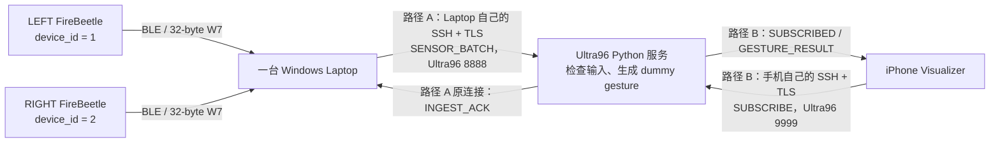
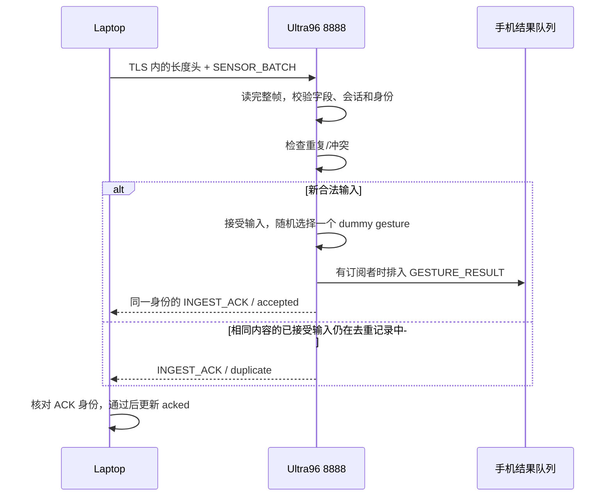
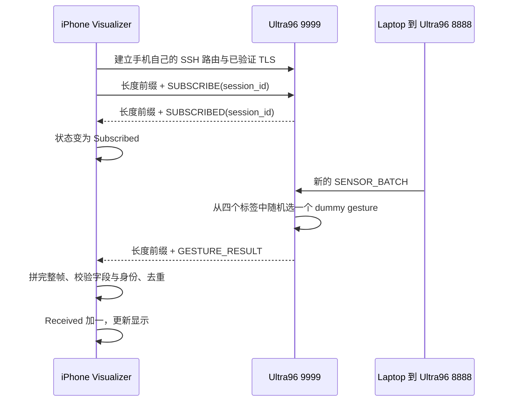
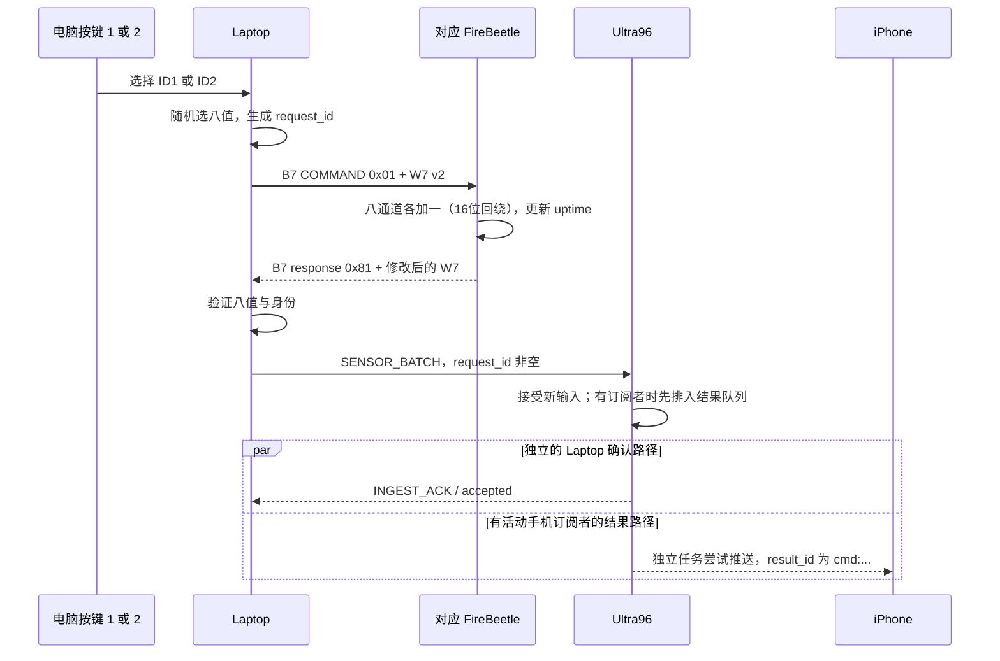

# B07 Communications：三个 Live 协议项目的零基础讲解

**环境说明：** 下文使用 `D:\LetThemCook` 的命令是原演示电脑示例；其他电脑请先按[通信快速上手](communications-quickstart.md)切换到实际仓库根目录，并设置自己的 SSH 身份和公有 CA 路径。

本稿按老师要求的三项排列：**1. Laptop ↔ Ultra96；2. Ultra96 ↔ iPhone Visualizer；3. FireBeetle 的设备 ID、包类型和包格式。**内容依据本次打包前的当前源码核对。下面的消息与字节示例是教学示例，已经用当前 Python 编解码器和消息校验器验证，不是假装现场采集到的日志。

配合使用：[中文 Live 全稿](B07-CO-live-demo-guide.zh-CN.md)、[英文 Live 全稿](B07-CO-live-demo-guide.en.md)。代码链接采用相对路径，项目整体移动后仍能找到文件；`#L数字` 表示关键行号，若当前 Markdown 查看器没有自动定位，打开文件后按编辑器的“转到行”输入数字。

先认识这几个设备和词：

| 名称 | 在你这个项目里是什么 | 它负责什么 |
|---|---|---|
| FireBeetle / ESP32 | LEFT、RIGHT 两块小板 | 自动产生八通道 dummy 数据；通过 BLE 发给电脑；接收电脑的控制和文件传输请求 |
| Laptop | 你的 Windows 演示电脑 | 用 `demo.py` 启动程序；接收两块板的数据；检查并转换格式；向 Ultra96 发送 |
| Ultra96 | 远程开发板及其 Python 服务 | 收输入、检查协议、回 ACK；为新的输入生成 dummy 手势结果并推送到手机 |
| Visualizer | iPhone 上的 App | 自己连接 Ultra96、订阅结果、检查结果并更新画面和 Received 计数 |
| 协议 protocol | 发送方和接收方约好的规则 | 包括“怎么连接、字节怎么排、各字段什么意思、收到后怎么回应、出错怎么办” |
| dummy data | 为验证通讯而使用的模拟数据 | 格式与当前传输协议一致；八个数来自预置数据表，手势也是模拟结果 |
| ACK | acknowledgement，应用程序的确认消息 | 在本项目里要说明“是谁确认了哪个阶段”；不能把所有 ACK 当成整条链路成功 |



**你只有一台 Laptop；两块 FireBeetle 可以都连这台 Laptop。手机通过自己的连接从 Ultra96 接收结果。**电脑的上行连接和手机的结果连接是两条独立路径。电脑已经收到 ACK 时，手机仍可能离线，这就是为什么现场需要分别检查电脑和手机。

## 1. Communications between laptop and Ultra96 [Live + Video]

老师要求：Explain the protocol for communication；Demo successful communications between ONE laptop and Ultra96 with dummy data。

### 1.1 从“发一条数据”理解连接的几层

假设 LEFT 产生一条八通道数据。小板通过 BLE 发出二进制 W7 包，Laptop 解码后得到设备、启动、序号、时间和八个值。Laptop 再把这些字段装进 `SENSOR_BATCH` JSON，发送给 Ultra96。

网络这一段分成几层，各层解决不同的问题：

| 层 | 当前项目采用什么 | 作用 |
|---|---|---|
| 应用内容 | `SENSOR_BATCH`、`INGEST_ACK` 等 JSON 对象 | 规定“这是什么消息、来自哪块板、带哪些数值” |
| 应用分帧 | 4 字节大端长度 + UTF-8 JSON | 规定“这一条消息到哪里结束，下一条从哪里开始” |
| TLS | 验证 CA 和服务端名称，最低 TLS 1.2 | 保护应用数据，确认连接的是受信任的 Ultra96 服务 |
| TCP 字节流 | Laptop 程序连接本地转发端口 | 提供有序可靠的字节流；它没有替应用定义一条 JSON 的边界 |
| SSH 路由 | 经校园跳板机的 SSH 本地端口转发 | 让 Laptop 到达 Ultra96 只在本机监听的服务端口 |

目前 `python demo.py tunnel` 将 **Laptop 的 `127.0.0.1:18889`** 转发到 **Ultra96 的 `127.0.0.1:8888`**。两处 `127.0.0.1` 分别指各自的电脑，不能把它们看成同一台机器。18889 是电脑端入口；8888 是 Ultra96 的输入服务端口；SSH 使用 22。

Laptop 应用到 Ultra96 服务之间的 TLS 字节经过 SSH 隧道。TLS 检查的名称仍然是 `ultra96.week7.internal`，不会因为连接入口写着 `127.0.0.1` 就跳过证书检查。

代码跳转：[当前隧道入口](../demo.py#L115)、[SSH 转发参数](../tools/ssh_tunnel.py#L12)、[TLS 验证配置](../common/tls.py#L7)、[Laptop 连接配置](../laptop/bridge.py#L34)。

### 1.2 为什么 JSON 前面还要放 4 个字节

TCP 像连续到来的字节带。发送程序一次写入一条消息，接收程序也可能分几次才收到；发送两条消息，接收程序可能一次就读到两条一起。因此不能假设“每调用一次 read，刚好得到一条 JSON”。

本项目先发 JSON 正文的长度，再发正文：

```text
完整应用帧 = [正文长度：4 字节，无符号，大端] + [正文：UTF-8 JSON]

例如：
00 00 00 9D | {"v":2,"type":"SENSOR_BATCH",...}
             ↑ 正文恰好 157 字节；0x9D = 十进制 157
```

“大端”表示高位字节在前。如果长度是 256，就写成 `00 00 01 00`。长度数的是 UTF-8 **字节数**，不包含前面这 4 字节；包含非 ASCII 字符时，字节数不一定等于字符数。

接收方先 `readexactly(4)`，把长度读完整；再 `readexactly(length)`，把正文读完整；最后才解析 JSON。当前正文只允许 1–16384 字节，还检查 UTF-8、重复键、非法数字以及消息必须为对象等条件。坏帧会结束当前连接，而不是继续猜下一条从哪里开始。

代码跳转：[计算长度并编码](../common/wire.py#L35)、[完整读取并校验](../common/wire.py#L49)。`struct.pack("!I", len(body))` 中 `!` 表示网络字节序，也就是大端；`I` 表示四字节无符号整数。

### 1.3 一条完整输入消息，每个字段是什么意思

下面这个教学示例正文恰好是 **157 字节**，前提是与下面相同的紧凑 JSON：

```json
{"v":2,"type":"SENSOR_BATCH","session_id":"week7-demo","device_id":1,"boot_id":42,"seq":7,"uptime_ms":1234,"values":[0,0,1000,0,0,0,10,20],"request_id":null}
```

| 字段 | 示例值 | 零基础解释 |
|---|---|---|
| `v` | `2` | 这个消息遵守第 2 版应用消息规则 |
| `type` | `SENSOR_BATCH` | 这是上传数据的消息。当前一条含一组八通道数据，名称中的 batch 不表示这里塞了很多时间点 |
| `session_id` | `week7-demo` | 所属演示会话。Laptop、Ultra96 和手机必须一致；它不是密码，也不是时间戳 |
| `device_id` | `1` | 数据来自 LEFT；2 表示 RIGHT |
| `boot_id` | `42` | 这块板本次启动的标识。真实固件启动时生成随机 uint32，用于区分重启前后的序号；教学例用 42 |
| `seq` | `7` | 这次启动中该数据流的序号。各板分别计数，不是两块板共享一个序号 |
| `uptime_ms` | `1234` | 产生/处理这条数据时，小板启动后经过的毫秒数；不是日期时间 |
| `values` | 八个整数 | 八个有符号 16 位通道值，范围 -32768 到 32767。本演示来自 dummy 表，不能称为本次实际测量的运动数据 |
| `request_id` | `null` | 表示普通自动数据流。键盘命令则是非空 ID，并要求等于该条消息的 `seq` |

为什么不能只传八个数？因为只有数字时，收到相同的 `[0,0,1000,...]` 无法判断来自哪块板、是新数据还是重发、重启前还是重启后。身份字段让我们能够逐条核对。

代码跳转：[W7 包转换为 JSON](../common/sensor.py#L41)、[Ultra96 精确字段和范围校验](../ultra96/protocol.py#L28)。v2 必须包含 `request_id` 这个键；普通流要传 JSON 的 `null`，不能直接省略。

### 1.4 Ultra96 接到后具体做什么，ACK 证明什么



示例 ACK：

```json
{"v":2,"type":"INGEST_ACK","session_id":"week7-demo","device_id":1,"boot_id":42,"seq":7,"request_id":null,"status":"accepted"}
```

Laptop 不能随便收到一个 ACK 就加一。它会逐项比较 `v`、`session_id`、`device_id`、`boot_id`、`seq` 和 `request_id`；只有匹配，才确认“刚才这条输入已由 Ultra96 应用处理”。

`accepted` 表示服务器新接受这条输入；`duplicate` 表示已接受过的同一输入再次到达，不生成第二个手势事件。相同身份但不同内容会被拒绝。去重状态在当前服务器进程内，并非断电后永久保存；旧数据可能重放时，重启服务需正确管理新会话。

**`INGEST_ACK` 证明输入到达并通过 Ultra96 的应用处理；它不证明手机收到，也不证明真实 AI 推理完成。**当前模拟手势在新输入被接受时生成；手机推送是独立任务，无手机订阅时服务器仍可回 ACK。

代码跳转：[接收输入、生成结果与 ACK](../ultra96/server.py#L246)、[v2 去重和冲突检查](../ultra96/server.py#L277)、[Laptop 核对 ACK](../laptop/bridge.py#L375)。

### 1.5 现场怎么演示：沿用 `demo.py`，用实体板产生 dummy 数据

“dummy”不等于必须用电脑模拟 BLE。你现在的实体固件自动发送的八通道数据就是 dummy，因此现有 `demo.py run/live` 已能展示这项要求。“ONE laptop”是只用一台电脑，并不要求只能使用一块 FireBeetle。

1. 给两块已经配对、烧好当前固件的板独立供电。电脑蓝牙保持开启，使用平时已验证能访问 Ultra96 的网络和 VPN/SSH 路线。
2. 打开 PowerShell 终端 A，进入包含 `demo.py` 的目录。原工程用下面路径；演示冻结 ZIP 时改为它解压后含 `demo.py` 的目录。

   ```powershell
   Set-Location 'D:\LetThemCook'
   python demo.py service
   ```

3. 确认服务检查显示 Ultra96 两个服务端口已工作。`service` 是检查入口；服务未运行时先按部署说明处理。当前 `service --start` 的辅助代码包含既定远端源码路径，不能把它当作“自动启动任意新上传目录”的命令。
4. 在终端 A 运行下面命令，按提示输入 SSH 登录信息。此终端保持打开。

   ```powershell
   python demo.py tunnel
   ```

5. 打开 PowerShell 终端 B，进入同一目录。为了把此项与下一项合并观察，先让手机连接到 `Subscribed`，记下手机 `Received` 起点，再开始本轮。
6. 在终端 B 运行：

   ```powershell
   Set-Location 'D:\LetThemCook'
   python demo.py run --duration 75
   ```

   冻结 ZIP 演示时同样把目录改成解压目录。若 CA 证书不在既定默认位置，在命令后加 `--ca '已有受信任CA证书的完整路径'`。
7. 等待 BLE 连接、认证、订阅和两板准备完成。观测阶段不是从你敲下命令那一刻立刻开始。看到 `mode=physical`、两个设备的 `received/acked` 递增后，指出：“数据已由小板到电脑，并由 Ultra96 回应用 ACK。”
8. 正常等程序结束，不用 Ctrl+C 提前结束。记下 `Saved in:` 的目录。查看 `Generated / Received / ACKed` 两行以及 `MissingBLE / MissingACK`；完整 clean 基线应逐板对齐，缺失为 0。
9. 打开该次目录的 `packets.log`，找同一 `device_id + boot_id + seq` 的 sensor 和 ACK。`sensor` 是电脑收到 BLE 数据的证据；`sensor_ack` 是 Ultra96 确认的证据。报告中的计数是很多这样的记录累计形成的。
10. 若需要重新显示报告，在终端 B 执行下面命令，将路径替换成本轮真实路径：

    ```powershell
    python demo.py report '本轮 Saved in 的完整目录'
    ```

成功判据：使用同一轮证据，Laptop 有实际发送和匹配 ACK，错误/丢弃等指标满足报告 clean 检查。`CAPTURE PASSED` 的边界是物理 FireBeetle 输入到 Ultra96 接入 ACK；手机必须按第 2 项独立检查。

### 1.6 可选：只隔离 Laptop ↔ Ultra96 的网络通道

老师若希望先不连接小板，你可以运行现有底层模块的 `--mock`。当前 **`demo.py` 没有 `--mock` 参数**；不要写成 `python demo.py run --mock`。

1. 保留终端 A 的 `python demo.py tunnel`。
2. 先结束其他生产者，避免两轮数据一起进入手机计数。
3. 终端 B 在工程根目录执行以下命令，生成新证据目录并运行 20 秒：

   ```powershell
   $demoCa = Join-Path $HOME '.codex\private\cg4002-week7-20260906\ca-cert.pem'
   $dummyDir = Join-Path (Get-Location) ('.week7-local\dummy-' + [guid]::NewGuid().ToString('N'))
   New-Item -ItemType Directory -Path $dummyDir | Out-Null
   python -m laptop.dual_bridge --mock --ca $demoCa --port 18889 --duration 20 --expected-rate 10 --progress-interval 1 --report (Join-Path $dummyDir 'report.json') --evidence (Join-Path $dummyDir 'packets.jsonl')
   $dummyExit = $LASTEXITCODE
   $dummyReport = Get-Content -Raw -LiteralPath (Join-Path $dummyDir 'report.json') | ConvertFrom-Json
   $dummyExit
   $dummyReport | Select-Object clean, mock_input, report_saved
   $dummyReport.devices.'1' | Select-Object received, sent, acked, ack_errors, transport_errors
   $dummyReport.devices.'2' | Select-Object received, sent, acked, ack_errors, transport_errors
   ```

4. 预期 `mode=synthetic`、`mock_input=True`；两路都有匹配 ACK、相关错误为 0，完成时 `clean=True`、退出码 0。不是必须恰好 400 条，实际数量由本轮时间、调度及启动收尾决定。
5. 这里仍只用一台 Laptop，它产生两个逻辑 device ID 的 v2 包，经真实 TLS/SSH 到 Ultra96。**不能用 synthetic 的数字证明实体 BLE 或小板真的发送过。**输出即使沿用 `BLE_sensor_kbps` 字段名称，在 mock 模式也不能称为物理蓝牙测速。

该模块的 JSON 报告可直接查看；`demo.py report` 的 `CAPTURE PASSED` 检查专门面向物理双板演示，并要求其自己的退出码证据文件，不用它给上述 synthetic 运行判定物理通过。

代码跳转：[mock 数据源](../laptop/bridge.py#L949)、[双逻辑设备 mock 调度](../laptop/dual_bridge.py#L98)。

### 1.7 现场可直接讲的短稿

**中文：**“我的 Laptop 把小板的完整数据包解码，再转换成包含设备 ID、boot ID、序号、时间和八个值的 SENSOR_BATCH JSON。网络协议使用四字节大端长度前缀，解决 TCP 没有消息边界的问题。应用数据通过验证证书的 TLS，并经过 SSH 隧道，到达 Ultra96 的 8888 输入端口。Ultra96 验证消息后回相同身份的 INGEST_ACK。我用电脑上的发送记录与匹配 ACK 证明这条路径成功；手机收到结果需要另行观察。”

**English:** “The laptop decodes the complete sensor packet and sends a SENSOR_BATCH JSON message containing the device ID, boot ID, sequence number, uptime and eight values. Each JSON body has a four-byte big-endian length prefix, because TCP is a byte stream. The application uses certificate-verified TLS through an SSH tunnel to the Ultra96 ingestion service on port 8888. The server validates the message and returns an INGEST_ACK with the same identity. A matching ACK proves ingestion by the Ultra96 application. Phone reception is checked separately.”

## 2. Communications between Ultra96 and Visualizer on the phone [Live + Video]

老师要求：Explain the protocol；Explain and Demo successful communications between Ultra96 and Visualizer with dummy data。

### 2.1 手机为什么需要自己的连接

Laptop 向 8888 端口上传输入；手机向 Ultra96 的 9999 结果服务建立自己的连接。手机 App 内部负责 SSH 路由、TLS 检查、订阅和接收。手机没有通过 Laptop 的 18889 端口收结果，Laptop 也没有用 BLE 给手机转发这些手势。

当前 App 支持其配置的板子直连或跳板机路线；启用校园跳板配置时，是 iPhone 自己建立对应 SSH 跳转，再从板子 SSH 通道到板子 `127.0.0.1:9999`。TLS 仍验证 CA 与 `ultra96.week7.internal` 名称。

代码跳转：[手机创建 SSH/TLS 路径](../ios-visualizer/CommsNative/Sources/CommsTransport/CommsClient.swift#L74)、[连接板子内部结果端口](../ios-visualizer/CommsNative/Sources/CommsTransport/CommsClient.swift#L139)。

### 2.2 订阅握手逐步发生了什么

“订阅”就是手机告诉服务器：“我要接收这个会话之后产生的结果。”应用过程如下：



手机发送：

```json
{"v":1,"type":"SUBSCRIBE","session_id":"week7-demo"}
```

Ultra96 回复：

```json
{"v":1,"type":"SUBSCRIBED","session_id":"week7-demo"}
```

这两个握手消息仍使用 `v:1`；随后手机可接收 v1 或 v2 的结果。这是当前协议规定，不是版本写错。它们也各自有 4 字节大端长度头；上面的紧凑 JSON 正文分别是 52 和 53 字节。

**`Subscribed` 表示订阅握手成功，还不能表示已经收到一条手势结果。**必须继续观察 `Received` 增长和具体结果。

代码跳转：[TLS 完成后发 SUBSCRIBE](../ios-visualizer/CommsNative/Sources/CommsTransport/Subscriber.swift#L24)、[服务端接收订阅并回 SUBSCRIBED](../ultra96/server.py#L309)。

### 2.3 GESTURE_RESULT 是什么，随机手势在哪里生成

同第 1 项输入相对应的教学结果示例：

```json
{"v":2,"type":"GESTURE_RESULT","session_id":"week7-demo","device_id":1,"boot_id":42,"seq":7,"request_id":null,"result_id":"1:42:7","gesture":"OPEN","confidence":1.0}
```

身份字段继续保留，以便把结果追到原始输入。另外三个字段是：

| 字段 | 作用 |
|---|---|
| `result_id` | 普通流为 `device:boot:seq`，例如 `1:42:7`；键盘命令为 `cmd:device:boot:request_id` |
| `gesture` | 当前允许 `REST`、`FIST`、`OPEN`、`POINT` 四个标签 |
| `confidence` | 当前固定为 `1.0`，属于 dummy 协议值；不能解读成训练模型有 100% 把握 |

**当前 v2 手势由 Ultra96 随机生成。**代码执行 `self._rng.choice(GESTURES)`。它不根据八个数值进行模型推理，因此相同的八值可以得到不同标签，不同八值也可以得到相同标签；连续多次 OPEN 完全可能。

不要把以下三处“随机”混在一起：

| 发生的事情 | 随机在哪里执行 | 什么时候发生 |
|---|---|---|
| 自动 sensor 选择八通道 dummy 数据 | FireBeetle 固件 | 发自动 sensor 包时，从编译进固件的表中选择 |
| 电脑按 `1` / `2` 选择命令的八值 | Laptop Python | 接收该按键、构建本次命令时 |
| 从四个 gesture 标签里挑一个 | Ultra96 Python | 新的合法 v2 输入被接受时 |

旧 v1 模式的手势采用 `seq % 4` 确定循环标签；当前正常固件默认是 v2，不能把旧循环规则拿来解释当前随机标签。

代码跳转：[Ultra96 随机选择标签](../ultra96/server.py#L264)、[四个标签及结果 ID 规则](../ultra96/protocol.py#L4)、[ESP 随机源](../firmware/esp32/src/main.cpp#L87)、[Laptop 按键选数据](../laptop/bridge.py#L256)。

### 2.4 手机画面为什么是可靠的独立观察点

收到网络字节不等于画面一定更新。手机首先拼出完整的长度帧，检查 JSON 字段、session、版本、设备 ID、result ID、gesture 和 confidence。之后显示层检查当前会话和已见结果 ID，接纳新的结果时才给 `Received` 加一。

`Received` 是手机自己接纳结果的计数。手机每次明确开启新的用户连接会话会清零；同一会话内自动重连会保留去重/计数状态。去重集合最多保留 4096 个结果 ID，不是永久无限保存全部历史。比较前后数字时，不要中途手动断开再开始一个新会话。

网络结果可能很密集，画面显示的是最新结果。你不可能靠人眼看到所有标签变化，但计数可以持续累加。没有新结果超过显示层的 2 秒后，画面清掉旧标签显示 `No live result`，避免一直把陈旧结果当成实时结果；此时连接仍可能保持 `Subscribed`。

服务器只保留当前订阅者的有限实时队列：最多 32 条，满时丢最旧；排队过旧的结果被丢弃。没有订阅者时不保存历史结果等待手机后来补收。因此要先看到手机 `Subscribed`，再开始测试。新订阅者会替换旧订阅者，现场不要同时启动 Laptop 的 phone simulator 抢走手机订阅。

这些时效检查主要约束各阶段自己的积压和显示年龄；结果中没有贯穿整条路径的生成时间戳，不能据此宣称严格测得“ESP 到手机端到端延迟永远小于 2 秒”。

代码跳转：[手机结果校验](../ios-visualizer/CommsNative/Sources/CommsCore/Protocol.swift#L36)、[手机流式分帧](../ios-visualizer/CommsNative/Sources/CommsCore/Protocol.swift#L109)、[去重与计数](../ios-visualizer/CommsNative/Sources/CommsCore/DisplayState.swift#L60)、[画面文字](../ios-visualizer/CommsNative/Sources/CommsBridge/DisplayMailbox.swift#L10)、[Ultra96 实时队列](../ultra96/server.py#L32)。

### 2.5 现场操作和判断，不能跳过手机这一步

1. 确认 Ultra96 服务和 Laptop 的 SSH 隧道已经按第 1 项准备好。
2. 在 iPhone 打开当前 Visualizer，使用已经验证的连接配置连接。保持 App 在前台、屏幕亮着。
3. 等待状态为 `Subscribed`，拍下当前 `Received` 数，例如 250；这个数字只是举例。
4. 暂停其他测试生产者，避免收到另一轮数据。然后在 Laptop 运行第 1 项的 `python demo.py run --duration 75`。此项可与第 1 项使用同一轮，不必重复跑。
5. 指给老师看手机 `Received` 持续增加，以及 `REST/FIST/OPEN/POINT` 标签和 `device:boot:seq` 格式的结果 ID。解释标签重复正常。
6. 等 Laptop 正常结束，并让手机处理完已到达结果，记录最终手机计数。假如起点 250、终点 1755，增量为 1505；这些是计算方式示例，不是本轮保证值。
7. 对照同一轮 Laptop 报告。没有按键命令的 clean 运行，预期手机增量等于两板实际新接入的普通 sensor 总数；干净物理运行中它们与 generated/ACKed 对齐。若用了 `live` 按键，还要加上成功完成并被新接入的命令数。
8. 如果少了，保留实际差值，检查手机是否晚订阅、重连、退出前台、被另一个订阅者替换、结果队列丢弃等。Laptop 全 ACK 不能覆盖手机缺收。
9. 需要逐条证明时，低速观察并拍到手机某个具体 `result_id`，再与电脑记录中的 device/boot/seq 或 command request ID 对照。只比较总数时，结论是“手机总量吻合”，不能说已逐条审计所有手机结果。

当前手机协议在订阅后主要单向接收结果，没有每条 `GESTURE_RESULT` 的手机应用 ACK。服务器完成 write 或 drain 只说明本地发送步骤完成，不能独自证明 App 已显示。实际手机屏幕和手机接收记录才是这项演示的观察点。

### 2.6 现场可直接讲的短稿

**中文：**“手机通过自己的 SSH 与 TLS 连接订阅 Ultra96 的 9999 结果端口。TLS 验证后，手机发送 SUBSCRIBE，服务端回复 SUBSCRIBED。Ultra96 每接受一个新的 v2 输入，会从四个标签里随机生成一个模拟 AI 结果；有活动订阅者时，把带有原始身份的 GESTURE_RESULT 放入该订阅者的结果队列，由独立发送任务推送。手机收到后检查结果 ID、去重并更新 Received。这些标签用于演示通讯，不是真实模型推理；我用手机计数和具体结果 ID 的实际变化证明结果到达了手机。”

**English:** “The iPhone uses its own SSH and certificate-verified TLS connection to the Ultra96 result service on port 9999. It sends SUBSCRIBE and waits for SUBSCRIBED. For each newly accepted v2 input, the Ultra96 randomly selects one of four dummy gesture labels. When a subscriber is active, it queues a GESTURE_RESULT with the original input identity for that subscriber. A separate task sends queued results. The phone validates and deduplicates received results before updating its Received count and display. These are dummy inference results for the communication demonstration. I verify reception by observing the actual phone count and result IDs.”

## 3. Explain FireBeetle: device IDs, packet types, packet format [Live + Video]

### 3.1 设备 ID、蓝牙地址、boot ID、seq 分别识别什么

| 名称 | 范围/形式 | 回答什么问题 | 何时变化 |
|---|---|---|---|
| `device_id` | 1 或 2 | 来自 LEFT 还是 RIGHT？ | 固件构建配置决定；重启通常不改变 |
| BLE address | 蓝牙地址 | 电脑在无线连接时具体找哪块板？ | 由设备身份决定，存于电脑的地址映射 |
| `boot_id` | uint32 | 这是这块板哪次启动？ | 固件启动时随机生成，重启通常改变；不是数学保证永不碰撞的全球唯一 ID |
| `seq` | uint32 | 当前启动、当前自动流的第几条样本？ | 自动产生新样本时前进；两块板独立 |
| `request_id` | 非零 uint32 | 哪次控制命令/事务？ | Laptop 分配；普通自动网络消息该字段为 null |
| `session_id` | 字符串 | 当前服务配置的哪个逻辑演示会话？ | 配置改变时变化；默认 week7-demo，不是每轮 run 自动随机生成 |
| `result_id` | 字符串组合 | 手机这条结果对应哪个输入？ | 从输入身份生成，不是另抽一个随机数 |

LEFT 编译环境设置 `COMMS_DEVICE_ID=1`，RIGHT 设置为 2。Laptop 根据地址连上板后，还检查数据包内的 `device_id`，不能只靠同名的 BLE 广播名称区分。

代码跳转：[左右构建环境](../firmware/esp32/platformio.ini#L18)、[固件设备 ID 与 GATT UUID](../firmware/esp32/src/main.cpp#L31)、[启动时生成 boot ID](../firmware/esp32/src/main.cpp#L406)。

### 3.2 固定 32 字节 W7 数据包，逐个字节讲清楚

ESP 自动 sensor 通过 BLE GATT notification 发送。数据特征的完整 UUID 是 `6e1c0005-7a45-4dc4-b678-3f2d5a9c1001`，可以用第一段里的 `0005` 帮助记忆。

一个普通 sensor notification 的应用数据恰好 **32 字节**，格式对应 Python 的 `struct.Struct("<2sBBIII8h")`：

```text
字节偏移： 0  1 | 2 | 3 | 4       7 | 8      11 | 12     15 | 16            31
内容：      W  7 |版本|ID |  boot_id  |    seq    | uptime_ms | 八个 int16 values
长度：       2  | 1 | 1 |     4     |     4     |     4     |       16
总长度：2 + 1 + 1 + 4 + 4 + 4 + 8×2 = 32 字节
```

| 偏移（从 0 起） | 长度 | 字段 | 类型与含义 |
|---|---:|---|---|
| 0–1 | 2 | magic | ASCII `W7`，十六进制 `57 37`，帮助识别本协议 |
| 2 | 1 | version | 当前正常 dummy 固件发 2；也支持旧 1 |
| 3 | 1 | device_id | 1=LEFT、2=RIGHT |
| 4–7 | 4 | boot_id | 无符号 32 位、小端 |
| 8–11 | 4 | seq | 无符号 32 位、小端 |
| 12–15 | 4 | uptime_ms | 无符号 32 位、小端 |
| 16–17 | 2 | values[0] | 有符号 16 位、小端 |
| 18–19 | 2 | values[1] | 同上 |
| 20–21 | 2 | values[2] | 同上 |
| 22–23 | 2 | values[3] | 同上 |
| 24–25 | 2 | values[4] | 同上 |
| 26–27 | 2 | values[5] | 同上 |
| 28–29 | 2 | values[6] | 同上 |
| 30–31 | 2 | values[7] | 同上 |

“小端”表示低位字节先放，例如 1000 = `0x03E8`，写成 `E8 03`；boot 42 写成 `2A 00 00 00`。上面的网络 JSON 长度头是大端，这里的 BLE 二进制字段是小端，两者各自有明确约定，并不冲突。

第 1 项示例对应的完整 32 字节为：

```text
57 37 02 01 | 2A 00 00 00 | 07 00 00 00 | D2 04 00 00 |
00 00 00 00 E8 03 00 00 00 00 00 00 0A 00 14 00

W7 v2 ID1  | boot 42     | seq 7       | uptime 1234 |
values = [0, 0, 1000, 0, 0, 0, 10, 20]
```

这里的 `W7` 是标记，不是校验和；该 32 字节应用包没有单独 CRC 字段。BLE/TLS 各层有各自的保护，不能虚构这里存在一个 CRC 字段。

这里 32 字节指应用数据，不包括 BLE 无线协议的开销。一次 GATT notification 的应用承载容量受 ATT MTU 限制，通常为 `MTU - 3`；因此本实现要求 sensor 通道 MTU 至少 35，才发送完整 32 字节 W7。普通默认 MTU 23 只能承载 20 字节，程序需要先完成 MTU 协商，不能直接塞下该包。代码跳转：[sensor MTU 检查](../firmware/esp32/include/comms_security.h#L19)。

源码创建一个 GATT service（UUID 第一段里的 `0001`）和七个 GATT characteristics（`0002` 至 `0008`）；主数据、控制、统计及测试特征的用途不同，下节会按用途说明。

代码跳转：[Python 固定布局](../common/sensor.py#L11)、[固件写各字节](../firmware/esp32/include/comms_packet.h#L22)、[Python 解码检查](../common/sensor.py#L72)、[实际创建特征](../firmware/esp32/src/main.cpp#L429)。

### 3.3 为什么有 signed 和 unsigned，它们不表示两套传输

一个字节有 8 个二进制位。`uint8_t` 表示用 0–255 的数值看这个字节，适合存储和拼接原始字节。八个 sensor 通道是 `int16_t`，它们用两个字节表示 -32768 到 32767，可以有负数。

同两个字节如何解释取决于协议：`FF FF` 用无符号 16 位看是 65535，用本协议有符号 16 位看是 -1。传输的比特没有变，变的是解释规则。

你之前问的 unsigned bits 主要来自键盘命令修改数据的实现。ESP 想给每个通道加 1，又要明确定义最大值边界，于是先按无符号 16 位位模式拼出值、加 1、保留 16 位，再拆回字节。Laptop 按 int16 解码结果：

| 输入通道值 | 输入 16 位位模式 | 加一后的位模式 | 解码后的输出 |
|---:|---|---|---:|
| -1 | `FFFF` | `0000` | 0 |
| 0 | `0000` | `0001` | 1 |
| 32767 | `7FFF` | `8000` | -32768 |
| -32768 | `8000` | `8001` | -32767 |

因此“每个通道加一”的准确表述是 **16 位回绕加一**；最大值 32767 的下一值为 -32768。这不是加密，也不是随机数生成；它让修改行为在边界上仍明确、可验证。

代码跳转：[固件位模式加一](../firmware/esp32/include/comms_control.h#L138)、[Laptop 计算预期输出](../common/control.py#L119)。

### 3.4 Packet types：W7 数据、B7 控制、W7S1 统计

32 字节 W7 头里没有另一个独立 `packet_type` 字段。它被定义为 sensor 数据结构；控制操作使用另一种 `B7` 帧，其中才有 opcode 区分具体操作。GATT characteristic 也区分数据、控制请求、控制响应和统计。

| 应用数据/包 | 方向与承载位置 | 用途 |
|---|---|---|
| W7，32 字节 | ESP → Laptop，sensor characteristic notification | 自动 dummy sensor 流 |
| B7 请求 | Laptop → ESP，control characteristic write | 命令修改、设定速率、文件传输 |
| B7 响应 | ESP → Laptop，response characteristic notification | 返回状态、命令修改后的 W7 包、文件进度或摘要 |
| W7S1，24 字节 | Laptop 读取 ESP source statistics characteristic | 核对 boot、生成序号、BLE 提交成功与失败计数 |
| Counter，4 字节 | ESP → Laptop，counter characteristic notification | 早期计数/链路测试；不是完整 sensor 证据 |
| MTU probe control / payload | 独立的测试特征 | 验证协商后可承载的 BLE 数据长度 |

B7 控制头是 **14 字节，小端**，后面跟操作对应的 payload：

| 偏移 | 长度 | 字段 | 说明 |
|---|---:|---|---|
| 0–1 | 2 | magic | `B7`，十六进制 `42 37` |
| 2 | 1 | control version | 1，与内部 W7 sensor 的 v2 是各自版本 |
| 3 | 1 | opcode | 操作码；响应把最高位设为 1，即请求 opcode OR `0x80` |
| 4 | 1 | device_id | 目标/响应设备 1 或 2 |
| 5 | 1 | status | 请求为 0；响应中 0=成功，其他值为具体失败原因 |
| 6–9 | 4 | request_id | 本次控制事务 ID；文件传输时同一文件所有块沿用同一 transfer ID |
| 10–13 | 4 | offset | 文件字节偏移/进度；COMMAND 与 SET_RATE 必须为 0 |
| 14 起 | 可变 | payload | 例如完整 32 字节 W7、两字节速率、文件内容块 |

| 请求 opcode | 成功响应 opcode | 名称 | payload/用途 |
|---|---|---|---|
| `0x01`（1） | `0x81`（129） | COMMAND | 请求和成功响应都带一个完整 32 字节 W7 v2；ESP 修改八值并返回 |
| `0x02`（2） | `0x82`（130） | SET_RATE | 两字节小端 uint16，目标 1–200 Hz；响应回确认值 |
| `0x10`（16） | `0x90`（144） | FILE_BEGIN | 请求带 4 字节长度 + 32 字节 SHA-256；响应报告接收进度 |
| `0x11`（17） | `0x91`（145） | FILE_CHUNK | 请求带 offset 和本块字节；响应 offset 为已接收字节数 |
| `0x12`（18） | `0x92`（146） | FILE_END | 要求全部收齐并核对 SHA-256；成功响应带实收长度和计算的摘要 |
| `0x13`（19） | `0x93`（147） | FILE_ABORT | 终止匹配的文件事务，释放相应内存 |

状态码：0 OK（成功）；1 INVALID（内容/字段无效）；2 BUSY（忙或分配失败）；3 ORDER（顺序/事务不对）；4 INTEGRITY（完整性校验失败）；5 CONFLICT（相同身份的内容冲突）；6 UNSUPPORTED（不支持的版本/操作）。错误响应没有成功 payload，不能继续当作成功数据解码。

完整 COMMAND 帧是 **14 + 32 = 46 字节**。实际 BLE 控制数据大小还受协商 MTU 限制；代码要求控制通道 MTU 至少 64，文件 chunk 最大为 `min(180, MTU - 3 - 14)` 字节。

W7S1 统计 24 字节布局：0–3 为 `W7S1`，4 为 device ID，5–7 为保留零，8–11 为 boot ID，12–15 为 next sequence，16–19 为提交成功累计，20–23 为提交失败累计。读取开始与结束快照后才能计算本轮差值；“提交成功”只是交给 BLE 栈，不等于电脑或 Ultra96 已收到。

代码跳转：[B7 定义和校验](../common/control.py#L8)、[ESP opcode 分派](../firmware/esp32/include/comms_control.h#L59)、[源统计布局](../firmware/esp32/include/comms_source_stats.h#L33)。

### 3.5 按电脑 1 / 2 时的完整往返

普通自动 sensor 持续发送，按键额外触发一次命令事务。不是“只有按一下才自动发一个 sensor”。



ACK 和手机结果经过两条独立连接，实际到达先后不保证；结果排入队列也不等于手机已经收到，手机侧仍需观察计数和结果 ID。

用教学例讲：电脑生成 request ID 1001，选出 `[32767,-32768,-1,0,1,123,-456,789]`。目标为 device 1、boot 42；命令内 `seq=1001`、输入 uptime=0。ESP 返回 `[-32768,-32767,0,1,2,124,-455,790]`，更新 uptime，保留 device/boot/seq。Laptop 验证通过后再上传：

```json
{"v":2,"type":"SENSOR_BATCH","session_id":"week7-demo","device_id":1,"boot_id":42,"seq":1001,"uptime_ms":2345,"values":[-32768,-32767,0,1,2,124,-455,790],"request_id":1001}
```

对应手机结果 ID 是 `cmd:1:42:1001`。普通自动 sensor 即使恰巧也有 seq 1001，它的结果 ID 是 `1:42:1001`，没有 `cmd:`；服务器也区分自动流与命令去重记录。

**当前代码没有一种网络消息叫 `COMMAND_RESULT`。**命令响应是 BLE 上 `opcode=0x81` 的 B7 帧；转发给 Ultra96 时仍叫 `SENSOR_BATCH`，用非空 `request_id` 标识；发手机的结果仍叫 `GESTURE_RESULT`。日志事件 `command_modified`、`command_ingested` 也不是新的网络消息类型。

现场可以运行 `python demo.py live --duration 75`，等两板工作后按 `1` 或 `2`，无需 Enter。结束后在本轮 `packets.log` 查同一 device/request ID 的 `command_original` → `command_modified` → `command_ingested`；手机如果显示对应 `cmd:` ID，再指出最后一段链路也已到达。每台板有自己的有界命令队列，快速按键可能被排队或拒绝，要看 accepted/completed/rejected/failed，不能靠按键次数猜成功次数。

代码跳转：[构造键盘命令](../laptop/bridge.py#L256)、[电脑校验 ESP 修改结果](../laptop/controls.py#L180)、[独立 TLS 上传命令](../laptop/bridge.py#L263)、[命令完成计数与日志](../laptop/controls.py#L303)。

### 3.6 文件传输为什么手机也在收结果

文件用 B7 的 begin/chunk/end 协议，通过 BLE 传到指定 ESP；成功的 end 响应包含 ESP 对实收内存计算出的 SHA-256。当前实现把文件放在 ESP **RAM 缓冲区**，没有保存为能浏览的文件路径；断线等清理会释放内存。

传文件时自动 sensor 流仍然运行。手机收到的是这些 sensor 产生的 gesture 结果，不是文件块。`--file-device 1` 表示把文件发到 LEFT；2 表示 RIGHT，不表示第 1 台电脑或手机。

这项可以证明数据字节到了 ESP 并通过摘要核验，但不能声称已写入 ESP 持久文件系统。代码跳转：[分配接收内存](../firmware/esp32/include/comms_control.h#L162)、[接收块](../firmware/esp32/include/comms_control.h#L182)、[接收端 SHA-256 核验](../firmware/esp32/include/comms_control.h#L200)。

### 3.7 现场可直接讲的短稿

**中文：**“LEFT 和 RIGHT 在固件里分别配置为设备 1 和 2。自动 sensor 采用固定 32 字节的 W7 二进制包：两字节标记、一字节版本、一字节设备 ID、三个 uint32 字段 boot ID、序号和 uptime，最后是八个 int16 数据值；多字节字段使用小端。设备 ID 区分左右板，boot ID 区分重启，seq 用于逐条跟踪。另外，控制协议使用 14 字节 B7 头，opcode 区分命令、速率和文件操作。按键命令带完整 W7 包，小板将八个值分别做 16 位回绕加一，再带原 request ID 返回，让电脑能核对具体哪次操作成功。”

**English:** “The LEFT and RIGHT firmware builds use device IDs 1 and 2. Automatic telemetry uses a fixed 32-byte W7 packet: two magic bytes, one version byte, one device byte, three uint32 fields for boot ID, sequence and uptime, and eight signed int16 values. Multi-byte binary fields are little-endian. The device ID separates the two boards, the boot ID distinguishes restarts, and the sequence tracks samples. A separate B7 control protocol has a 14-byte header and opcodes for commands, rate changes and file transfers. A keyboard command carries a complete W7 packet. The ESP increments all eight values with explicit 16-bit wraparound and returns the correlated response.”

## 4. 老师可能追问：回答时的边界

| 追问 | 可以准确回答的内容 | 关键代码 |
|---|---|---|
| 你到底用了什么协议？ | ESP 到电脑是 BLE GATT 上的 W7/B7；电脑到板、板到手机是长度前缀 JSON over TLS，经各自 SSH 路由。 | [W7](../common/sensor.py#L11)、[B7](../common/control.py#L16)、[网络分帧](../common/wire.py#L35) |
| TCP 可靠为什么还要 ACK？ | TCP 不报告“Ultra96 应用是否接受了正确的这条消息”。应用 ACK 可匹配 session/device/boot/seq/request，并表明 accepted 或 duplicate。 | [ACK 核对](../laptop/bridge.py#L375) |
| 为什么 SSH 里面又用 TLS？ | SSH 提供到私有端口的访问路线；应用层另外用 CA 和服务名检查目标服务，保持相同验证规则。 | [TLS](../common/tls.py#L7) |
| 每条 sensor 真的是传感器测量吗？ | 此次是实体板发出的格式完整 dummy 数据，来自预置八通道表；不能称为实际动作测量。 | [数据表](../common/dummy_fixtures.json)、[固件选表](../firmware/esp32/include/comms_packet.h#L54) |
| 固定格式为什么日志行长度不一样？ | 固定 32 字节指 BLE sensor 二进制；日志是文字，有不同事件、十进制数字长度和可选 raw_hex。JSON 正文长度也随数字变化，所以网络用长度前缀。 | [包格式](../common/sensor.py#L11)、[日志](../laptop/evidence.py) |
| 改电脑上的 dummy JSON，小板马上变吗？ | 自动流的表在构建时编进固件，需重新生成头文件、编译、烧录才改变；Laptop mock/按键源读取的是电脑表。 | [固件表生成](../tools/generate_dummy_fixtures.py)、[烧录流程](../flash.py) |
| 按一次键是不是给 sensor seq 加一？ | 额外命令有独立 request ID；自动 sensor 序号继续独立计数，命令不会消耗自动流的序号。 | [命令实现说明](../firmware/esp32/include/comms_control.h#L32)、[独立上传](../laptop/bridge.py#L263) |
| “ingested”能否证明手机收到？ | 只能证明 Ultra96 接入了命令。需要手机 Received/具体 cmd 结果 ID 的独立观察。 | [命令完成](../laptop/controls.py#L303)、[手机计数](../ios-visualizer/CommsNative/Sources/CommsCore/DisplayState.swift#L60) |
| 手机晚连接能补收到以前结果吗？ | 当前是实时流，不保存离线历史给迟到订阅者；必须先订阅再开始本轮。 | [无订阅者处理](../ultra96/server.py#L268)、[实时队列](../ultra96/server.py#L32) |
| 随机标签跟八值有什么对应？ | v2 当前没有模型映射，Ultra96 独立随机选四个标签之一；它用于通讯演示。 | [随机结果](../ultra96/server.py#L264) |
| 能保证绝对零丢包吗？ | 只能依据某一轮的源端、接收、ACK 对账及手机观察陈述该轮结果；有界队列、断线和过时丢弃都是实际边界。 | [源对账](../laptop/source_audit.py)、[结果队列](../ultra96/server.py#L32) |

## 5. 你先记住这六句话，再展开字段

1. **小板通过 BLE 发完整二进制包，电脑负责解码和转成网络 JSON。**
2. **Laptop → Ultra96 8888 是输入路径；iPhone → Ultra96 9999 是独立的订阅结果路径。**
3. **网络帧是四字节大端长度加 JSON；小板 W7/B7 的多字节二进制字段是小端。**
4. **device/boot/seq/request 身份让我们能把输入、ACK 和结果对起来。**
5. **Ultra96 的 INGEST_ACK 和 iPhone 的 Received 是不同阶段的证据，必须分别看。**
6. **自动八值由 ESP 选，按键八值由电脑选，dummy gesture 由 Ultra96 选。当前不是实际 AI 推理。**
