# B07 — Communication Subsystem

Two FireBeetles · one relay laptop · Ultra96 · Visualizer iPhone

The diagrams and annotated excerpts below support the recorded physical demonstration. Comments have been added for this walkthrough; the implementation statements are preserved. `L` labels refer to original source-file lines, not the line numbers of this Markdown document. In VS Code Markdown preview, Code links jump to the annotated excerpts below; Source links open the original file at the indicated line. Each code excerpt is followed by a Read aloud paragraph explaining the file, key lines and observable behavior. Use the Chinese operator guide to choose the main excerpts for each recording section; the remaining excerpts support optional detail.

## Recording and live commands

Two entry files cover the routine: `flash.py` programs the boards, and `demo.py` runs the communication demonstration. [D01 — Change dummy packets, rebuild and rerun](#d01) uses the same two files. Film the iPhone's Received count and results directly; there is no phone-counter input step.

Run from `D:\LetThemCook`. Keep the SSH tunnel in terminal A and run the capture in terminal B. One USB cable is sufficient for sequential programming; both boards use independent power during BLE communication.

| Use | Command | When |
|---|---|---|
| [R01 — Flash](#r01) | `python flash.py` | Initial setup or after editing dummy data |
| [R02 — Tunnel](#r02) | `python demo.py tunnel` | Once per session; keep it running |
| [R03 — Video](#r03) | `python demo.py run` | 60 seconds; report appears automatically |
| [R04 — Live](#r04) | `python demo.py live` | 120 seconds with keyboard commands |
| [R05 — Review](#r05) | `python demo.py report "<exact Saved in directory>"` | Only when reopening saved evidence |

First-time pairing, serial monitoring and service maintenance are occasional setup options: [R06](#r06), [R07](#r07), [R08](#r08).

## Diagrams and implemented code

- [G01 — System architecture](#g01)
- [G02 — FireBeetle setup and device IDs](#g02)
- [G03 — The 32-byte sensor packet](#g03)
- [G04 — Packet types and BLE controls](#g04)
- [G05 — FireBeetle communication FSM](#g05)
- [G06 — TCP framing and partial delivery](#g06)
- [G07 — Laptop and Ultra96 connection FSM](#g07)
- [G08 — Visualizer subscription FSM](#g08)
- [G09 — Encryption on each channel](#g09)
- [G10 — Concurrency on the laptop](#g10)
- [G11 — Concurrency on Ultra96](#g11)

<a id="g01"></a>
## G01 — System architecture

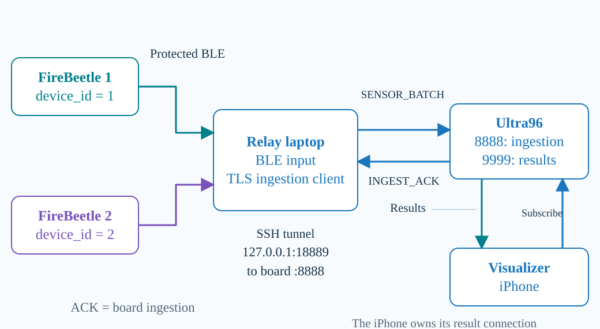

Two FireBeetles send structured dummy sensor packets to the relay laptop over protected Bluetooth Low Energy. The laptop forwards both streams to Ultra96 and receives ingestion acknowledgements. The Visualizer iPhone has its own SSH and TLS connection to the board. Ultra96 sends gesture results directly to that phone. The application servers run on Ultra96. We use SSH for the deployed campus access route and do not use a message broker.

**Code:** [C01 Launcher](#c01)

<a id="c01"></a>
### C01 — Launcher

Source: [demo.py](../demo.py#L71) · original lines **71–88**.

The launcher selects explicit transport settings and evidence paths, then delegates communication to the dual-device bridge.

```python
def capture_command(args, report_path):
    """Keep physical input and current protocol settings explicit in the child."""
    command = [sys.executable, "-u", "-m", "laptop.dual_bridge",
            # L74: Use the configured CA and ingestion endpoint; the launcher does not
            # disable TLS verification.
            "--ca", str(args.ca.expanduser().resolve()), "--port", str(args.port),
            "--left-address", args.left_address, "--right-address", args.right_address,
            # L76: Keep both device streams in the same configured session and use one
            # requested observation duration.
            "--duration", str(args.duration), "--session-id", "week7-demo",
            # L77: Allow up to 32 outstanding ingestion messages per device; progress
            # printing is separate from accounting.
            "--ack-window", "32", "--progress-interval", "1",
            # L78: Save the report and packet evidence in this capture's directory so
            # later review uses the same run.
            "--report", str(report_path), "--evidence", str(report_path.with_name("packets.jsonl"))]
    # L79: Keyboard commands are optional; a sensor-only recording must not count
    # command results that were never requested.
    if args.keyboard:
        command.append("--keyboard")
    for flag, value in (("--rate", args.rate), ("--seed", args.seed),
                        ("--file", args.file.expanduser().resolve() if args.file else None),
                        ("--file-device", args.file_device)):
        if value is not None:
            command.extend((flag, str(value)))
    return command


```
**Read aloud:**

In demo.py, capture_command builds the command that starts the existing dual-device bridge with explicit settings. Line 74 passes the trusted CA file and ingestion port, while line 76 fixes the session name and passes the requested capture duration. The next lines set the acknowledgement window and give this capture its own report and packet-log paths. At line 79, keyboard commands are included only when enabled: run leaves them off by default, while live enables them. These saved files describe the laptop and board exchange; the iPhone screen remains separate evidence of phone reception.

[Back to G01](#g01)

---

<a id="g02"></a>
## G02 — FireBeetle setup and device IDs

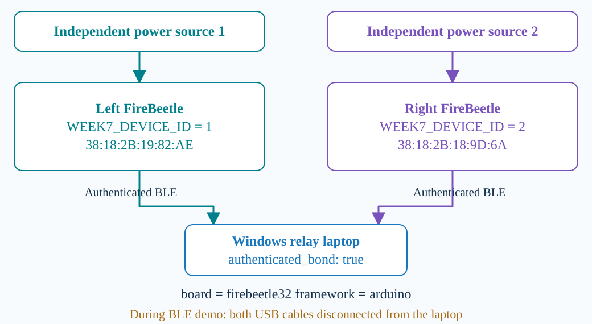

PlatformIO builds our Arduino firmware for the firebeetle32 board. The left profile assigns device ID one, and the right profile assigns device ID two. We use one USB cable to upload to the left board and then the right board, and disconnect the laptop USB after programming. During the BLE demonstration, each board uses its own power source. We complete authenticated pairing before streaming. The BLE address selects the physical board, while the device ID identifies its application packets.

**Code:** [C02 Board + IDs](#c02) · [C03 Boot setup](#c03) · [C04 Pairing](#c04)

<a id="c02"></a>
### C02 — Board + IDs

Source: [firmware/esp32/platformio.ini](../firmware/esp32/platformio.ini#L4) · original lines **4–26**.

Separate protected build profiles assign stable left and right application identities while sharing the same board and framework.

```ini
[env]
platform = espressif32
; L6: Select the FireBeetle board definition so PlatformIO uses the intended hardware
; build configuration.
board = firebeetle32
; L7: Compile against the Arduino framework used by the BLE server and security
; callbacks.
framework = arduino
monitor_speed = 115200
; Arduino BLE logs the passkey at INFO. Suppress framework logs; the security
; callback displays it only in interactive serial (never enable log capture).
build_flags = -DCORE_DEBUG_LEVEL=0
; Optional reproducible fixtures: add -DWEEK7_FIXTURE_SEED=12345.
; Initial physical source rate: -DWEEK7_INITIAL_RATE_HZ=10 (valid 1..200).
; Legacy deterministic baseline: -DWEEK7_LEGACY_DUMMY=1.

[env:firebeetle32]

[env:firebeetle32-left]
build_flags =
    ${env.build_flags}
    ; L21: Embed application device ID 1 in the left firmware; this ID is distinct
    ; from the board's BLE address.
    -DWEEK7_DEVICE_ID=1

[env:firebeetle32-right]
build_flags =
    ${env.build_flags}
    ; L26: Embed application device ID 2 in the right firmware so concurrent packets
    ; remain attributable to their source.
    -DWEEK7_DEVICE_ID=2
```
**Read aloud:**

In firmware/esp32/platformio.ini, the shared environment selects the actual hardware and build framework. Lines 6 and 7 select FireBeetle32 and Arduino, so both device profiles start from the same platform configuration. Line 21 compiles the left profile with device ID one, and line 26 compiles the right profile with device ID two. These IDs travel inside application packets, whereas Bluetooth addresses select the physical boards during connection. The commented legacy and seed options are optional build choices; the current protected profiles use the normal version-two fixture path unless those options are deliberately added.

[Back to G02](#g02)

<a id="c03"></a>
### C03 — Boot setup

Source: [firmware/esp32/src/main.cpp](../firmware/esp32/src/main.cpp#L404) · original lines **404–423**.

Startup creates the boot identity and control state, then requires successful BLE security configuration before continuing.

```cpp
void setup() {
  Serial.begin(115200);
  // L406: Generate a new boot namespace so samples after a restart are
  // distinguishable from earlier sequence numbers.
  bootId = esp_random();
  sensorStats.bootId = bootId;
  lastReportMs = millis();
  lastNotificationUs = micros();
  // L410: Bind control processing to this device and boot; command validation must
  // match the currently running board.
  controls = new (std::nothrow) week7::ControlEngine(kDeviceId, bootId, sha256File, kInitialRateHz);
  if (controls == nullptr) {
    Serial.println("b07_control_state_allocation_failed");
    return;
  }
  connectionStateMutex = xSemaphoreCreateMutex();
  if (connectionStateMutex == nullptr) {
    Serial.println("ble_state_mutex_create_failed");
    return;
  }
  BLEDevice::init(kDeviceName);
  // L421: Stop setup if security configuration fails, rather than advertising an
  // unintentionally unprotected service.
  if (!configureSecurity()) return;
  BLEDevice::setCustomGapHandler(gapCallback);
  BLEDevice::setCustomGattsHandler(gattsCallback);
```
**Read aloud:**

In firmware/esp32/src/main.cpp, setup prepares the identity and shared state before normal BLE operation begins. Line 406 obtains a random boot ID and stores it in the source statistics, helping distinguish samples from different startups when sequence numbers restart. The control engine receives the same device and boot identity, while allocation failures stop this setup path instead of continuing with missing state. After creating the mutex, line 421 requires security configuration to succeed. This is startup preparation; the later notification path still checks connection, subscription and authentication before sending sensor data.

[Back to G02](#g02)

<a id="c04"></a>
### C04 — Pairing

Source: [laptop/windows_pairing.py](../laptop/windows_pairing.py#L116) · original lines **116–127**.

The pairing helper preserves valid authenticated bonds and verifies the security level after any new pairing.

```python
async def pair_address(address, pin_provider):
    device = await _device(address)
    try:
        # L119: Read Windows pairing metadata for the explicitly selected BLE address.
        info = await _information(device)
        # L120: Reuse an existing bond only after check_bond verifies authenticated
        # encryption; being paired alone is insufficient.
        if info.pairing.is_paired:
            check_bond(info.pairing)
            return
        # L123: For an unpaired board, request authenticated passkey pairing through
        # the interactive PIN provider.
        await pair_custom(info.pairing.custom, pin_provider)
        info = await _information(device)
        # L125: Read and validate the resulting bond again before reporting success;
        # pairing UI completion alone is not the check.
        check_bond(info.pairing)
    finally:
        device.close()
```
**Read aloud:**

In laptop/windows_pairing.py, pair_address checks Windows pairing information for the selected Bluetooth address. At lines 119 and 120, an existing pairing is inspected rather than blindly accepted: check_bond requires encryption and authentication before the function returns. If there is no pairing, line 123 runs the custom passkey flow, then line 125 checks the refreshed protection state. The finally block closes the temporary device handle even when an error occurs. This prepares an authenticated bond for later BLE connections; first-time passkeys come from the private serial monitor and should stay outside the recording.

[Back to G02](#g02)

---

<a id="g03"></a>
## G03 — The 32-byte sensor packet

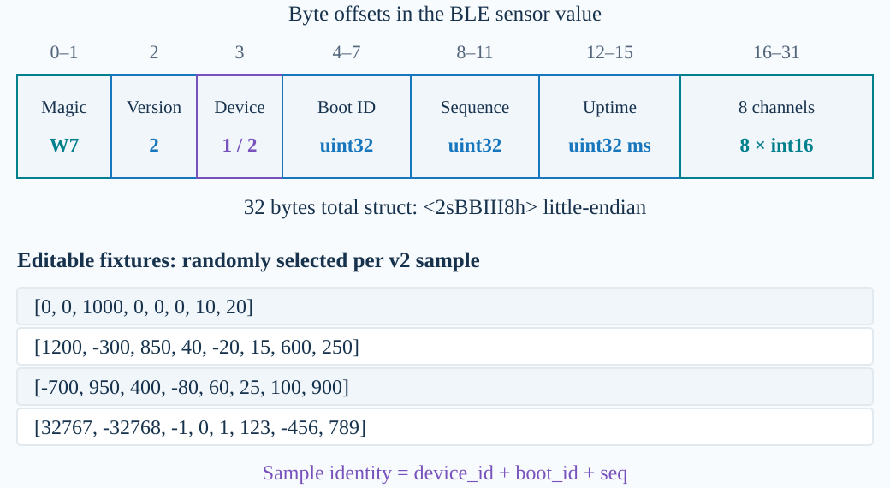

Each sensor notification contains thirty-two bytes. The fields are the W7 marker, version, device ID, boot ID, sequence number, uptime and eight signed sixteen-bit channel values. Multi-byte fields use little-endian encoding. Version two randomly selects from several editable fixtures. Device, boot and sequence identify the sample. The packet has no custom application CRC field. Our dummy values follow the sensor packet schema, and the decoded log shows the actual values transmitted.

**Code:** [C05 Sensor fields](#c05) · [C06 Sensor codec](#c06) · [C07 Fixtures](#c07) · [C08 Sensor send](#c08) · [C40 Random source](#c40)

<a id="c05"></a>
### C05 — Sensor fields

Source: [common/sensor.py](../common/sensor.py#L11) · original lines **11–38**.

SensorPacket defines and validates the fixed binary sensor schema shared by firmware and the Python bridge. The version-one constructor default supports legacy packets; the decoder retains the received version, and the current firmware sends version two.

```python
# L11: The little-endian layout totals 32 bytes: marker, version, device, three uint32
# fields and eight signed int16 channels.
_PACKET = struct.Struct("<2sBBIII8h")
# L12: Derive the required byte count from the codec so encoder and decoder share the
# same frame size.
PACKET_SIZE = _PACKET.size
SENSOR_CHARACTERISTIC_UUID = "6e1c0005-7a45-4dc4-b678-3f2d5a9c1001"


def _integer(value, minimum: int, maximum: int, name: str) -> None:
    if type(value) is not int or not minimum <= value <= maximum:
        raise ValueError("{} must be an integer in [{}, {}]".format(name, minimum, maximum))


@dataclass(frozen=True)
class SensorPacket:
    # L23: The application device ID identifies the source board; boot and sequence
    # distinguish its individual samples.
    device_id: int
    boot_id: int
    seq: int
    uptime_ms: int
    # L27: Keep exactly eight channel values per sample so dummy data uses the real
    # packet schema.
    values: Tuple[int, ...]
    version: int = 1

    def __post_init__(self) -> None:
        _integer(self.device_id, 1, 2, "device_id")
        _integer(self.version, 1, 2, "version")
        for name in ("boot_id", "seq", "uptime_ms"):
            _integer(getattr(self, name), 0, 0xFFFFFFFF, name)
        if not isinstance(self.values, (list, tuple)) or len(self.values) != 8:
            raise ValueError("values must contain exactly eight int16 integers")
        # L37: Validate every channel against signed 16-bit bounds before
        # serialization or downstream processing.
        for value in self.values:
            _integer(value, -32768, 32767, "channel")
```
**Read aloud:**

In common/sensor.py, line 11 defines the binary layout shared by the sender and receiver. The little-endian struct contains the two-byte marker, version and device bytes, three unsigned thirty-two-bit fields, and eight signed sixteen-bit channel values, totalling thirty-two bytes. The SensorPacket class names those fields, and lines 35 to 38 reject the wrong channel count or values outside the signed range. The version-one default on line 28 supports legacy construction; it does not make today's firmware version one. The current fixture firmware sends version two, and decoding preserves that received version.

[Back to G03](#g03)

<a id="c06"></a>
### C06 — Sensor codec

Source: [common/sensor.py](../common/sensor.py#L63) · original lines **63–80**.

The sensor codec enforces exact length, marker, version and field validity before the bridge accepts a BLE sample.

```python
def encode_packet(packet: SensorPacket) -> bytes:
    if not isinstance(packet, SensorPacket):
        raise ValueError("packet must be a SensorPacket")
    return _PACKET.pack(
        # L67: Serialize identity and timing together with the W7 marker, allowing
        # receivers to attribute and validate the payload.
        b"W7", packet.version, packet.device_id, packet.boot_id, packet.seq, packet.uptime_ms,
        *packet.values
    )


def decode_packet(data: bytes) -> SensorPacket:
    # L73: Reject short, oversized or non-byte sensor values instead of decoding an
    # ambiguous partial packet.
    if not isinstance(data, (bytes, bytearray, memoryview)) or len(data) != PACKET_SIZE:
        raise ValueError("W7 packet must contain exactly 32 bytes")
    # L75: Decode all fields using the same fixed little-endian layout used for
    # encoding.
    magic, version, device_id, boot_id, seq, uptime_ms, *values = _PACKET.unpack(data)
    if magic != b"W7":
        raise ValueError("invalid W7 packet magic")
    # L78: Accept only the supported sensor versions; constructing SensorPacket then
    # validates IDs and channel ranges.
    if version not in (1, 2):
        raise ValueError("unsupported W7 packet version")
    return SensorPacket(device_id, boot_id, seq, uptime_ms, tuple(values), version)
```
**Read aloud:**

In common/sensor.py, encode_packet and decode_packet provide the two directions of the same sensor format. Line 67 writes the W7 marker and identity fields before the eight values, using the struct defined earlier. On reception, line 73 requires exactly thirty-two bytes, line 75 unpacks the fields, and line 78 rejects unsupported versions. Constructing the final SensorPacket also applies its device, integer-range and channel checks. These checks establish that the bytes follow our schema; they are not an application checksum, an encryption step, or proof that Ultra96 or the phone received the sample.

[Back to G03](#g03)

<a id="c07"></a>
### C07 — Fixtures

Source: [common/dummy_fixtures.json](../common/dummy_fixtures.json#L1) · original lines **1–6**.

Several editable eight-channel fixtures provide varied, schema-valid dummy payloads for random selection.

```jsonc
// Walkthrough comments only; the source file is strict JSON.
[
  // L2: Each row is one complete eight-channel dummy payload; the packet header is
  // added by the serializer.
  [0, 0, 1000, 0, 0, 0, 10, 20],
  // L3: This editable row supplies different channel values without changing the
  // binary protocol format.
  [1200, -300, 850, 40, -20, 15, 600, 250],
  // L4: Positive and negative examples exercise signed channel decoding rather than
  // sending a single plain counter.
  [-700, 950, 400, -80, 60, 25, 100, 900],
  // L5: Boundary values exercise the int16 range; command processing must wrap 32767
  // to -32768 when incrementing.
  [32767, -32768, -1, 0, 1, 123, -456, 789]
]
```
**Read aloud:**

In common/dummy_fixtures.json, lines 2 to 5 contain four complete eight-channel samples. The values include positive, negative and boundary cases, while the firmware randomly chooses one whole row for each version-two sensor sample. To demonstrate an edit, I can change the first value on line 3, regenerate the firmware header, and build and upload both device profiles. The source validator requires two to sixty-four rows, each containing eight signed sixteen-bit integers. I then look for the complete changed row in fresh logs from both devices, because random selection does not guarantee that the first displayed example uses it.

[Back to G03](#g03)

<a id="c08"></a>
### C08 — Sensor send

Source: [firmware/esp32/src/main.cpp](../firmware/esp32/src/main.cpp#L483) · original lines **483–511**.

Firmware paces independently sequenced sensor samples, checks readiness and MTU, and records each submission outcome.

```cpp
  xSemaphoreTake(connectionStateMutex, portMAX_DELAY);
  controls->expire(nowMs);
  const uint32_t nowUs = micros();
  // L486: Use the accepted source-rate setting to pace firmware samples; this is a
  // target interval, not a measured maximum.
  const uint32_t intervalUs = 1000000u / controls->rateHz();
  if (static_cast<uint32_t>(nowUs - lastNotificationUs) >= intervalUs) {
    lastNotificationUs = nowUs;
    if (clientConnected && !authenticated && !kDiagnostic) ++securitySuppressed;
    if (canNotify(notificationsEnabled)) {
      uint8_t payload[4];
      week7::writeUint32Le(payload, notificationCounter);
      if (submitNotification(counterCharacteristic, payload, sizeof(payload))) {
        Serial.printf("ble_notify_submitted boot_id=%lu counter=%lu uptime_ms=%lu\n",
            static_cast<unsigned long>(bootId), static_cast<unsigned long>(notificationCounter),
            static_cast<unsigned long>(nowMs));
        ++notificationCounter;
      }
    }
    // L500: Generate sensor traffic only when the current connection satisfies
    // subscription and security gates.
    if (canNotify(sensorNotificationsEnabled)) {
      if (!week7::sensorFitsMtu(negotiatedMtu)) ++sensorMtuSuppressed;
      else {
        // L503: Allocate one complete 32-byte sensor value after confirming it fits
        // the negotiated ATT MTU.
        uint8_t payload[week7::kPacketSize];
        const uint32_t sampleSequence = week7::allocateSampleSequence(sensorStats);
        const bool serialized = kLegacyDummy
            ? week7::serializeDummyPacket(payload, sizeof(payload), kDeviceId, bootId, sampleSequence, nowMs)
            // L507: The normal v2 branch serializes a selected fixture; the optional
            // legacy branch retains deterministic v1 values.
            : week7::serializeFixturePacket(payload, sizeof(payload), kDeviceId, bootId, sampleSequence,
                                            // L508: Choose the fixture independently
                                            // of the stream sequence, using the
                                            // configured random-word source.
                                            nowMs, fixtureRandomWord());
        const bool submitted = serialized &&
            submitNotification(sensorCharacteristic, payload, sizeof(payload));
        // L511: Record whether submission to the BLE stack succeeded; this counter
        // does not prove laptop or phone receipt.
        week7::recordSensorSubmission(sensorStats, submitted);
```
**Read aloud:**

In firmware/esp32/src/main.cpp, this part of the loop sends sensor data when the configured sampling interval has elapsed. Line 500 checks whether sensor notifications are allowed, and the next line checks that the negotiated MTU can carry the complete packet. Line 503 allocates the packet buffer, then lines 507 and 508 serialize a randomly selected fixture with the device, boot, sequence and uptime fields. Line 511 records whether serialization and submission succeeded. A successful submission means the BLE stack accepted the notification attempt; laptop reception and Ultra96 acknowledgement are measured separately.

[Back to G03](#g03)

<a id="c40"></a>
### C40 — Random source

Source: [firmware/esp32/src/main.cpp](../firmware/esp32/src/main.cpp#L87) · original lines **87–96**.

Fixture randomness is independent of identity counters, with an optional deterministic seed for reproducible testing.

```cpp
uint32_t fixtureRandomWord() {
#ifdef WEEK7_FIXTURE_SEED
  // L89: An explicit build seed makes fixture selection reproducible for tests
  // without deriving it from sample sequence or boot identity.
  // A reproducible build mode, independent of boot identity and sample sequence.
  static uint32_t state = static_cast<uint32_t>(WEEK7_FIXTURE_SEED);
  state = state * 1664525u + 1013904223u;
  return state >> 8;
#else
  // L94: Normal firmware uses the ESP random source to choose fixtures; repeated
  // choices are valid and do not imply a round-robin sequence.
  return esp_random();
#endif
}
```
**Read aloud:**

In firmware main.cpp, fixtureRandomWord supplies randomness to the fixture selection shown in G03. With an explicit WEEK7_FIXTURE_SEED build setting, Line 90 maintains a separate deterministic state, making fixture choices reproducible for testing without using the packet sequence as the random source. In the normal branch, Line 94 returns esp_random, so consecutive packets can select the same editable fixture and are not required to cycle through every row. This explains why the dummy-edit demonstration may need to inspect several transmitted samples before the updated eight-value fixture appears in the saved evidence.

[Back to G03](#g03)

---

<a id="g04"></a>
## G04 — Packet types and BLE controls

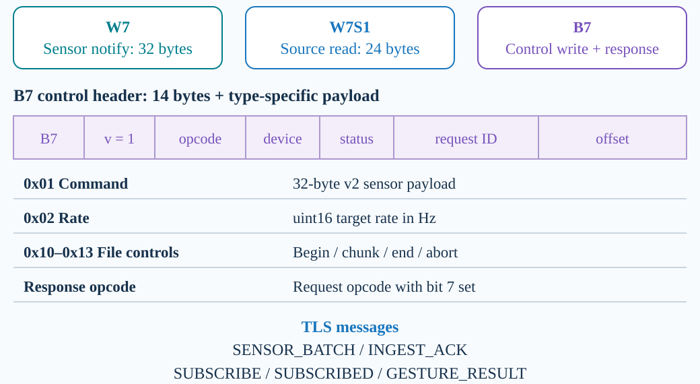

The sensor characteristic sends W7 notifications. The laptop reads W7S1 source counters for reconciliation. Commands use a separate B7 control header containing the opcode, device ID, status, request ID and offset. A response sets bit seven of the opcode. The command payload carries a complete version-two sensor packet. The control header itself remains version one. The laptop then uses SENSOR_BATCH and INGEST_ACK messages with Ultra96, while the phone uses subscription and gesture-result messages.

**Code:** [C09 BLE types](#c09) · [C10 Control codec](#c10) · [C11 JSON types](#c11) · [C12 Source counters](#c12)

<a id="c09"></a>
### C09 — BLE types

Source: [common/control.py](../common/control.py#L8) · original lines **8–17**.

BLE controls use a separate bounded binary protocol with typed operations, response identification and request correlation.

```python
CONTROL_UUID = '6e1c0007-7a45-4dc4-b678-3f2d5a9c1001'
RESPONSE_UUID = '6e1c0008-7a45-4dc4-b678-3f2d5a9c1001'
# L10: Separate command and rate operations so the receiver knows how to validate and
# interpret each payload.
COMMAND, SET_RATE = 1, 2
# L11: File transfers use explicit begin, ordered chunk, end and abort operations
# rather than unbounded writes.
FILE_BEGIN, FILE_CHUNK, FILE_END, FILE_ABORT = 16, 17, 18, 19
# L12: Set bit 7 on a response opcode while retaining the original operation code for
# request correlation.
RESPONSE_FLAG = 128
OK, INVALID, BUSY, ORDER, INTEGRITY, CONFLICT, UNSUPPORTED = range(7)
MIN_CONTROL_MTU, MAX_FILE_SIZE, MAX_CHUNK_SIZE = 64, 65536, 180
# L15: Reserve 14 bytes for control metadata before any operation-specific payload.
HEADER_SIZE = 14
# L16: The little-endian header carries B7, version, opcode, device, status, request
# ID and offset; its version is independent of sensor v2.
_HEADER = struct.Struct('<2sBBBBII')
_OPCODES = (COMMAND, SET_RATE, FILE_BEGIN, FILE_CHUNK, FILE_END, FILE_ABORT)
```
**Read aloud:**

In common/control.py, these constants describe the separate BLE control protocol. Lines 10 and 11 assign operations for commands, source-rate changes and file transfer, while line 12 marks responses by setting bit seven of the opcode. Lines 15 and 16 define a fourteen-byte little-endian header containing the marker, version, opcode, device, status, request ID and offset. The control and response UUIDs identify their own characteristics, separate from normal sensor notifications. File chunks and command replies therefore have explicit meanings; they should not be mistaken for fragments of the ordinary thirty-two-byte sensor stream.

[Back to G04](#g04)

<a id="c10"></a>
### C10 — Control codec

Source: [common/control.py](../common/control.py#L88) · original lines **88–101**.

Control encoding and decoding preserve the B7 boundary and validate the whole operation against its schema and MTU.

```python
def encode_control(frame, *, mtu=517):
    _validate(frame, mtu)
    # L90: Encode control protocol version 1 and the request identity before appending
    # the already-validated payload.
    return _HEADER.pack(b'B7', 1, frame.opcode, frame.device_id, frame.status,
                        frame.request_id, frame.offset) + frame.payload


def decode_control(data, *, mtu=517):
    if not isinstance(data, (bytes, bytearray, memoryview)) or len(data) < HEADER_SIZE:
        raise ValueError('truncated control header')
    # L97: Decode the fixed header first; the remainder of this BLE write is the
    # operation payload.
    magic, version, opcode, device, status, request, offset = _HEADER.unpack_from(data)
    # L98: Reject unknown control markers or versions rather than guessing how to
    # interpret their bytes.
    if magic != b'B7' or version != 1:
        raise ValueError('unsupported control magic/version')
    # L100: Rebuild the typed frame and apply opcode, payload and negotiated-MTU
    # checks before returning it.
    frame = ControlFrame(opcode, device, request, offset, bytes(data[HEADER_SIZE:]), status)
    _validate(frame, mtu)
```
**Read aloud:**

In common/control.py, encode_control validates the frame before line 90 packs the B7 header and appends its payload. The decoder first rejects a short header, then lines 97 and 98 unpack it and require the expected marker and control version. Line 100 rebuilds the ControlFrame, and the following validation checks its operation, identity, payload and negotiated size limits. The outer control header remains version one even when a command carries a complete version-two sensor packet. Keeping those two version fields distinct prevents a valid command payload from being confused with a different control format.

[Back to G04](#g04)

<a id="c11"></a>
### C11 — JSON types

Source: [ultra96/protocol.py](../ultra96/protocol.py#L3) · original lines **3–13**.

Distinct JSON message schemas separate sample ingestion, board acknowledgements and phone subscription/results.

```python

GESTURES = ("REST", "FIST", "OPEN", "POINT")
_BASE = {"v", "type", "session_id"}
_TRACE = {"device_id", "boot_id", "seq"}
# L7: These exact field sets form the base schemas; validation elsewhere adds required
# request_id for v2 data messages.
_FIELDS = {
    # L8: SENSOR_BATCH carries decoded sample values, uptime and source identity to
    # the ingestion service.
    "SENSOR_BATCH": _BASE | _TRACE | {"uptime_ms", "values"},
    # L9: INGEST_ACK echoes the sample identity and an ingestion status; it is not a
    # receipt from the phone.
    "INGEST_ACK": _BASE | _TRACE | {"status"},
    # L10: SUBSCRIBE selects the configured result session and has no sensor payload.
    "SUBSCRIBE": _BASE,
    # L11: SUBSCRIBED confirms the subscription handshake; subscription envelopes
    # remain protocol version 1.
    "SUBSCRIBED": _BASE,
    # L12: GESTURE_RESULT carries an attributable simulated event on the phone's
    # separate connection.
    "GESTURE_RESULT": _BASE | _TRACE | {"result_id", "gesture", "confidence"},
}
```
**Read aloud:**

In ultra96/protocol.py, this field table separates the roles of the network messages. Line 8 describes sensor data sent from the laptop, and line 9 describes the board's ingestion acknowledgement with the same device, boot and sequence identity. Lines 10 and 11 describe subscription setup, while line 12 describes the result sent to the phone. Later validation adds request_id for version-two data, acknowledgements and results; subscription envelopes remain version one. This table is a schema definition, so receiving a valid board acknowledgement establishes ingestion, while actual phone reception must be observed on the phone.

[Back to G04](#g04)

<a id="c12"></a>
### C12 — Source counters

Source: [firmware/esp32/include/week7_source_stats.h](../firmware/esp32/include/week7_source_stats.h#L34) · original lines **34–53**.

Protected source-counter reads provide boot-specific sequence boundaries and submission outcomes for end-of-run reconciliation.

```cpp
                                 uint8_t deviceId, const SourceStats& stats) {
  if (output == nullptr || capacity < kSourceStatsSize ||
      (deviceId != 1 && deviceId != 2)) {
    return false;
  }

  output[0] = 'W';
  // L41: The W7S1 marker distinguishes this source-statistics record from a W7 sensor
  // notification.
  output[1] = '7';
  output[2] = 'S';
  output[3] = '1';
  // L44: Include the source device so a snapshot from the wrong board cannot be used
  // for reconciliation.
  output[4] = deviceId;
  // L45: Keep the three reserved bytes zero to preserve the defined 24-byte record
  // layout.
  output[5] = 0;
  output[6] = 0;
  output[7] = 0;
  writeUint32Le(output + 8, stats.bootId);
  // L49: Expose the next sequence number as an exclusive source boundary for
  // detecting missing samples, including a missing tail.
  writeUint32Le(output + 12, stats.nextSequence);
  // L50: Count successful BLE-stack submissions separately from later laptop
  // reception and board ACKs.
  writeUint32Le(output + 16, stats.submitted);
  // L51: Retain failed submission counts so source-side losses remain visible in the
  // final audit.
  writeUint32Le(output + 20, stats.failures);
  // L52: Successful serialization only creates a valid statistics record; downstream
  // delivery still requires separate evidence.
  return true;
}
```
**Read aloud:**

In firmware/esp32/include/week7_source_stats.h, serializeSourceStats builds the twenty-four-byte source-counter record. Lines 40 to 44 write the W7S1 marker and device ID, followed by reserved bytes and the boot ID. Lines 49 to 51 then write the next sequence number, successful submissions and failed submissions as little-endian integers. These are cumulative counters for that boot, so the capture compares appropriate beginning and ending observations with its received and acknowledged samples. They make missing data measurable at the source boundary, but a submitted notification counter alone cannot establish laptop reception or phone delivery.

[Back to G04](#g04)

---

<a id="g05"></a>
## G05 — FireBeetle communication FSM

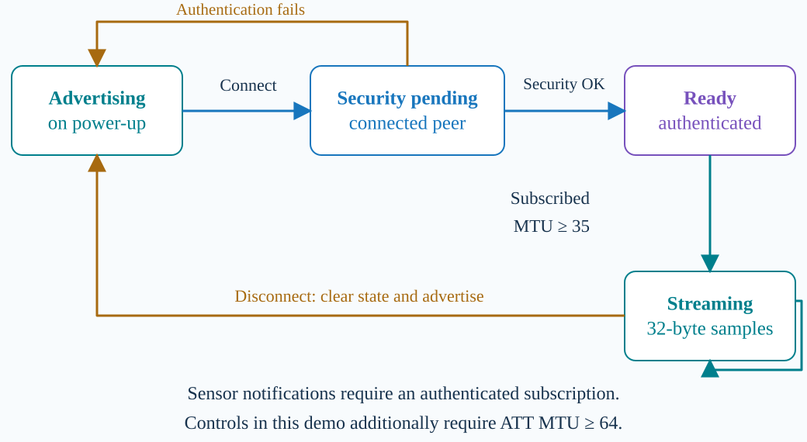

On power-up, the FireBeetle advertises its BLE service. After the laptop connects, the firmware checks authenticated encryption. A valid peer can enable notifications. Sensor streaming requires a subscription and an ATT MTU of at least thirty-five. Our rate-control operation additionally requires an MTU of at least sixty-four. On disconnection, the device clears connection state and advertises again. This diagram summarizes the implemented control flow.

**Code:** [C13 BLE gates](#c13)

<a id="c13"></a>
### C13 — BLE gates

Source: [firmware/esp32/include/week7_security.h](../firmware/esp32/include/week7_security.h#L7) · original lines **7–25**.

Small explicit gates connect BLE protocol states to authentication, current-peer ownership, subscription and payload-size requirements.

```cpp
// ESP-IDF SC (0x08), MITM (0x04), bond (0x01); main.cpp checks SDK equivalence.
constexpr uint8_t kRequiredAuthMode = 0x0d;

// L10: Evaluate the completed pairing result against the required Secure Connections,
// MITM and bonding policy.
inline bool isAuthenticated(bool success, uint8_t authMode) {
  // L11: A successful callback is insufficient unless all required authentication-
  // mode bits are present.
  return success && (authMode & kRequiredAuthMode) == kRequiredAuthMode;
}

// L14: Notification eligibility combines connection state, subscription state and the
// authentication decision.
inline bool canNotify(bool connected, bool subscribed, bool authenticated,
                      bool diagnostic) {
  // L16: The diagnostic bypass is explicit; normal protected builds require
  // authentication and cannot use diagnostic results as security evidence.
  return connected && subscribed && (authenticated || diagnostic);
}

// L19: A 32-byte notification needs ATT MTU 35 because the ATT notification overhead
// consumes three bytes.
inline bool sensorFitsMtu(uint16_t mtu) { return mtu >= 35; }

inline bool canAcceptControl(bool connected, bool subscribed, bool authenticated,
                             bool diagnostic, uint16_t writeConnection,
                             uint16_t currentConnection) {
  // L24: Accept a control write only from the connection currently owned by this
  // device.
  return writeConnection == currentConnection &&
      // L25: Controls also require an enabled response subscription and the same
      // security gate, preventing accepted work without its response path.
      canNotify(connected, subscribed, authenticated, diagnostic);
```
**Read aloud:**

In firmware/esp32/include/week7_security.h, these small predicates define when BLE work is permitted. Line 11 requires a successful authentication result containing all the required Secure Connections, MITM and bonding bits. Line 16 also requires a connection and subscription before notifications can proceed; the diagnostic bypass belongs to an explicitly unprotected build, not this protected demonstration. Line 19 requires an MTU of at least thirty-five bytes for the thirty-two-byte sensor value and ATT overhead. Lines 24 and 25 additionally bind control writes to the current connection, preventing a different connection handle from satisfying the normal send conditions.

[Back to G05](#g05)

---

<a id="g06"></a>
## G06 — TCP framing and partial delivery

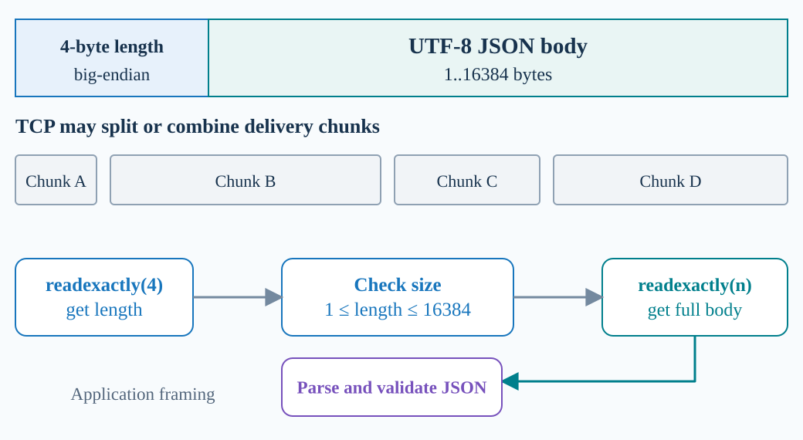

TCP delivers a byte stream, so one application frame can arrive in several pieces. Our encoder prefixes the JSON body with its four-byte big-endian byte length. The receiver first reads exactly four bytes, checks that the length is between one and sixteen thousand three hundred and eighty-four, and then reads exactly that many body bytes. It parses and validates the complete JSON object. TLS provides encryption around these application frames.

**Code:** [C14 Frame encode](#c14) · [C15 Partial reads](#c15)

<a id="c14"></a>
### C14 — Frame encode

Source: [common/wire.py](../common/wire.py#L35) · original lines **35–46**.

Network messages are bounded UTF-8 JSON objects preceded by a byte-count header, independently of the BLE binary format.

```python
def encode_frame(message):
    """Encode an object, rejecting values JSON cannot safely represent."""
    if not isinstance(message, dict):
        raise ProtocolError("frame must contain a JSON object")
    try:
        body = json.dumps(message, ensure_ascii=False, allow_nan=False,
                          separators=(",", ":")).encode("utf-8")
    except (TypeError, ValueError, OverflowError, RecursionError) as exc:
        # L43: Convert serialization failures into protocol errors before any invalid
        # message is written to the stream.
        raise ProtocolError("invalid JSON object") from exc
    if not 0 < len(body) <= MAX_FRAME_SIZE:
        # L45: Reject empty or oversized bodies so a peer cannot declare an unbounded
        # application frame.
        raise ProtocolError("frame length outside 1..16384")
    # L46: Prefix the UTF-8 byte length as a four-byte big-endian integer; this
    # supplies boundaries that TCP itself does not provide.
    return struct.pack("!I", len(body)) + body
```
**Read aloud:**

In common/wire.py, encode_frame converts one network message into an explicit application frame. The JSON object is encoded as compact UTF-8, and line 43 rejects data that cannot be represented safely, including non-finite numeric values. Lines 44 and 45 limit the encoded body to between one and sixteen thousand three hundred and eighty-four bytes. Line 46 adds a four-byte network-order length prefix before that body. This framing is needed because TCP delivers a byte stream whose reads may split or combine writes; it is separate from the fixed binary format used on the BLE sensor characteristic.

[Back to G06](#g06)

<a id="c15"></a>
### C15 — Partial reads

Source: [common/wire.py](../common/wire.py#L49) · original lines **49–76**.

The frame reader handles fragmented and coalesced TCP delivery by reading exact bounded lengths under one deadline.

```python
async def read_frame(reader, timeout=5.0):
    """Read exactly one frame with one deadline for both header and body."""
    async def receive():
        try:
            # L53: Wait for all four header bytes even when TCP delivers the header in
            # separate reads.
            header = await reader.readexactly(4)
        except asyncio.IncompleteReadError as exc:
            if exc.partial:
                raise ProtocolError("incomplete frame header") from exc
            raise  # Clean EOF between frames, distinguishable by consumers.
        # L58: Interpret the header as an unsigned big-endian body length, not a
        # character count.
        length = struct.unpack("!I", header)[0]
        # L59: Validate the length before requesting the body to bound buffering and
        # reject malformed framing.
        if not 0 < length <= MAX_FRAME_SIZE:
            raise ProtocolError("frame length outside 1..16384")
        try:
            # L62: Collect exactly one body while leaving any later frame bytes
            # buffered for the next call.
            body = await reader.readexactly(length)
        except asyncio.IncompleteReadError as exc:
            raise ProtocolError("incomplete frame body") from exc
        try:
            # L66: Strict JSON hooks reject duplicate keys and non-finite numbers
            # after UTF-8 decoding; endpoint schema checks follow.
            message = json.loads(body.decode("utf-8"), object_pairs_hook=_object,
                                 parse_constant=_constant, parse_float=_float)
        except (UnicodeError, ValueError, RecursionError) as exc:
            raise ProtocolError("invalid UTF-8 JSON frame") from exc
        if not isinstance(message, dict):
            raise ProtocolError("frame must contain a JSON object")
        return message
    return await asyncio.wait_for(receive(), timeout=timeout)


async def write_frame(writer, message, timeout=5.0):
```
**Read aloud:**

In common/wire.py, read_frame reverses the length-prefixed encoding while handling TCP stream boundaries. Line 53 reads exactly four header bytes, then lines 58 and 59 decode and validate the body length before line 62 reads exactly that many bytes. Line 66 parses UTF-8 JSON with checks for duplicate keys and invalid numeric values, and the result must be an object. One timeout covers the complete header-and-body operation, so receiving small fragments does not continually reset the budget. A partial header or body is an error; a clean end between frames remains distinguishable for the connection handler.

[Back to G06](#g06)

---

<a id="g07"></a>
## G07 — Laptop and Ultra96 connection FSM

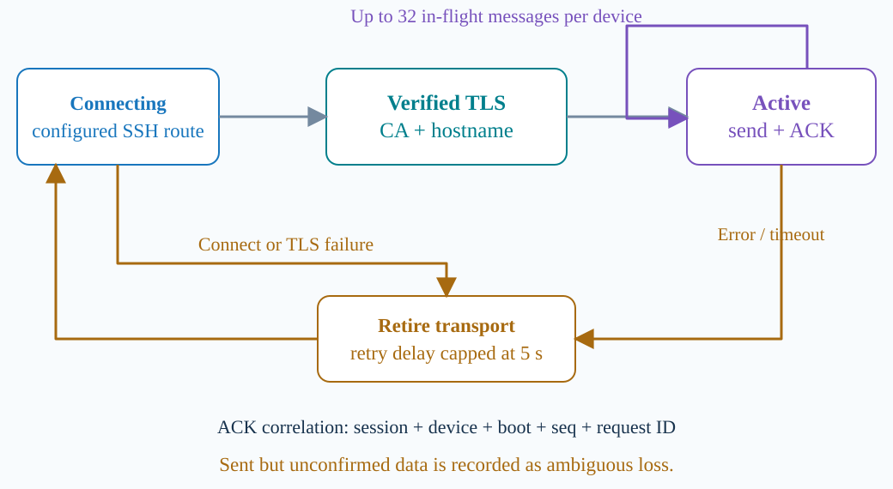

The laptop connects through the configured SSH route and verifies Ultra96's TLS certificate and hostname. In the active state it sends SENSOR_BATCH messages and validates matching INGEST_ACK messages. Sending and acknowledgement reading progress concurrently, with up to thirty-two outstanding messages per device. A connection failure retires the transport before retrying with a capped delay. Sent but unconfirmed packets are recorded as ambiguous drops, so reconnection does not imply complete outage replay.

**Code:** [C16 TLS connect](#c16) · [C17 ACK identity](#c17) · [C39 Retry delay](#c39)

<a id="c16"></a>
### C16 — TLS connect

Source: [laptop/bridge.py](../laptop/bridge.py#L349) · original lines **349–353**.

Each bridge opens its own verified and time-bounded TLS connection through the configured SSH route.

```python
    async def _connect_tls(self):
        return await asyncio.wait_for(asyncio.open_connection(
            # L351: Connect to the configured route using a CA-verifying TLS context;
            # the local SSH endpoint does not remove TLS checks.
            self.config.host, self.config.port, ssl=client_context(self.config.ca_file),
            # L352: Verify the application's certificate hostname even though the TCP
            # connection may target localhost through a tunnel.
            server_hostname=TLS_SERVER_NAME, limit=32768,
            # L353: Bound both the TLS handshake and overall connection attempt so one
            # stalled device path cannot wait forever.
            ssl_handshake_timeout=self.config.io_timeout), self.config.io_timeout)
```
**Read aloud:**

In laptop/bridge.py, _connect_tls opens the verified application connection used to forward decoded sensor data. Line 351 uses the configured destination and creates a client TLS context from the trusted CA file. Line 352 supplies the expected server name, so certificate identity is checked even when the TCP destination is the laptop's local SSH forwarding port. Line 353 bounds both the TLS handshake and the overall connection attempt with the configured timeout. This verifies the board's TLS server through the existing route; it does not replace BLE authentication or prove that a particular sensor sample has been acknowledged.

[Back to G07](#g07) · [Back to G09](#g09)

<a id="c17"></a>
### C17 — ACK identity

Source: [laptop/bridge.py](../laptop/bridge.py#L375) · original lines **375–386**.

The bridge releases work only for an acknowledgement whose schema and complete identity match the submitted record.

```python
    def _check_ack(self, ack, packet, request_id=None):
        # L376: Build the expected acknowledgement identity from the packet and
        # configured session, not from untrusted reply fields.
        expected = dict(v=packet.version, type="INGEST_ACK", session_id=self.config.session_id,
                        device_id=packet.device_id, boot_id=packet.boot_id, seq=packet.seq)
        if packet.version == 2:
            # L379: For v2, require the correct request_id: null for telemetry or the
            # correlated command ID.
            expected["request_id"] = request_id
        if not isinstance(ack, dict) or set(ack) != set(expected) | {"status"}:
            # L381: Reject missing or extra acknowledgement fields before comparing
            # identities.
            raise ProtocolError("malformed ingestion acknowledgement")
        # L382: Compare both type and value for every identity field; a valid ACK
        # confirms ingestion, not phone delivery.
        for key, value in expected.items():
            if type(ack[key]) is not type(value) or ack[key] != value:
                raise ProtocolError("uncorrelated ingestion acknowledgement")
        if ack["status"] not in ("accepted", "duplicate"):
            raise ProtocolError("invalid acknowledgement status")
```
**Read aloud:**

In laptop/bridge.py, _check_ack ties an ingestion acknowledgement to the exact packet being sent. Line 376 builds the expected version, message type, session, device, boot and sequence fields; line 379 also includes request_id for version two. The code rejects missing or extra fields, and lines 382 and 383 require both the value and its Python type to match. Only accepted or duplicate is a valid status, with a null request ID for streaming telemetry and a nonzero ID for commands. This confirms a correlated board response, while the phone has its own independent result connection.

[Back to G07](#g07)

<a id="c39"></a>
### C39 — Retry delay

Source: [laptop/bridge.py](../laptop/bridge.py#L656) · original lines **656–670**.

The bridge retries failed transport epochs with a capped asynchronous backoff and resets the delay after real ACK progress.

```python
    async def _pipeline_writer_loop(self):
        # The pipeline owns this bridge's socket for its whole lifetime. A
        # concurrent public forward_one call waits instead of racing the FIFO.
        async with self._forward_lock:
            # L660: Start retry delays at half a second while keeping exclusive
            # ownership of this bridge's ingestion socket.
            delay = 0.5
            while True:
                acked_before = self.metrics.acked
                try:
                    await self._pipeline_epoch()
                except _PipelineTransportError:
                    self.metrics.transport_errors += 1
                    # L667: Reset backoff only after observed ACK progress so repeated
                    # unsuccessful epochs do not constantly retry at the shortest
                    # delay.
                    if self.metrics.acked > acked_before:
                        delay = 0.5
                    # L669: Sleep asynchronously before retrying, allowing the other
                    # device and UI progress tasks to continue.
                    await asyncio.sleep(delay)
                    # L670: Cap exponential delay at five seconds; this limits the
                    # delay, not the number of retry attempts.
                    delay = min(5.0, delay * 2)
```
**Read aloud:**

In laptop/bridge.py, _pipeline_writer_loop owns the bridge's ingestion socket through the asynchronous forward lock while retrying failed transport lifetimes. Line 660 starts the retry delay at half a second, and Line 667 resets it only when the failed lifetime made actual ACK progress. Line 669 sleeps asynchronously before retrying, and Line 670 doubles the delay up to five seconds, allowing other device and display tasks to run during the wait. This supplies the retry branch in G07; the five-second value caps the delay between attempts, not the total number of attempts or the duration of an outage.

[Back to G07](#g07)

---

<a id="g08"></a>
## G08 — Visualizer subscription FSM

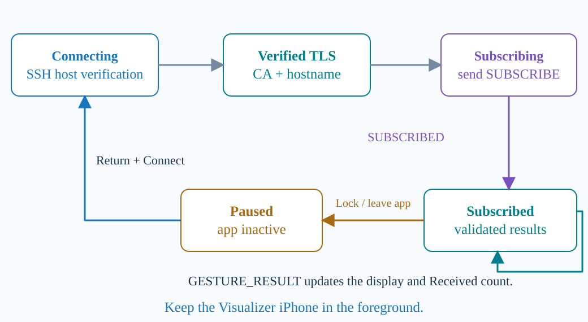

After Connect, the iPhone verifies the SSH hosts and establishes verified TLS to the board's result service. It sends SUBSCRIBE and waits for SUBSCRIBED. It then validates GESTURE_RESULT messages and updates the received count and display. Version-two results use simulated random gesture labels. If the application becomes inactive, it pauses and requires an explicit Connect after returning. The filming phone is a different device, allowing this iPhone to remain in the foreground.

**Code:** [C18 Phone subscribe](#c18) · [C19 Phone pause](#c19)

<a id="c18"></a>
### C18 — Phone subscribe

Source: [ios-visualizer/Week7Native/Sources/Week7Transport/Subscriber.swift](../ios-visualizer/Week7Native/Sources/Week7Transport/Subscriber.swift#L24) · original lines **24–50**.

The native phone waits for verified TLS, performs a subscription handshake, then incrementally decodes and validates result frames.

```swift
    func userInboundEventTriggered(context: ChannelHandlerContext, event: Any) {
        if case TLSUserEvent.handshakeCompleted = event {
            guard !sentSubscribe, !failed else { return }
            sentSubscribe = true
            // L28: Create the subscription only after TLS completes and only once for
            // this channel.
            do {
                let wire = try Week7Protocol.subscribe(session: session)
                var buffer = context.channel.allocator.buffer(capacity: wire.count); buffer.writeBytes(wire)
                // L31: Flush SUBSCRIBE and start the handshake deadline; the phone is
                // not subscribed until SUBSCRIBED validates.
                context.writeAndFlush(NIOAny(buffer), promise: nil)
                arm(context, delay: options.frameTimeout)
            } catch { fail(context, error) }
        }
        context.fireUserInboundEventTriggered(event)
    }
    // L37: Incoming bytes enter the framing and subscription state machine rather
    // than being treated as one complete message per read.
    func channelRead(context: ChannelHandlerContext, data: NIOAny) {
        guard !failed, sentSubscribe else { fail(context, TransportFailure.invalidData); return }
        let bytes = Array(unwrapInboundIn(data).readableBytesView)
        guard !bytes.isEmpty else { return }
        // L41: Give each started frame a fixed deadline so additional fragments
        // cannot keep an incomplete frame alive indefinitely.
        // Clean idle has no deadline. The first byte of each result starts one
        // frame budget; later fragments of that frame never extend it.
        if !partialFrame && subscribed { arm(context, delay: options.frameTimeout) }
        do {
            // L45: The incremental decoder may return zero, one or several complete
            // frames; validate the handshake before processing results.
            let frames = try decoder.feed(bytes)
            for body in frames {
                if !subscribed {
                    try Week7Protocol.subscribed(body, session: session)
                    subscribed = true; onSubscribed()
                } else { onResult(try Week7Protocol.result(body, session: session)) }
```
**Read aloud:**

In Subscriber.swift, the phone begins its application subscription after the TLS handshake completes. The first method prevents duplicate subscription sends, and line 31 writes the session-specific SUBSCRIBE frame before starting its response timer. In channelRead, line 45 feeds incoming bytes to the frame decoder; lines 48 to 50 require SUBSCRIBED first, then validate later messages as results. Lines 41 to 43 explain the timing rule: clean idle is allowed, but the first fragment starts a frame deadline that later fragments cannot extend. These callbacks describe phone-side processing, separate from the laptop's ingestion acknowledgement checks.

[Back to G08](#g08)

<a id="c19"></a>
### C19 — Phone pause

Source: [ios-visualizer/Week7Native/Sources/Week7Bridge/IntegrationController.swift](../ios-visualizer/Week7Native/Sources/Week7Bridge/IntegrationController.swift#L24) · original lines **24–37**.

The visualizer deliberately pauses networking when inactive, so the filming phone must be a separate device.

```swift
        _ = state.stop(status: "Tap Week 7 Connect to configure this iPhone")
        let center = NotificationCenter.default
        // L26: Observe loss of foreground activity on the main queue so lifecycle
        // changes can stop reception predictably.
        observers.append(center.addObserver(forName: UIApplication.willResignActiveNotification, object: nil, queue: .main) { [weak self] _ in
            // L27: Disconnect and expose a Paused state; returning to the app
            // requires an explicit Connect action.
            self?.disconnect(status: "Paused — return and connect again")
        // L28: This completes the pause handler; the separate foreground handler
        // below restores the button, not an automatic connection.
        })
        observers.append(center.addObserver(forName: UIApplication.didBecomeActiveNotification, object: nil, queue: .main) { [weak self] _ in
            self?.attachButton()
        })
        attachButton()
    }

    private func rootController() -> UIViewController? {
        UIApplication.shared.connectedScenes.compactMap { $0 as? UIWindowScene }
            .filter { $0.activationState == .foregroundActive }
```
**Read aloud:**

In IntegrationController.swift, the application registers for iPhone lifecycle changes during setup. Line 26 observes the moment the app is about to become inactive, and line 27 disconnects with a message telling the user to return and connect again. The observer at lines 29 and 30 restores the button when the app becomes active; it does not automatically restart the result connection. During recording, I therefore keep the Visualizer in the foreground and use a different phone as the camera. If the app becomes inactive, I reconnect and record a fresh starting count before interpreting a new capture.

[Back to G08](#g08)

---

<a id="g09"></a>
## G09 — Encryption on each channel

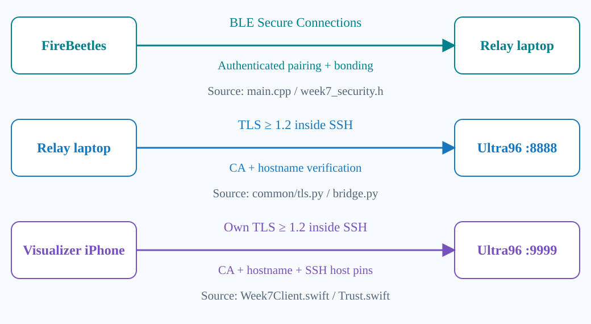

The FireBeetle link uses BLE Secure Connections with authenticated pairing and bonding. Its stack provides link encryption. The laptop independently verifies the Ultra96 TLS certificate against our CA and checks the expected hostname. The native iPhone performs its own TLS verification and pins the SSH host keys for its route. Both TLS clients require version one point two or newer. These are separate protected connections. We will now inspect the enforcement points in the source code.

**Code:** [C16 TLS connect](#c16) · [C20 BLE security](#c20) · [C21 Peer check](#c21) · [C22 GATT access](#c22) · [C23 Python TLS](#c23) · [C24 iPhone TLS](#c24) · [C25 Phone route](#c25) · [C26 SSH pins](#c26)

<a id="c20"></a>
### C20 — BLE security

Source: [firmware/esp32/src/main.cpp](../firmware/esp32/src/main.cpp#L243) · original lines **243–262**.

The protected firmware configures BLE-stack authentication, bonding and key policy rather than inventing payload encryption.

```cpp
bool configureSecurity() {
  if (kDiagnostic) {
    Serial.println("ble_security=UNPROTECTED_DIAGNOSTIC not_protected_evidence");
    return true;
  }
  BLEDevice::setSecurityCallbacks(new SecurityCallbacks());
  // Stack-generated fresh passkey per pairing. setStaticPIN is intentionally
  // avoided because that Arduino helper overwrites the authentication mode.
  // L251: Require Secure Connections, MITM protection and bonding; any failed
  // configuration call makes setup reject this policy.
  return setSecurityParam(ESP_BLE_SM_AUTHEN_REQ_MODE, ESP_LE_AUTH_REQ_SC_MITM_BOND) &&
      setSecurityParam(ESP_BLE_SM_IOCAP_MODE, ESP_IO_CAP_OUT) &&
      // L253: Configure a maximum 16-byte BLE key size; the Bluetooth stack performs
      // the actual link encryption.
      setSecurityParam(ESP_BLE_SM_MAX_KEY_SIZE, 16) &&
      // L254: Declare encryption and identity key distribution for the initiating
      // role as part of the bonding configuration.
      setSecurityParam(ESP_BLE_SM_SET_INIT_KEY, ESP_BLE_ENC_KEY_MASK | ESP_BLE_ID_KEY_MASK) &&
      // L255: Configure the responding role's key distribution as well, preserving
      // the intended bond policy.
      setSecurityParam(ESP_BLE_SM_SET_RSP_KEY, ESP_BLE_ENC_KEY_MASK | ESP_BLE_ID_KEY_MASK) &&
      // L256: Require the specified authentication policy instead of accepting a
      // weaker association automatically.
      setSecurityParam(ESP_BLE_SM_ONLY_ACCEPT_SPECIFIED_SEC_AUTH, ESP_BLE_ONLY_ACCEPT_SPECIFIED_AUTH_ENABLE);
}

void gattsCallback(esp_gatts_cb_event_t event, esp_gatt_if_t interface,
                   esp_ble_gatts_cb_param_t* param) {
  // BLEServer's getGattsIf() is private in Arduino 2.0.17. Capture the public
  // registration event for this process's sole GATT application instead.
```
**Read aloud:**

In firmware/esp32/src/main.cpp, configureSecurity asks the BLE stack to enforce the protected pairing policy. Line 251 requests Secure Connections, MITM protection and bonding, while the following settings select display capability, a maximum key size of sixteen bytes, and encryption and identity key distribution. Line 256 requires the specified authentication mode, and the chained checks return failure if any security setting cannot be applied. The stack creates a fresh pairing passkey rather than using a static PIN helper that would change the authentication mode. The earlier diagnostic branch is explicitly unprotected and is not evidence for this protected demonstration.

[Back to G09](#g09)

<a id="c21"></a>
### C21 — Peer check

Source: [firmware/esp32/src/main.cpp](../firmware/esp32/src/main.cpp#L196) · original lines **196–208**.

Authentication completion authorizes only the current peer and rejects connections that fail the required BLE security policy.

```cpp
  void onAuthenticationComplete(esp_ble_auth_cmpl_t result) override {
    xSemaphoreTake(connectionStateMutex, portMAX_DELAY);
    // L198: Match the authentication callback address to the current connected peer
    // before changing connection authorization.
    const bool currentPeer = clientConnected &&
        memcmp(connectedAddress, result.bd_addr, sizeof(connectedAddress)) == 0;
    // L200: Approve only successful authentication with all required mode bits, and
    // never while bonds are being erased.
    const bool approved = !erasingBonds && week7::isAuthenticated(result.success, result.auth_mode);
    // L201: Apply the approval result only to the current peer; another peer's
    // callback must not unlock this connection.
    if (currentPeer) authenticated = approved;
    const uint16_t rejectedConnection = connectionId;
    xSemaphoreGive(connectionStateMutex);
    // Never print the callback struct: it includes key material.
    Serial.printf("ble_security_complete success=%u auth_mode=%u approved=%u current_peer=%u reason=%u\n",
        result.success, result.auth_mode, currentPeer && approved, currentPeer,
        result.success ? 0 : result.fail_reason);
    // L208: Disconnect the current peer if it failed the policy so protected
    // operations cannot continue in a downgraded state.
    if (currentPeer && !approved) server->disconnect(rejectedConnection);
```
**Read aloud:**

In main.cpp, onAuthenticationComplete decides whether the current BLE connection may become authenticated. Line 198 compares the callback address with the connected peer, so a callback belonging to another device cannot change this connection's authorization. Line 200 also requires successful authentication with the required security mode and blocks approval during bond erasure; Line 208 disconnects a current peer that fails these checks. This implements the authentication gate in G09, and the printed completion fields let us inspect the decision without printing the callback structure, which contains key material.

[Back to G09](#g09)

<a id="c22"></a>
### C22 — GATT access

Source: [firmware/esp32/src/main.cpp](../firmware/esp32/src/main.cpp#L391) · original lines **391–398**.

GATT permissions protect both data attributes and the subscription descriptor used to enable notifications.

```cpp
BLECharacteristic* addNotify(BLEService* service, const char* uuid, BLE2902** descriptor) {
  BLECharacteristic* characteristic = service->createCharacteristic(uuid, BLECharacteristic::PROPERTY_NOTIFY);
  *descriptor = new BLE2902();
  (*descriptor)->setCallbacks(new CccdCallbacks());
  if (!kDiagnostic) {
    // L396: Require encrypted, MITM-authenticated access on the notification
    // characteristic in the protected profile.
    characteristic->setAccessPermissions(ESP_GATT_PERM_READ_ENC_MITM);
    // L397: Protect CCCD reads and writes too, so enabling notification subscriptions
    // cannot bypass the authenticated link requirement.
    (*descriptor)->setAccessPermissions(ESP_GATT_PERM_READ_ENC_MITM | ESP_GATT_PERM_WRITE_ENC_MITM);
  }
```
**Read aloud:**

In main.cpp, addNotify creates a notification characteristic together with its client configuration descriptor, which controls subscription. For the protected profile, Line 396 applies encrypted, MITM-authenticated read permission, and Line 397 applies the corresponding protected read and write permissions to the descriptor. Protecting that descriptor matters because enabling notifications is itself a GATT operation, not merely a local phone or laptop setting. This is one layer of the BLE protection shown in G09; the authentication callback and the firmware's notification gate provide the related connection checks used during the demonstration.

[Back to G09](#g09)

<a id="c23"></a>
### C23 — Python TLS

Source: [common/tls.py](../common/tls.py#L4) · original lines **4–19**.

Python TLS verifies the Ultra96 server certificate and hostname with a configured CA and enforces a minimum protocol version.

```python
TLS_SERVER_NAME = "ultra96.week7.internal"


def client_context(ca_file):
    context = ssl.SSLContext(ssl.PROTOCOL_TLS_CLIENT)
    # L9: Reject TLS versions below 1.2 rather than negotiating an obsolete protocol.
    context.minimum_version = ssl.TLSVersion.TLSv1_2
    # L10: Require a valid server certificate; an encrypted but unverified connection
    # is insufficient.
    context.verify_mode = ssl.CERT_REQUIRED
    # L11: Check the server's expected application hostname in addition to
    # certificate-chain trust.
    context.check_hostname = True
    # L12: Load the configured CA as the trust anchor for the application's server
    # certificate.
    context.load_verify_locations(cafile=str(ca_file))
    return context


def server_context(cert_file, key_file):
    context = ssl.SSLContext(ssl.PROTOCOL_TLS_SERVER)
    # L18: The server also enforces TLS 1.2 or newer, independently of client
    # settings.
    context.minimum_version = ssl.TLSVersion.TLSv1_2
    # L19: Load the server identity certificate and private key; this code does not
    # require client certificates or implement mutual TLS.
    context.load_cert_chain(certfile=str(cert_file), keyfile=str(key_file))
```
**Read aloud:**

In common/tls.py, client_context builds the TLS policy used by the Python connection to Ultra96. Lines 9 through 12 require TLS version 1.2 or newer, certificate verification, hostname checking and the configured certificate authority, so opening an encrypted socket alone is not enough to accept the server. The server_context function loads Ultra96's certificate and private key at Line 19 and sets the same minimum protocol version. This is the application TLS layer in G09, separate from the SSH route, and this configuration authenticates the server without requiring client certificates.

[Back to G09](#g09)

<a id="c24"></a>
### C24 — iPhone TLS

Source: [ios-visualizer/Week7Native/Sources/Week7Transport/Week7Client.swift](../ios-visualizer/Week7Native/Sources/Week7Transport/Week7Client.swift#L88) · original lines **88–95**.

The phone independently configures TLS certificate trust and distinct SSH host-key pins for its route.

```swift
            var configuration = TLSConfiguration.makeClientConfiguration()
            // L89: Use the configured certificate roots for the phone's independent
            // application TLS connection.
            configuration.trustRoots = .certificates(roots)
            configuration.additionalTrustRoots = []
            // L91: Require full certificate verification rather than accepting an
            // arbitrary encrypted peer.
            configuration.certificateVerification = .fullVerification
            // L92: Keep the same minimum TLS 1.2 policy on the native phone client.
            configuration.minimumTLSVersion = .tlsv12
            let tls = try NIOSSLContext(configuration: configuration)
            // L94: Parse the expected board SSH host key; this is separate from TLS
            // CA and hostname verification.
            let boardPin = try PinnedHostKey(route.boardHostKey)
            // L95: When a jump host is used, configure its own pinned SSH host key as
            // well.
            let jumpPin = try route.jump.map { try PinnedHostKey($0.hostKey) }
```
**Read aloud:**

In Week7Client.swift, the connect function constructs the iPhone's own TLS configuration before opening its result connection. Line 89 installs the supplied certificate roots, while Lines 91 and 92 require full certificate verification and at least TLS version 1.2. Lines 94 and 95 then create separate SSH host-key checks for the board and, when configured, the jump host. G09 shows these as distinct protections because trusting the application certificate and trusting each SSH server are different checks, and the phone performs its own checks rather than borrowing the laptop's connection.

[Back to G09](#g09)

<a id="c25"></a>
### C25 — Phone route

Source: [ios-visualizer/Week7Native/Sources/Week7Transport/Week7Client.swift](../ios-visualizer/Week7Native/Sources/Week7Transport/Week7Client.swift#L128) · original lines **128–150**.

The native client opens a board-loopback result channel through SSH, layers verified TLS over it and ignores obsolete connection callbacks.

```swift
                    return self.direct(parent: channel, host: route.boardHost, port: self.options.boardPort) { child in
                        child.eventLoop.makeCompletedFuture {
                            try child.pipeline.syncOperations.addHandler(SSHByteStream())
                            try child.pipeline.syncOperations.addHandler(self.ssh(channel: child, username: route.boardUser, jumpHop: false, pin: boardPin))
                            try child.pipeline.syncOperations.addHandler(ConnectionEnd { [weak self, weak next] error in
                                guard let next else { return }; self?.failed(next, epoch: token, error: error)
                            })
                        }
                    }
                }.flatMap { [weak self] board -> EventLoopFuture<Channel> in
                    // L138: Reject a stale or inactive connection attempt before it
                    // opens the application's result channel.
                    guard let self, self.current(token), next.active else { return board.eventLoop.makeFailedFuture(TransportFailure.disconnected) }
                    return self.direct(parent: board, host: "127.0.0.1", port: self.options.servicePort) { child in
                        // L140: Install the result-channel handlers on that channel's
                        // event loop, preserving NIO's ownership model.
                        child.eventLoop.makeCompletedFuture {
                            try child.pipeline.syncOperations.addHandler(SSHByteStream())
                            // L142: Layer verified application TLS over the SSH byte
                            // stream and verify ultra96.week7.internal as the server
                            // hostname.
                            try child.pipeline.syncOperations.addHandler(try NIOSSLClientHandler(context: tls, serverHostname: "ultra96.week7.internal"))
                            try child.pipeline.syncOperations.addHandler(Subscriber(session: self.session, options: self.options, onSubscribed: { [weak self, weak next] in
                                // L144: Only the currently active connection
                                // generation may announce subscription or update UI
                                // state.
                                guard let self, let next, next.active, self.current(token) else { return }
                                next.deadline?.cancel(); next.deadline = nil
                                self.emitStatus("Subscribed", epoch: token)
                            }, onResult: { [weak self, weak next] result in
                                guard let self, let next, next.active, self.current(token) else { return }
                                self.retryDelay = self.options.retryMinimum
                                self.emitResult(result, epoch: token)
```
**Read aloud:**

In Week7Client.swift, connect first reaches the board over SSH, then opens the result service on board loopback. Line 138 rejects an obsolete connection attempt, and Line 142 places a TLS client handler over that byte stream with ultra96.week7.internal as the expected server hostname. The subscription callback at Line 144 checks the current connection generation again before announcing Subscribed, preventing a late callback from an earlier attempt from updating the active connection's state. This connects the security layers in G09 with G08's subscription state, which we also show on the physical phone.

[Back to G09](#g09)

<a id="c26"></a>
### C26 — SSH pins

Source: [ios-visualizer/Week7Native/Sources/Week7Transport/Trust.swift](../ios-visualizer/Week7Native/Sources/Week7Transport/Trust.swift#L4) · original lines **4–10**.

Pinned SSH host keys make an unexpected board or jump-host identity a connection failure.

```swift
final class PinnedHostKey: NIOSSHClientServerAuthenticationDelegate {
    private let pinned: NIOSSHPublicKey
    init(_ key: String) throws { pinned = try NIOSSHPublicKey(openSSHPublicKey: key) }
    // L7: Validate the server-presented SSH public key against the key configured for
    // this hop.
    func validateHostKey(hostKey: NIOSSHPublicKey, validationCompletePromise: EventLoopPromise<Void>) {
        // L8: Fail the connection on a key mismatch instead of silently trusting a
        // replacement server.
        guard hostKey == pinned else { validationCompletePromise.fail(TransportFailure.hostKey); return }
        // L9: Complete host authentication successfully only after the exact pinned-
        // key comparison passes.
        validationCompletePromise.succeed(())
    }
```
**Read aloud:**

In Trust.swift, PinnedHostKey implements the SSH library's server authentication delegate. The constructor parses the configured public key, and Line 8 compares that key with the key actually presented by the remote SSH server, failing the authentication promise on a mismatch. Only the successful comparison reaches Line 9, so a different server key is not silently accepted during reconnection. This explains the pinned SSH identities in G09: the board and jump host have their own expected keys, while the separate TLS configuration checks the application server's certificate.

[Back to G09](#g09)

---

<a id="g10"></a>
## G10 — Concurrency on the laptop

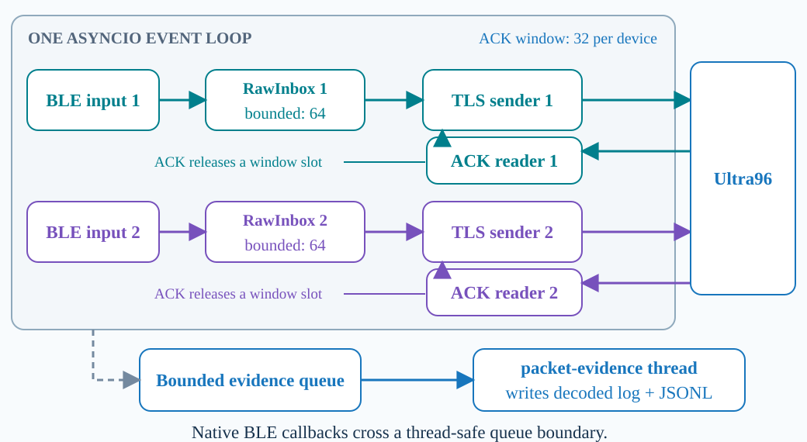

Each device has its own BLE input task, bounded inbox and TLS sender. Its acknowledgement reader validates replies and releases slots in the thirty-two-message window. Waiting for one device's I/O allows the other device's tasks to progress. BLE callbacks enter through a thread-safe queue boundary. A separate worker thread writes packet evidence from another bounded queue. The main network concurrency uses asyncio tasks, while logging uses an actual operating-system thread.

**Code:** [C27 Device tasks](#c27) · [C28 Inbox state](#c28) · [C29 Callback queue](#c29) · [C30 ACK window](#c30) · [C31 Send / ACK tasks](#c31) · [C32 Log thread](#c32)

<a id="c27"></a>
### C27 — Device tasks

Source: [laptop/dual_bridge.py](../laptop/dual_bridge.py#L91) · original lines **91–111**.

The laptop schedules independent device inputs and ingestion writers, with optional command workers alongside them.

```python
        stop = {device: asyncio.Event() for device in self.bridges}
        active = {device: asyncio.Event() for device in self.bridges}
        writers = {
            # L94: Give each device its own ingestion writer task so its network waits
            # do not serialize the other device's stream.
            device: asyncio.create_task(bridge.writer_loop(), name=f"writer-{device}")
            for device, bridge in self.bridges.items()
        }
        inputs = {}
        for device, bridge in self.bridges.items():
            if mock:
                coroutine = bridge.dummy_loop(
                    rate, stop_event=stop[device], active_event=active[device])
            else:
                options = dict(ble_options.get(device, {}))
                coroutine = bridge.ble_loop(
                    stop_event=stop[device], active_event=active[device], **options)
            # L106: Run each physical BLE input as a separate task; mock input is an
            # explicit alternate path and is not physical evidence.
            inputs[device] = asyncio.create_task(coroutine, name=f"input-{device}")

        failures = {1: [], 2: []}
        # L109: Create command workers only when enabled, keeping their optional work
        # separate from the telemetry input tasks.
        command_workers = {device: asyncio.create_task(bridge.commands.run(),
                           name=f"commands-{device}")
                           for device, bridge in self.bridges.items() if bridge.commands is not None}
```
**Read aloud:**

In laptop/dual_bridge.py, DualBridge.run creates separate asynchronous work for both device streams. Line 94 starts one writer task per bridge, and Line 106 starts each input task using the physical BLE path unless mock mode was explicitly requested. Line 109 adds command workers when the corresponding command support exists, allowing live keyboard work alongside telemetry. These asyncio tasks cooperate at their suspension points, which is the concurrency shown in G10: while one device waits for input or network progress, the other device's tasks can continue, with their identities kept separate in the evidence.

[Back to G10](#g10)

<a id="c28"></a>
### C28 — Inbox state

Source: [laptop/bridge.py](../laptop/bridge.py#L87) · original lines **87–101**.

RawInbox bridges cross-thread BLE callbacks into bounded asyncio processing with explicit synchronization.

```python
class RawInbox:
    """Bound callback bytes AND cross-thread loop wakeups; parse in the writer."""
    def __init__(self, capacity):
        self._items = deque()
        # L91: Bound queued notifications to prevent an unresponsive downstream path
        # from consuming unlimited memory.
        self._capacity = capacity
        # L92: Protect inbox state shared between native BLE callbacks and the asyncio
        # consumer.
        self._lock = threading.Lock()
        # L93: Use an event to wake the asynchronous consumer only when work is
        # available, rather than blocking the event loop.
        self._event = asyncio.Event()
        self._loop = asyncio.get_running_loop()
        self._wake_pending = False
        self._accepting = False
        self.generation = 0
        self.dropped = 0
        self.generation_dropped = 0

    @property
```
**Read aloud:**

In laptop/bridge.py, RawInbox is the small handoff between BLE callback delivery and asynchronous packet processing. Line 91 stores a capacity limit, Line 92 creates a threading lock for shared queue state, and Line 93 creates an asyncio event for the waiting consumer. The lock protects operations that may originate outside the event loop, while the event lets the consumer wait without blocking the loop's other work. This is the callback boundary in G10, and its generation and drop counters make reconnection or overload losses visible instead of hiding them as unlimited buffering.

[Back to G10](#g10)

<a id="c29"></a>
### C29 — Callback queue

Source: [laptop/bridge.py](../laptop/bridge.py#L122) · original lines **122–147**.

The callback queue rejects obsolete generations, records bounded-buffer losses and wakes its asynchronous consumer without busy waiting.

```python
    def _wake(self):
        with self._lock:
            self._wake_pending = False
        # L125: Wake the consumer on the owning event loop after a scheduled callback
        # reaches that loop.
        self._event.set()

    def put(self, generation, data, received_at):
        # L128: Serialize callback-side updates so connection generations and queue
        # capacity are checked consistently.
        with self._lock:
            if not self._accepting or not generation or generation != self.generation:
                self.generation_dropped += 1
                return False
            if len(self._items) == self._capacity:
                self._items.popleft()
                self.dropped += 1
            # L135: Copy callback bytes and retain their receive time and connection
            # generation before the native buffer can change.
            self._items.append(Received(bytes(data), received_at, generation))
            if not self._wake_pending:
                # L137: Coalesce wakeups so a burst of notifications cannot flood the
                # event loop with one scheduled callback per packet.
                self._wake_pending = True
                self._loop.call_soon_threadsafe(self._wake)
            return True
# L140: The consumer below removes queued items under the same lock used by producers.

    # L141: Wait asynchronously when the inbox is empty, allowing other devices and
    # network tasks to continue.
    async def get(self):
        while True:
            with self._lock:
                if self._items:
                    return self._items.popleft()
                self._event.clear()
            await self._event.wait()
```
**Read aloud:**

In laptop/bridge.py, RawInbox.put performs only the bounded handoff needed by the BLE callback. Under the lock at Line 128, it rejects an inactive connection generation, removes the oldest item if capacity is full, and copies the incoming bytes with their receive time at Line 135. Line 138 schedules a thread-safe wakeup, while the pending flag coalesces repeated notifications until that wakeup runs. The consumer then waits asynchronously at Line 147, matching G10's queue boundary and allowing the recording to report buffer or generation losses separately from successful downstream acknowledgements.

[Back to G10](#g10)

<a id="c30"></a>
### C30 — ACK window

Source: [laptop/bridge.py](../laptop/bridge.py#L533) · original lines **533–544**.

The ingestion pipeline bounds messages awaiting acknowledgement while allowing sending and ACK reading to overlap.

```python
    async def _pipeline_epoch(self):
        """Run one owned TLS epoch with a FIFO sender and ACK reader."""
        # L535: Limit outstanding messages with a per-device semaphore; the recording
        # configures 32 slots.
        slots = asyncio.Semaphore(self.config.ack_window)
        pending = deque()
        pending_available = asyncio.Event()
        current = [None]
        state = {"active": True, "epoch": None}

        # L541: The sender acquires a slot before consuming and forwarding another
        # sample; validated ACKs release capacity on the receive path.
        async def sender():
            while True:
                await slots.acquire()
                item = await self.inbox.get()
```
**Read aloud:**

In laptop/bridge.py, _pipeline_epoch creates the per-device acknowledgement window for one TLS connection lifetime. Line 535 initializes a semaphore from ack_window, which the recording launcher sets to thirty-two, and Line 543 acquires a slot before the sender consumes another item. The normal successful receive path validates the corresponding ingestion ACK before releasing capacity, so sending can overlap acknowledgement reception without accumulating an unlimited number of outstanding messages. This is G10's ACK window, and its count measures work awaiting Ultra96 acknowledgement rather than packets confirmed as received by the phone.

[Back to G10](#g10)

<a id="c31"></a>
### C31 — Send / ACK tasks

Source: [laptop/bridge.py](../laptop/bridge.py#L632) · original lines **632–642**.

Sender and ACK-reader tasks share one owned TLS epoch, with coordinated failure and cancellation handling.

```python
        workers = {
            # L633: Schedule transmission independently from acknowledgement reception
            # so the pipeline is not stop-and-wait.
            asyncio.create_task(sender(), name="pipeline-sender"),
            # L634: The ACK reader can validate replies and release window slots while
            # the sender waits on new input or capacity.
            asyncio.create_task(receiver(), name="pipeline-ack-reader"),
        }
        failure = None
        # L637: Track cancellation separately from transport errors so cleanup can
        # preserve the reason the pipeline stopped.
        cancelled = False
        try:
            # L639: Observe either worker's failure and then retire the shared
            # connection and companion task together.
            done, _ = await asyncio.wait(workers, return_when=asyncio.FIRST_EXCEPTION)
            for task in done:
                error = None if task.cancelled() else task.exception()
                if failure is None and error is not None:
```
**Read aloud:**

In laptop/bridge.py, _pipeline_epoch starts the sender at Line 633 and the ACK reader at Line 634 as separate asyncio tasks on the same owned connection. This allows a new frame to be sent while the receive task validates earlier acknowledgements and releases window capacity. Line 639 waits for a worker exception, after which the surrounding cleanup retires that connection lifetime and coordinates the companion task, keeping old replies from being treated as current progress. G10 therefore shows concurrent send and receive work, while the error counters and reconnect behavior still belong to one coherent ingestion pipeline.

[Back to G10](#g10)

<a id="c32"></a>
### C32 — Log thread

Source: [laptop/evidence.py](../laptop/evidence.py#L13) · original lines **13–34**.

Packet evidence is written by a dedicated thread from a bounded queue, keeping disk work outside the main network event loop.

```python
class PacketEvidence:
    def __init__(self, path=None, *, capacity=4096, sample_every=10, stream=None, color=None):
        if capacity < 1 or sample_every < 1:
            raise ValueError("evidence capacity and sample interval must be positive")
        # L17: Bound pending evidence records; logging overload is counted rather than
        # allowed to consume unlimited memory.
        self.queue = queue.Queue(maxsize=capacity)
        self.sample_every = sample_every
        self.stream = stream if stream is not None else sys.stderr
        self.color = self.stream.isatty() if color is None else color
        self.json_file = self.text_file = None
        if path is not None:
            path = Path(path)
            self.json_file = path.open("x", encoding="utf-8")
            try:
                self.text_file = path.with_suffix(".log").open("x", encoding="utf-8")
            except BaseException:
                self.json_file.close()
                raise
        self._closing = threading.Event()
        self.dropped = self.written = self.write_errors = 0
        self._counts = {}
        # L33: Use a real worker thread for file and console evidence writes, separate
        # from the asyncio communication tasks.
        self._thread = threading.Thread(target=self._write, name="packet-evidence", daemon=True)
        # L34: Start the writer after its queue and output handles are ready; the
        # owner later drains and closes it during cleanup.
        self._thread.start()
```
**Read aloud:**

In laptop/evidence.py, PacketEvidence moves record writing to a dedicated Python thread. Line 17 creates a bounded queue, and Lines 33 and 34 create and start the packet-evidence thread, which drains records into the saved JSON and text files and the sampled console display. Keeping that disk work outside the network event loop helps the two device pipelines continue processing, while queue drops and write errors remain explicit evidence counters. This is the actual logging thread shown in G10, and the saved files support our later packet-to-ACK comparison without claiming phone receipt.

[Back to G10](#g10)

---

<a id="g11"></a>
## G11 — Concurrency on Ultra96

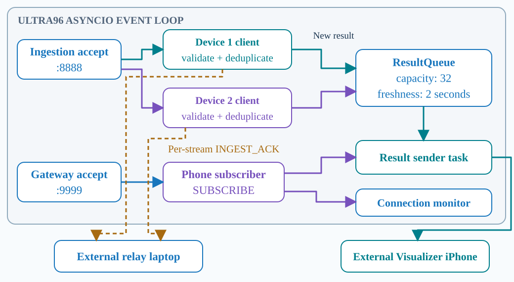

Ultra96 has separate accept tasks for ingestion and the phone gateway. Each client connection gets a task. Ingestion validates and deduplicates a message, creates a simulated result for a new input and returns an acknowledgement. The phone gateway runs a result sender and a connection monitor. A bounded result queue connects the two paths. An ingestion acknowledgement does not confirm phone receipt, which is why the physical demonstration separately compares the phone's received-count increase.

**Code:** [C33 Two listeners](#c33) · [C34 Client task](#c34) · [C35 Ingest + ACK](#c35) · [C36 Gateway tasks](#c36) · [C37 Queue capacity](#c37) · [C38 Queue freshness](#c38)

<a id="c33"></a>
### C33 — Two listeners

Source: [ultra96/server.py](../ultra96/server.py#L136) · original lines **136–153**.

Ultra96 owns two loopback TCP services with independent asynchronous accept tasks.

```python
    async def start(self):
        if self._listeners or self._closing:
            raise RuntimeError("server is already started or closed")
        # L139: Create both service listeners within one guarded startup path so
        # partial setup can be cleaned up on failure.
        try:
            for gateway, port in ((False, self.ingest_port), (True, self.gateway_port)):
                listener = socket.socket(socket.AF_INET, socket.SOCK_STREAM)
                listener.setblocking(False)
                self._listeners.append(listener)
                if os.name == "posix":
                    # Match asyncio's POSIX listener default: stopped clients
                    # in TIME_WAIT must not prevent an immediate service restart.
                    # Windows has different reuse semantics and does not need it.
                    listener.setsockopt(socket.SOL_SOCKET, socket.SO_REUSEADDR, 1)
                listener.bind(("127.0.0.1", port))
                # L150: Accept through a finite socket backlog; the listeners are
                # bound to board loopback for access through SSH.
                listener.listen(8)
                # L151: Run a separate accept task for ingestion and results so
                # waiting on one listener does not block the other.
                task = asyncio.create_task(self._accept(listener, gateway))
                self._accept_tasks.add(task)
                task.add_done_callback(self._accept_done)
```
**Read aloud:**

In ultra96/server.py, Week7Server.start creates separate TCP listeners for ingestion and the phone result gateway. Line 149 binds each listener to board loopback, so the deployed SSH route provides access to these local services, and Line 151 creates an asynchronous accept task for each listener. Line 150 sets the pending connection backlog; the separate accepted-client check controls how many live sockets the server owns. These are the two service entrances in G11, allowing the laptop's ingestion connections and the phone's subscription connection to make progress through the same server event loop.

[Back to G11](#g11)

<a id="c34"></a>
### C34 — Client task

Source: [ultra96/server.py](../ultra96/server.py#L179) · original lines **179–188**.

Each accepted socket gets a tracked asynchronous client task, within the server's bounded connection capacity.

```python
            retry_delay = 0.1
            connection.setblocking(False)
            if self._closing or len(self._sockets) >= 8:
                self.metrics["client_limit"] += 1
                connection.close()
                continue
            connection.setsockopt(socket.IPPROTO_TCP, socket.TCP_NODELAY, 1)
            self._sockets.add(connection)
            # L187: Create a client task for this accepted connection so one client's
            # TLS and application I/O do not serialize all peers.
            task = asyncio.create_task(self._client(connection, gateway))
            # L188: Retain the task in the server's ownership set so shutdown and
            # completion cleanup can account for it.
            self._tasks.add(task)
```
**Read aloud:**

In ultra96/server.py, Week7Server._accept checks each new socket before handing it to application processing. Line 181 refuses connections during shutdown or when the server already owns eight sockets, and Line 187 creates an asyncio client task for an accepted connection. Tracking that task at Line 188 gives shutdown and completion handling an explicit record of the work being owned. In G11, the two laptop ingestion clients and the phone gateway client therefore have separate tasks whose I/O waits can overlap, without implying a dedicated operating-system thread for every connection.

[Back to G11](#g11)

<a id="c35"></a>
### C35 — Ingest + ACK

Source: [ultra96/server.py](../ultra96/server.py#L246) · original lines **246–275**.

Ultra96 validates and deduplicates input, creates one simulated result for a new identity and acknowledges ingestion separately.

```python
    async def _ingest(self, reader, writer):
        while not self._closing:
            # L248: Read a complete framed message and validate its exact SENSOR_BATCH
            # schema and configured session before accepting it.
            message = validate_message(await read_frame(reader), "SENSOR_BATCH", self.session_id)
            trace = (message["device_id"], message["boot_id"], message["seq"])
            duplicate = (self._v2_duplicate(message) if message["v"] == 2
                         else trace in self._recent)
            if duplicate:
                self.metrics["duplicates"] += 1
                self._observe("result_duplicate", **trace_fields(message))
            else:
                if message["v"] == 1:
                    self._recent[trace] = None
                    if len(self._recent) > 4096:
                        self._recent.popitem(last=False)
                self.metrics["accepted"] += 1
                self._observe("result_accepted", **trace_fields(message))
                LOG.info("accepted session=%s device=%d boot=%d seq=%d",
                         self.session_id, *trace)
                result = dict(v=message["v"], type="GESTURE_RESULT", **trace_fields(message))
                # L265: Build an attributable result identity from the accepted input,
                # preserving stream versus command identity rules.
                result.update(result_id=result_identity(message),
                              # L266: For v2, choose a simulated gesture randomly;
                              # confidence 1.0 here is a dummy value, not trained-
                              # model confidence.
                              gesture=(self._rng.choice(GESTURES) if message["v"] == 2
                                       else GESTURES[message["seq"] % 4]), confidence=1.0)
                if self._subscriber is None:
                    self.metrics["disconnected_results"] += 1
                    self._observe("result_no_subscriber", **trace_fields(message))
                else:
                    # L272: Queue a new result for the current subscriber; enqueueing
                    # alone does not confirm delivery to the phone.
                    self._subscriber[1].put(result)
            # L273: Echo the accepted input's trace fields in a separate ingestion
            # acknowledgement to the laptop.
            ack = dict(v=message["v"], type="INGEST_ACK", **trace_fields(message))
            ack["status"] = "duplicate" if duplicate else "accepted"
            # L275: Write the ingestion ACK without waiting for a phone receipt;
            # duplicate input is acknowledged without producing another result.
            await write_frame(writer, ack)
```
**Read aloud:**

In ultra96/server.py, _ingest validates each framed SENSOR_BATCH at Line 248 and checks whether its identity has already been accepted. A new identity produces a result with preserved trace fields, while Line 266 selects a simulated gesture; confidence 1.0 is dummy data, not a trained model's confidence. Line 272 queues that result only when a subscriber exists, and Line 275 separately writes the ingestion acknowledgement to the laptop. This is G11's split between result delivery and ACK return: duplicates are acknowledged without creating another result, and actual phone reception is demonstrated by the recorded phone screen.

[Back to G11](#g11)

<a id="c36"></a>
### C36 — Gateway tasks

Source: [ultra96/server.py](../ultra96/server.py#L309) · original lines **309–337**.

The result gateway owns one subscription at a time and separates result sending from connection monitoring.

```python
    async def _gateway(self, reader, writer):
        # L310: Require a valid SUBSCRIBE message for the configured session before
        # granting result-stream ownership.
        validate_message(await read_frame(reader), "SUBSCRIBE", self.session_id)
        self._subscriber_generation += 1
        queue = ResultQueue(observer=self._observe if self.observer is not None else None,
                            subscriber_id=self._subscriber_generation)
        owner = (writer, queue)
        previous = self._subscriber
        self._subscriber = owner
        self.metrics["subscribers"] += 1
        sender = monitor = None
        reason = "disconnected"
        error_fields = {}
        try:
            self._observe("subscriber_claimed", session_id=self.session_id,
                          subscriber_id=queue.subscriber_id)
            if previous is not None:
                self.metrics["replaced"] += 1
                previous[1].retirement_reason = "replaced"
                self._observe("subscriber_replaced", session_id=self.session_id,
                              subscriber_id=queue.subscriber_id,
                              previous_subscriber_id=previous[1].subscriber_id)
                previous[0].close()
            # L331: Confirm the subscription with its version-one envelope before
            # streaming any results.
            await write_frame(writer, {"v": 1, "type": "SUBSCRIBED", "session_id": self.session_id})
            self._observe("subscribed_write_complete", session_id=self.session_id,
                          subscriber_id=queue.subscriber_id, phone_receipt_confirmed=False)
            # L334: Send queued results in a dedicated task rather than making
            # ingestion wait for the phone socket.
            sender = asyncio.create_task(self._send_results(writer, queue))
            # After SUBSCRIBE the connection is receive-only; EOF or extra bytes end ownership.
            # L336: Monitor EOF or unexpected extra input because the phone's
            # application direction is receive-only after SUBSCRIBE.
            monitor = asyncio.create_task(reader.read(1))
            # L337: When either sending or connection monitoring finishes, retire this
            # subscription and clean up its companion task.
            finished, _ = await asyncio.wait((sender, monitor), return_when=asyncio.FIRST_COMPLETED)
```
**Read aloud:**

In ultra96/server.py, _gateway first validates SUBSCRIBE at Line 310 and establishes a new subscriber generation with its own result queue. If a previous subscriber exists, its connection is closed, and Line 331 writes SUBSCRIBED before result streaming begins. Lines 334 and 336 create separate tasks for sending results and monitoring EOF or unexpected incoming data, while Line 337 waits for either task to finish so ownership can be retired. This is G11's gateway branch and G08's subscription handshake; writing the confirmation on the server is distinct from observing Subscribed on the phone.

[Back to G11](#g11)

<a id="c37"></a>
### C37 — Queue capacity

Source: [ultra96/server.py](../ultra96/server.py#L32) · original lines **32–41**.

The phone result path uses a bounded live queue with loss counters and a distinct subscription identity.

```python
class ResultQueue:
    """Live-only bounded queue with monotonic age, shared by one subscriber."""
    def __init__(self, *, observer=None, subscriber_id=None):
        # L35: Limit the subscriber's live result queue to 32 items; this queue is
        # separate from the laptop's ACK window.
        self._queue = asyncio.Queue(maxsize=32)
        # L36: Track overflow losses explicitly so finite buffering is not mistaken
        # for guaranteed delivery.
        self.dropped = 0
        self.stale = 0
        self.observer = observer
        self.observer_errors = 0
        # L40: Attach a subscriber generation to diagnostics so results from different
        # subscription lifetimes can be distinguished.
        self.subscriber_id = subscriber_id
        self.retirement_reason = None
```
**Read aloud:**

In ultra96/server.py, ResultQueue gives the current phone subscriber a bounded live result buffer. Line 35 creates an asyncio queue with space for thirty-two items, while Lines 36 and 37 initialize separate overflow and stale-result counters. Line 40 stores the subscriber identity so observations can be attributed to a particular subscription lifetime, including after a reconnect replaces an earlier subscriber. This is the shared result queue in G11: it receives results arising from both ingestion streams, and its finite capacity is separate from each laptop bridge's thirty-two-slot ingestion ACK window.

[Back to G11](#g11)

<a id="c38"></a>
### C38 — Queue freshness

Source: [ultra96/server.py](../ultra96/server.py#L56) · original lines **56–77**.

The live result queue bounds memory and latency by recording overflow and discarding stale results.

```python
    def put(self, message, received_at=None):
        if self._queue.full():
            # L58: Remove the oldest queued result when capacity is exhausted,
            # prioritizing recent live state and recording the loss.
            old_at, old = self._queue.get_nowait()
            self.dropped += 1
            self.observe("result_drop_oldest", old, old_at)
        received_at = time.monotonic() if received_at is None else received_at
        # L62: Enqueue without awaiting phone transmission so ingestion remains
        # decoupled from a slow subscriber.
        self._queue.put_nowait((received_at, message))
        self.observe("result_enqueued", message, received_at)

    async def get(self, now=None):
        _, message = await self.get_timed(now=now)
        return message

    async def get_timed(self, now=None):
        while True:
            received_at, message = await self._queue.get()
            # L72: Measure age with a monotonic clock so wall-clock changes do not
            # change freshness decisions.
            current = time.monotonic() if now is None else now
            # L73: Drop results at least two seconds old before sending; the system
            # does not provide full outage replay.
            if current - received_at >= 2.0:
                self.stale += 1
                self.observe("result_drop_stale", message, received_at, reason="dequeue")
                continue
            return received_at, message
```
**Read aloud:**

In ultra96/server.py, ResultQueue.put and get_timed implement the freshness policy behind G11's live result queue. Line 58 removes the oldest queued result when the queue is full, while Line 62 adds the new result without awaiting transmission to the phone. During dequeue, Line 72 uses a monotonic clock and Line 73 rejects an item at least two seconds old, so a slow or disconnected consumer does not turn this queue into an outage replay archive. The loss counters document that tradeoff, and these server-side decisions do not guarantee the age of a result when the phone finally renders it.

[Back to G11](#g11)

---

## Command walkthroughs

Routine operation uses R01 when programming is needed, R02 for the tunnel, and R03 or R04 for capture. Reports appear automatically. R05–R08 are used only when their specific task is needed.

<a id="r01"></a>
### R01 — Build and upload using one programming USB cable

File: [flash.py](../flash.py)

```powershell
python flash.py
```

This script regenerates the fixture table and builds both device profiles. I connect the left board, then swap it for the right board when prompted. The script detects the serial port for each upload and stops if a step fails.

At each board prompt, confirm the physical left/right label and press Enter. One detected serial port is selected automatically; if several are listed, choose the connected board explicitly. Windows assigns COM numbers to connected serial devices, so the two uploads may use the same COM number. `--ports` only lists ports when needed for first-time setup.

<a id="r02"></a>
### R02 — Keep the SSH tunnel open

File: [demo.py](../demo.py)

```powershell
python demo.py tunnel
```

This command opens the existing SSH route to Ultra96. I keep this terminal open during the demonstration.

<a id="r03"></a>
### R03 — Record the physical communication run

File: [demo.py](../demo.py)

```powershell
python demo.py run
```

This command captures both physical boards for sixty seconds at ten hertz each, then automatically shows the report and matching sensor and acknowledgement records. The camera records the phone reception.

<a id="r04"></a>
### R04 — Run the live keyboard demonstration

File: [demo.py](../demo.py)

```powershell
python demo.py live
```

This command starts a two-minute live capture with keyboard input enabled. Pressing one or two sends a command to the corresponding board. The same launcher saves the evidence and displays the report.

The default source rate is ten hertz per board. Maximum-rate, file-transfer and interruption demonstrations are separate runs using the existing rate, file and duration options; ten hertz is not a maximum-speed claim.

<a id="r05"></a>
### R05 — Reopen saved evidence when needed

File: [demo.py](../demo.py)

```powershell
python demo.py report "<exact Saved in directory>"
```

This command reopens the exact saved capture and displays its report and matching packets. The phone observation remains in the corresponding camera footage.

Replace the placeholder with the real Saved in directory from that capture. There is no need to run this immediately after a normal capture because its report is already displayed.

<a id="r06"></a>
### R06 — Initial authenticated pairing

File: [flash.py](../flash.py)

```powershell
python flash.py --pair left
```

This setup option uses the existing authenticated pairing tool for the selected board. I use left and right in turn during first-time setup; existing authenticated bonds are reused.

For the right board, use `python flash.py --pair right`. With an existing bond on both boards, `python flash.py --pair` checks both. During first pairing with one programming USB cable, monitor and pair one board at a time.

<a id="r07"></a>
### R07 — Private serial monitor for first pairing

File: [flash.py](../flash.py)

```powershell
python flash.py --monitor COM4
```

This setup option opens the selected serial port at one hundred and fifteen thousand two hundred baud. I keep pairing passkeys off camera and close the monitor before uploading or starting the wireless demonstration.

Replace COM4 with the actual port shown by `python flash.py --ports`. The monitor occupies its terminal; run the selected board's pairing option in another terminal, then close the monitor before swapping boards.

<a id="r08"></a>
### R08 — Service maintenance before the demonstration

File: [demo.py](../demo.py)

```powershell
python demo.py service
```

This command checks the Ultra96 service. If no service is running, the start option checks that both ports are free before starting the existing deployment.

Only if the service is absent, use `python demo.py service --start` in a separate terminal and keep it open. Reuse a healthy running service.

---

<a id="d01"></a>
## D01 — Change dummy packets, rebuild and rerun

**Baseline capture → edit fixture → `flash.py` → independent power → `demo.py run` or `live` → automatic report**

Source: [editable fixture, line 3](../common/dummy_fixtures.json#L3) · [generated firmware table, line 9](../firmware/esp32/include/week7_fixtures.h#L9) · [generator](../tools/generate_dummy_fixtures.py#L6) · [random firmware selection](../firmware/esp32/include/week7_packet.h#L55).

**Editable values:** Any channel in any fixture may be changed. Keep exactly eight integers per fixture, each between −32768 and 32767, and two to sixty-four fixtures in valid JSON. Decimals, strings and comments are not accepted. The 1200-to-1500 change below is an example; if you choose different values, adjust the narration and search for your complete updated vector. The flash script validates the data before building or uploading.

| Fixture | All eight channel values |
|---|---|
| Before editing | `[1200, -300, 850, 40, -20, 15, 600, 250]` |
| After editing | `[1500, -300, 850, 40, -20, 15, 600, 250]` |

I am changing the first channel of the second dummy fixture from twelve hundred to fifteen hundred. Each fixture still contains eight signed sixteen-bit values, and the thirty-two-byte packet format remains unchanged. The firmware will continue selecting randomly from the four fixtures.

| Step | Action | Evidence to show |
|---|---|---|
| Edit | Save the change in `common/dummy_fixtures.json` after the previous capture has finished | The actual file changes from 1200 to 1500 |
| Rebuild and upload | Run `python flash.py`; connect left, then swap to right at the prompts | Regenerated fixture header and both successful uploads using one programming USB cable |
| Prepare | Disconnect laptop USB; power both boards independently; keep the tunnel open and the iPhone Subscribed | Both boards on separate power; film the starting Received count |
| Rerun | Run `python demo.py run` for Video or `python demo.py live` for Live | New physical capture, authenticated BLE connections and its exact Saved in directory |
| Observe | Read the automatically displayed report; inspect this capture's `packets.log`; film the final phone count | Updated values from both devices, matching ACKs and camera evidence of phone reception |

I run the same flash script again, using one programming USB cable for the two boards in turn. After restoring independent power, I start a new capture with demo.py. It displays the report automatically, while the camera records the phone's received count.

Random selection means the first displayed sample may come from another fixture. Search the new capture's saved log for the complete updated vector, then match each sensor record to its acknowledgement using device, boot and sequence. Keep the baseline and modified captures, fixture copies and camera clips separate. The fixture excerpt in C07 is a snapshot; open the actual source or saved copy to show the edit. The phone shows result events and a received count; it need not display the raw sensor value 1500.

**After verifying the recorded evidence:**

The earlier capture contains the original fixture starting with twelve hundred. In this new capture, both devices have transmitted the updated fixture starting with fifteen hundred. Each displayed sample has a matching Ultra96 acknowledgement. The new report passes its checks. The corresponding camera footage shows the phone receiving results and its count increasing.

[Back to G03](#g03)
