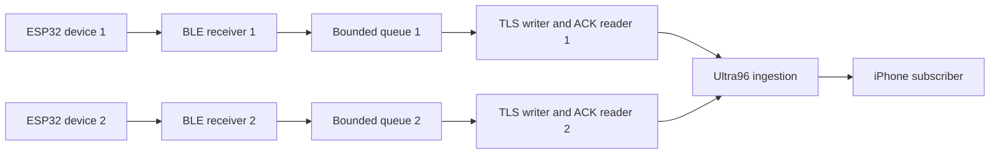

# Two ESP32 streams on one Windows laptop

This mode implements the selected option 1: keep both gloves connected, receive their streams concurrently, and measure missing packets separately for each device. A disconnect is a visible discontinuity; the healthy glove keeps running while the disconnected glove retries. Samples from an outage are not replayed as live gestures.

The current source is still the Week 7 10 Hz dummy generator. Real sensor calibration, a final 50 Hz contract, two-glove time alignment, and AI inference windows remain separate work.

## Runtime design



Each device owns its BLE connection, connection generation, packet queue, sequence accounting, TLS connection, and recovery state. A stalled ACK or BLE reconnect on one path does not hold the other's writer. Both TLS connections can use the same existing loopback SSH forward on port 18888. The Ultra96 sensor/result wire schemas remain unchanged, so the existing board server and installed native iPhone receiver remain compatible.

The dual command permits up to **32 outstanding frames per device** by default. Each path has one serialized sender and one FIFO ACK reader on its own TLS connection: the sender can forward another fresh sample while earlier frames await acknowledgements. ACKs must match the pending frame order and exact session/device/boot/sequence identity. This overlaps network round trips without changing the packet format or adding server-side batching.

Use `--ack-window N` to choose an integer from **1 through 64**. `--ack-window 1` selects the original stop-and-wait behavior for comparison. The legacy `laptop.bridge` command and default `BridgeConfig` retain a window of **1**; the dual command defaults to **32**. The selected window is included in the dual CLI report's run settings.

The notification queue and ACK window are separately bounded. The default **two-second freshness limit is unchanged**: queued samples must still be fresh immediately before sending, including after waiting for capacity or reconnecting. The window does not authorize sending expired backlog. On an uncertain write, failed ACK or lost connection, unresolved attempted frames are counted as ambiguous and are never replayed; fresh traffic can resume on a new connection. Normal shutdown drains both accepted queued samples and outstanding acknowledgements within the configured limits.

The queue and window absorb brief scheduling or network delays. Drops, excessive residence time, wrong device IDs, sequence anomalies, missing source snapshots, and incomplete drains prevent a clean capture result. A larger window does not guarantee zero loss under sustained overload or an arbitrarily long stall; buffers remain finite and failures remain visible.

## Prepare two distinct devices

Build the two protected firmware variants from the repository root, using the installed PlatformIO command or its activated environment:

```powershell
$dualEspPio = Join-Path $env:USERPROFILE '.platformio\penv\Scripts\platformio.exe'
& $dualEspPio run --project-dir firmware/esp32 -e firebeetle32-left
& $dualEspPio run --project-dir firmware/esp32 -e firebeetle32-right
```

Install the left build on the intended left ESP and the right build on the intended right ESP using their actual, individually verified upload ports. The profiles set device IDs 1 and 2 respectively and retain authenticated BLE bonding. Both ESPs need this firmware version because the dual capture reads its new protected source-statistics characteristic. An old firmware image can still serve the legacy single-device tool, but cannot supply the source evidence required by dual capture.

Use the existing [firmware and authenticated pairing procedure](week7-runbook.md#firmware-and-pairing) for each ESP. Select explicit, different BLE addresses; the advertising name alone is insufficient to distinguish two gloves. Once their addresses are known:

```powershell
python -m laptop.windows_pairing --address '<LEFT_BLE_ADDRESS>'
python -m laptop.windows_pairing --address '<RIGHT_BLE_ADDRESS>'
```

Enter each device's local serial passkey through the existing pairing prompt. Normal stored-bond reconnection should not require deleting bonds.

## Run the physical capture

1. Power both ESPs and enable the required VPN on Windows.
2. Verify the existing Week 7 Ultra96 server and your ingestion SSH forward. `python -m tools.ssh_tunnel` prints the existing strict-trust command; run that command in its own terminal. Both device writers use `127.0.0.1:18888`, forwarding to board loopback `8888` through SSH port 22.
3. If observing results on the iPhone, enable its own VPN and connect from **Week 7 Connect**. Keep the app foregrounded. Do not start an additional result subscriber: the board has one Phone owner and a later subscriber replaces it.
4. Run the dual command from the checkout containing this implementation:

```powershell
python -m laptop.dual_bridge --ca '<EXISTING_WEEK7_CA_CERT_PATH>' --left-address '<LEFT_BLE_ADDRESS>' --right-address '<RIGHT_BLE_ADDRESS>' --duration 600 --report '<EXISTING_EVIDENCE_DIRECTORY>/dual-esp-test.json'
```

The command waits for both streams before starting its common observation period. It uses the default 32-frame ACK window on each path; append `--ack-window 1` for a deliberate stop-and-wait comparison, or another value within 1–64. Allow the run to finish normally so it can stop notifications, read final counters, drain queued packets and pending ACKs, and close both paths. Its final JSON reports each device separately. Keep the saved report and process exit code with the firmware version and actual test conditions.

A successful run exits with code 0 and reports `clean: true`, `mock_input: false`, and a clean entry for each device. The `--diagnostic-unprotected` option is available for diagnosis, but cannot produce a clean physical result.

For a separate recovery test, use a shorter duration and interrupt only one device after both are receiving. The other device should keep progressing, and the interrupted device should reconnect. That run intentionally contains an outage and must not be presented as a clean zero-loss soak. Follow it with a new uninterrupted capture.

## Live progress and saved reports

The dual command shows a progress line for each device approximately once per second. It identifies synthetic or physical input and the current capture phase, with received/acknowledged counts, queue size, drops and errors. Progress goes to standard error; standard output remains one final JSON object. These are periodic totals, not a recording of every packet's sensor values.

For example, these illustrative lines show both physical streams progressing:

```text
progress mode=physical phase=observation device=1 received=100 processed=100 acked=100 queue=0 drops=0 errors=0
progress mode=physical phase=observation device=2 received=100 processed=100 acked=100 queue=0 drops=0 errors=0
```

In live progress, `received` counts admitted notification callbacks, `processed` counts packets taken from the queue, and `acked` counts validated server acknowledgements. A temporarily growing queue can therefore show continued BLE reception even while its writer is waiting. Queue size excludes frames already sent and awaiting ACKs, so `queue=0` alone does not establish completion. The existing final JSON's `received` field retains its processed-packet meaning; `callback_received` records notification arrivals.

Use `--progress-interval 5` for five-second updates or `--progress-interval 0` to disable progress. Warnings still appear. Live counts are provisional: the final source snapshots and ACK reconciliation determine whether the completed run is clean.

Use `--report '<EXISTING_EVIDENCE_DIRECTORY>/dual-esp-test.json'` to save the same final JSON printed to the terminal. Choose a new filename in an existing directory for every capture. The command refuses an existing or unusable destination before starting the device connections. Without `--report`, the final JSON is printed without creating a report file.

The destination initially contains an explicit `incomplete` record, so an interrupted run cannot be mistaken for a completed test. Normal completion replaces that reservation with the final report, including both device summaries, the overall verdict, UTC timing, input mode and requested test settings. A report-write failure produces a nonzero exit code and a non-clean terminal result. An incomplete file is not passing evidence.

## What packet accounting proves

The protected read-only source-statistics characteristic is `6e1c0006-7a45-4dc4-b678-3f2d5a9c1001`. Its 24-byte payload is `<4sB3xIIII`: `W7S1`, device ID, three zero reserved bytes, boot ID, next generated sequence, successful sensor submissions, and failed sensor submissions. Fields after the reserved bytes are little-endian uint32.

The firmware allocates a sequence before attempting submission. The laptop reads a source baseline before subscribing and a final snapshot after disabling notifications. For an uninterrupted same-boot capture, every generated sequence in that interval must be received and acknowledged. First and last IDs, count, continuity, and source failures are all relevant: a stream without an interior gap can still be missing its final packet.

The sustained-rate check is separate from completeness. The test requires at least 90% of the configured expected rate during the common observation and bounds silent intervals. That timing allowance does not permit losing 10% of generated samples: source-to-receiver-to-ACK reconciliation still requires every generated sample in the captured interval.

The source counters cover generated samples while the authenticated sensor subscription is active. They do not claim to record every theoretical sampling opportunity while disconnected or stalled. The firmware has no outage history or automatic replay.

The native iPhone displays the latest result, so it may not render every intermediate gesture. Its label is useful for confirming live delivery, but the laptop/source counters establish dual sensor-capture completeness. Full source-to-iPhone logging would be a separate test.

## Local synthetic check

Use temporary test PKI and a local `ultra96.server` if checking without the campus board. Generate PKI in a new empty directory outside the repository, then run the server in another terminal:

```powershell
python -m tools.generate_week7_pki --output-dir '<NEW_TEMP_PKI_DIRECTORY>'
python -m ultra96.server --cert '<TEMP_PKI_DIRECTORY>/server-cert.pem' --key '<TEMP_PKI_DIRECTORY>/server-key.pem' --ingest-port 18888 --gateway-port 19999
```

Run two explicit synthetic sources through the same coordinator:

```powershell
python -m laptop.dual_bridge --ca '<TEMP_PKI_DIRECTORY>/ca-cert.pem' --mock --duration 10 --report '<EXISTING_EVIDENCE_DIRECTORY>/dual-esp-mock.json'
```

Synthetic success verifies software coordination and local TLS. It does not verify the Windows Bluetooth adapter, two physical ESPs, the campus route, or the iPhone. Use the existing enrolled CA for the real deployment; temporary test PKI is only for this isolated local check.
