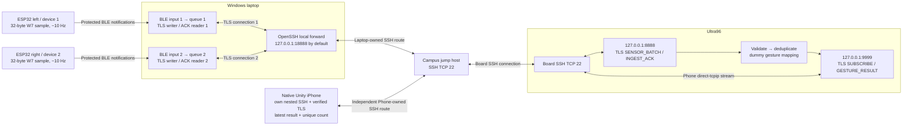

# Week 7 communication system: technical report

**Source baseline:** `79a8c0df1693e3b21d15e8b46ed351a12db1c610`, reviewed on **21 September 2026**. This report describes the implementation and evidence at that point. For executable setup, tests and the presentation script, use the companion [testing and demo guide](week7-testing-and-demo-guide.md). Relative links below point to the implementation; named functions and selected line anchors make the explanation traceable.

**Reading route:** start with [the system](#1-what-the-system-does), follow [one sample](#2-one-sample-from-generation-to-display), then study [the protocol](#3-the-protocol-byte-by-byte) and [implementation](#4-reading-the-implementation). Use [defaults and recovery](#5-defaults-resource-bounds-and-recovery), [security](#6-security-boundaries-and-credentials) and [physical evidence](#7-what-has-actually-been-demonstrated) to explain design choices. [The file map](#8-file-by-file-map), [professor questions](#9-questions-to-be-ready-to-answer) and [glossary](#10-short-glossary) are reference sections.

## 1. What the system does

Two ESP32 boards each produce a deterministic, eight-channel dummy sample approximately every 100 ms while their protected BLE sensor subscription is active. A Windows laptop receives both streams, validates the binary packets, and forwards each device's messages through its own TLS connection to the Ultra96. The board validates the messages, assigns a deterministic dummy gesture, acknowledges ingestion to the laptop, and sends gesture results to a subscribed iPhone. The actual iPhone application is the imported Unity app connected to a native Swift networking package.

The iPhone owns its SSH connection to the board, optionally through the campus jump host, and its TLS session inside that connection. Result data travels from the board to the iPhone without passing through the laptop's application. The laptop remains necessary for the ESP32-to-board ingestion path.

This demonstrates communication, identity tracking, bounded buffering, security checks and recovery. It does not demonstrate real sensor acquisition, calibration, a trained gesture classifier, or ARKit/camera correctness. `DUMMY inference` on the display is intentional: `seq % 4` selects `REST`, `FIST`, `OPEN`, or `POINT`; confidence is fixed at `1.0`.

### 1.1 Physical and logical topology



The diagram shows two independent client routes sharing the same network hosts. They do not share SSH authentication state or application sockets. VPN access, when needed, makes the campus route reachable; it is not an application message format.

| Endpoint | Owner and meaning |
|---|---|
| ESP32 BLE service `6e1c0001-7a45-4dc4-b678-3f2d5a9c1001` | Advertises the Week 7 GATT service. Both boards advertise `LTC-W7`; addresses and embedded device IDs distinguish them. |
| Laptop `127.0.0.1:18888` | Default local SSH listening port forwarding to board loopback `8888`. A run may select another unused local port, such as the documented `18889`; both tunnel and bridge must agree. |
| Board `127.0.0.1:8888` | TLS ingestion listener. Receives sensor messages and returns ingestion ACKs. |
| Board `127.0.0.1:9999` | TLS result listener. One current subscriber receives live results from both devices. |
| Jump host TCP 22 and board TCP 22 | SSH transport and authenticated forwarding. Board application ports remain loopback-only. |
| Phone internal SSH stream to board `127.0.0.1:9999` | The native app opens a `direct-tcpip` SSH channel; it needs no Phone TCP listening port. |
| `127.0.0.1:19999` in older guides | A separate Phone/local forward used by Python/iSH, generic C# or desktop test subscribers. It is not part of the native app's implementation. |

`127.0.0.1` always means “this machine.” The laptop's local address and the board's local address identify different network stacks. TLS authenticates the logical name `ultra96.week7.internal` even when a client connects to a local forward; the socket address is not used as a substitute for the certificate's server name.

The firmware's complete GATT interface is below. Each listed identifier has the suffix `-7a45-4dc4-b678-3f2d5a9c1001`; for example the sensor characteristic is `6e1c0005-7a45-4dc4-b678-3f2d5a9c1001`.

| UUID prefix | GATT role | Value/operation |
|---|---|---|
| `6e1c0001` | Service | Groups the five characteristics. |
| `6e1c0002` | Counter Notify | Four-byte little-endian diagnostic counter; used by the earlier counter receiver. |
| `6e1c0003` | MTU-control Write | Two-byte little-endian requested probe length. |
| `6e1c0004` | MTU-probe Notify | Requested-length diagnostic payload with byte `i` equal to `i % 256`. |
| `6e1c0005` | Sensor Notify | The 32-byte W7 sample used by the current bridge. |
| `6e1c0006` | Source-statistics Read | The 24-byte W7S1 snapshot used to audit a finite capture. |

### 1.2 What “parallel reception” means here

[`DualBridge.run`](../laptop/dual_bridge.py#L63) creates independent input and writer tasks for devices 1 and 2. Each `Bridge` owns its BLE client, raw inbox, tracker, source audit, TLS socket and ACK pipeline. A slow operation on one path does not require the other path to wait for that device's ACK before sending its own next sample.

These are concurrent asynchronous I/O paths in one Python event loop. `await` lets the loop run another ready task while the current task waits for BLE, network or a timer. This is not a claim of two Python CPU cores executing simultaneously, or two BLE radio transmissions occurring at the exact same instant. The useful claim is independent ownership and sustained progress for both streams during a common observation interval. They still share the Windows adapter, event loop, network and board resources.

## 2. One sample from generation to display

```mermaid
sequenceDiagram
    participant ESP as ESP32 device 1
    participant L as Windows Bridge 1
    participant U as Ultra96 ingestion :8888
    participant G as Ultra96 result :9999
    participant P as Native iPhone
    participant UI as Unity main thread
    P->>G: Own SSH route + verified TLS; SUBSCRIBE
    G-->>P: SUBSCRIBED
    L->>ESP: Protected source-statistics read (start)
    L->>ESP: Enable sensor notifications
    ESP-->>L: W7 binary packet: device, boot, seq, values
    Note over L: Callback copies bytes into finite per-device queue
    L->>U: TLS frame containing SENSOR_BATCH
    Note over U: Exact schema + dummy values + duplicate check
    U->>G: Queue live GESTURE_RESULT
    U-->>L: INGEST_ACK for that device/boot/seq
    G-->>P: GESTURE_RESULT
    Note over P: Validate; deduplicate; count; retain newest result
    UI->>P: Week7CopyDisplay(buffer, capacity)
    P-->>UI: Changed display text
    Note over UI: Update existing TextMeshPro label
    L->>ESP: Disable sensor notifications at normal stop
    L->>ESP: Protected source-statistics read (end)
    Note over L: Drain finite tail; reconcile source / receive / ACK counts
```

The ACK and result channels are separate. The board queues a result before writing its ingestion ACK, but task scheduling and two different network connections mean the Phone result may arrive before or after the laptop receives the ACK. The diagram is an explanation of causality, not a global timing guarantee.

1. **Generation:** the ESP32 checks connection, subscription, authentication and MTU. It allocates a sequence number, creates eight deterministic `int16` values, serializes 32 bytes and submits a BLE notification.
2. **Receipt:** the Windows BLE callback records a monotonic arrival time and copies the payload. It does not wait for network delivery or parse JSON.
3. **Validation:** a bridge writer decodes the binary packet, checks identity and dummy values, observes sequence continuity, and rejects retired-connection or stale data.
4. **Forwarding:** the packet becomes one `SENSOR_BATCH` JSON object, prefixed by its byte length and sent through TLS. A device can have up to 32 sent-but-unacknowledged messages in the default dual run.
5. **Board processing:** the board checks the exact schema and active session. A new trace identity produces one result; a recent duplicate receives a duplicate ACK without another result.
6. **Acknowledgement:** the bridge compares the ACK's version, type, session, device, boot and sequence against the oldest pending message. An unrelated ACK cannot silently retire that message.
7. **Result delivery:** the board's current subscriber receives live results through the Phone's independent TLS/SSH connection. No subscriber means the result is counted as disconnected and discarded.
8. **Display:** Swift validates the complete result and updates a thread-safe latest-value state. Unity polls through a C interface on its own main thread. The counter can increase for multiple validated results between rendered frames; the screen need not show every intermediate gesture.
9. **Evidence:** orderly stop obtains the final source snapshot, drains already accepted input and reports anomalies. A disconnect or incomplete snapshot prevents a clean audit even if the visible final counts look plausible.

## 3. The protocol, byte by byte

### 3.1 ESP32 sensor packet: exactly 32 bytes

[`week7_packet.h`](../firmware/esp32/include/week7_packet.h) writes bytes explicitly. [`common.sensor`](../common/sensor.py#L12) implements the matching Python representation:

```python
_PACKET = struct.Struct("<2sBBIII8h")
```

`<` selects little-endian byte order with standard sizes and no native padding. `2s` is two raw bytes, each `B` is one unsigned byte, each `I` is a four-byte unsigned integer, and `8h` is eight two-byte signed integers. Their sizes add to `2 + 1 + 1 + 4 + 4 + 4 + 16 = 32`.

| Byte offset | Size | Field | Meaning |
|---:|---:|---|---|
| 0–1 | 2 | Magic | ASCII `W7`; identifies this packet format. |
| 2 | 1 | Version | `1`. |
| 3 | 1 | `device_id` | `1` for left or `2` for right. |
| 4–7 | 4 | `boot_id` | Random `uint32` generated once at boot. |
| 8–11 | 4 | `seq` | Unsigned 32-bit sample sequence. |
| 12–15 | 4 | `uptime_ms` | Board-local `millis()` value at generation. |
| 16–31 | 16 | `values[0..7]` | Eight uncalibrated signed 16-bit channels, little-endian. |

There is no added application checksum or timestamp from a synchronized clock in this structure. BLE and the later secure transport provide their own transport protections; schema and deterministic-value checks detect application-level mismatches. `uptime_ms` is useful provenance, but one board's uptime cannot directly be subtracted from another machine's wall clock to obtain end-to-end latency.

The notification's ATT payload capacity is negotiated MTU minus three bytes. The 32-byte packet therefore requires ATT MTU at least **35**, checked by both firmware and laptop. The diagnostic MTU probe tests actual notification lengths; its payload is different from the sensor packet.

The sample formula is identical in C++ and Python:

```python
base = (seq % 2000) - 1000
return tuple(base + 10 * index for index in range(8))
```

`% 2000` repeats a known ramp; subtracting 1000 gives negative as well as positive values; `range(8)` creates channel indices 0 through 7; each channel is ten larger than the previous one. This makes byte-order and value corruption visible. `SensorPacket` accepts the full int16 representation, but the current bridge and board deliberately require these Week 7 dummy values. Replacing the generator with real sensor readings also requires changing that semantic validation and the inference contract.

### 3.2 Source-statistics packet: exactly 24 bytes

The protected **Read** characteristic ending in `0006` supplies a snapshot defined in [`week7_source_stats.h`](../firmware/esp32/include/week7_source_stats.h) and parsed by [`parse_source_stats`](../laptop/source_audit.py#L37).

| Byte offset | Size | Field |
|---:|---:|---|
| 0–3 | 4 | ASCII `W7S1` |
| 4 | 1 | Device ID |
| 5–7 | 3 | Reserved, must all be zero |
| 8–11 | 4 | Boot ID |
| 12–15 | 4 | Next sequence to allocate |
| 16–19 | 4 | Successful notification submissions |
| 20–23 | 4 | Failed notification submissions |

All four-byte numbers are little-endian unsigned integers. “Submitted” means the ESP-IDF notification API accepted the work; it does not itself prove laptop receipt. The firmware increments `nextSequence` before submission, so a submission failure cannot disappear by reusing the same sequence. The start snapshot is read before subscribing, and the end snapshot after a successful stop-notify. Both are copied while the firmware's connection-state mutex is held.

The source counter concerns samples generated while the notification gates pass. The firmware does not maintain an accumulating queue of samples for disconnected periods. A quiet interval with no bridge subscribed can therefore leave adjacent sequence intervals without claiming that missing wall-clock periods were sampled and replayed.

### 3.3 JSON frames over TLS

The binary sample is converted to JSON for the board interface. TCP/TLS supplies a byte stream, so a single read can contain half a message or several messages. [`common.wire`](../common/wire.py#L35) solves this with a four-byte **big-endian** length followed by exactly that many UTF-8 JSON bytes:

```python
body = json.dumps(message, ensure_ascii=False, allow_nan=False,
                  separators=(",", ":")).encode("utf-8")
return struct.pack("!I", len(body)) + body
```

`json.dumps` serializes the object; compact separators omit optional spaces; `allow_nan=False` excludes invalid nonfinite numbers. `encode` turns characters into bytes. `!I` encodes the byte count in network byte order. The prefix measures UTF-8 bytes, not characters, and excludes the prefix itself. BLE payload fields use little-endian order while the network frame prefix uses big-endian order; they are distinct formats.

Bodies must be **1–16,384 bytes** and must be JSON objects. Duplicate keys, malformed UTF-8, nonfinite numbers, wrong schemas, missing/extra fields and invalid field types are rejected. Reading uses exact lengths, not “whatever arrived in one socket read.” The native `FrameDecoder` retains at most one unfinished frame (16,388 bytes including the prefix) and refuses to resynchronize after invalid framing.

[`ultra96.protocol`](../ultra96/protocol.py) defines these complete message types:

| Type | Direction | Fields in addition to `v`, `type`, `session_id` |
|---|---|---|
| `SENSOR_BATCH` | Laptop → board ingestion | `device_id`, `boot_id`, `seq`, `uptime_ms`, `values` |
| `INGEST_ACK` | Board ingestion → laptop | `device_id`, `boot_id`, `seq`, `status` (`accepted` or `duplicate`) |
| `SUBSCRIBE` | Phone → board result port | None |
| `SUBSCRIBED` | Board result port → Phone | None |
| `GESTURE_RESULT` | Board → Phone | `device_id`, `boot_id`, `seq`, `result_id`, `gesture`, `confidence` |

Version is integer `1`; device ID is integer 1 or 2; boot and sequence are uint32. A session is a nonempty string of at most 128 characters with no controls or invalid surrogate code points. It separates configured runs logically; it is not a password or authorization token.

### 3.4 A complete worked example

For device 1, boot `305419896` (`0x12345678`), sequence 42 and uptime 4200 ms, the packet has values `[-958,-948,-938,-928,-918,-908,-898,-888]`. The selected gesture is `OPEN`, because `42 % 4 == 2`.

Its 32 bytes, grouped by field for readability, are:

```text
57 37 | 01 | 01 | 78 56 34 12 | 2a 00 00 00 | 68 10 00 00 |
42 fc | 4c fc | 56 fc | 60 fc | 6a fc | 74 fc | 7e fc | 88 fc
```

`57 37` is ASCII `W7`; `78 56 34 12` is the little-endian boot ID; `2a 00 00 00` is sequence 42; and signed little-endian `42 fc` is the first channel, −958. The bars and line break are annotations, not transmitted bytes.

```json
{"v":1,"type":"SENSOR_BATCH","session_id":"week7-demo","device_id":1,"boot_id":305419896,"seq":42,"uptime_ms":4200,"values":[-958,-948,-938,-928,-918,-908,-898,-888]}
```

The board accepts this unique trace and emits these messages on different connections:

```json
{"v":1,"type":"INGEST_ACK","session_id":"week7-demo","device_id":1,"boot_id":305419896,"seq":42,"status":"accepted"}
```

```json
{"v":1,"type":"GESTURE_RESULT","session_id":"week7-demo","device_id":1,"boot_id":305419896,"seq":42,"result_id":"1:305419896:42","gesture":"OPEN","confidence":1.0}
```

Before receiving results the Phone exchanges:

```json
{"v":1,"type":"SUBSCRIBE","session_id":"week7-demo"}
{"v":1,"type":"SUBSCRIBED","session_id":"week7-demo"}
```

These are readable message bodies. On the wire **each object has its own length prefix**; the last example is not a newline-delimited protocol. Key order is not significant. The same trace sent again while retained in the board's recent-ID cache yields `status: "duplicate"` and no second gesture result.

## 4. Reading the implementation

### 4.1 ESP32: startup, callbacks and sample generation

[`setup`](../firmware/esp32/src/main.cpp#L328) runs once. It initializes serial output, generates a boot ID, creates a mutex, configures BLE security, registers callback handlers, creates characteristics and starts advertising. [`loop`](../firmware/esp32/src/main.cpp#L369) repeatedly handles controlled bond erasure, advertising restart, timed notifications and status reporting.

`ServerCallbacks` records the active peer and MTU, resets subscriptions on disconnect, and requests encrypted MITM-protected pairing. `SecurityCallbacks` accepts only authentication satisfying Secure Connections, MITM protection and bonding. `CccdCallbacks` reads notification subscription flags. `SourceStatsCallbacks` returns a coherent source snapshot. A mutex prevents asynchronous stack callbacks from changing connection state halfway through a sample submission.

The firmware's sensor section contains this core sequence:

```cpp
const uint32_t sampleSequence = week7::allocateSampleSequence(sensorStats);
const bool serialized = week7::serializeDummyPacket(
    payload, sizeof(payload), kDeviceId, bootId, sampleSequence, nowMs);
const bool submitted = serialized &&
    submitNotification(sensorCharacteristic, payload, sizeof(payload));
week7::recordSensorSubmission(sensorStats, submitted);
```

The first line allocates an identity before attempting transmission. `const` prevents accidental reassignment of a local result. The serializer receives the buffer and its capacity, so it can reject an invalid destination. `&&` calls the notification API only if serialization succeeded. The final line increments either successful or failed source submission counts. The `false` confirmation argument inside `submitNotification` selects a notification, not an application-confirmed BLE indication.

The four headers isolate portable logic from ESP hardware APIs. This allows host C++ tests to check serialization, security policy and callback-event parsing without flashing a board. In particular, `week7_gatts_control.h` checks that an event really is a WRITE before accessing the write member of the ESP-IDF event union; another event's bytes must not be interpreted as a write request.

`platformio.ini` builds the same source with `WEEK7_DEVICE_ID=1` or `2`. `firebeetle32-unprotected-diagnostic` is explicitly diagnostic. Its output cannot establish the protected BLE claim. The standard builds suppress framework logs that might otherwise print a pairing passkey. Pairing secrets belong only in the immediate interactive exchange, never in saved demonstration logs.

### 4.2 Laptop: keep the callback short, bound the work

[`RawInbox`](../laptop/bridge.py#L73) is a lock-protected deque. It stores payload bytes, a monotonic arrival time and a connection generation. A full queue evicts the oldest item and increments a drop counter. It also coalesces cross-thread wakeups: callbacks do not accumulate an unbounded number of event-loop notifications even if they arrive faster than the writer can run.

```python
if len(self._items) == self._capacity:
    self._items.popleft()
    self.dropped += 1
self._items.append(Received(bytes(data), received_at, generation))
```

`popleft` removes the oldest item. `bytes(data)` takes a stable copy of callback memory. `Received` groups the payload with its age and connection ownership. Dropping oldest data favors the current live state, and the counter makes the loss visible.

[`Bridge.ble_loop`](../laptop/bridge.py#L600) scans for the exact service and selected address, connects through `make_ble_client`, checks the sensor characteristic and MTU, requires the Windows authenticated bond, obtains the starting source snapshot, and subscribes. `ble_connection.py` disables cached Windows service discovery to avoid reusing stale MTU/service state after pairing. Windows pairing itself is an explicit helper, rather than a hidden password/pairing prompt inside every receive attempt.

[`_prepare_item`](../laptop/bridge.py#L325) decodes a packet and records malformed, wrong-identity, duplicate, out-of-order, new-boot and gap conditions. The stream tracker uses modulo-32-bit subtraction to handle sequence wrap. A generation identifies one BLE connection attempt: a callback arriving late from an old connection cannot inject data into the new connection's queue. Freshness is checked after receipt and again after potentially slow TLS connection setup.

The ACK pipeline in [`_pipeline_epoch`](../laptop/bridge.py#L458) separates sending from reading acknowledgements:

```python
slots = asyncio.Semaphore(self.config.ack_window)
# Sender: acquire a slot, validate and send a frame, append it to pending.
# Receiver: validate the oldest pending ACK, remove it, release a slot.
```

The semaphore counts free in-flight positions. With window 32, waiting for an earlier ACK does not prevent the sender from using another free position. There remains one FIFO sender and one ACK reader per TLS connection; multiple tasks do not concurrently consume the same stream. Each pending frame's five-second ACK deadline starts at its own send attempt, so queued ACK checks cannot give an old message a fresh timeout every time it reaches the head.

`BridgeConfig.ack_window` defaults to **1** for the original single bridge API, and `writer_loop` selects its legacy one-message-at-a-time path in that case. The single-device CLI has no `--ack-window` option and uses that default. The current **dual CLI defaults to 32** and accepts 1–64. This distinction matters when explaining older results or comparing throughput. Window size does not alter the wire format or generate extra data.

On transport failure, the connection epoch is retired: pending sends are accounted, tasks are cancelled and observed, and the transport is closed/aborted. A message whose write may have reached the board is marked ambiguous and is not replayed automatically. Cleanup failures remain visible; they cannot be turned into clean completion by starting another overlapping owner.

### 4.3 Dual coordination and evidence

[`DualBridge`](../laptop/dual_bridge.py#L21) rejects identical physical addresses, incorrect expected identities, missing source auditing and different session IDs. It starts both pipelines, waits for both inputs to become active, then begins a common timed observation. Normal shutdown signals both producers, performs stop-notify and source snapshot work independently, allows a bounded drain, retires writers, closes transports and creates the report.

[`SourceAudit.report`](../laptop/source_audit.py#L149) calculates modulo-32-bit deltas for a matching boot:

```text
generated = end.next_seq - start.next_seq  (modulo 2^32)
source_consistent = generated == submitted + failures
```

A clean source audit requires complete snapshots, the same boot, positive generation, no source failures, generated = received = ACKed, contiguous sequence endpoints and zero identity, interruption or snapshot anomalies. Checking only `last_seq - first_seq` among received packets would miss a lost first or last packet; the source snapshots provide those boundaries. The audit retains counters and endpoints instead of a growing list, so its memory use does not grow with capture duration.

The dual report adds sustained coverage, maximum silence, protected-input status, absence of unfinished work and absence of listed anomalies. Coverage must reach at least 90% of elapsed common time × configured rate, and the maximum observation silence must not exceed freshness. This accepts ordinary startup/boundary scheduling variation while detecting a stream that stopped progressing. A clean report is a defined capture result, not proof of zero loss under every future network condition.

[`reporting.py`](../laptop/reporting.py) reserves a new report path before capture with an `incomplete` marker. Finalization validates ownership, writes and flushes a temporary file, then atomically replaces the reservation. It refuses an existing path. This preserves evidence that a crashed run never completed and avoids overwriting another run's report. Revision and UTC metadata identify the sender checkout and capture, while monotonic clocks drive local age and timeout decisions.

### 4.4 Ultra96: validate, acknowledge, and fan in two devices

[`Week7Server`](../ultra96/server.py#L85) owns two loopback TLS listeners and asynchronous client tasks. The ingest listener can accept the two device connections while the result listener has one current subscriber. Listener failure is surfaced to the service host instead of silently leaving a process alive with a dead socket. Expected connection/protocol failures are counted and cleaned up.

[`_ingest`](../ultra96/server.py#L232) validates `SENSOR_BATCH`, remembers the latest 4,096 `(device_id, boot_id, seq)` identities in insertion order, constructs the result and writes the correlated ACK. Because the server is configured for one validated session, that trace tuple is interpreted within that session. Deduplication is finite and in-memory; restarting the server or aging out a trace removes that protection for the old identity.

```python
result.update(result_id="{}:{}:{}".format(*trace),
              gesture=GESTURES[message["seq"] % 4], confidence=1.0)
```

`format(*trace)` joins the device, boot and sequence fields with colons. `% 4` chooses an index from `("REST", "FIST", "OPEN", "POINT")`. The result contains no raw channel array because the Phone interface displays the inference output and trace identity.

[`_gateway`](../ultra96/server.py#L260) accepts a valid `SUBSCRIBE`, claims a new subscriber generation and responds `SUBSCRIBED`. A newly subscribed client replaces and closes the previous owner. This is why starting a Phone simulator while the physical app is connected interferes with that app. After subscription the client must be receive-only; EOF or unexpected extra input ends ownership.

`ResultQueue` holds at most 32 results. Overflow drops oldest, and dequeue/write checks expire results at two seconds. [`_send_results`](../ultra96/server.py#L317) bounds the write by the remaining local age budget. A socket write completion means the server transport accepted/drained the frame; it does **not** prove that the iPhone validated or displayed it. Bytes already handed to TCP/TLS cannot be retracted if they later arrive late.

[`BoundedEventLog`](../ultra96/diagnostics.py) observes safe trace and subscriber events without doing JSON/disk work on the forwarding loop. A bounded queue feeds a background writer. Its final status reports overflow, dropped events, file cap, callback/writer errors, completion and an event-file hash. That makes a diagnostic ledger auditable; a truncated or incomplete logger cannot be represented as complete evidence. It explicitly records `phone_receipt_confirmed=False` for server write events.

### 4.5 Actual native iPhone client

The Swift package has three layers:

| Layer | Responsibility |
|---|---|
| `Week7Core` | Exact message validation, stream framing and thread-safe display state. No UIKit or SSH connection ownership. |
| `Week7Transport` | SSH route, host-key verification, password lifetime, TLS verification, subscription, deadlines and retry. |
| `Week7Bridge` | UIKit setup, public settings, foreground-session ownership and the C functions called by Unity. |

[`Week7Client.connect`](../ios-visualizer/Week7Native/Sources/Week7Transport/Week7Client.swift#L74) creates an outer SSH client to the jump host; opens a direct TCP/IP channel to board TCP 22; runs a second SSH client inside it; then opens a channel to board loopback TCP 9999. TLS runs inside that final stream, using the imported enrolled CA and the fixed server name. Direct mode omits the jump layer but still uses board SSH and the same result service. Both SSH host keys are pinned.

The networking code uses a shared SwiftNIO event-loop group with one thread. `ConnectionAttempt` owns all allocated root channels, including connection candidates, so cancellation closes resources even if a handshake has not finished. An epoch rejects callbacks from a stopped client. `CredentialVault` allows deferred authentication callbacks to discover that credentials were revoked instead of retaining old route passwords indefinitely.

[`Subscriber.channelRead`](../ios-visualizer/Week7Native/Sources/Week7Transport/Subscriber.swift#L37) decodes stream fragments and requires `SUBSCRIBED` before accepting results. Its timing rule is precise:

```swift
if !partialFrame && subscribed { arm(context, delay: options.frameTimeout) }
// Decode incoming bytes into complete frames.
partialFrame = decoder.hasPartialFrame
if !partialFrame { disarm() }
```

The first bytes of a new result start a five-second frame budget. Completing that frame disarms the timer when no partial frame remains. More fragments of the same incomplete frame do not extend its budget. A subsequent partial frame coalesced into the same read receives its own budget. **A healthy subscribed connection with no incomplete frame can remain idle indefinitely.** Five seconds is not a clean-idle timeout. Setup through `SUBSCRIBED` remains bounded by the connection deadline and response-frame timeout.

`Week7Protocol.result` checks the exact fields, session, uint32 identities, trace string, gesture mapping and confidence. Its small flat JSON parser preserves the distinction between an integer token such as `42` and a floating token such as `42.0`, rejects duplicate decoded keys, and handles escaped Unicode carefully. A malformed complete message is not treated as valid merely because a general JSON decoder accepted it.

[`DisplayState.accept`](../ios-visualizer/Week7Native/Sources/Week7Core/DisplayState.swift#L60) rejects old generations, invalid/old arrival times and recently seen IDs. It counts each accepted unique result but stores only the newest result for display. The last 4,096 IDs are retained across transport reconnects within one explicit Connect session. Explicit Connect starts a new generation and resets its count/deduplication history. `snapshot` clears a result after two seconds of local inactivity without decrementing the received count.

The native app has no result timestamp from the source in its chosen schema. Its two-second display freshness means “recently accepted locally,” not measured source-to-display latency. The latest-value mailbox avoids UI backlog while still counting every accepted unique callback.

### 4.6 How Swift reaches the Unity scene

[`DisplayMailbox.swift`](../ios-visualizer/Week7Native/Sources/Week7Bridge/DisplayMailbox.swift#L33) exports stable C-callable symbols:

```swift
@_cdecl("Week7CopyDisplay")
public func week7CopyDisplay(_ buffer: UnsafeMutablePointer<CChar>?,
                            _ capacity: Int32) -> Int32 {
    sharedMailbox.copy(into: buffer, capacity: capacity)
}
```

`@_cdecl` gives the function a C symbol name that generated C++ can link. The caller supplies a buffer and capacity; the callee returns a byte count and writes a terminating zero only when the changed text fits. `Week7Start` installs setup/session support; `Week7Stop` immediately invalidates the state and schedules UIKit teardown.

[`patch_export.py`](../ios-visualizer/tools/patch_export.py) guards exact imported method signatures and source hashes before modifying the generated receiver in [`Assembly-CSharp.cpp`](../ios-visualizer/xcode-export/Il2CppOutputProject/Source/il2cppOutput/Assembly-CSharp.cpp). Its replacements connect `Start` to `Week7Start`, `Update` to `Week7CopyDisplay`, and `OnDestroy` to `Week7Stop`; they disable the old `ListenLoop`. The update uses a 2,048-byte stack buffer and changes the existing TextMeshPro label on Unity's thread. Native networking callbacks never manipulate retained Unity managed pointers. The patch also enlarges the imported label rectangle and enables appropriate text sizing so the status, trace and count fit.

[`configure_xcode.py`](../ios-visualizer/tools/configure_xcode.py) links the local `Week7Native` static library into `UnityFramework`, validates the project reference graph, updates the app metadata and guards inherited symbol uploads. It does not choose the user's signing team. Reapplication is designed to be idempotent; an unknown export needs a reviewed adaptation, not blind text replacement.

The original [`reference/TlsDataReceiver.cs`](../ios-visualizer/reference/TlsDataReceiver.cs) is retained as import reference. Editing it does not rebuild or change the checked-in generated export. Likewise, [`phone/unity/Week7PhoneReceiver.cs`](../phone/unity/Week7PhoneReceiver.cs) is a separate generic/Android-oriented C# integration requiring an independently running Phone SSH forward. Neither is the actual native iPhone network owner described above.

## 5. Defaults, resource bounds and recovery

| Setting | Current value and scope | Where defined |
|---|---|---|
| Firmware sample interval | 100 ms, approximately 10 Hz per subscribed ESP32 | `main.cpp`, `kNotificationIntervalMs` |
| Source identity | Left 1; right 2; a new random boot ID at firmware startup | `platformio.ini`, `setup()` |
| Sensor minimum MTU | 35 | `week7_security.h`, `Bridge.ble_loop` |
| Dual capture duration | 600 s after both inputs become active | `dual_bridge._parser` |
| Raw queue | 64 per device by default; configurable 1–4,096 | `BridgeConfig`, dual CLI |
| ACK window | 32 per device for dual CLI; accepted range 1–64; legacy API default 1 | `dual_bridge._parser`, `BridgeConfig` |
| Laptop freshness | 2 s from BLE callback receipt | `BridgeConfig` |
| Laptop ACK/I/O timeout | 5 s; write can use the smaller remaining freshness budget | `BridgeConfig`, pipeline sender/receiver |
| BLE scan/connect timeout | 8 s / 20 s defaults | `BridgeConfig` |
| Dual startup/drain/shutdown | 30 s / 10 s / 25 s defaults | `DualBridge` |
| Board result queue | 32 messages for the current subscriber | `ResultQueue` |
| Board result age | 2 s at dequeue and before/during write | `ResultQueue`, `_send_results` |
| Board recent trace cache | 4,096 entries, memory only | `_ingest` |
| JSON body limit | 16,384 bytes | `common.wire`, Swift `Week7Protocol` |
| Native connection deadline | 10 s through subscription setup | `TransportOptions`, `Week7Client` |
| Native partial frame deadline | 5 s, no subscribed clean-idle deadline | `TransportOptions`, `Subscriber` |
| Native retry delay | 0.5 s doubling to 5 s; reset by a valid result | `Week7Client` |
| Native display freshness/cache | 2 s local age / last 4,096 result IDs | `DisplayState` |
| Board diagnostic log | Default 2,048 queued events and 50 MiB file cap; bounded close attempt 2 s | `BoundedEventLog`, server host |

Bounded queues prevent runaway memory growth but permit explicit drops. A 64-slot queue is not permission to send 6.4 seconds of old data at 10 Hz: the two-second freshness check still applies. Once a connection has been disrupted, this system favors current live state over reconstructing history.

| Failure or action | Implemented behavior | What the operator/evidence should show |
|---|---|---|
| BLE malformed packet or wrong device | Reject/count it; no valid forwarded sample for that item | Malformed/identity counters; clean audit fails. |
| BLE disconnect/reboot | Retire that input generation; reconnect with bounded backoff; preserve interruption/boot evidence | Source audit cannot silently span a new boot as one clean capture. |
| TLS loss or wrong ACK | Retire that transport epoch; account ambiguous writes; do not replay them | Transport/ACK/ambiguity counters explain incomplete delivery. |
| Queue overflow or stale item | Drop/count according to queue or freshness policy | A clean capture requires zero such anomalies. |
| No Phone subscriber | Board accepts sensor input and returns ACKs; counts/discards the corresponding result | ACK success alone can coexist with missing Phone results. |
| New subscriber | Replace the previous owner | Subscriber generation/replace event; stop competing simulators before the physical demo. |
| Native foreground transport EOF/error | Retry eligible transient failures with capped backoff | New route and subscription within the same explicit session when recovery succeeds. |
| Wrong credentials, SSH pin, CA, certificate or schema | Native terminal verification/authentication failures require corrected setup and explicit retry | Clear failure status; no insecure fallback or automatic repeated password offers. |
| App loses active state or Phone locks | `willResignActive` stops the native client, revokes credentials and clears live state | Return to foreground and tap Connect with credentials again. |
| No new complete results on a healthy native connection | Keep subscription; clear old displayed result after local age limit | `Subscribed` may coexist with `No live result`; the count is retained. |
| Silent network blackhole | No native SSH/application heartbeat has been added | Detection may wait for the OS to report failure. No fixed detection bound is claimed. |

The laptop OpenSSH helper separately configures `ServerAliveInterval=15` and `ServerAliveCountMax=3`. Those settings do not give the native Phone the same heartbeat behavior: it uses a different SSH implementation and connection owner.

## 6. Security boundaries and credentials

Protected BLE requires Secure Connections, MITM protection and bonding, with encrypted characteristic/descriptor permissions and a runtime notification gate. Windows checks an `EncryptionAndAuthentication` bond. The unprotected diagnostic build and flag intentionally bypass part of that evidence and must remain labelled diagnostic.

The laptop's SSH helper binds only loopback and uses strict known-host verification for both hops. Its supervised mode uses existing key/agent authentication and terminates only the child it owns. The native Phone compares both SSH host keys with enrolled public values, then verifies the board TLS certificate using the imported enrolled CA, hostname and validity. TLS minimum version is 1.2; the recorded physical laptop tunnel used TLS 1.3. Neither version is a promise that every platform/run negotiates exactly 1.3.

TLS here authenticates the server; the code does not configure TLS client certificates. SSH credentials authenticate access to the forwarding route, while the board server additionally checks the configured protocol session. `session_id` is public context, not an access-control secret. Loopback binding narrows exposure but does not imply that other authorized processes on the board cannot connect to the local service.

The Phone persists only public configuration/usernames and a public CA certificate. Setup rejects a private-key import or unrelated authority. Passwords stay in UI/transport memory, are cleared from the form after connecting, and are revoked when disconnecting/pausing. This describes application ownership and lifetime, not a guarantee of forensic zeroization of every temporary string inside the runtime.

Public host-key pins and CA fingerprints are safe to describe as trust configuration; password values, private key contents, pairing codes and local credential files are not part of reports or logs. `generate_week7_pki.py` is a local provisioning/test helper that refuses a Git/worktree output directory and preexisting nonempty key directory. It is not an instruction to replace the enrolled authority for a running demo; a new CA would require independently verified enrollment changes in the app.

## 7. What has actually been demonstrated

The [21 September post-update physical report](phone-post-update-test-2026-09-21.md) is the current acceptance evidence for the protected dual-ESP → Windows → Ultra96 → native Unity iPhone path. It records generated dummy inputs at 10 Hz per board, exact source/receive/ACK accounting, separately finalized board event ledgers, and operator-reported aggregate Phone counts.

| Post-update capture | Source/BLE/ACK total | Both-device stage-progress bins | Operator Phone count | Exact board write completions |
|---|---:|---:|---:|---:|
| Baseline, 60 s | 1,202 | 59/59 | 1,202 | 1,202 |
| Resume after quiet interval, 60 s | 1,206 | 59/59 | +1,206; cumulative 2,408 | 1,206 |
| Manual recovery after requested VPN cycle, 30 s | 621 | 30/30 | 621 | 621 |
| After lock/unlock and explicit Connect, 600 s | 12,003 | 600/600 | 12,003 | 12,003 |
| **Total** | **15,032** | — | **15,032 across session counts/increments** | **15,032** |

The baseline and resume used one board-observed subscriber generation across **129.286175 seconds** between the last baseline and first resume write. The ledger had no replacement, disconnect, no-subscriber result, queue loss, stale drop or send failure during those captures. The operator did not independently record every instant of foreground/status behavior; the continuity claim rests on the board's connection events and the reported aggregate counts.

The four clean source captures retained the same two boot IDs and adjacent per-device sequence intervals. The final ten-minute capture showed progress for both devices in all 600 audited one-second bins. The modest difference between nominal rate × duration and total packets reflects capture subscription/setup/stop boundaries as well as the common observation window; source snapshots establish the actual finite sample totals.

Evidence layers must be stated separately:

| Evidence | Supports | Does not establish by itself |
|---|---|---|
| ESP source snapshots and ordered source audit | Generated/submitted interval and full BLE/ACK reconciliation for that capture | Phone receipt. |
| Correlated ingestion ACK | Board accepted or recognized that trace | Board-to-Phone delivery. |
| Complete board event ledger | Exact accepted IDs and socket-write fates, subscriber ownership and continuity | Per-ID Phone validation or display. |
| Operator Phone count | Aggregate accepted unique count as shown by the app | A saved Phone identity ledger or exact end-to-end latency. |
| Local automated tests | Reproducible behavior under their simulated/local peer conditions | Protected physical radio or campus/VPN behavior. |

An earlier **109-result Phone shortfall remains unexplained**. A separate pre-update idle test lost **16 results while no subscriber was present**, reproducing the old idle-timeout behavior. The passing retest does not erase either historical failure. See [recovery evidence](phone-recovery-test-2026-09-21.md) and the [post-update report](phone-post-update-test-2026-09-21.md) for their relationship.

The VPN/lock recovery evidence used explicit Connect after pause. It supports manual foreground recovery, not automatic background reception. Results produced with no subscriber are not replayed. No universal perfect-delivery or outage-lossless claim is justified. The installed updated app's provenance is the operator's report; the Windows-led retest did not extract an app revision or collect a fresh Apple build/test log. Real sensors, model accuracy and ARKit remain outside these transport checks.

## 8. File-by-file map

The baseline has 3,633 tracked files: 154 outside the imported Xcode export and 3,479 inside it. This section names the authored runtime, helper, configuration and test files individually, and groups generated/vendor trees by purpose. The two new reports and their writing plan are documentation additions after that count. An imported generated runtime is useful build input, but thousands of generated bindings are not thousands of independently authored communication modules.

### 8.1 Shared protocol and firmware

| File | What its code/configuration means |
|---|---|
| [common/__init__.py](../common/__init__.py) | Python package marker for shared imports. |
| [common/sensor.py](../common/sensor.py) | Immutable validated `SensorPacket`, 32-byte encode/decode, deterministic channels and sensor-to-JSON conversion. |
| [common/wire.py](../common/wire.py) | Strict UTF-8 JSON-object codec, length prefix, frame limit and bounded stream reads/writes. |
| [common/tls.py](../common/tls.py) | Verified TLS client/server contexts and the logical server name. |
| [firmware/esp32/platformio.ini](../firmware/esp32/platformio.ini) | Board/framework selection, serial speed, logging suppression, left/right and diagnostic build definitions. |
| [firmware/esp32/src/main.cpp](../firmware/esp32/src/main.cpp) | Hardware initialization, BLE services/security/callbacks, 10 Hz dummy generation, source counters, diagnostic probe and controlled bond reset. |
| [week7_packet.h](../firmware/esp32/include/week7_packet.h) | Explicit portable byte serialization and dummy-value formula. |
| [week7_source_stats.h](../firmware/esp32/include/week7_source_stats.h) | Allocate sample IDs, count successful/failed submissions and serialize source snapshots. |
| [week7_security.h](../firmware/esp32/include/week7_security.h) | Portable authentication-bit, notification-gate and minimum-MTU policy. |
| [week7_gatts_control.h](../firmware/esp32/include/week7_gatts_control.h) | Safely distinguish and parse a two-byte MTU-control write from other callback-union events. |
| [host_packet.cpp](../firmware/esp32/test/host_packet.cpp) | Host C++ driver checking packet serialization, security policy and minimum sensor MTU; Python tests compare output against cross-language fixtures. |
| [host_source_stats.cpp](../firmware/esp32/test/host_source_stats.cpp) | Host checks for source allocation, submission accounting, serialization and wrap behavior. |
| [host_events.cpp](../firmware/esp32/test/host_events.cpp) | Host checks for event-union guards and malformed MTU-control write parsing. |

### 8.2 Laptop and board

| File | What its code means |
|---|---|
| [laptop/__init__.py](../laptop/__init__.py) | Makes laptop modules importable and runnable with `python -m`. |
| [laptop/requirements.txt](../laptop/requirements.txt) | Pins Bleak `3.0.1`, the host BLE library used by the bridge. |
| [laptop/bridge.py](../laptop/bridge.py) | One device's queue, binary validation, trace tracking, TLS/ACK pipeline, BLE lifecycle, dummy test input, metrics and single-device CLI. |
| [laptop/dual_bridge.py](../laptop/dual_bridge.py) | Owns two bridges, the common observation, bounded stop/drain, progress reporting and final dual-capture verdict. |
| [laptop/source_audit.py](../laptop/source_audit.py) | Parses protected `W7S1` snapshots and reconciles source, receive and ACK sequences in constant memory. |
| [laptop/reporting.py](../laptop/reporting.py) | Exclusive incomplete report reservation, atomic finalization and local Git revision lookup. |
| [laptop/ble_connection.py](../laptop/ble_connection.py) | Constructs Bleak clients with fresh Windows GATT discovery. |
| [laptop/windows_pairing.py](../laptop/windows_pairing.py) | Interactive authenticated Windows pairing and protection-level checks; validates PIN syntax without persisting the code. |
| [laptop/bounded_telemetry_queue.py](../laptop/bounded_telemetry_queue.py) | Retained/tested generic finite drop-oldest queue groundwork. Current live and diagnostic receivers use their own inbox implementations; this module is imported by its tests. |
| [laptop/ble_counter_receiver.py](../laptop/ble_counter_receiver.py) | Earlier four-byte counter-characteristic diagnostic: continuity, reconnect, duration/target limits and safe cleanup. Not the 32-byte sensor bridge. |
| [laptop/mtu_probe.py](../laptop/mtu_probe.py) | Requests deterministic notification lengths through the probe characteristics and checks what Windows actually receives. |
| [laptop/phone_simulator.py](../laptop/phone_simulator.py) | Desktop TLS result subscriber for rehearsal; using it on the live result service replaces the Phone subscriber. |
| [ultra96/__init__.py](../ultra96/__init__.py) | Python package marker for the board service. |
| [ultra96/protocol.py](../ultra96/protocol.py) | Exact schemas, allowed session/number values, dummy-value and gesture validation, trace extraction. |
| [ultra96/server.py](../ultra96/server.py) | Two loopback TLS listeners; ingestion/dedup/ACK; sole live subscriber; bounded result queue; ownership/accept/shutdown handling. |
| [ultra96/diagnostics.py](../ultra96/diagnostics.py) | Allowlisted nonblocking observer, background bounded JSONL ledger, final completeness receipt and hash. |

### 8.3 Native iOS implementation and build helpers

All source paths in this table are under `ios-visualizer/`.

| File | What its code/configuration means |
|---|---|
| [Week7Native/Package.swift](../ios-visualizer/Week7Native/Package.swift) | Swift 5.10 package; iOS 15/macOS 13 minimums; three implementation targets, three test targets and static `Week7Native` product. Exact direct pins: NIO 2.102.0, NIOSSH 0.15.0, NIOSSL 2.37.4, Swift Crypto 4.5.2. |
| [Week7Native/Package.resolved](../ios-visualizer/Week7Native/Package.resolved) | Resolved dependency versions/revisions for repeatable package resolution; not application logic. |
| [Week7Core/Protocol.swift](../ios-visualizer/Week7Native/Sources/Week7Core/Protocol.swift) | Subscribe encoder, strict result/schema parser and bounded incremental frame decoder. |
| [Week7Core/DisplayState.swift](../ios-visualizer/Week7Native/Sources/Week7Core/DisplayState.swift) | Locked latest result, accepted unique count, bounded deduplication, generation checks and two-second local expiry. |
| [Week7Transport/SSHRoute.swift](../ios-visualizer/Week7Native/Sources/Week7Transport/SSHRoute.swift) | Route settings, fixed app-facing ports, timeout/retry options and user-readable failure categories. |
| [Week7Transport/Credentials.swift](../ios-visualizer/Week7Native/Sources/Week7Transport/Credentials.swift) | Revocable password vault and a separate password-free endpoint structure for async captures. |
| [Week7Transport/Trust.swift](../ios-visualizer/Week7Native/Sources/Week7Transport/Trust.swift) | Exact SSH host-key comparison, one credential offer per hop/attempt, and conversion between SSH channel data and stream bytes. |
| [Week7Transport/Subscriber.swift](../ios-visualizer/Week7Native/Sources/Week7Transport/Subscriber.swift) | TLS-handshake-triggered subscribe, frame processing and response/partial-frame deadlines without a clean-idle timeout. |
| [Week7Transport/Week7Client.swift](../ios-visualizer/Week7Native/Sources/Week7Transport/Week7Client.swift) | Owns nested SSH/TLS attempts, channels, callback epochs, cancellation, terminal failures and transient retries. |
| [Week7Bridge/Configuration.swift](../ios-visualizer/Week7Native/Sources/Week7Bridge/Configuration.swift) | Public enrolled endpoints/trust, username validation, CA import/fingerprint check and password-free settings storage. |
| [Week7Bridge/SetupViewController.swift](../ios-visualizer/Week7Native/Sources/Week7Bridge/SetupViewController.swift) | Native setup form, public certificate picker, password visibility/clearing, validation, Connect and Disconnect actions. |
| [Week7Bridge/IntegrationController.swift](../ios-visualizer/Week7Native/Sources/Week7Bridge/IntegrationController.swift) | Main-thread app integration, setup button, explicit session creation and pause/disconnect cleanup. |
| [Week7Bridge/DisplayMailbox.swift](../ios-visualizer/Week7Native/Sources/Week7Bridge/DisplayMailbox.swift) | Changed-text-only bounded C buffer copy and exported `Week7Start`, `Week7CopyDisplay`, `Week7Stop` symbols. |
| [tools/patch_export.py](../ios-visualizer/tools/patch_export.py) | Hash/signature-guarded transformation of the imported generated receiver and display layout; rejects unknown edited exports. |
| [tools/configure_xcode.py](../ios-visualizer/tools/configure_xcode.py) | Validates/link-wires the Swift library into UnityFramework, changes metadata, clears inherited team/token settings and guards uploads. |
| [verify-import.py](../ios-visualizer/verify-import.py) | Verifies original imported files against the manifest; intentional integration modifications are not expected to match the original import byte-for-byte. |
| [import-manifest.json](../ios-visualizer/import-manifest.json) | Original sanitized import provenance/hashes; preserved instead of rewritten to disguise later modifications. |
| [reference/TlsDataReceiver.cs](../ios-visualizer/reference/TlsDataReceiver.cs) | Detached teammate C# receiver reference; its old inbound-TLS approach is disabled in the integrated export. |
| [reference/teammate-localhost-cert.pem](../ios-visualizer/reference/teammate-localhost-cert.pem) | Public historical certificate artifact for that reference, not the enrolled native client's trust configuration. |
| [NativePreview/Sources/App.swift](../ios-visualizer/NativePreview/Sources/App.swift) | Lightweight iOS host for the same native bridge/settings, allowing UI/transport tests without Unity. |
| [NativePreview/project.yml](../ios-visualizer/NativePreview/project.yml) | XcodeGen definition for preview and transport-test targets and fixture resources. |
| [NativePreview/tools/generate_test_pki.py](../ios-visualizer/NativePreview/tools/generate_test_pki.py) | Creates disposable, short-lived local certificate fixtures in ignored storage for simulator tests. |
| [NativePreview/UITests/SetupTests.swift](../ios-visualizer/NativePreview/UITests/SetupTests.swift) | Tests setup validation, password visibility/value preservation and clearing when the app becomes inactive. |

### 8.4 Earlier Phone implementations and orchestration tools

| File | Purpose and current status |
|---|---|
| [phone/receiver.py](../phone/receiver.py) | Standalone standard-library Python Phone receiver with strict framed JSON/TLS, unique-result output and run limits; used by historical iSH evidence. It connects to the Phone's independently established local forward. |
| [phone/ish_control.py](../phone/ish_control.py) | Historical scoped iSH diagnostic-control bootstrap/cleanup using an existing SSH control route. It is not a dependency of the native app. |
| [phone/unity/Week7PhoneCore.cs](../phone/unity/Week7PhoneCore.cs) | Generic C# protocol/framing, CA trust, finite fresh-result queue and asynchronous subscriber through a local Phone forward. |
| [phone/unity/Week7PhoneReceiver.cs](../phone/unity/Week7PhoneReceiver.cs) | Unity component/overlay around that C# core, with main-thread result events and pause handling. Separate from the Swift-powered exported iPhone app. |
| [tools/ssh_tunnel.py](../tools/ssh_tunnel.py) | Constructs strict two-hop OpenSSH forwarding commands; optional owned-process supervision with bounded restart/stop behavior. |
| [tools/generate_week7_pki.py](../tools/generate_week7_pki.py) | Generates CA/server test/provisioning certificates in protected storage outside Git; runtime board peers do not depend on `cryptography`. |
| [tools/rehearse_week7.py](../tools/rehearse_week7.py) | Owns a local TLS board service, bridge and result consumer for reproducible local rehearsal; optional BLE mode must be identified separately. |
| [tools/rehearse_remote_week7.py](../tools/rehearse_remote_week7.py) | Exercises separately established forwards and correlates ACK/result IDs and timing. Its optional confirmed-topology flag records an operator assertion; without it, remote provenance is labelled unverified. A laptop subscriber is test instrumentation, not the physical Phone path. |
| [tools/week7_demo.py](../tools/week7_demo.py) | Generates the packet example, runs an observed sender and audits saved demo/Phone result logs for trace correlation and minimum coverage. |

### 8.5 Automated tests and fixtures

Tests are specifications exercised under controlled conditions. A filename containing `transport` does not mean it tested the campus network or a physical BLE radio. Python fixtures usually inject peers/clocks or use local TLS; Swift local peers emulate SSH/TLS, and the dedicated Python-board test checks cross-language interoperability.

| File | Behavior checked or fixture provided |
|---|---|
| [tests/test_accept_recovery.py](../tests/test_accept_recovery.py) | Listener transient-error retry, observable terminal failure and CLI failure propagation. |
| [tests/test_ack_window_transport.py](../tests/test_ack_window_transport.py) | Real local TLS with delayed ACKs and exact concurrent result accounting. |
| [tests/test_ble_connection.py](../tests/test_ble_connection.py) | Fresh Windows GATT discovery and cancellable pairing prompt. |
| [tests/test_bridge.py](../tests/test_bridge.py) | Queue/generation bounds, sequence tracking, stale input, ACK validation, loopback trust, reconnect and bounded cleanup. |
| [tests/test_bridge_ack_window.py](../tests/test_bridge_ack_window.py) | Pipelining latency, FIFO retirement, bounded windows, no ambiguous replay, drain and independent device progress. |
| [tests/test_bridge_ack_window_cleanup.py](../tests/test_bridge_ack_window_cleanup.py) | Cancellation during transport close retires attempted frames once. |
| [tests/test_bridge_disconnect_cleanup.py](../tests/test_bridge_disconnect_cleanup.py) | BLE link-loss/cancellation cleanup with in-process clients and safe error logging. |
| [tests/test_bridge_transport_cleanup.py](../tests/test_bridge_transport_cleanup.py) | Failed TLS teardown aborts sockets and preserves cancellation. |
| [tests/test_dual_bridge.py](../tests/test_dual_bridge.py) | Independent devices, shared observation, drain/source reconciliation, identity checks and fault verdicts. |
| [tests/test_dual_reporting.py](../tests/test_dual_reporting.py) | Exclusive report reservation/finalization, interrupted reports, progress and CLI output. |
| [tests/test_dual_transport.py](../tests/test_dual_transport.py) | Exact device-tagged sets over real local TLS and continued progress of the healthy device during peer failure. |
| [tests/test_firmware_events.py](../tests/test_firmware_events.py) | Compiles/runs portable GATTS event-union and malformed MTU-write checks. |
| [tests/test_firmware_source_stats.py](../tests/test_firmware_source_stats.py) | Compiles/runs portable source-counter accounting and wire checks. |
| [tests/test_ios_export_patch.py](../tests/test_ios_export_patch.py) | Guarded/idempotent export patching, Xcode integration validation and compiled C++ native polling hooks. |
| [tests/test_rehearsal.py](../tests/test_rehearsal.py) | Local TLS bridge with independent direct subscriber. |
| [tests/test_remote_rehearsal.py](../tests/test_remote_rehearsal.py) | Externally owned local TLS fixtures, exact correlation, deadlines, reconnect, silence and trust failures; does not establish SSH/BLE hardware behavior. |
| [tests/test_sensor.py](../tests/test_sensor.py) | Independent literal packet vectors, range/schema errors, sentinels and host firmware serializer/security checks. |
| [tests/test_server_diagnostics.py](../tests/test_server_diagnostics.py) | Bounded ledger, exclusive directory, safe fields, overflow/error handling, hash-bound receipt and shutdown deadlines. |
| [tests/test_server_observation.py](../tests/test_server_observation.py) | Result fate accounting through queue drops, replacement, teardown and observer failure; keeps write and receipt concepts separate. |
| [tests/test_server_signals.py](../tests/test_server_signals.py) | Linux SIGTERM/SIGINT shutdown, metrics and socket release using local processes. |
| [tests/test_source_audit.py](../tests/test_source_audit.py) | Literal snapshots, schema/identity rejection, missing first/tail sample and uint32-wrap reconciliation. |
| [tests/test_ssh_trust.py](../tests/test_ssh_trust.py) | OpenSSH effective strict verification settings for destination and jump hops. |
| [tests/test_transport.py](../tests/test_transport.py) | Local TLS framing/trust/schema, exact ACK/result pairs, deduplication, queues, connection limits, shutdown, PKI and simulator behavior. |
| [tests/test_transport_cleanup.py](../tests/test_transport_cleanup.py) | Interrupted TLS shutdown and port reuse after pending handshake teardown. |
| [tests/test_week7_demo.py](../tests/test_week7_demo.py) | Packet examples, exact evidence IDs, offline labels, sender-only capture and fault/silence verdicts. |
| [tests/test_windows_pairing.py](../tests/test_windows_pairing.py) | PIN syntax, authenticated-bond policy and pairing handler removal. |
| [laptop/tests/test_ble_counter_receiver.py](../laptop/tests/test_ble_counter_receiver.py) | Counter byte/order/wrap checks, service/GATT requirements, queue drops, reconnect generations and cleanup. |
| [laptop/tests/test_bounded_telemetry_queue.py](../laptop/tests/test_bounded_telemetry_queue.py) | Capacity validation, FIFO eviction and asynchronous/cancelled consumers. |
| [laptop/tests/test_mtu_probe.py](../laptop/tests/test_mtu_probe.py) | Exact MTU-boundary payloads, anomaly classification and cleanup with fake Bleak boundaries. |
| [phone/tests/test_ish_control.py](../phone/tests/test_ish_control.py) | Legacy iSH metadata/account checks, key-only scoped process ownership, rollback and identity-safe stop. |
| [phone/tests/test_receiver.py](../phone/tests/test_receiver.py) | Standalone Python Phone framing/startup grace, cancellation, reconnect and local TLS trust. |
| [phone/tests/CoreSelfTest.cs](../phone/tests/CoreSelfTest.cs) | Legacy C# core schema/framing/freshness and generated temporary CA/SAN trust, loopback TLS rejection, reconnect and cancellation. |
| [phone/tests/run_core_tests.ps1](../phone/tests/run_core_tests.ps1) | PowerShell compile/run entry point for the C# core self-test. |
| [tests/fixtures/week7-golden.json](../tests/fixtures/week7-golden.json) | Human-readable independent packet-vector values. |
| [tests/fixtures/week7-dummy.bin](../tests/fixtures/week7-dummy.bin) | Literal dummy packet bytes used to compare implementations. |
| [tests/fixtures/week7-boundaries.bin](../tests/fixtures/week7-boundaries.bin) | Literal numeric-boundary packet bytes; protects signedness/endian/range behavior. |
| [Swift ProtocolTests.swift](../ios-visualizer/Week7Native/Tests/Week7CoreTests/ProtocolTests.swift) | Exact native schema/numeric/Unicode rules, fragmented/coalesced frames, invalid lengths and partial EOF. |
| [Swift DisplayStateTests.swift](../ios-visualizer/Week7Native/Tests/Week7CoreTests/DisplayStateTests.swift) | Expiry, generations, bounded dedup, callback/poll ordering and concurrent unique counts. |
| [Swift ConfigurationTests.swift](../ios-visualizer/Week7Native/Tests/Week7BridgeTests/ConfigurationTests.swift) | Public-only settings, username validation and rejected private-key/unrelated-CA imports. |
| [Swift DisplayMailboxTests.swift](../ios-visualizer/Week7Native/Tests/Week7BridgeTests/DisplayMailboxTests.swift) | Changed-text-only C buffer copying with capacity safety. |
| [Swift LocalPeers.swift](../ios-visualizer/Week7Native/Tests/Week7TransportTests/LocalPeers.swift) | Local SSH/TLS peer servers and disposable certificate/route fixtures supporting transport tests. |
| [Swift TransportTests.swift](../ios-visualizer/Week7Native/Tests/Week7TransportTests/TransportTests.swift) | Direct/two-hop SSH, verified TLS, cancellation, retries, complete-frame idle and fixed partial-frame deadlines against local peers. |
| [Swift TrustTests.swift](../ios-visualizer/Week7Native/Tests/Week7TransportTests/TrustTests.swift) | Host pins, hop-specific password offers/errors and revoked credential access. |
| [Swift PythonBoardTests.swift](../ios-visualizer/Week7Native/Tests/Week7TransportTests/PythonBoardTests.swift) | On macOS, launches the actual Python board and delivers 100 unique results through local SSH peers for interoperability. |

The principal entry points are `python -m pytest tests laptop/tests phone/tests`, the PowerShell C# runner, `swift test --package-path ios-visualizer/Week7Native`, and the Xcode simulator/device build commands in [NATIVE-INTEGRATION.md](../ios-visualizer/NATIVE-INTEGRATION.md). Host C++ checks require a C++ compiler; Swift/Xcode checks require an appropriate Apple environment. Some OS/tool-dependent cases may skip when prerequisites are absent. A test-suite invocation must be reported with its actual passed/skipped/failed result, not treated as evidence that every platform test ran. The companion guide gives the bounded local rehearsal and physical procedure separately.

### 8.6 Documentation and repository configuration

| File | How to use it |
|---|---|
| [README.md](../README.md) | Repository entry point and links to the current reports and evidence. |
| [.gitignore](../.gitignore) | Keeps local build products, environments and private operational material out of version control. |
| [.gitattributes](../.gitattributes) | Git text/binary/LFS handling for imported assets and repository files. |
| [requirements-dev.txt](../requirements-dev.txt) | Test/provisioning dependencies: pytest, cryptography and pyserial; separate from board runtime dependencies. |
| [week7-system-technical-report.md](week7-system-technical-report.md) | This report: current architecture, code and file map. |
| [week7-testing-and-demo-guide.md](week7-testing-and-demo-guide.md) | Companion operational instructions, validation and professor-facing demonstration. |
| [architecture-and-interface-draft-v0.1.md](architecture-and-interface-draft-v0.1.md) | Early topology, responsibilities, interfaces and open proposals; read as historical design context. |
| [dual-esp-runbook.md](dual-esp-runbook.md) | Dual-device preparation, capture/progress/report usage and packet accounting. |
| [dual-esp-physical-test-2026-09-19.md](dual-esp-physical-test-2026-09-19.md) | Dual-board preparation, local/remote tests, preserved failures and ACK-window retests. |
| [dual-esp-iphone-test-2026-09-21.md](dual-esp-iphone-test-2026-09-21.md) | Earlier native-Phone dual-source baseline, soak, fault/recovery and aggregate-count evidence. |
| [phone-post-update-test-2026-09-21.md](phone-post-update-test-2026-09-21.md) | Current updated-Phone baseline, quiet/resume, manual VPN recovery and after-lock soak evidence, with limits. |
| [phone-recovery-test-2026-09-21.md](phone-recovery-test-2026-09-21.md) | Earlier recovery/diagnostic captures and the idle failure that led to the timer fix. |
| [phone-idle-fix-mac-handoff-2026-09-21.md](phone-idle-fix-mac-handoff-2026-09-21.md) | Mac build/install handoff for that native receiver fix. |
| [week7-runbook.md](week7-runbook.md) | General firmware, pairing, deployment/forwarding and historical physical acceptance procedure. |
| [week7-development-plan.md](week7-development-plan.md) | Earlier implementation gates and required evidence. |
| [week7-selected-design-2026-09-06.md](week7-selected-design-2026-09-06.md) | Selected transport design, measured decisions and wire reference from that date. |
| [week7-packet-firmware-evidence.md](week7-packet-firmware-evidence.md) | Packet vectors, firmware verification and security boundaries. |
| [week7-transport-evidence.md](week7-transport-evidence.md) | Historical transport contract, executed checks and fixes. |
| [week7-overnight-report-2026-09-05.md](week7-overnight-report-2026-09-05.md) | Initial Gate C/D cleanup work and then-measured physical evidence. |
| [week7-continuation-report-2026-09-05.md](week7-continuation-report-2026-09-05.md) | Gate D cleanup, finite-queue groundwork and contemporaneous verification limits. |
| [week7-continuation-report-2026-09-06.md](week7-continuation-report-2026-09-06.md) | Packet/transport completion, physical BLE experiments and the then-blocked SSH work. |
| [week7-continuation-report-2026-09-07.md](week7-continuation-report-2026-09-07.md) | Actual board deployment, remote acceptance, physical faults and replacement-iPhone history. |
| [week7-continuation-report-2026-09-14.md](week7-continuation-report-2026-09-14.md) | Native iOS integration/build/device history and local-only artifact locators. |
| [week7-phone-runbook.md](week7-phone-runbook.md) | Earlier Android/Python/generic Unity receiver route and historical iOS alternative. |
| [week7-iphone-quickstart.md](week7-iphone-quickstart.md) | Foreground iSH receiver experiment and public trust setup. |
| [week7-iphone-ssh-import.md](week7-iphone-ssh-import.md) | Verified public setup-bundle import through the board SSH route. |
| [week7-iphone-startup-update.md](week7-iphone-startup-update.md) | Standalone Python receiver startup change and fresh 100-result capture. |
| [week7-iphone-next-physical-tests.md](week7-iphone-next-physical-tests.md) | Historical replacement-Phone capture/fault checklist; consult newer evidence for completed outcomes. |
| [week7-iphone-control.md](week7-iphone-control.md) | Temporary iSH maintenance-access design. |
| [week7-replacement-iphone-setup.md](week7-replacement-iphone-setup.md) | Replacement-iPhone one-time maintenance setup. |
| [week7-ish-root-lock.md](week7-ish-root-lock.md) | Historical locked-root iSH maintenance recovery and restoration. |
| [week7-ish-short-import.md](week7-ish-short-import.md) | Short-command iSH public setup import with host-key checks. |
| [week7-visualizer-handoff.md](week7-visualizer-handoff.md) | Teammate-facing visualizer integration handoff. |
| [week7-mac-agent-prompt.md](week7-mac-agent-prompt.md) | Historical Mac native-visualizer work handoff prompt. |
| [ios-visualizer/README.md](../ios-visualizer/README.md) | Imported Unity export provenance and orientation. |
| [ios-visualizer/NATIVE-INTEGRATION.md](../ios-visualizer/NATIVE-INTEGRATION.md) | Actual Swift integration, Apple build/sign/install, public setup, tests and updated physical-evidence links. |
| [2026-09-06-week7-completion.md](superpowers/plans/2026-09-06-week7-completion.md) | Earlier completion implementation plan. |
| [2026-09-07-week7-demo-materials.md](superpowers/plans/2026-09-07-week7-demo-materials.md) | Plan for packet/evidence/demo material generation. |
| [2026-09-14-ios-visualizer.md](superpowers/plans/2026-09-14-ios-visualizer.md) | Native iOS implementation plan. |
| [2026-09-17-dual-esp-reception.md plan](superpowers/plans/2026-09-17-dual-esp-reception.md) | Implementation plan for independent dual ESP reception and audits. |
| [2026-09-21-system-reports.md](superpowers/plans/2026-09-21-system-reports.md) | Plan for these source-grounded system/test reports and validation. |
| [2026-09-14-ios-visualizer-design.md](superpowers/specs/2026-09-14-ios-visualizer-design.md) | Native Phone design/specification before implementation. |
| [2026-09-17-dual-esp-reception.md specification](superpowers/specs/2026-09-17-dual-esp-reception.md) | Dual reception requirements and evidence design. |
| [week7-demo-pack/README.md](week7-demo-pack/README.md) | Entry point for the earlier prepared classroom/demo pack. |
| [week7-demo-pack/.gitattributes](week7-demo-pack/.gitattributes) | Git handling overrides for the demo-pack artifacts. |
| [week7-demo-pack/teacher-script.md](week7-demo-pack/teacher-script.md) | Earlier spoken demonstration script; use the new guide for the current dual/native path. |
| [week7-demo-pack/teacher-brief.html](week7-demo-pack/teacher-brief.html) | Shareable formatted brief source from the earlier demo pack. |
| [week7-demo-pack/teacher-brief.pdf](week7-demo-pack/teacher-brief.pdf) | Rendered version of that brief, a document artifact rather than executable code. |
| [week7-demo-pack/packet-walkthrough.md](week7-demo-pack/packet-walkthrough.md) | Readable binary/JSON packet walkthrough. |
| [week7-demo-pack/packet-example.json](week7-demo-pack/packet-example.json) | Saved machine-readable demonstration packet/example. |
| [week7-demo-pack/recorded-demo100.jsonl](week7-demo-pack/recorded-demo100.jsonl) | Recorded 100-result demonstration log; an offline artifact, not a new live test. |
| [week7-demo-pack/evidence-index.json](week7-demo-pack/evidence-index.json) | Index/provenance of the prepared pack's evidence. |

Historical documents preserve decisions and failures rather than being rewritten to pretend the native dual path existed from the start. If an old document says “remaining acceptance,” compare its date and path with the latest [post-update report](phone-post-update-test-2026-09-21.md). Old iSH setup, direct C# subscribers, earlier single-ESP measurements and synthetic demo files must not be relabelled as native dual-ESP evidence.

### 8.7 Imported/generated Xcode trees

| Tree/file | Meaning and maintenance boundary |
|---|---|
| [xcode-export/Il2CppOutputProject](../ios-visualizer/xcode-export/Il2CppOutputProject) | 3,307 files of Unity-generated C++ output, managed-library translations, runtime/build inputs and diagnostics. Read the reviewed receiver hooks in `Assembly-CSharp.cpp` for this feature; do not explain generated runtime code as project-authored networking. |
| [xcode-export/Classes](../ios-visualizer/xcode-export/Classes) | 104 generated/platform trampoline files connecting Unity with iOS rendering, lifecycle, input, camera and UI. They support the imported app; the native Week 7 package owns the new communication behavior. |
| [xcode-export/Data](../ios-visualizer/xcode-export/Data) | 19 serialized Unity scene/resource/metadata inputs, including assets and the imported hand model. These are build/runtime data, not editable Python/Swift source. |
| [xcode-export/Frameworks](../ios-visualizer/xcode-export/Frameworks) | 10 files in supplied UnityRuntime/MediaPipeUnity framework trees, including binaries and metadata/signatures. Preserve provenance and use the platform build/signing workflow. |
| [xcode-export/Libraries](../ios-visualizer/xcode-export/Libraries) | Nine imported generated/native/static-library inputs, including Burst, ARKit and input-system integration. They are distinct from `Week7Native`. |
| [Unity-iPhone.xcodeproj/project.pbxproj](../ios-visualizer/xcode-export/Unity-iPhone.xcodeproj/project.pbxproj) | Xcode targets/build graph. The project's intentional Week 7 modification links the local Swift product; configure it using the guarded helper. |
| [Xcode Package.resolved](../ios-visualizer/xcode-export/Unity-iPhone.xcodeproj/project.xcworkspace/xcshareddata/swiftpm/Package.resolved) | Resolved package graph used by the Xcode workspace. |
| [Info.plist](../ios-visualizer/xcode-export/Info.plist) | App metadata/capabilities, including the configured Week 7 display name and network-use text. |
| [process_symbols.sh](../ios-visualizer/xcode-export/process_symbols.sh) | Imported symbol-upload script with the explicit local-build guard inserted by `configure_xcode.py`. |
| [xcode-export](../ios-visualizer/xcode-export) remaining project/assets | 30 other project/workspace/scheme, launch image/storyboard, icon, framework header/metadata, entry-point, generated test and symbol-tool files after the five groups above. The preceding explicit rows identify the intentional integration surfaces within this group. |

Large imported files use Git LFS according to repository attributes. A text pointer in an incomplete checkout is not the actual framework/asset binary; building requires materialized LFS inputs. `verify-import.py` checks the original import, while the guarded patch/configure tools recognize the intentional integration state. Passing one check must not be represented as the other.

## 9. Questions to be ready to answer

| Professor's question | Defensible answer |
|---|---|
| Why both BLE and Wi-Fi/networking? | BLE is the wearable-to-laptop radio link. The laptop bridges its binary notifications into the board's network/TLS protocol. The Phone reaches the board through its own network/SSH path. |
| Why a laptop at all? | It owns the two BLE links and transforms/validates their packets before ingestion. It is not the Phone result relay. |
| Is this real inference? | No. It is a deterministic communications test: sequence modulo four selects a label. Real sensor and model integration remain separate work. |
| How can two devices work at once? | Independent asynchronous inputs, finite queues and TLS/ACK pipelines share one event loop; either can progress while the other waits for I/O. The radio and CPU still schedule work. |
| Why window 32? | It allows up to 32 frames in flight per device so one network round trip does not throttle every sample. It is bounded and each ACK is matched in order. Legacy window 1 remains available. |
| Does ACK mean the Phone received it? | It means board ingestion accepted or recognized the trace. Phone results use another connection and have separate evidence. |
| How do you detect loss at capture boundaries? | Read source snapshots before subscribe and after stop-notify; reconcile the full allocated sequence interval with received and ACKed identities/counts. |
| What if an ESP restarts? | Its boot ID changes. Auditing detects that boundary instead of conflating new sequence zero with old sequence zero. Random boot IDs make accidental equality unlikely, not mathematically impossible. |
| Is there exactly-once delivery? | No persistent guarantee. Recent identities are deduplicated in finite in-memory caches; ambiguous writes and outage packets are not replayed. |
| Why keep the last result rather than a UI queue? | The display should show current state. Every accepted unique result increments the count; rendering a backlog would show stale gestures. |
| What did the idle fix change? | It removed the deadline between complete subscribed frames. The five-second budget still protects an incomplete frame and the subscription response. |
| Will it work when the Phone locks? | Reception intentionally pauses and credentials are cleared. The tested recovery returns to foreground and uses explicit Connect. |
| Is 15,032 proof of perfect delivery? | It is the matched aggregate count across four named post-update captures, supported by exact source/ACK/server-write evidence. Phone per-ID receipts were not recorded; historical failures remain documented. |
| What is needed for real sensing next? | Agree on channel units/rate, replace the generator, update dummy-specific validation and inference, preserve trace/queue/security behavior, then repeat appropriate physical acceptance. That work is outside this report. |

## 10. Short glossary

| Term | Meaning in this project |
|---|---|
| BLE | Bluetooth Low Energy, the ESP32-to-Windows wireless link. |
| GATT service / characteristic | A BLE grouping / named value or operation; UUIDs identify the expected service and sensor/probe/statistics functions. |
| CCCD | Client Characteristic Configuration Descriptor; controls whether the peer subscribed to notifications. |
| MTU / ATT | Maximum packet unit / BLE Attribute Protocol. Notification data can use ATT MTU minus three bytes. |
| Notification | BLE server-to-client value update without an application indication acknowledgement. Successful local submission is not receipt evidence. |
| Bond / MITM / Secure Connections | Retained pairing relationship / protection against an active intermediary / the required modern BLE pairing mode. |
| Serialization | Turning typed values into agreed bytes or JSON; decoding reverses that representation. |
| Endianness | Which byte of a multibyte integer comes first. Packet fields are little-endian; frame lengths are big-endian. |
| Frame | One length prefix plus one complete JSON body in an otherwise boundary-free byte stream. |
| TLS / CA | Encrypted, authenticated transport / the trusted certificate authority used to verify the board server. |
| SSH / jump host / direct-tcpip | Authenticated encrypted connection / intermediate reachable host / an SSH channel carrying bytes to a target TCP endpoint. |
| Loopback | An address reachable only within the host's own network stack, here `127.0.0.1`. |
| Coroutine / event loop | A function that can suspend at `await` / the scheduler that runs ready async operations. |
| Backpressure / ACK window | Limiting pending work when downstream is slow / the maximum sent-but-unacknowledged frames per device. |
| Generation / epoch | A logical ownership number identifying the current BLE/display/transport attempt so retired callbacks cannot act on current state. |
| Monotonic clock | Elapsed-time clock suited to timeouts/age, independent of wall-clock adjustments. |
| Trace / result ID | Device + boot + sequence identify a sample; `result_id` is their colon-separated form within the configured session. |
| Deduplication | Rejecting a recently seen identity; here bounded and in-memory. |
| Source audit | Reconciliation of firmware-generated/submitted samples, BLE receipts and board ACKs using finite capture boundaries. |
| IL2CPP / native bridge | Unity's generated C++ representation of managed code / the small C-callable interface between that output and Swift. |
| Soak | A sustained timed run intended to expose accumulating errors or stalled progress, here including a 600-second physical capture. |
