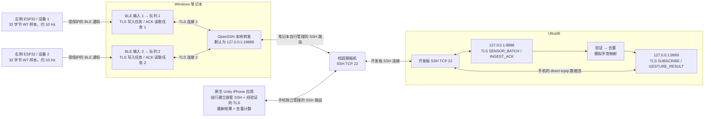
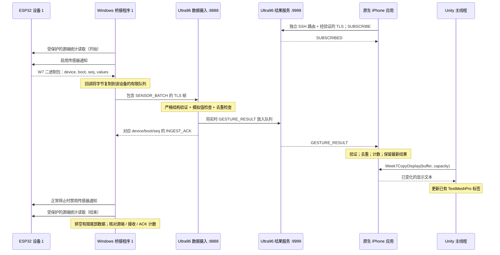

# 第 7 周通信系统：技术报告

> **中文版说明（2026-09-26）：** 本文完整翻译自[英文技术报告](week7-system-technical-report.md)，保留原文以 **2026-09-21** 为准的源码基线、实现说明、历史统计及证据边界；翻译日期不代表重新执行了测试。操作步骤与演示脚本请参阅配套的[中文版测试与演示指南](week7-testing-and-demo-guide.zh-CN.md)。

**源码基线：** `79a8c0df1693e3b21d15e8b46ed351a12db1c610`，审阅日期为 **2026 年 9 月 21 日**。本报告描述该时间点的实现和证据。可直接执行的配置步骤、测试和演示脚本见配套的[中文版测试与演示指南](week7-testing-and-demo-guide.zh-CN.md)。下文的相对链接指向对应实现；具名函数与部分行号锚点便于读者核对说明与源码。

**阅读顺序：** 先了解[系统的功能](#1-what-the-system-does)，再跟踪[一个样本的完整路径](#2-one-sample-from-generation-to-display)，随后学习[协议](#3-the-protocol-byte-by-byte)和[实现](#4-reading-the-implementation)。可结合[默认参数与恢复](#5-defaults-resource-bounds-and-recovery)、[安全](#6-security-boundaries-and-credentials)和[实物证据](#7-what-has-actually-been-demonstrated)解释设计选择。[文件索引](#8-file-by-file-map)、[教师提问](#9-questions-to-be-ready-to-answer)和[术语表](#10-short-glossary)可随时查阅。

<a id="1-what-the-system-does"></a>
## 1. 系统实现了什么

两块 ESP32 在受保护的 BLE 传感器订阅处于活动状态时，各自约每 100 ms 生成一个确定性的八通道模拟样本。Windows 笔记本同时接收两路数据，验证二进制数据包，并通过每台设备独立的 TLS 连接将其消息转发至 Ultra96。Ultra96 验证消息，按确定性规则分配一个模拟手势，向笔记本确认数据已摄入，并向已订阅的 iPhone 发送手势结果。实际使用的 iPhone 应用是导入的 Unity 应用，接入了一个原生 Swift 网络包。

iPhone 自行管理到开发板的 SSH 连接，以及该连接内部的 TLS 会话；SSH 路由可以选择经过校园跳板机。结果数据从开发板直接到达 iPhone，不经过笔记本上的应用程序。ESP32 到开发板的数据摄入路径仍然需要笔记本。

系统展示的是通信、身份追踪、有界缓冲、安全检查和故障恢复。它没有展示真实传感器采集、校准、经过训练的手势分类器，也没有验证 ARKit 或相机的正确性。屏幕上的 `DUMMY inference` 是有意保留的说明：`seq % 4` 决定结果为 `REST`、`FIST`、`OPEN` 或 `POINT`；置信度固定为 `1.0`。

### 1.1 物理与逻辑拓扑



图中两条独立的客户端路由共用相同的网络主机，但不共享 SSH 认证状态或应用套接字。需要 VPN 时，VPN 的作用是让校园路由可达；它不是一种应用消息格式。

| 端点 | 归属与含义 |
|---|---|
| ESP32 BLE 服务 `6e1c0001-7a45-4dc4-b678-3f2d5a9c1001` | 广播第 7 周 GATT 服务。两块板都以 `LTC-W7` 广播，通过地址和数据内嵌的设备 ID 区分。 |
| 笔记本 `127.0.0.1:18888` | SSH 默认的本地监听端口，转发到开发板回环地址的 `8888` 端口。某次运行可改用其他未占用的本地端口，例如文档记录的 `18889`；隧道与桥接程序的设置必须一致。 |
| 开发板 `127.0.0.1:8888` | TLS 数据摄入监听端口，接收传感器消息并返回摄入 ACK。 |
| 开发板 `127.0.0.1:9999` | TLS 结果监听端口；当前唯一的订阅者接收来自两台设备的实时结果。 |
| 跳板机 TCP 22 与开发板 TCP 22 | 用于 SSH 传输和经过认证的转发。开发板上的应用端口始终只绑定回环地址。 |
| 手机内部到开发板 `127.0.0.1:9999` 的 SSH 数据流 | 原生应用打开一个 `direct-tcpip` SSH 通道，不需要在手机上设置 TCP 监听端口。 |
| 较早指南中的 `127.0.0.1:19999` | Python/iSH、通用 C# 或桌面测试订阅程序所用的独立手机端/本地转发，不属于原生应用的实现。 |

`127.0.0.1` 始终表示“本机”。笔记本的本地地址与开发板的本地地址指向不同的网络协议栈。即便客户端连接的是本地转发端口，TLS 仍验证逻辑名称 `ultra96.week7.internal`；不能用套接字地址替代证书中的服务器名称。

固件的完整 GATT 接口如下。表中每个标识符都带有后缀 `-7a45-4dc4-b678-3f2d5a9c1001`；例如，传感器特征的完整 UUID 为 `6e1c0005-7a45-4dc4-b678-3f2d5a9c1001`。

| UUID 前缀 | GATT 作用 | 值/操作 |
|---|---|---|
| `6e1c0001` | 服务（Service） | 将五个特征组织在一起。 |
| `6e1c0002` | 计数器通知（Counter Notify） | 四字节小端诊断计数器，供较早的计数器接收程序使用。 |
| `6e1c0003` | MTU 控制写入（MTU-control Write） | 两字节小端数值，表示请求的探测负载长度。 |
| `6e1c0004` | MTU 探测通知（MTU-probe Notify） | 长度为请求值的诊断负载，其中第 `i` 个字节等于 `i % 256`。 |
| `6e1c0005` | 传感器通知（Sensor Notify） | 当前桥接程序使用的 32 字节 W7 样本。 |
| `6e1c0006` | 源端统计读取（Source-statistics Read） | 用于审计一次有限时段采集的 24 字节 W7S1 快照。 |

### 1.2 这里的“并行接收”指什么

[`DualBridge.run`](../laptop/dual_bridge.py#L63) 为设备 1 和设备 2 创建相互独立的输入任务和写入任务。每个 `Bridge` 都管理自己的 BLE 客户端、原始数据收件队列、追踪器、源端审计、TLS 套接字和 ACK 流水线。一条路径上的慢操作不会迫使另一条路径等到该设备收到 ACK 后，才能发送自己的下一个样本。

这些是在同一个 Python 事件循环中并发运行的异步 I/O 路径。当当前任务等待 BLE、网络或定时器时，`await` 允许事件循环运行其他已就绪的任务。这不等于声称两个 Python CPU 核心在同时执行，也不等于两次 BLE 无线传输发生在完全相同的时刻。真正有意义的结论是：两路数据有独立的管理状态，并能在共同的观察时段内持续推进。它们仍共享 Windows 适配器、事件循环、网络和开发板资源。

<a id="2-one-sample-from-generation-to-display"></a>
## 2. 一个样本从生成到显示的完整路径



ACK 通道与结果通道彼此独立。开发板先将结果放入队列，再写入摄入 ACK；但由于任务调度和两条网络连接彼此独立，手机收到结果的时间既可能早于，也可能晚于笔记本收到 ACK 的时间。该图解释因果关系，不保证全局时序。

1. **生成：** ESP32 检查连接、订阅、认证和 MTU。它分配一个序列号，生成八个确定性的 `int16` 数值，序列化为 32 字节，并提交一条 BLE 通知。
2. **接收：** Windows BLE 回调记录基于单调时钟的到达时间并复制负载，不等待网络交付，也不解析 JSON。
3. **验证：** 桥接程序的写入任务解码二进制包，检查身份和模拟值，观察序列连续性，并拒绝来自已退役连接的数据或过期数据。
4. **转发：** 数据包转为一个 `SENSOR_BATCH` JSON 对象，加上表示字节长度的前缀后，通过 TLS 发送。在默认的双设备运行中，每台设备最多可有 32 条已发送但尚未收到确认的消息。
5. **开发板处理：** 开发板严格检查消息结构和活动会话。新的追踪标识产生一个结果；近期见过的重复标识只获得重复 ACK，不会再产生一个结果。
6. **确认：** 桥接程序将 ACK 中的版本、类型、会话、设备、启动 ID 和序列号，与最早等待确认的消息逐项比对。不相关的 ACK 无法悄悄将该消息移出待确认队列。
7. **结果交付：** 开发板当前的订阅者通过手机独立的 TLS/SSH 连接接收实时结果。如果没有订阅者，该结果会计入未连接状态下的结果数，并被丢弃。
8. **显示：** Swift 验证完整结果，更新线程安全的最新值状态。Unity 在自己的主线程上通过 C 接口轮询。两次画面渲染之间可能已验证多个结果，因此计数器可能一次增加多个；屏幕不必展示每一个中间手势。
9. **证据：** 有序停止时读取最终源端快照，排空已接收的输入并报告异常。发生断连或快照不完整时，即使最终可见计数看起来合理，也不能得到无异常的审计结果。

<a id="3-the-protocol-byte-by-byte"></a>
## 3. 逐字节理解协议

### 3.1 ESP32 传感器数据包：固定 32 字节

[`week7_packet.h`](../firmware/esp32/include/week7_packet.h) 显式写入每个字节。[`common.sensor`](../common/sensor.py#L12) 实现了相匹配的 Python 表示：

```python
_PACKET = struct.Struct("<2sBBIII8h")
```

`<` 选择小端字节序，使用标准大小且不加本机对齐填充。`2s` 表示两个原始字节；每个 `B` 是一个无符号字节；每个 `I` 是四字节无符号整数；`8h` 则是八个两字节有符号整数。总大小为 `2 + 1 + 1 + 4 + 4 + 4 + 16 = 32`。

| 字节偏移 | 大小 | 字段 | 含义 |
|---:|---:|---|---|
| 0–1 | 2 | 魔数（Magic） | ASCII `W7`，用于识别该数据包格式。 |
| 2 | 1 | 版本（Version） | `1`。 |
| 3 | 1 | `device_id` | 左侧为 `1`，右侧为 `2`。 |
| 4–7 | 4 | `boot_id` | 每次启动时生成一次的随机 `uint32`。 |
| 8–11 | 4 | `seq` | 无符号 32 位样本序列号。 |
| 12–15 | 4 | `uptime_ms` | 生成时 ESP32 本地的 `millis()` 值。 |
| 16–31 | 16 | `values[0..7]` | 八个未经校准的有符号 16 位通道值，采用小端序。 |

该结构没有额外的应用层校验和，也没有来自同步时钟的时间戳。BLE 和后续安全传输各自提供传输层保护；结构检查与确定性数值检查负责发现应用层不匹配。`uptime_ms` 有助于追溯数据来源，但不能直接用另一台机器的日历时钟时间减去某块板的运行时长，来计算端到端延迟。

通知的 ATT 负载容量等于协商后的 MTU 减去三字节。因此，32 字节数据包要求 ATT MTU 至少为 **35**；固件和笔记本都会检查这一条件。诊断 MTU 探测用于测试实际可接收的通知长度，其负载与传感器包不同。

C++ 和 Python 使用相同的样本公式：

```python
base = (seq % 2000) - 1000
return tuple(base + 10 * index for index in range(8))
```

`% 2000` 让已知的斜坡数列周期性重复；减去 1000 使结果同时包含负值和正值；`range(8)` 生成 0 到 7 的通道索引；每个通道的值比前一通道大十。这有助于发现字节序错误和数值损坏。`SensorPacket` 接受完整的 int16 表示范围，但当前桥接程序和开发板有意要求数据符合这些第 7 周模拟值。若将生成器换成真实传感器读数，还必须相应修改语义验证和推理接口约定。

### 3.2 源端统计包：固定 24 字节

末尾为 `0006` 的受保护 **Read** 特征提供一个快照，其格式定义在 [`week7_source_stats.h`](../firmware/esp32/include/week7_source_stats.h)，由 [`parse_source_stats`](../laptop/source_audit.py#L37) 解析。

| 字节偏移 | 大小 | 字段 |
|---:|---:|---|
| 0–3 | 4 | ASCII `W7S1` |
| 4 | 1 | 设备 ID |
| 5–7 | 3 | 保留字节，必须全为零 |
| 8–11 | 4 | 启动 ID |
| 12–15 | 4 | 下一个待分配的序列号 |
| 16–19 | 4 | 成功提交通知的次数 |
| 20–23 | 4 | 提交通知失败的次数 |

所有四字节数值均为小端无符号整数。“已提交”表示 ESP-IDF 通知 API 接受了这项工作，本身不证明笔记本已收到。固件在提交前递增 `nextSequence`，因此提交失败不会因为复用相同序列号而从记录中消失。开始快照在订阅前读取，结束快照在成功停止通知后读取；复制这两份快照时，固件均持有连接状态互斥锁。

源端计数器只统计通知门控条件满足时生成的样本。固件不会在断连期间维持一个不断积累样本的队列。因此，在没有桥接程序订阅的安静时段前后，序列区间可能依然相邻；这不表示系统采集并回放了该段实际时间内的样本。

### 3.3 TLS 上传输的 JSON 帧

面向开发板接口时，二进制样本会转成 JSON。TCP/TLS 提供的是字节流，因此一次读取可能只拿到半条消息，也可能拿到多条消息。[`common.wire`](../common/wire.py#L35) 使用四字节的**大端**长度前缀，后接长度恰好相等的 UTF-8 JSON 字节，以解决消息边界问题：

```python
body = json.dumps(message, ensure_ascii=False, allow_nan=False,
                  separators=(",", ":")).encode("utf-8")
return struct.pack("!I", len(body)) + body
```

`json.dumps` 序列化对象；紧凑分隔符省略可选空格；`allow_nan=False` 排除无效的非有限数值。`encode` 将字符转为字节。`!I` 用网络字节序编码字节数。前缀计量的是 UTF-8 字节数，而非字符数，且不包含前缀自身。BLE 负载字段采用小端序，网络帧前缀采用大端序；这是两种不同的格式。

消息体必须为 **1–16,384 字节**，且必须是 JSON 对象。重复键、非法 UTF-8、非有限数值、错误结构、字段缺失或多余、字段类型无效，都会被拒绝。读取过程以精确长度为准，而不是“某次套接字读取碰巧拿到了多少”。原生 `FrameDecoder` 最多保留一个未完成帧（连同前缀共 16,388 字节），遇到非法分帧后不会尝试重新同步。

[`ultra96.protocol`](../ultra96/protocol.py) 定义了以下全部消息类型：

| 类型 | 方向 | 除 `v`、`type`、`session_id` 外的字段 |
|---|---|---|
| `SENSOR_BATCH` | 笔记本 → 开发板摄入端 | `device_id`, `boot_id`, `seq`, `uptime_ms`, `values` |
| `INGEST_ACK` | 开发板摄入端 → 笔记本 | `device_id`, `boot_id`, `seq`, `status`（`accepted` 或 `duplicate`） |
| `SUBSCRIBE` | 手机 → 开发板结果端口 | 无 |
| `SUBSCRIBED` | 开发板结果端口 → 手机 | 无 |
| `GESTURE_RESULT` | 开发板 → 手机 | `device_id`, `boot_id`, `seq`, `result_id`, `gesture`, `confidence` |

版本为整数 `1`；设备 ID 为整数 1 或 2；启动 ID 和序列号为 uint32。会话标识是长度不超过 128 个字符的非空字符串，不允许控制字符或无效的代理码点。它在逻辑上区分配置好的各次运行，并非密码或授权令牌。

### 3.4 一个完整示例

对设备 1，设启动 ID 为 `305419896`（`0x12345678`），序列号为 42，运行时长为 4200 ms，则数据包中的值为 `[-958,-948,-938,-928,-918,-908,-898,-888]`。因为 `42 % 4 == 2`，选择的手势为 `OPEN`。

它的 32 个字节如下，为便于阅读按字段分组：

```text
57 37 | 01 | 01 | 78 56 34 12 | 2a 00 00 00 | 68 10 00 00 |
42 fc | 4c fc | 56 fc | 60 fc | 6a fc | 74 fc | 7e fc | 88 fc
```

`57 37` 是 ASCII `W7`；`78 56 34 12` 是小端启动 ID；`2a 00 00 00` 是序列号 42；有符号小端值 `42 fc` 是第一通道的 −958。竖线和换行仅作标注，不是实际发送的字节。

```json
{"v":1,"type":"SENSOR_BATCH","session_id":"week7-demo","device_id":1,"boot_id":305419896,"seq":42,"uptime_ms":4200,"values":[-958,-948,-938,-928,-918,-908,-898,-888]}
```

开发板接受这个新的追踪标识，并在不同连接上发出以下消息：

```json
{"v":1,"type":"INGEST_ACK","session_id":"week7-demo","device_id":1,"boot_id":305419896,"seq":42,"status":"accepted"}
```

```json
{"v":1,"type":"GESTURE_RESULT","session_id":"week7-demo","device_id":1,"boot_id":305419896,"seq":42,"result_id":"1:305419896:42","gesture":"OPEN","confidence":1.0}
```

接收结果之前，手机会进行以下交换：

```json
{"v":1,"type":"SUBSCRIBE","session_id":"week7-demo"}
{"v":1,"type":"SUBSCRIBED","session_id":"week7-demo"}
```

这些是便于阅读的消息体。在实际传输中，**每个对象都有自己的长度前缀**；最后一个示例不表示协议以换行分隔消息。键的顺序无关紧要。如果同一追踪标识仍在开发板近期 ID 缓存中，再次发送它会得到 `status: "duplicate"`，不会产生第二个手势结果。

<a id="4-reading-the-implementation"></a>
## 4. 阅读具体实现

### 4.1 ESP32：启动、回调与样本生成

[`setup`](../firmware/esp32/src/main.cpp#L328) 只执行一次。它初始化串口输出、生成启动 ID、创建互斥锁、配置 BLE 安全、注册回调处理器、创建特征并开始广播。[`loop`](../firmware/esp32/src/main.cpp#L369) 则反复处理受控的绑定信息清除、广播重启、定时通知和状态报告。

`ServerCallbacks` 记录当前对端和 MTU，在断连时重置订阅，并请求启用加密且具备 MITM 防护的配对。`SecurityCallbacks` 只接受同时满足 Secure Connections、MITM 防护和绑定要求的认证。`CccdCallbacks` 读取通知订阅标志。`SourceStatsCallbacks` 返回一致的源端快照。互斥锁防止异步协议栈回调在样本提交到一半时修改连接状态。

固件的传感器部分包含以下核心顺序：

```cpp
const uint32_t sampleSequence = week7::allocateSampleSequence(sensorStats);
const bool serialized = week7::serializeDummyPacket(
    payload, sizeof(payload), kDeviceId, bootId, sampleSequence, nowMs);
const bool submitted = serialized &&
    submitNotification(sensorCharacteristic, payload, sizeof(payload));
week7::recordSensorSubmission(sensorStats, submitted);
```

第一行在尝试发送前先分配标识。`const` 防止局部结果被意外重新赋值。序列化函数同时接收缓冲区和容量，因此可以拒绝无效的目标缓冲区。`&&` 确保只有序列化成功后才调用通知 API。最后一行根据结果递增源端提交成功或失败的计数。`submitNotification` 内部的确认参数为 `false`，表示使用通知，而不是需要应用确认的 BLE indication。

四个头文件将可移植逻辑与 ESP 硬件 API 分开，使主机端 C++ 测试无需烧录开发板，就能检查序列化、安全策略和回调事件解析。特别是，`week7_gatts_control.h` 会先确认事件确实是 WRITE，再访问 ESP-IDF 事件联合体中的 write 成员；不能把其他事件的字节误读为写入请求。

`platformio.ini` 通过 `WEEK7_DEVICE_ID=1` 或 `2` 编译同一份源码。`firebeetle32-unprotected-diagnostic` 明确属于诊断构建，其输出不能证明 BLE 链路受到保护。标准构建会抑制可能输出配对口令的框架日志。配对秘密只应出现在当次即时交互中，不应写入保存的演示日志。

### 4.2 笔记本：缩短回调，限制待处理工作量

[`RawInbox`](../laptop/bridge.py#L73) 是一个由锁保护的双端队列，保存负载字节、单调到达时间和连接代次。队列满时移除最旧的一项，并增加丢弃计数。它还会合并跨线程唤醒请求：即使回调到达速度超过写入任务的处理速度，也不会向事件循环无限堆积通知。

```python
if len(self._items) == self._capacity:
    self._items.popleft()
    self.dropped += 1
self._items.append(Received(bytes(data), received_at, generation))
```

`popleft` 移除最旧的一项。`bytes(data)` 为回调内存建立稳定副本。`Received` 将负载与其时间、连接归属组合起来。丢弃最旧数据优先保障当前实时状态，而计数器让这类丢失可见。

[`Bridge.ble_loop`](../laptop/bridge.py#L600) 扫描准确的服务和选定地址，通过 `make_ble_client` 连接，检查传感器特征和 MTU，要求 Windows 已建立经过认证的绑定，取得起始源端快照，然后订阅。`ble_connection.py` 禁用 Windows 缓存的服务发现，避免配对后复用过时的 MTU/服务状态。Windows 配对由明确的辅助程序执行，不会在每次接收尝试中暗藏密码或配对提示。

[`_prepare_item`](../laptop/bridge.py#L325) 解码数据包，并记录格式错误、身份不符、重复、乱序、新启动 ID 和序列缺口等情况。数据流追踪器使用 32 位无符号减法（模 2^32）处理序列号回绕。一个代次标识一次 BLE 连接尝试：旧连接迟到的回调无法向新连接的队列注入数据。数据在接收后会检查一次新鲜度，在可能耗时较长的 TLS 连接建立后还会再检查一次。

[`_pipeline_epoch`](../laptop/bridge.py#L458) 中的 ACK 流水线将发送与读取确认分开：

```python
slots = asyncio.Semaphore(self.config.ack_window)
# Sender: acquire a slot, validate and send a frame, append it to pending.
# Receiver: validate the oldest pending ACK, remove it, release a slot.
```

信号量统计仍可使用的在途位置。窗口为 32 时，等待较早消息的 ACK 不会阻止发送任务使用其他空闲位置。每条 TLS 连接仍然只有一个 FIFO 发送任务和一个 ACK 读取任务，不会有多个任务同时读取同一条数据流。每个待确认帧的五秒 ACK 截止时间从它自己的发送尝试开始计算，因此按队列逐项检查 ACK 时，不会在旧消息移到队首后重新给它一整个超时时间。

对于原始的单桥接 API，`BridgeConfig.ack_window` 默认是 **1**；此时 `writer_loop` 选择传统的逐条发送、逐条等待确认路径。单设备 CLI 没有 `--ack-window` 选项，使用该默认值。当前的**双设备 CLI 默认值为 32**，允许范围为 1–64。解释较早结果或比较吞吐量时，必须区分这两种情况。窗口大小不会改变传输格式，也不会生成额外数据。

传输失败后，该连接轮次会退役：统计待处理发送，取消并等待任务结束，关闭或强制中止传输。若某条消息的写入可能已到达开发板，则将其标记为交付状态不确定，不会自动重放。清理失败会保留为可见状态，不能通过启动另一个重叠的连接管理者，把它伪装成正常完成。

### 4.3 双设备协调与证据

[`DualBridge`](../laptop/dual_bridge.py#L21) 会拒绝以下配置：两个相同的物理地址、不正确的预期身份、缺少源端审计，以及不同的会话 ID。它启动两条流水线，等两路输入均进入活动状态后，再开始共同计时观察。正常关闭时，它通知两路生产者停止，分别完成停止通知和源端快照工作，允许在限定时间内排空尾部数据，结束写入任务、关闭传输并生成报告。

[`SourceAudit.report`](../laptop/source_audit.py#L149) 对具有相同启动 ID 的快照计算 32 位无符号差值（模 2^32）：

```text
generated = end.next_seq - start.next_seq  (modulo 2^32)
source_consistent = generated == submitted + failures
```

一次无异常的源端审计要求：快照完整、启动 ID 相同、生成数量为正、源端提交无失败、生成数 = 接收数 = ACK 数、序列区间端点连续，并且身份、中断和快照异常均为零。只检查已收包的 `last_seq - first_seq` 会漏掉首包或尾包丢失；源端快照提供了这两个边界。审计只保留计数器和区间端点，不维护不断增长的列表，因此内存使用不会随着采集时间增长。

双设备报告还检查持续覆盖率、最长静默时间、输入是否受到保护、是否存在未完成工作，以及是否出现列出的异常。覆盖数量必须达到“共同观察的实际时长 × 配置速率”的至少 90%，观察到的最长静默时间不得超过新鲜度限制。这允许正常的启动和边界调度差异，同时能发现不再推进的数据流。一份无异常报告是按明确标准得到的一次采集结果，并不能证明未来任何网络条件下都零丢失。

[`reporting.py`](../laptop/reporting.py) 在采集前以 `incomplete` 标记预留一个新的报告路径。最终生成时先验证归属，写入并刷新临时文件，再原子替换预留文件；若路径已存在则拒绝使用。这既保留了崩溃运行未完成的证据，也避免覆盖其他运行的报告。修订版本和 UTC 元数据标识发送端检出版本及采集时间；本地新鲜度和超时判断则使用单调时钟。

### 4.4 Ultra96：验证、确认并汇合两台设备的数据

[`Week7Server`](../ultra96/server.py#L85) 管理两个回环 TLS 监听器和异步客户端任务。摄入监听器可以接收两台设备的连接，而结果监听器仅保留一个当前订阅者。监听器失败会向承载服务的上层暴露，不会悄悄留下一个进程仍存活、套接字却已失效的状态。预期内的连接或协议错误会被计数并清理。

[`_ingest`](../ultra96/server.py#L232) 验证 `SENSOR_BATCH`，按插入顺序保存最近 4,096 个 `(device_id, boot_id, seq)` 标识，构造结果并写入相关联的 ACK。由于服务器配置为一个经过验证的会话，该追踪元组的含义限定在此会话内。去重是有界且仅存于内存中的；服务器重启或旧标识被移出缓存后，该旧标识便不再受到去重保护。

```python
result.update(result_id="{}:{}:{}".format(*trace),
              gesture=GESTURES[message["seq"] % 4], confidence=1.0)
```

`format(*trace)` 用冒号连接设备、启动 ID 和序列号字段。`% 4` 从 `("REST", "FIST", "OPEN", "POINT")` 中选择索引。结果不包含原始通道数组，因为手机界面显示的是推理输出和追踪标识。

[`_gateway`](../ultra96/server.py#L260) 接受有效的 `SUBSCRIBE`，取得新一代订阅者的所有权，并回复 `SUBSCRIBED`。新订阅的客户端会替换并关闭上一位所有者。因此，当实物应用已连接时启动手机模拟器，会干扰该应用。订阅完成后，客户端必须只接收数据；EOF 或意外的额外输入会终止其所有权。

`ResultQueue` 最多保存 32 个结果。溢出时丢弃最旧结果；出队和写入检查会将超过两秒的结果判为过期。[`_send_results`](../ultra96/server.py#L317) 用剩余的本地新鲜度时间限制写入时长。套接字写入完成只表示服务器传输层已接受该帧并完成相应的缓冲排空，**不证明** iPhone 已验证或显示它。字节一旦交给 TCP/TLS，即使之后迟到也无法撤回。

[`BoundedEventLog`](../ultra96/diagnostics.py) 观察允许记录的追踪和订阅事件，不在转发循环中做 JSON 编码或磁盘操作。有界队列将事件交给后台写入任务。最终状态会报告队列溢出、丢失事件、文件容量上限、回调/写入错误、完成状态和事件文件哈希。这让诊断明细可供审计；被截断或未完成的记录器不能被表述为完整证据。对于服务器写入事件，它明确记录 `phone_receipt_confirmed=False`。

### 4.5 实际使用的原生 iPhone 客户端

Swift 包分为三层：

| 层 | 职责 |
|---|---|
| `Week7Core` | 严格消息验证、数据流分帧和线程安全的显示状态；不负责 UIKit 或 SSH 连接管理。 |
| `Week7Transport` | SSH 路由、主机密钥验证、密码生命周期、TLS 验证、订阅、截止时间与重试。 |
| `Week7Bridge` | UIKit 设置界面、公开配置、前台会话管理，以及供 Unity 调用的 C 函数。 |

[`Week7Client.connect`](../ios-visualizer/Week7Native/Sources/Week7Transport/Week7Client.swift#L74) 先建立到跳板机的外层 SSH 客户端，打开到开发板 TCP 22 的直接 TCP/IP 通道，在该通道内运行第二个 SSH 客户端，然后打开到开发板回环 TCP 9999 的通道。TLS 在最后这条数据流内运行，使用已导入并登记信任的 CA 和固定服务器名称。直连模式省去跳板层，但仍使用开发板 SSH 和同一个结果服务。两跳的 SSH 主机密钥都经过固定值核验。

网络代码使用共享的 SwiftNIO 单线程事件循环组。`ConnectionAttempt` 管理所有已分配的根通道，包括候选连接，因此即使握手尚未完成，取消操作也能关闭资源。轮次标识会拒绝来自已停止客户端的回调。`CredentialVault` 让延迟执行的认证回调能够发现凭据已经撤销，避免无限保留旧路由的密码。

[`Subscriber.channelRead`](../ios-visualizer/Week7Native/Sources/Week7Transport/Subscriber.swift#L37) 解码数据流片段，要求先收到 `SUBSCRIBED`，才接受结果。其计时规则非常明确：

```swift
if !partialFrame && subscribed { arm(context, delay: options.frameTimeout) }
// Decode incoming bytes into complete frames.
partialFrame = decoder.hasPartialFrame
if !partialFrame { disarm() }
```

新结果的首批字节启动一个五秒的帧接收时间预算。该帧完成且没有剩余的不完整帧时，定时器解除。同一个不完整帧的后续片段不会延长其预算。如果同一次读取还包含下一帧的部分内容，则下一帧获得自己的时间预算。**已经成功订阅、且没有不完整帧的健康连接，可以无限期保持空闲。** 五秒不是完整帧之间的空闲超时。建立连接直到收到 `SUBSCRIBED` 的过程，仍受连接截止时间和响应帧超时约束。

`Week7Protocol.result` 检查字段是否完全符合要求、会话、uint32 身份字段、追踪字符串、手势映射和置信度。它的小型扁平 JSON 解析器会保留整数词元（如 `42`）与浮点词元（如 `42.0`）之间的区别，拒绝解码后重复的键，并谨慎处理转义 Unicode。一个格式错误的完整消息，不会仅因为通用 JSON 解码器接受了它就被当作有效消息。

[`DisplayState.accept`](../ios-visualizer/Week7Native/Sources/Week7Core/DisplayState.swift#L60) 拒绝旧代次、无效或过旧的到达时间，以及近期见过的 ID。每个通过验证且未重复的结果都会增加计数，但显示状态只保存最新结果。在一次用户明确点击 Connect 开始的会话中，最近 4,096 个 ID 会跨传输重连保留。再次明确点击 Connect 会开始新代次，并重置计数和去重历史。`snapshot` 会在本地连续两秒没有新结果后清除当前结果，但不会减少接收计数。

原生应用选用的消息结构不包含源端结果时间戳。其两秒显示新鲜度表示“最近在本地被接受”，不是测得的源端到屏幕延迟。只保存最新值的邮箱机制避免 UI 积压，同时仍统计每一个通过验证且未重复的回调结果。

### 4.6 Swift 如何接入 Unity 场景

[`DisplayMailbox.swift`](../ios-visualizer/Week7Native/Sources/Week7Bridge/DisplayMailbox.swift#L33) 导出稳定的 C 可调用符号：

```swift
@_cdecl("Week7CopyDisplay")
public func week7CopyDisplay(_ buffer: UnsafeMutablePointer<CChar>?,
                            _ capacity: Int32) -> Int32 {
    sharedMailbox.copy(into: buffer, capacity: capacity)
}
```

`@_cdecl` 为函数指定一个生成的 C++ 可以链接的 C 符号名。调用方提供缓冲区与容量；被调用方返回字节数，并且只有在变化后的文本能够放入缓冲区时，才写入末尾的零字节。`Week7Start` 安装设置与会话支持；`Week7Stop` 立即使状态失效，并安排 UIKit 界面的清理。

[`patch_export.py`](../ios-visualizer/tools/patch_export.py) 在修改 [`Assembly-CSharp.cpp`](../ios-visualizer/xcode-export/Il2CppOutputProject/Source/il2cppOutput/Assembly-CSharp.cpp) 中生成的接收器之前，会严格检查导入的方法签名和源码哈希。替换后的代码将 `Start` 接到 `Week7Start`，将 `Update` 接到 `Week7CopyDisplay`，将 `OnDestroy` 接到 `Week7Stop`，并禁用旧的 `ListenLoop`。更新逻辑使用 2,048 字节栈缓冲区，在 Unity 线程上修改已有的 TextMeshPro 标签。原生网络回调不会操作被保留的 Unity 托管指针。补丁还会扩大导入标签的矩形区域，并启用合适的文字尺寸设置，使状态、追踪标识和计数能够完整显示。

[`configure_xcode.py`](../ios-visualizer/tools/configure_xcode.py) 将本地 `Week7Native` 静态库链接进 `UnityFramework`，验证项目引用图，更新应用元数据，并为继承而来的符号上传操作加保护。它不会替用户选择签名团队。重复应用被设计为幂等操作；遇到未知导出版本时，需要经过审阅的适配，不能盲目替换文本。

原始的 [`reference/TlsDataReceiver.cs`](../ios-visualizer/reference/TlsDataReceiver.cs) 保留为导入参考。修改它不会重新构建或改变仓库中已提交的生成导出代码。同样，[`phone/unity/Week7PhoneReceiver.cs`](../phone/unity/Week7PhoneReceiver.cs) 是独立的、面向通用场景/Android 的 C# 集成，需要手机上另行运行 SSH 转发。二者都不是上述实际原生 iPhone 网络连接的管理者。

<a id="5-defaults-resource-bounds-and-recovery"></a>
## 5. 默认参数、资源上限与恢复

| 设置 | 当前值及适用范围 | 定义位置 |
|---|---|---|
| 固件采样间隔 | 100 ms，每块已订阅的 ESP32 约 10 Hz | `main.cpp`, `kNotificationIntervalMs` |
| 源端身份 | 左侧 1；右侧 2；固件启动时生成新的随机启动 ID | `platformio.ini`, `setup()` |
| 传感器最小 MTU | 35 | `week7_security.h`, `Bridge.ble_loop` |
| 双设备采集时长 | 两路输入都进入活动状态后 600 s | `dual_bridge._parser` |
| 原始数据队列 | 默认每台设备 64 项；可配置为 1–4,096 | `BridgeConfig`，双设备 CLI |
| ACK 窗口 | 双设备 CLI 每台设备 32；允许范围 1–64；旧 API 默认 1 | `dual_bridge._parser`, `BridgeConfig` |
| 笔记本新鲜度 | 从 BLE 回调接收时起 2 s | `BridgeConfig` |
| 笔记本 ACK/I/O 超时 | 5 s；写入可使用更短的剩余新鲜度预算 | `BridgeConfig`，流水线发送/接收任务 |
| BLE 扫描/连接超时 | 默认 8 s / 20 s | `BridgeConfig` |
| 双设备启动/排空/关闭 | 默认 30 s / 10 s / 25 s | `DualBridge` |
| 开发板结果队列 | 当前订阅者最多 32 条消息 | `ResultQueue` |
| 开发板结果有效时间 | 2 s，在出队时及写入前/写入中检查 | `ResultQueue`, `_send_results` |
| 开发板近期追踪缓存 | 4,096 项，仅保存在内存中 | `_ingest` |
| JSON 消息体上限 | 16,384 字节 | `common.wire`，Swift `Week7Protocol` |
| 原生连接截止时间 | 10 s，覆盖至订阅建立完成 | `TransportOptions`, `Week7Client` |
| 原生不完整帧截止时间 | 5 s；已订阅且无不完整帧时，没有空闲截止时间 | `TransportOptions`, `Subscriber` |
| 原生重试间隔 | 从 0.5 s 开始翻倍，最多 5 s；收到有效结果后重置 | `Week7Client` |
| 原生显示新鲜度/缓存 | 本地到达后 2 s / 最近 4,096 个结果 ID | `DisplayState` |
| 开发板诊断日志 | 默认最多排队 2,048 个事件，文件上限 50 MiB；关闭尝试限时 2 s | `BoundedEventLog`，服务器宿主 |

有界队列避免内存无限增长，但允许明确记录的丢弃。64 项队列不意味着允许在 10 Hz 下发送 6.4 秒前的旧数据：两秒的新鲜度检查仍然有效。一旦连接中断，系统优先恢复当前实时状态，而非重建历史。

| 故障或操作 | 已实现行为 | 操作者或证据应体现的情况 |
|---|---|---|
| BLE 包格式错误或设备不符 | 拒绝并计数；该项不会作为有效样本转发 | 格式错误/身份计数增加；无异常审计不通过。 |
| BLE 断连/重启 | 退役该输入代次；采用有上限的退避重连；保留中断/启动变化证据 | 源端审计不能悄悄跨越新启动，把它算作一次无异常采集。 |
| TLS 断开或 ACK 不符 | 退役该传输轮次；统计交付状态不确定的写入；不重放它们 | 传输/ACK/状态不确定计数说明交付为何不完整。 |
| 队列溢出或数据过期 | 按队列或新鲜度策略丢弃并计数 | 无异常采集要求这类异常全部为零。 |
| 没有手机订阅者 | 开发板接受传感器输入并返回 ACK；统计并丢弃相应结果 | ACK 成功与手机缺少结果可以同时发生。 |
| 新订阅者接入 | 替换先前的所有者 | 出现订阅者代次/替换事件；实物演示前停止竞争的模拟器。 |
| 原生应用前台传输 EOF/错误 | 对可重试的暂时性错误采用有上限的退避重试 | 恢复成功时，在同一次明确开启的会话内建立新路由和订阅。 |
| 凭据、SSH 固定密钥、CA、证书或消息结构错误 | 原生端将终止性的验证/认证失败交由用户修正设置并明确重试 | 给出清晰的失败状态；不降低安全要求，也不自动反复提供密码。 |
| 应用失去活动状态或手机锁屏 | `willResignActive` 停止原生客户端，撤销凭据并清除实时状态 | 回到前台，再次输入凭据并点击 Connect。 |
| 健康的原生连接没有新完整结果 | 保持订阅；在超过本地有效时间后清除旧的显示结果 | `Subscribed` 与 `No live result` 可以同时出现；计数保留。 |
| 网络静默丢弃流量，形成黑洞 | 尚未加入原生 SSH/应用心跳 | 可能需要等操作系统报告故障；不声称存在固定的发现时限。 |

笔记本的 OpenSSH 辅助程序另外配置了 `ServerAliveInterval=15` 和 `ServerAliveCountMax=3`。这些设置不会让原生手机具备相同的心跳行为，因为它使用不同的 SSH 实现，并独立管理连接。

<a id="6-security-boundaries-and-credentials"></a>
## 6. 安全边界与凭据

受保护的 BLE 要求 Secure Connections、MITM 防护和绑定，同时配置加密的特征/描述符访问权限，并在运行时对通知进行门控。Windows 检查 `EncryptionAndAuthentication` 绑定。未受保护的诊断构建和标志会有意绕过部分保护条件，所得证据必须始终标明属于诊断用途。

笔记本 SSH 辅助程序只绑定回环地址，并对两跳都使用严格的已知主机验证。其受监督模式使用现有密钥/代理认证，只终止由自己启动并管理的子进程。原生手机将两跳 SSH 主机密钥与已登记的公开值逐一比较，再使用已导入并登记信任的 CA、主机名和有效期验证开发板 TLS 证书。TLS 最低版本为 1.2；已记录的实物笔记本隧道使用 TLS 1.3。这不意味着每个平台或每次运行都会恰好协商出 1.3。

这里的 TLS 用于认证服务器，代码没有配置 TLS 客户端证书。SSH 凭据认证的是访问转发路由的权限，开发板服务器还会检查配置好的协议会话。`session_id` 是公开上下文，不是访问控制秘密。绑定回环地址缩小了暴露范围，但不表示开发板上其他已获授权的进程无法连接本地服务。

手机只持久保存公开配置、用户名和公开 CA 证书。设置流程拒绝导入私钥或不相关的证书颁发机构。密码只保存在 UI/传输层内存中，连接后从表单清除，断连或暂停时撤销。这描述的是应用对凭据的管理范围与生命周期，并不保证运行时每个临时字符串都能达到取证意义上的彻底清零。

公开的主机密钥固定值和 CA 指纹可以作为信任配置说明；密码值、私钥内容、配对码和本地凭据文件不应进入报告或日志。`generate_week7_pki.py` 是本地配置/测试辅助程序，会拒绝将 Git/工作树目录用作输出目录，也会拒绝已存在且非空的密钥目录。它不是让正在运行的演示替换已登记信任 CA 的操作指令；更换 CA 需要独立验证并更新应用中的信任登记。

<a id="7-what-has-actually-been-demonstrated"></a>
## 7. 实际已经证明了什么

[9 月 21 日更新后实物报告](phone-post-update-test-2026-09-21.md) 是受保护的“双 ESP32 → Windows → Ultra96 → 原生 Unity iPhone”路径当前的验收证据。它记录了每块板 10 Hz 的模拟输入、精确的源端/接收/ACK 核对结果、分别完成最终确认的开发板事件明细，以及操作者报告的手机汇总计数。

| 更新后采集 | 源端/BLE/ACK 总数 | 双设备各阶段均有进展的时间桶 | 操作者报告的手机计数 | 精确的开发板写入完成数 |
|---|---:|---:|---:|---:|
| 基线，60 s | 1,202 | 59/59 | 1,202 | 1,202 |
| 安静时段后恢复，60 s | 1,206 | 59/59 | +1,206；累计 2,408 | 1,206 |
| 请求切换 VPN 后的手动恢复，30 s | 621 | 30/30 | 621 | 621 |
| 锁屏/解锁并明确点击 Connect 后，600 s | 12,003 | 600/600 | 12,003 | 12,003 |
| **合计** | **15,032** | — | **各会话计数/增量合计 15,032** | **15,032** |

从基线最后一次写入到恢复采集第一次写入之间，相隔 **129.286175 秒**；开发板观察到这两次采集始终使用同一个订阅者代次。在这些采集期间，事件明细没有记录订阅者替换、断连、无订阅者结果、队列丢失、过期丢弃或发送失败。操作者没有独立记录前台/状态行为的每一个瞬间；连续性的结论依据的是开发板连接事件和报告的汇总计数。

这四次无异常的源端采集保留了相同的两个启动 ID，而且每台设备前后采集的序列区间相邻。最终十分钟采集中，两台设备在全部 600 个受审计的一秒时间桶内都有进展。名义速率 × 时长与实际包总数之间的小幅差异，既来自订阅、启动和停止边界，也与共同观察窗口有关；源端快照确定了实际有限采集中的样本总数。

必须分别说明各层证据：

| 证据 | 能支持的结论 | 单凭它不能证明的内容 |
|---|---|---|
| ESP 源端快照和按序进行的源端审计 | 该次采集的生成/提交区间，以及完整的 BLE/ACK 核对 | 手机已接收。 |
| 相互关联的摄入 ACK | 开发板接受或识别了该追踪标识 | 开发板到手机的交付。 |
| 完整的开发板事件明细 | 精确的已接受 ID、套接字写入结果、订阅者归属与连续性 | 手机逐 ID 验证或显示。 |
| 操作者报告的手机计数 | 应用显示的、已接受且去重后的汇总计数 | 已保存的手机逐 ID 明细，或精确的端到端延迟。 |
| 本地自动化测试 | 在所用模拟/本地对端条件下可复现的行为 | 受保护的实物无线链路，或校园网/VPN 行为。 |

较早一次**手机少收 109 个结果的问题仍未解释**。另一次更新前空闲测试在**没有订阅者时丢失了 16 个结果**，复现了旧的空闲超时行为。重测通过不会抹去这两次历史失败。它们之间的关系见[恢复证据](phone-recovery-test-2026-09-21.md)和[更新后报告](phone-post-update-test-2026-09-21.md)。

VPN/锁屏恢复证据是在暂停后明确点击 Connect 得到的。它支持手动回到前台后的恢复，不支持自动后台接收的结论。没有订阅者时产生的结果不会重放。不能据此声称普遍完美交付，或中断期间无损。已安装更新版应用的来源信息依据操作者报告；由 Windows 端主导的重测没有提取应用修订版本，也没有收集新的 Apple 构建/测试日志。真实传感器、模型精度和 ARKit 均不在这些传输检查的范围内。

<a id="8-file-by-file-map"></a>
## 8. 逐文件索引

该基线有 3,633 个受版本控制的文件：154 个位于导入的 Xcode 导出目录之外，3,479 个位于其中。本节逐一列出项目编写的运行时代码、辅助程序、配置和测试文件，并按用途归类生成代码/第三方目录。原文提到的两份新报告及其撰写计划，是上述统计之后新增的文档。导入的生成运行时代码是有用的构建输入，但数千个生成的绑定文件，并不等于数千个独立编写的通信模块。

### 8.1 共享协议与固件

| 文件 | 代码或配置的作用 |
|---|---|
| [common/__init__.py](../common/__init__.py) | 用于共享导入的 Python 包标记。 |
| [common/sensor.py](../common/sensor.py) | 不可变且经过验证的 `SensorPacket`、32 字节编码/解码、确定性通道值，以及传感器包到 JSON 的转换。 |
| [common/wire.py](../common/wire.py) | 严格的 UTF-8 JSON 对象编解码、长度前缀、帧大小上限和有界数据流读写。 |
| [common/tls.py](../common/tls.py) | 配置验证的 TLS 客户端/服务器上下文及逻辑服务器名称。 |
| [firmware/esp32/platformio.ini](../firmware/esp32/platformio.ini) | 开发板/框架选择、串口速率、日志抑制，以及左侧、右侧和诊断构建定义。 |
| [firmware/esp32/src/main.cpp](../firmware/esp32/src/main.cpp) | 硬件初始化、BLE 服务/安全/回调、10 Hz 模拟数据生成、源端计数器、诊断探测和受控的绑定信息重置。 |
| [week7_packet.h](../firmware/esp32/include/week7_packet.h) | 显式且可移植的字节序列化，以及模拟值公式。 |
| [week7_source_stats.h](../firmware/esp32/include/week7_source_stats.h) | 分配样本 ID、统计成功/失败的提交并序列化源端快照。 |
| [week7_security.h](../firmware/esp32/include/week7_security.h) | 可移植的认证位检查、通知门控和最小 MTU 策略。 |
| [week7_gatts_control.h](../firmware/esp32/include/week7_gatts_control.h) | 安全区分两字节 MTU 控制写入与其他回调联合体事件，并解析写入。 |
| [host_packet.cpp](../firmware/esp32/test/host_packet.cpp) | 主机端 C++ 检查程序，验证数据包序列化、安全策略和传感器最小 MTU；Python 测试将其输出与跨语言固定测试样本比对。 |
| [host_source_stats.cpp](../firmware/esp32/test/host_source_stats.cpp) | 主机端检查源端序号分配、提交计数、序列化和回绕行为。 |
| [host_events.cpp](../firmware/esp32/test/host_events.cpp) | 主机端检查事件联合体访问保护，以及格式错误的 MTU 控制写入解析。 |

### 8.2 笔记本与开发板

| 文件 | 代码的作用 |
|---|---|
| [laptop/__init__.py](../laptop/__init__.py) | 使笔记本模块可导入，并可通过 `python -m` 运行。 |
| [laptop/requirements.txt](../laptop/requirements.txt) | 固定桥接程序使用的主机 BLE 库 Bleak 为 `3.0.1`。 |
| [laptop/bridge.py](../laptop/bridge.py) | 单台设备的队列、二进制验证、追踪标识管理、TLS/ACK 流水线、BLE 生命周期、模拟测试输入、指标和单设备 CLI。 |
| [laptop/dual_bridge.py](../laptop/dual_bridge.py) | 管理两套桥接、共同观察时段、有时限的停止/排空、进度报告和双设备采集最终判定。 |
| [laptop/source_audit.py](../laptop/source_audit.py) | 解析受保护的 `W7S1` 快照，以恒定内存核对源端、接收端和 ACK 序列。 |
| [laptop/reporting.py](../laptop/reporting.py) | 独占预留未完成报告、原子化完成报告，以及查询本地 Git 修订版本。 |
| [laptop/ble_connection.py](../laptop/ble_connection.py) | 构建使用全新 Windows GATT 发现结果的 Bleak 客户端。 |
| [laptop/windows_pairing.py](../laptop/windows_pairing.py) | Windows 交互式认证配对和保护等级检查；验证 PIN 格式，但不持久保存配对码。 |
| [laptop/bounded_telemetry_queue.py](../laptop/bounded_telemetry_queue.py) | 已保留并经过测试的通用有限队列基础实现，满时丢弃最旧项。当前实时与诊断接收器使用各自的收件队列实现；本模块由其测试导入。 |
| [laptop/ble_counter_receiver.py](../laptop/ble_counter_receiver.py) | 较早的四字节计数器特征诊断程序：检查连续性、重连、时长/目标数量限制和安全清理。它不是 32 字节传感器桥接程序。 |
| [laptop/mtu_probe.py](../laptop/mtu_probe.py) | 通过探测特征请求确定性通知长度，并检查 Windows 实际收到的内容。 |
| [laptop/phone_simulator.py](../laptop/phone_simulator.py) | 用于演练的桌面 TLS 结果订阅程序；连接实时结果服务会替换手机订阅者。 |
| [ultra96/__init__.py](../ultra96/__init__.py) | 开发板服务的 Python 包标记。 |
| [ultra96/protocol.py](../ultra96/protocol.py) | 精确消息结构、允许的会话/数值、模拟值和手势验证，以及追踪标识提取。 |
| [ultra96/server.py](../ultra96/server.py) | 两个回环 TLS 监听器；摄入/去重/ACK；唯一实时订阅者；有界结果队列；归属、连接接入及关闭处理。 |
| [ultra96/diagnostics.py](../ultra96/diagnostics.py) | 只接收白名单字段的非阻塞观察器、后台有界 JSONL 明细、最终完整性回执和哈希。 |

### 8.3 原生 iOS 实现与构建辅助程序

本表所有源码路径都位于 `ios-visualizer/` 下。

| 文件 | 代码或配置的作用 |
|---|---|
| [Week7Native/Package.swift](../ios-visualizer/Week7Native/Package.swift) | Swift 5.10 包；最低支持 iOS 15/macOS 13；三个实现目标、三个测试目标，以及静态 `Week7Native` 产品。直接依赖精确固定为：NIO 2.102.0、NIOSSH 0.15.0、NIOSSL 2.37.4、Swift Crypto 4.5.2。 |
| [Week7Native/Package.resolved](../ios-visualizer/Week7Native/Package.resolved) | 已解析的依赖版本/修订号，用于可重复的包解析；不属于应用逻辑。 |
| [Week7Core/Protocol.swift](../ios-visualizer/Week7Native/Sources/Week7Core/Protocol.swift) | 订阅编码器、严格的结果/结构解析器和有界增量帧解码器。 |
| [Week7Core/DisplayState.swift](../ios-visualizer/Week7Native/Sources/Week7Core/DisplayState.swift) | 加锁保护的最新结果、已接受的去重计数、有界去重、代次检查和两秒本地过期机制。 |
| [Week7Transport/SSHRoute.swift](../ios-visualizer/Week7Native/Sources/Week7Transport/SSHRoute.swift) | 路由设置、面向应用的固定端口、超时/重试选项，以及用户可理解的故障类别。 |
| [Week7Transport/Credentials.swift](../ios-visualizer/Week7Native/Sources/Week7Transport/Credentials.swift) | 可撤销的密码保管库，以及供异步闭包捕获的独立无密码端点结构。 |
| [Week7Transport/Trust.swift](../ios-visualizer/Week7Native/Sources/Week7Transport/Trust.swift) | 精确比较 SSH 主机密钥；每跳、每次尝试仅提供一次凭据；转换 SSH 通道数据与流字节。 |
| [Week7Transport/Subscriber.swift](../ios-visualizer/Week7Native/Sources/Week7Transport/Subscriber.swift) | TLS 握手触发订阅、帧处理、响应/不完整帧截止时间；不设置完整帧之间的空闲超时。 |
| [Week7Transport/Week7Client.swift](../ios-visualizer/Week7Native/Sources/Week7Transport/Week7Client.swift) | 管理嵌套 SSH/TLS 连接尝试、通道、回调轮次、取消、终止性错误和暂时性错误重试。 |
| [Week7Bridge/Configuration.swift](../ios-visualizer/Week7Native/Sources/Week7Bridge/Configuration.swift) | 已登记的公开端点/信任信息、用户名验证、CA 导入/指纹检查，以及不含密码的设置存储。 |
| [Week7Bridge/SetupViewController.swift](../ios-visualizer/Week7Native/Sources/Week7Bridge/SetupViewController.swift) | 原生设置表单、公开证书选择器、密码显示/清除、验证，以及 Connect 和 Disconnect 操作。 |
| [Week7Bridge/IntegrationController.swift](../ios-visualizer/Week7Native/Sources/Week7Bridge/IntegrationController.swift) | 主线程应用集成、设置按钮、明确创建会话，以及暂停/断连清理。 |
| [Week7Bridge/DisplayMailbox.swift](../ios-visualizer/Week7Native/Sources/Week7Bridge/DisplayMailbox.swift) | 仅在文本变化时进行有容量限制的 C 缓冲区复制，并导出 `Week7Start`、`Week7CopyDisplay`、`Week7Stop` 符号。 |
| [tools/patch_export.py](../ios-visualizer/tools/patch_export.py) | 在哈希/签名保护下修改导入的生成接收器和显示布局；拒绝未知的已编辑导出版本。 |
| [tools/configure_xcode.py](../ios-visualizer/tools/configure_xcode.py) | 验证并把 Swift 库链接到 UnityFramework，修改元数据，清除继承的团队/令牌设置，并保护上传操作。 |
| [verify-import.py](../ios-visualizer/verify-import.py) | 根据清单验证原始导入文件；有意进行的集成修改不应再与原始导入内容逐字节一致。 |
| [import-manifest.json](../ios-visualizer/import-manifest.json) | 经清理的原始导入来源与哈希；保留它，而不是重写它来掩盖后续修改。 |
| [reference/TlsDataReceiver.cs](../ios-visualizer/reference/TlsDataReceiver.cs) | 独立保留的队友 C# 接收器参考；其旧版入站 TLS 方式已在集成导出中禁用。 |
| [reference/teammate-localhost-cert.pem](../ios-visualizer/reference/teammate-localhost-cert.pem) | 该参考实现的历史公开证书文件，不是原生客户端已登记的信任配置。 |
| [NativePreview/Sources/App.swift](../ios-visualizer/NativePreview/Sources/App.swift) | 承载同一原生桥接/设置界面的轻量 iOS 应用，可脱离 Unity 进行 UI/传输测试。 |
| [NativePreview/project.yml](../ios-visualizer/NativePreview/project.yml) | 预览和传输测试目标及固定测试资源的 XcodeGen 定义。 |
| [NativePreview/tools/generate_test_pki.py](../ios-visualizer/NativePreview/tools/generate_test_pki.py) | 在被 Git 忽略的存储位置生成一次性、短有效期的本地证书测试材料，供模拟器测试使用。 |
| [NativePreview/UITests/SetupTests.swift](../ios-visualizer/NativePreview/UITests/SetupTests.swift) | 测试设置验证、密码可见性/值保留，以及应用失去活动状态时的密码清除。 |

### 8.4 较早的手机实现与编排工具

| 文件 | 用途与当前状态 |
|---|---|
| [phone/receiver.py](../phone/receiver.py) | 仅使用标准库的独立 Python 手机接收器，具备严格分帧 JSON/TLS、去重结果输出和运行限制；历史 iSH 证据使用了它。它连接的是手机独立建立的本地转发。 |
| [phone/ish_control.py](../phone/ish_control.py) | 历史 iSH 诊断控制的有限范围初始化/清理，使用已有 SSH 控制路由。它不是原生应用的依赖。 |
| [phone/unity/Week7PhoneCore.cs](../phone/unity/Week7PhoneCore.cs) | 通用 C# 协议/分帧、CA 信任、有限的新鲜结果队列，以及通过手机本地转发连接的异步订阅器。 |
| [phone/unity/Week7PhoneReceiver.cs](../phone/unity/Week7PhoneReceiver.cs) | 封装该 C# 核心的 Unity 组件/叠加显示层，提供主线程结果事件和暂停处理。它与使用 Swift 的导出 iPhone 应用相互独立。 |
| [tools/ssh_tunnel.py](../tools/ssh_tunnel.py) | 构造采用严格验证的两跳 OpenSSH 转发命令；可选监督自有进程，并限制重启/停止过程。 |
| [tools/generate_week7_pki.py](../tools/generate_week7_pki.py) | 在 Git 之外的受保护存储中生成 CA/服务器测试或配置用证书；运行时的开发板通信端不依赖 `cryptography`。 |
| [tools/rehearse_week7.py](../tools/rehearse_week7.py) | 管理本地 TLS 开发板服务、桥接程序和结果接收者，实现可复现的本地演练；可选 BLE 模式必须单独标明。 |
| [tools/rehearse_remote_week7.py](../tools/rehearse_remote_week7.py) | 测试另行建立的转发，并关联 ACK/结果 ID 和时间。可选的拓扑已确认标志记录操作者的声明；没有该标志时，远程来源会标为未验证。笔记本订阅者属于测试仪器，不是实物手机路径。 |
| [tools/week7_demo.py](../tools/week7_demo.py) | 生成数据包示例、运行带观测的发送端，并审计已保存的演示/手机结果日志，检查追踪关联与最低覆盖率。 |

### 8.5 自动化测试与固定测试材料

测试是在受控条件下执行的规范。文件名中含有 `transport`，不表示它测试过校园网络或实物 BLE 无线链路。Python 测试通常注入对端/时钟，或使用本地 TLS；Swift 本地对端模拟 SSH/TLS，专门的 Python 开发板测试则检查跨语言互操作性。

| 文件 | 检查的行为或提供的测试材料 |
|---|---|
| [tests/test_accept_recovery.py](../tests/test_accept_recovery.py) | 监听器暂时性错误重试、可观察的终止性失败，以及 CLI 失败传播。 |
| [tests/test_ack_window_transport.py](../tests/test_ack_window_transport.py) | 在真实本地 TLS 上延迟 ACK，并精确核对并发结果。 |
| [tests/test_ble_connection.py](../tests/test_ble_connection.py) | 全新的 Windows GATT 发现，以及可取消的配对提示。 |
| [tests/test_bridge.py](../tests/test_bridge.py) | 队列/代次边界、序列追踪、过期输入、ACK 验证、回环信任、重连和有界清理。 |
| [tests/test_bridge_ack_window.py](../tests/test_bridge_ack_window.py) | 流水线延迟、按 FIFO 完成待确认消息、有界窗口、不重放交付状态不确定的消息、排空，以及两台设备独立推进。 |
| [tests/test_bridge_ack_window_cleanup.py](../tests/test_bridge_ack_window_cleanup.py) | 传输关闭期间取消时，每个尝试发送的帧只结算一次。 |
| [tests/test_bridge_disconnect_cleanup.py](../tests/test_bridge_disconnect_cleanup.py) | 使用进程内客户端检查 BLE 链路丢失/取消时的清理，以及安全的错误日志。 |
| [tests/test_bridge_transport_cleanup.py](../tests/test_bridge_transport_cleanup.py) | TLS 拆除失败时强制中止套接字，并保留取消语义。 |
| [tests/test_dual_bridge.py](../tests/test_dual_bridge.py) | 独立设备、共同观察、排空/源端核对、身份检查和故障判定。 |
| [tests/test_dual_reporting.py](../tests/test_dual_reporting.py) | 独占预留/完成报告、中断报告、进度及 CLI 输出。 |
| [tests/test_dual_transport.py](../tests/test_dual_transport.py) | 真实本地 TLS 上传输的精确设备标记集合，以及某一路故障时健康设备继续推进。 |
| [tests/test_firmware_events.py](../tests/test_firmware_events.py) | 编译并运行可移植 GATTS 事件联合体检查和格式错误的 MTU 写入检查。 |
| [tests/test_firmware_source_stats.py](../tests/test_firmware_source_stats.py) | 编译并运行可移植源端计数核对及传输格式检查。 |
| [tests/test_ios_export_patch.py](../tests/test_ios_export_patch.py) | 受保护且幂等的导出补丁、Xcode 集成验证，以及经编译的 C++ 原生轮询钩子。 |
| [tests/test_rehearsal.py](../tests/test_rehearsal.py) | 带有独立直连订阅者的本地 TLS 桥接。 |
| [tests/test_remote_rehearsal.py](../tests/test_remote_rehearsal.py) | 外部管理的本地 TLS 测试环境、精确关联、截止时间、重连、静默和信任失败；不能证明 SSH/BLE 硬件行为。 |
| [tests/test_sensor.py](../tests/test_sensor.py) | 独立的字面数据包向量、范围/结构错误、哨兵值，以及主机端固件序列化/安全检查。 |
| [tests/test_server_diagnostics.py](../tests/test_server_diagnostics.py) | 有界明细、独占目录、安全字段、溢出/错误处理、哈希绑定的回执和关闭截止时间。 |
| [tests/test_server_observation.py](../tests/test_server_observation.py) | 核对队列丢弃、订阅替换、拆除和观察器失败时各结果的去向；保持写入与接收两个概念的区分。 |
| [tests/test_server_signals.py](../tests/test_server_signals.py) | 使用本地进程检查 Linux SIGTERM/SIGINT 关闭、指标和套接字释放。 |
| [tests/test_source_audit.py](../tests/test_source_audit.py) | 固定字面快照、结构/身份拒绝、首包/尾包缺失，以及 uint32 回绕核对。 |
| [tests/test_ssh_trust.py](../tests/test_ssh_trust.py) | OpenSSH 对目标端和跳板两跳实际生效的严格验证设置。 |
| [tests/test_transport.py](../tests/test_transport.py) | 本地 TLS 分帧/信任/结构、精确 ACK/结果配对、去重、队列、连接限制、关闭、PKI 和模拟器行为。 |
| [tests/test_transport_cleanup.py](../tests/test_transport_cleanup.py) | TLS 关闭被中断，以及未完成握手清理后的端口复用。 |
| [tests/test_week7_demo.py](../tests/test_week7_demo.py) | 数据包示例、精确证据 ID、离线标记、仅发送端采集，以及故障/静默判定。 |
| [tests/test_windows_pairing.py](../tests/test_windows_pairing.py) | PIN 格式、经过认证的绑定策略，以及配对处理器移除。 |
| [laptop/tests/test_ble_counter_receiver.py](../laptop/tests/test_ble_counter_receiver.py) | 计数器字节/顺序/回绕检查、服务/GATT 要求、队列丢弃、重连代次和清理。 |
| [laptop/tests/test_bounded_telemetry_queue.py](../laptop/tests/test_bounded_telemetry_queue.py) | 容量验证、FIFO 淘汰，以及异步消费者与被取消的消费者。 |
| [laptop/tests/test_mtu_probe.py](../laptop/tests/test_mtu_probe.py) | 使用模拟 Bleak 接口边界检查精确 MTU 边界负载、异常分类和清理。 |
| [phone/tests/test_ish_control.py](../phone/tests/test_ish_control.py) | 旧版 iSH 元数据/账户检查、仅使用密钥且范围受限的进程管理、回滚，以及核对身份后安全停止。 |
| [phone/tests/test_receiver.py](../phone/tests/test_receiver.py) | 独立 Python 手机接收器的分帧/启动宽限、取消、重连和本地 TLS 信任。 |
| [phone/tests/CoreSelfTest.cs](../phone/tests/CoreSelfTest.cs) | 旧版 C# 核心的结构/分帧/新鲜度，生成的临时 CA/SAN 信任，回环 TLS 拒绝、重连和取消。 |
| [phone/tests/run_core_tests.ps1](../phone/tests/run_core_tests.ps1) | C# 核心自检的 PowerShell 编译/运行入口。 |
| [tests/fixtures/week7-golden.json](../tests/fixtures/week7-golden.json) | 人可读的独立数据包测试向量。 |
| [tests/fixtures/week7-dummy.bin](../tests/fixtures/week7-dummy.bin) | 用于比较各实现的固定模拟包字节。 |
| [tests/fixtures/week7-boundaries.bin](../tests/fixtures/week7-boundaries.bin) | 固定的数值边界包字节，用于保护符号性、字节序和范围行为。 |
| [Swift ProtocolTests.swift](../ios-visualizer/Week7Native/Tests/Week7CoreTests/ProtocolTests.swift) | 原生端精确的结构/数值/Unicode 规则，拆分/合并帧、非法长度，以及帧未完成时的 EOF。 |
| [Swift DisplayStateTests.swift](../ios-visualizer/Week7Native/Tests/Week7CoreTests/DisplayStateTests.swift) | 过期、代次、有界去重、回调/轮询顺序，以及并发情况下的去重计数。 |
| [Swift ConfigurationTests.swift](../ios-visualizer/Week7Native/Tests/Week7BridgeTests/ConfigurationTests.swift) | 仅保存公开设置、用户名验证，以及拒绝私钥或不相关 CA 的导入。 |
| [Swift DisplayMailboxTests.swift](../ios-visualizer/Week7Native/Tests/Week7BridgeTests/DisplayMailboxTests.swift) | 仅复制已变化文本，并保证 C 缓冲区容量安全。 |
| [Swift LocalPeers.swift](../ios-visualizer/Week7Native/Tests/Week7TransportTests/LocalPeers.swift) | 支持传输测试的本地 SSH/TLS 对端服务器，以及一次性证书/路由测试材料。 |
| [Swift TransportTests.swift](../ios-visualizer/Week7Native/Tests/Week7TransportTests/TransportTests.swift) | 对本地对端检查直连/两跳 SSH、经过验证的 TLS、取消、重试、完整帧之间的空闲，以及固定的不完整帧截止时间。 |
| [Swift TrustTests.swift](../ios-visualizer/Week7Native/Tests/Week7TransportTests/TrustTests.swift) | 主机密钥固定值、每跳各自的密码提供/错误，以及已撤销凭据的访问。 |
| [Swift PythonBoardTests.swift](../ios-visualizer/Week7Native/Tests/Week7TransportTests/PythonBoardTests.swift) | 在 macOS 上启动实际 Python 开发板服务，通过本地 SSH 对端交付 100 个不同结果，以检查互操作性。 |

主要入口是 `python -m pytest tests laptop/tests phone/tests`、PowerShell C# 运行脚本、`swift test --package-path ios-visualizer/Week7Native`，以及 [NATIVE-INTEGRATION.md](../ios-visualizer/NATIVE-INTEGRATION.md) 中的 Xcode 模拟器/实机构建命令。主机 C++ 检查需要 C++ 编译器；Swift/Xcode 检查需要合适的 Apple 环境。缺少前置条件时，部分依赖操作系统或工具的测试可能跳过。报告一次测试套件执行时，必须给出实际通过/跳过/失败结果，不能把“调用了测试套件”当作所有平台测试都已运行的证据。配套指南分别介绍有边界限制的本地演练和实物操作步骤。

### 8.6 文档与仓库配置

| 文件 | 使用方式 |
|---|---|
| [README.md](../README.md) | 仓库入口，链接到当前报告和证据。 |
| [.gitignore](../.gitignore) | 避免将本地构建产物、环境和私密操作材料纳入版本控制。 |
| [.gitattributes](../.gitattributes) | 配置 Git 对导入资源及仓库文件的文本/二进制/LFS 处理。 |
| [requirements-dev.txt](../requirements-dev.txt) | 测试/配置依赖：pytest、cryptography 和 pyserial；与开发板运行时依赖分开。 |
| [week7-system-technical-report.md](week7-system-technical-report.md) | 本报告的英文原文：相应基线下的架构、代码说明和文件索引。 |
| [week7-testing-and-demo-guide.md](week7-testing-and-demo-guide.md) | 配套的英文操作说明、验证步骤和面向教师的演示指南。 |
| [week7-system-technical-report.zh-CN.md](week7-system-technical-report.zh-CN.md) | 本报告的完整简体中文版，保留英文原文的基线与证据边界。 |
| [week7-testing-and-demo-guide.zh-CN.md](week7-testing-and-demo-guide.zh-CN.md) | 配套测试与演示指南的完整简体中文版。 |
| [architecture-and-interface-draft-v0.1.md](architecture-and-interface-draft-v0.1.md) | 早期拓扑、职责、接口和待定提案；应作为历史设计背景阅读。 |
| [dual-esp-runbook.md](dual-esp-runbook.md) | 双设备准备、采集/进度/报告的使用方法，以及数据包核对。 |
| [dual-esp-physical-test-2026-09-19.md](dual-esp-physical-test-2026-09-19.md) | 双开发板准备、本地/远程测试、保留的失败记录，以及 ACK 窗口重测。 |
| [dual-esp-iphone-test-2026-09-21.md](dual-esp-iphone-test-2026-09-21.md) | 较早的原生手机双源基线、长时间运行、故障/恢复和汇总计数证据。 |
| [phone-post-update-test-2026-09-21.md](phone-post-update-test-2026-09-21.md) | 当前更新版手机的基线、安静/恢复、手动 VPN 恢复及锁屏后长时间运行证据，并说明局限。 |
| [phone-recovery-test-2026-09-21.md](phone-recovery-test-2026-09-21.md) | 较早的恢复/诊断采集，以及促成定时器修复的空闲故障。 |
| [phone-idle-fix-mac-handoff-2026-09-21.md](phone-idle-fix-mac-handoff-2026-09-21.md) | 原生接收器该项修复的 Mac 构建/安装交接。 |
| [week7-runbook.md](week7-runbook.md) | 通用固件、配对、部署/转发和历史实物验收步骤。 |
| [week7-development-plan.md](week7-development-plan.md) | 较早的实现阶段关卡与所需证据。 |
| [week7-selected-design-2026-09-06.md](week7-selected-design-2026-09-06.md) | 当时选定的传输设计、基于测量的决策和传输格式参考。 |
| [week7-packet-firmware-evidence.md](week7-packet-firmware-evidence.md) | 数据包向量、固件验证和安全边界。 |
| [week7-transport-evidence.md](week7-transport-evidence.md) | 历史传输接口约定、已执行检查和修复。 |
| [week7-overnight-report-2026-09-05.md](week7-overnight-report-2026-09-05.md) | 最初 Gate C/D 清理工作，以及当时测得的实物证据。 |
| [week7-continuation-report-2026-09-05.md](week7-continuation-report-2026-09-05.md) | Gate D 清理、有限队列基础工作和当时的验证限制。 |
| [week7-continuation-report-2026-09-06.md](week7-continuation-report-2026-09-06.md) | 数据包/传输实现完成、实物 BLE 实验，以及当时受阻的 SSH 工作。 |
| [week7-continuation-report-2026-09-07.md](week7-continuation-report-2026-09-07.md) | 实际开发板部署、远程验收、实物故障及更换 iPhone 的历史。 |
| [week7-continuation-report-2026-09-14.md](week7-continuation-report-2026-09-14.md) | 原生 iOS 集成/构建/设备历史，以及仅在本地保存的产物位置。 |
| [week7-phone-runbook.md](week7-phone-runbook.md) | 较早的 Android/Python/通用 Unity 接收路径，以及历史 iOS 替代方案。 |
| [week7-iphone-quickstart.md](week7-iphone-quickstart.md) | 前台 iSH 接收实验与公开信任配置。 |
| [week7-iphone-ssh-import.md](week7-iphone-ssh-import.md) | 通过开发板 SSH 路由导入经过验证的公开设置包。 |
| [week7-iphone-startup-update.md](week7-iphone-startup-update.md) | 独立 Python 接收器的启动行为修改，以及当时新进行的 100 结果采集。 |
| [week7-iphone-next-physical-tests.md](week7-iphone-next-physical-tests.md) | 历史上的更换手机采集/故障检查清单；已完成结果应查阅更新的证据。 |
| [week7-iphone-control.md](week7-iphone-control.md) | 临时 iSH 维护访问设计。 |
| [week7-replacement-iphone-setup.md](week7-replacement-iphone-setup.md) | 更换 iPhone 后的一次性维护设置。 |
| [week7-ish-root-lock.md](week7-ish-root-lock.md) | 历史上 iSH root 被锁定后的维护恢复和复原。 |
| [week7-ish-short-import.md](week7-ish-short-import.md) | 带主机密钥检查的 iSH 公开设置短命令导入。 |
| [week7-visualizer-handoff.md](week7-visualizer-handoff.md) | 面向队友的可视化应用集成交接。 |
| [week7-mac-agent-prompt.md](week7-mac-agent-prompt.md) | 历史 Mac 原生可视化应用工作的交接提示词。 |
| [ios-visualizer/README.md](../ios-visualizer/README.md) | 导入 Unity 导出工程的来源说明与阅读指引。 |
| [ios-visualizer/NATIVE-INTEGRATION.md](../ios-visualizer/NATIVE-INTEGRATION.md) | 实际 Swift 集成、Apple 构建/签名/安装、公开设置、测试及更新后的实物证据链接。 |
| [2026-09-06-week7-completion.md](superpowers/plans/2026-09-06-week7-completion.md) | 较早的收尾实现计划。 |
| [2026-09-07-week7-demo-materials.md](superpowers/plans/2026-09-07-week7-demo-materials.md) | 数据包/证据/演示材料生成计划。 |
| [2026-09-14-ios-visualizer.md](superpowers/plans/2026-09-14-ios-visualizer.md) | 原生 iOS 实现计划。 |
| [2026-09-17-dual-esp-reception.md 计划](superpowers/plans/2026-09-17-dual-esp-reception.md) | 独立双 ESP 接收与审计的实现计划。 |
| [2026-09-21-system-reports.md](superpowers/plans/2026-09-21-system-reports.md) | 基于源码撰写并验证这些系统/测试报告的计划。 |
| [2026-09-14-ios-visualizer-design.md](superpowers/specs/2026-09-14-ios-visualizer-design.md) | 实现前的原生手机设计/规格。 |
| [2026-09-17-dual-esp-reception.md 规格](superpowers/specs/2026-09-17-dual-esp-reception.md) | 双路接收要求和证据设计。 |
| [week7-demo-pack/README.md](week7-demo-pack/README.md) | 较早准备的课堂/演示材料包入口。 |
| [week7-demo-pack/.gitattributes](week7-demo-pack/.gitattributes) | 演示包产物的 Git 处理覆盖规则。 |
| [week7-demo-pack/teacher-script.md](week7-demo-pack/teacher-script.md) | 较早的口头演示脚本；当前双设备/原生路径应使用新的指南。 |
| [week7-demo-pack/teacher-brief.html](week7-demo-pack/teacher-brief.html) | 较早演示包中可分享的排版简报源文件。 |
| [week7-demo-pack/teacher-brief.pdf](week7-demo-pack/teacher-brief.pdf) | 该简报的渲染版本，属于文档产物而非可执行代码。 |
| [week7-demo-pack/packet-walkthrough.md](week7-demo-pack/packet-walkthrough.md) | 便于阅读的二进制/JSON 数据包讲解。 |
| [week7-demo-pack/packet-example.json](week7-demo-pack/packet-example.json) | 保存的机器可读演示数据包/示例。 |
| [week7-demo-pack/recorded-demo100.jsonl](week7-demo-pack/recorded-demo100.jsonl) | 已录制的 100 结果演示日志；属于离线产物，不是新执行的实时测试。 |
| [week7-demo-pack/evidence-index.json](week7-demo-pack/evidence-index.json) | 准备好的演示材料包的证据索引与来源。 |

历史文档保留当时的决策与失败，不会重写成仿佛原生双设备路径一开始就已存在。如果旧文档写着“仍待验收”，应将其日期和路径与最新的[更新后报告](phone-post-update-test-2026-09-21.md)比较。旧 iSH 设置、直连 C# 订阅器、较早的单 ESP 测量和合成演示文件，都不能被重新标成原生双 ESP 的证据。

### 8.7 导入/生成的 Xcode 目录树

| 目录树/文件 | 含义与维护边界 |
|---|---|
| [xcode-export/Il2CppOutputProject](../ios-visualizer/xcode-export/Il2CppOutputProject) | 3,307 个文件，包含 Unity 生成的 C++ 输出、托管库转换结果、运行时/构建输入和诊断内容。理解本功能时，应阅读 `Assembly-CSharp.cpp` 中经过审阅的接收器钩子；不能把生成的运行时代码说成项目自行编写的网络实现。 |
| [xcode-export/Classes](../ios-visualizer/xcode-export/Classes) | 104 个生成的平台衔接文件，将 Unity 与 iOS 渲染、生命周期、输入、相机和 UI 连接起来。它们支撑导入的应用；新增通信行为由原生 Week 7 包负责。 |
| [xcode-export/Data](../ios-visualizer/xcode-export/Data) | 19 个序列化的 Unity 场景/资源/元数据输入，包括资源和导入的手部模型。它们是构建/运行时数据，不是可编辑的 Python/Swift 源码。 |
| [xcode-export/Frameworks](../ios-visualizer/xcode-export/Frameworks) | 所提供的 UnityRuntime/MediaPipeUnity 框架目录中的 10 个文件，包括二进制和元数据/签名。应保留其来源，并使用平台的构建/签名流程。 |
| [xcode-export/Libraries](../ios-visualizer/xcode-export/Libraries) | 九个导入的生成代码/原生代码/静态库输入，包括 Burst、ARKit 和输入系统集成。它们与 `Week7Native` 不同。 |
| [Unity-iPhone.xcodeproj/project.pbxproj](../ios-visualizer/xcode-export/Unity-iPhone.xcodeproj/project.pbxproj) | Xcode 目标/构建依赖图。项目为第 7 周有意进行的修改将本地 Swift 产品链接进来；应使用有检查保护的辅助程序配置。 |
| [Xcode Package.resolved](../ios-visualizer/xcode-export/Unity-iPhone.xcodeproj/project.xcworkspace/xcshareddata/swiftpm/Package.resolved) | Xcode 工作区使用的已解析包依赖图。 |
| [Info.plist](../ios-visualizer/xcode-export/Info.plist) | 应用元数据/能力，包括已配置的第 7 周显示名称和网络使用说明。 |
| [process_symbols.sh](../ios-visualizer/xcode-export/process_symbols.sh) | 导入的符号上传脚本，已由 `configure_xcode.py` 插入明确的本地构建保护。 |
| [xcode-export](../ios-visualizer/xcode-export) 中其余项目/资源 | 除前五组外，还有 30 个项目/工作区/方案、启动图/故事板、图标、框架头文件/元数据、入口、生成测试和符号工具文件。前面的单独条目列出了本组中有意修改的集成接点。 |

大型导入文件按照仓库属性使用 Git LFS。不完整检出中的文本指针不是实际的框架/资源二进制文件；构建需要取得并落地真实 LFS 文件。`verify-import.py` 检查原始导入状态，而带保护的补丁/配置工具识别有意修改后的集成状态。通过其中一种检查，不能被表述成通过了另一种检查。

<a id="9-questions-to-be-ready-to-answer"></a>
## 9. 应准备回答的问题

| 教师可能提出的问题 | 有证据支持的回答 |
|---|---|
| 为什么同时使用 BLE 和 Wi-Fi/网络？ | BLE 负责可穿戴设备到笔记本的无线链路。笔记本把二进制通知桥接成开发板的网络/TLS 协议。手机通过自己的网络/SSH 路径连接开发板。 |
| 为什么还需要笔记本？ | 它管理两条 BLE 链路，在摄入前转换并验证数据包。它不承担手机结果的中继。 |
| 这是真正的推理吗？ | 不是。这是确定性的通信测试：序列号对四取模后选择标签。真实传感器和模型集成仍是另外的工作。 |
| 两台设备如何同时工作？ | 独立的异步输入、有限队列和 TLS/ACK 流水线共用一个事件循环；一路等待 I/O 时，另一路可以继续。无线电和 CPU 仍然需要调度工作。 |
| 为什么窗口设为 32？ | 每台设备最多允许 32 帧在途，从而避免每个样本都受一次网络往返限制。窗口有上限，每个 ACK 都按顺序匹配。旧的窗口 1 仍然可用。 |
| ACK 是否表示手机已经收到？ | 它表示开发板摄入端接受或识别了该追踪标识。手机结果走另一条连接，需使用独立证据说明。 |
| 如何发现采集边界的丢包？ | 订阅前和停止通知后读取源端快照，将完整的已分配序列区间与接收及 ACK 的标识/计数核对。 |
| ESP 重启会怎样？ | 启动 ID 会改变。审计会发现这一边界，不会将新的序列号零与旧的序列号零混为一谈。随机启动 ID 使意外相同的概率很低，但不是数学上绝不可能。 |
| 是否保证恰好交付一次？ | 没有持久化保证。近期标识在有限的内存缓存中去重；交付状态不确定的写入和中断期间的数据包不会重放。 |
| 为什么只保留最新结果，而不设置 UI 队列？ | 显示应反映当前状态。每个被接受且未重复的结果都会增加计数；渲染积压数据会显示过时手势。 |
| 空闲修复改变了什么？ | 去掉了已订阅连接中完整帧之间的截止时间。五秒预算仍然保护不完整帧和订阅响应。 |
| 手机锁屏时还能工作吗？ | 接收会按设计暂停，凭据会清除。已测试的恢复方式是回到前台并明确点击 Connect。 |
| 15,032 是否证明完美交付？ | 这是四次明确列出的更新后采集中相匹配的汇总计数，并有精确的源端/ACK/服务器写入证据支持。没有记录手机逐 ID 接收明细；历史失败仍然保留。 |
| 下一步接入真实传感器需要做什么？ | 约定通道单位/采样率，替换生成器，更新专门针对模拟值的验证与推理，保留追踪、队列和安全行为，再重复适当的实物验收。这些工作不在本报告范围内。 |

<a id="10-short-glossary"></a>
## 10. 简明术语表

| 术语 | 在本项目中的含义 |
|---|---|
| BLE | 低功耗蓝牙（Bluetooth Low Energy），用于 ESP32 到 Windows 的无线链路。 |
| GATT service / characteristic（服务/特征） | BLE 中的一组功能 / 有名称的值或操作；UUID 用于识别预期服务及传感器、探测、统计功能。 |
| CCCD | 客户端特征配置描述符（Client Characteristic Configuration Descriptor），控制对端是否订阅通知。 |
| MTU / ATT | 最大传输单元 / BLE 属性协议。通知数据可使用的容量为 ATT MTU 减三字节。 |
| Notification（通知） | BLE 服务器向客户端发送的值更新，不带应用层 indication 确认。成功提交到本地协议栈并不是接收证据。 |
| Bond / MITM / Secure Connections | 保留的配对关系 / 对主动中间人的防护 / 要求采用的现代 BLE 配对模式。 |
| Serialization（序列化） | 将有类型的值转换为约定字节或 JSON；解码执行逆向转换。 |
| Endianness（字节序） | 多字节整数的哪个字节先出现。数据包字段用小端序；帧长度用大端序。 |
| Frame（帧） | 在本身没有消息边界的字节流中，一个长度前缀加一个完整 JSON 消息体。 |
| TLS / CA | 加密且经过认证的传输 / 用于验证开发板服务器的受信任证书颁发机构。 |
| SSH / jump host / direct-tcpip | 经过认证的加密连接 / 可达的中间跳板主机 / 向目标 TCP 端点传送字节的 SSH 通道。 |
| Loopback（回环） | 只能在主机自身网络协议栈内访问的地址，这里为 `127.0.0.1`。 |
| Coroutine / event loop（协程/事件循环） | 可在 `await` 处挂起的函数 / 运行已就绪异步操作的调度器。 |
| Backpressure / ACK window（背压/ACK 窗口） | 下游变慢时限制待处理工作量 / 每台设备已发送但尚未确认帧数的上限。 |
| Generation / epoch（代次/轮次） | 标识当前 BLE、显示或传输尝试的逻辑归属编号，防止已退役的回调作用于当前状态。 |
| Monotonic clock（单调时钟） | 适合测量超时和数据年龄的经过时间时钟，不受日历时钟调整影响。 |
| Trace / result ID（追踪/结果 ID） | 设备 + 启动 ID + 序列号共同标识一个样本；`result_id` 是它们在配置会话内用冒号连接的形式。 |
| Deduplication（去重） | 拒绝近期见过的标识；本项目的去重范围有界，且只保存在内存中。 |
| Source audit（源端审计） | 利用有限采集的边界，核对固件生成/提交的样本、BLE 接收记录和开发板 ACK。 |
| IL2CPP / native bridge（原生桥接） | Unity 将托管代码生成的 C++ 表示 / 将该输出与 Swift 连接起来的小型 C 可调用接口。 |
| Soak（长时间运行测试） | 持续运行一定时长，以发现累积错误或进度停滞；这里包括一次 600 秒的实物采集。 |
