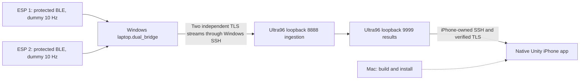

# Week 7: test the complete system and demonstrate it

This is the operating guide for the current **two physical ESP32 → Windows → Ultra96 → native Unity iPhone** system. The ESPs generate approved dummy packets at **10 Hz each**. The purpose is to demonstrate communications, authentication, packet accounting and the live Phone display. Real sensors, trained inference accuracy, two-glove time alignment and ARKit behavior are separate work.

Read [the current physical acceptance report](phone-post-update-test-2026-09-21.md) for the September 21 results. Older runbooks contain useful setup details, but their single-ESP commands, iSH receiver, deployment directories and historical PIDs are not the daily launch procedure below.

For the architecture, protocols and file-by-file explanation, read the companion [system technical report](week7-system-technical-report.md).

Use [daily launch](#4-daily-launch-checklist) when the devices are already configured. For first use, work through [Windows preparation](#2-prepare-a-checkout-and-evidence-folder-on-windows) and [one-time setup](#3-one-time-esp-and-iphone-setup). The remaining sections cover [board checks](#5-check-the-board-without-redeploying-or-stopping-it), [the tunnel](#6-start-and-verify-the-windows-ingestion-tunnel), [capture and acceptance](#7-capture-a-complete-physical-run-and-save-its-outcome), [the test matrix](#8-test-matrix-what-to-run-and-what-it-establishes), [offline rehearsal](#9-offline-rehearsal-and-command-reference), [the professor demo](#10-five-to-seven-minute-professor-demonstration), [problems](#11-common-problems) and [cleanup](#12-finish-safely-and-retain-the-evidence).

## 1. What runs where



| Machine/component | What you run | What to watch |
|---|---|---|
| ESP 1, original unit | Protected `firebeetle32-left` firmware; device ID **1**, BLE **38:18:2B:19:82:AE** | Powered and in radio range; Windows device 1 counters increase. |
| ESP 2, newer unit | Protected `firebeetle32-right` firmware; device ID **2**, BLE **38:18:2B:18:9D:6A** | Powered and in radio range; Windows device 2 counters increase. |
| Windows terminal A | Foreground ingestion SSH tunnel | It remains open; local **127.0.0.1:18889** forwards to board **127.0.0.1:8888**. |
| Windows terminal B | `python -m laptop.dual_bridge` | Both progress lines, then saved final JSON and exit code. |
| Windows terminal C, optional | Follow the progress file | Both paths advance during the capture. |
| Ultra96 | Existing `python3 -m ultra96.server` | Loopback listeners 8888/9999 and the correct process/source identity. Normally leave it running. |
| iPhone | Updated installed Unity app, **Week 7 Connect** | `Subscribed`, changing result IDs/labels, increasing `Received` count. |
| Mac | Swift tests, Xcode build/sign/install when updating | Needed for an app update; not needed to relay packets during daily use. |

Both SSH routes use `yanjie@stujump.comp.nus.edu.sg` and then `xilinx@makerslab-fpga-35.ddns.comp.nus.edu.sg`, through **TCP 22**. Application ports 8888 and 9999 stay on the board's loopback interface. The Phone creates its own native SSH/TLS connection to 9999; it does not connect to the Windows tunnel. The TLS server identity is **`ultra96.week7.internal`**, even though a client socket connects to loopback.

**Do not start `laptop.phone_simulator`, `phone.receiver` or `tools.rehearse_remote_week7` against this session during the native Phone demo.** Those are additional subscribers. The board permits one current Phone owner; a newer subscriber replaces the existing one.

USB may supply ESP power. Normal paired operation does not require a USB serial monitor, serial logs, a Mac, or reflashing the ESPs. Data travels over BLE, not USB.

### Files worth knowing

All paths below are relative to the repository root. Run the commands from that root, not from inside `laptop/` or `tools/`.

| File or directory | Purpose |
|---|---|
| `firmware/esp32/platformio.ini`, `firmware/esp32/src/main.cpp` | Two protected firmware profiles and the source generator. |
| `laptop/windows_pairing.py` | Windows authenticated pairing; used at initial setup or deliberate bond recovery. |
| `laptop/dual_bridge.py` | Normal two-device capture command. |
| `laptop/bridge.py`, `laptop/source_audit.py`, `laptop/reporting.py` | Per-device BLE/TLS path, its current `RawInbox` bounded notification queue, source reconciliation and saved reports. |
| `laptop/bounded_telemetry_queue.py` | Separately tested queue groundwork; the current live bridge uses its own `RawInbox`, not this module. |
| `tools/ssh_tunnel.py` | Builds the strict-trust SSH command; optional key/agent supervision. |
| `ultra96/server.py`, `ultra96/protocol.py`, `ultra96/diagnostics.py` | Board ingestion, dummy results, Phone subscription and optional event evidence. |
| `ios-visualizer/Week7Native/` | Native iPhone SSH, TLS, framing, lifecycle, validation and display bridge. |
| `ios-visualizer/xcode-export/Unity-iPhone.xcodeproj` | Actual Unity iPhone Xcode project. |
| `phone/unity/Week7PhoneCore.cs`, `phone/tests/` | Portable C# core and separate Python receiver tests; these do not replace testing the installed native app. |
| `tools/week7_demo.py`, `docs/week7-demo-pack/` | Offline packet explanation, saved demonstration and legacy single-device trace tools. |

## 2. Prepare a checkout and evidence folder on Windows

Use Python **3.10 or newer** for Windows BLE; the project was tested with Python 3.12. Install Git, Python and OpenSSH Client if absent. **Use PowerShell 7.3 or newer (`pwsh`) for every Windows command in this guide.** This preserves the quoted native Python arguments used below; Windows PowerShell 5.1 handles them differently. PlatformIO is needed only to build/flash firmware. The board runtime uses Python 3.8+ standard-library modules; it does not need the Windows Bluetooth packages.

Launch `pwsh` from your terminal, then check the version in the new shell:

```powershell
pwsh
```

```powershell
$PSVersionTable.PSVersion
if ($PSVersionTable.PSVersion -lt [version]'7.3') { throw 'Use PowerShell 7.3 or newer for these commands.' }
```

Open PowerShell in your existing checkout or fresh clone. First check that `README.md`, `laptop`, `tools` and `ultra96` are present. These commands do not depend on `D:\LetThemCook-builds` or an archived worktree:

```powershell
$week7Repo = (Get-Location).Path
if (-not (Test-Path -LiteralPath (Join-Path $week7Repo 'laptop\dual_bridge.py'))) {
    throw 'Open PowerShell in the Let-Them-Cook repository root first.'
}
$week7Local = Join-Path $week7Repo '.week7-local'
New-Item -ItemType Directory -Path $week7Local -Force | Out-Null
$week7Python = Join-Path $week7Local 'venv\Scripts\python.exe'
if (-not (Test-Path -LiteralPath $week7Python)) {
    python -m venv (Join-Path $week7Local 'venv')
    if ($LASTEXITCODE -ne 0) { throw 'Virtual environment creation failed.' }
}
& $week7Python --version
& $week7Python -m pip install -r laptop/requirements.txt -r requirements-dev.txt
if ($LASTEXITCODE -ne 0) { throw 'Dependency installation failed.' }

$week7Stamp = (Get-Date).ToUniversalTime().ToString('yyyyMMddTHHmmssfffZ')
$week7Evidence = Join-Path $week7Local ('system-test-' + $week7Stamp)
New-Item -ItemType Directory -Path $week7Evidence -ErrorAction Stop | Out-Null
git rev-parse HEAD | Set-Content -LiteralPath (Join-Path $week7Evidence 'revision.txt')
$week7Ca = Join-Path $env:USERPROFILE '.codex\private\cg4002-week7-20260906\ca-cert.pem'
$week7Port = 18889
$week7Left = '38:18:2B:19:82:AE'
$week7Right = '38:18:2B:18:9D:6A'
if (-not (Test-Path -LiteralPath $week7Ca)) { throw 'Locate the existing trusted public CA certificate.' }
Write-Host "Evidence directory: $week7Evidence"
```

On the current laptop the CA resolves to `C:\Users\Yanjie Wang\.codex\private\cg4002-week7-20260906\ca-cert.pem`. On a different machine set `$week7Ca` to your authorized copy of the **same public certificate**. A fresh Git clone does not include private provisioning or SSH trust. Obtain the verified public CA and independently verified SSH host keys from the existing setup. Do not generate a replacement CA to fix a normal demo.

Check the public CA without displaying a private key:

```powershell
& $week7Python -c 'import sys; from cryptography import x509; from cryptography.hazmat.primitives import hashes; c=x509.load_pem_x509_certificate(open(sys.argv[1],"rb").read()); print("CA SHA256:",c.fingerprint(hashes.SHA256()).hex()); print("Valid until:",c.not_valid_after_utc)' $week7Ca
```

The enrolled CA SHA-256 is `4dfba4905c171e68c3623dbc952154149076ed89004b85d475e858cc550760ec`. Certificate validity and the machine clocks still matter. The separately issued server certificate must also be valid; a normal TLS preflight below checks it. Certificate renewal is a coordinated provisioning task, not a reason to disable verification.

`.week7-local/` is ignored by Git. Each top-level evidence directory is newly created without `-Force`, and each capture below gets a new subdirectory. Keep successful and failed attempts. Save safe application reports, not password terminals, private keys or raw pairing serial output. Do not use `Start-Transcript` while entering credentials or viewing a pairing passkey.

For a new PowerShell terminal, the variables above do not carry over. Set its repository location and `$week7Python` again, or paste the required absolute paths printed by the first terminal.

## 3. One-time ESP and iPhone setup

Skip this section for the already flashed, paired ESPs and updated installed Phone. A daily test should not erase bonds or rebuild the app.

### Flash and pair the two ESPs on Windows

Use the installed PlatformIO executable or an activated PlatformIO environment. Verify it exists before continuing:

```powershell
$week7Pio = Join-Path $env:USERPROFILE '.platformio\penv\Scripts\platformio.exe'
& $week7Pio --version
& $week7Pio device list
& $week7Pio run --project-dir firmware/esp32 -e firebeetle32-left
& $week7Pio run --project-dir firmware/esp32 -e firebeetle32-right
```

Identify the actual COM port of each board by connecting/checking one unit at a time. Label the units and record the mapping. **Do not assume COM3 or copy the same upload port for both.** Set the following variables only after identification:

```powershell
$week7LeftCom = Read-Host 'Verified COM port for ESP 1 / left'
$week7RightCom = Read-Host 'Verified COM port for ESP 2 / right'
& $week7Pio run --project-dir firmware/esp32 -e firebeetle32-left --target upload --upload-port $week7LeftCom
if ($LASTEXITCODE -ne 0) { throw 'ESP 1 upload failed.' }
& $week7Pio run --project-dir firmware/esp32 -e firebeetle32-right --target upload --upload-port $week7RightCom
if ($LASTEXITCODE -ne 0) { throw 'ESP 2 upload failed.' }
```

Both builds must include the protected source-statistics characteristic. `firebeetle32-left` sets device ID 1, and `firebeetle32-right` sets ID 2. An old image without source statistics cannot pass the dual capture, even if it produces notifications.

For initial pairing, open this unit's monitor in one terminal, without saving its output:

```powershell
& $week7Pio device monitor --port $week7LeftCom --baud 115200
```

In another terminal run `python -m laptop.windows_pairing --address 38:18:2B:19:82:AE`, using the configured `$week7Python` executable. Enter the locally displayed six-digit passkey only into the hidden prompt. Repeat with the right COM port and address `38:18:2B:18:9D:6A`. Require `authenticated_bond: true` for each; safe firmware authentication evidence is `success=1 auth_mode=13 approved=1 current_peer=1`. Close monitors before the normal demo. Do not capture the `PAIR LOCALLY:` line in logs or screenshots.

Pairing commands with the prepared interpreter are:

```powershell
& $week7Python -m laptop.windows_pairing --address $week7Left
& $week7Python -m laptop.windows_pairing --address $week7Right
```

Use the [deliberate bond recovery procedure](week7-runbook.md#deliberate-bond-recovery) only if a diagnosed bond problem requires it. Normal stored-bond reconnection needs no erasure. The unprotected diagnostic firmware and `--diagnostic-unprotected` cannot establish a protected physical pass.

### Update, build and install on the Mac when needed

Follow [the idle-fix Mac handoff](phone-idle-fix-mac-handoff-2026-09-21.md) and [native integration instructions](../ios-visualizer/NATIVE-INTEGRATION.md). Preserve local signing changes. In the Mac checkout:

```sh
git status --short
git switch main
git pull --ff-only origin main
git merge-base --is-ancestor 724f3995f41120640b13711637ba8ab58f7b3ffe HEAD
git lfs pull
git lfs fsck
swift test --package-path ios-visualizer/Week7Native
python3 ios-visualizer/tools/patch_export.py
python3 ios-visualizer/tools/configure_xcode.py
```

Run each next step only if the previous command succeeds. The ancestor check verifies the idle fix is present. If Git reports a conflict/divergence, preserve it; do not reset away local signing work. Open `ios-visualizer/xcode-export/Unity-iPhone.xcodeproj`, select **Unity-iPhone**, the connected unlocked physical iPhone and your own development team, then **Run**. Complete normal device trust, Developer Mode and signing prompts. Merely reopening the old installed app does not install an update. Record the built revision, build outcome and device/iOS version.

On iPhone enable the required VPN, open Unity, tap **Week 7 Connect**, import the existing public CA if needed, keep **Use campus jump host** enabled and enter the authorized board/jump credentials in the app. Passwords are memory-only. The app independently checks its enrolled CA, TLS hostname and pinned SSH host keys. Wait for **`Subscribed, Received: 0`** before starting a controlled fresh-session capture.

Keep Unity foregrounded throughout a normal capture. Locking the Phone, changing apps or opening system UI that deactivates Unity pauses reception and clears credentials. Return to the app, tap Connect and enter credentials again for a new explicit session. Do not describe that flow as automatic background recovery.

## 4. Daily launch checklist

1. Power both already configured ESPs. Enable Windows Bluetooth; close other BLE clients for these devices.
2. Enable the required VPN on **both Windows and iPhone**. Check the existing board server using section 5; leave a healthy service running.
3. Start the Windows ingestion tunnel using section 6, on local **18889**. Keep that terminal open.
4. Open the updated iPhone app and Connect. Confirm `Subscribed`; note its starting received count. Do not start a desktop result subscriber.
5. In the prepared Windows terminal, run a **60-second** capture using section 7. Watch both devices and the Phone.
6. Let the command end normally. Require source-to-ACK clean results and a matching Phone count increase. Save the report and observation.
7. Before the professor session, run a separate **600-second uninterrupted soak**. During a five-to-seven-minute talk show a new short live run plus the saved soak.

If the board, firmware and app are already ready, daily operation is just power/VPN → tunnel → Phone Connect → dual capture. The following sections show the exact checks and commands behind those steps.

## 5. Check the board without redeploying or stopping it

In a Windows **control terminal**, open an interactive board shell. Do not redirect this terminal to a log. These options preserve strict trust independently on both hops:

```powershell
$week7Proxy = 'ssh -o StrictHostKeyChecking=yes -o BatchMode=no -o ConnectTimeout=20 -o ServerAliveInterval=15 -o ServerAliveCountMax=3 -W "[%h]:%p" yanjie@stujump.comp.nus.edu.sg'
$week7SshOptions = @('-o', 'Port=22', '-o', 'StrictHostKeyChecking=yes', '-o', 'BatchMode=no', '-o', 'ConnectTimeout=60', '-o', 'ServerAliveInterval=15', '-o', 'ServerAliveCountMax=3', '-o', "ProxyCommand=$week7Proxy")
ssh @week7SshOptions xilinx@makerslab-fpga-35.ddns.comp.nus.edu.sg
```

Enter passwords only at OpenSSH's interactive prompts. In the **Ultra96 shell**, these are read-only checks:

```sh
week7_root=/var/tmp/cg4002-week7-yanjie-20260907
id
hostname
cat "$week7_root/evidence/server.pid"
ss -ltnp
ps -u "$(id -u)" -o pid=,args=
```

The owned deployment root is the path above. The last verified source directory is **`source-observer-20260921T080754Z`**, containing the observer-enabled server. The post-update report recorded PID **90538** left running after the September 21 tests. That number is historical: **never use it directly in a stop command**. A historical `server.pid` can also be stale after a supervised rotation.

Use the current PID file and the listener/process output together. For the numeric PID you actually observed, inspect its owner, command, working directory and log destinations:

```sh
# Replace the example token with the current, observed numeric PID.
week7_pid=REPLACE_WITH_OBSERVED_PID
ps -p "$week7_pid" -o pid=,uid=,args=
readlink -f "/proc/$week7_pid/cwd"
tr '\000' ' ' < "/proc/$week7_pid/cmdline"
printf '\n'
readlink "/proc/$week7_pid/fd/1"
readlink "/proc/$week7_pid/fd/2"
```

Require the authorized `xilinx` user, the intended `ultra96.server` command, the existing `$week7_root/tls/server-cert.pem` and `server-key.pem`, and the expected source directory. Confirm that **this process** owns **127.0.0.1:8888** and **127.0.0.1:9999**. `0.0.0.0` or an unrelated owner is not the expected state. If the PID file disagrees, record that discrepancy and identify the actual owner; do not kill an arbitrary process to make the port available.

The command line may name an `--event-log-dir`. Record that exact path when present. A running observer's `events.partial.jsonl` is provisional; its initial `status.json` is not a live all-clear counter display. A finalized ledger requires normal server shutdown and matching final files/receipt. You do not need to rotate a healthy service just to perform the daily capture.

### Only if the owned service is absent and both ports are free

Use this conditional **foreground** start in the verified board shell. It reuses the existing code and TLS identity. It does not deploy files or terminate anything:

```sh
week7_root=/var/tmp/cg4002-week7-yanjie-20260907
week7_source="$week7_root/source-observer-20260921T080754Z"
if ss -ltnH | awk '$4 ~ /:(8888|9999)$/ {found=1} END {exit !found}'; then
    printf '%s\n' 'A required port is occupied. Inspect its owner; do not start another server.'
else
    week7_stamp=$(date -u +%Y%m%dT%H%M%SZ)
    week7_observer="$week7_root/evidence/manual-observer-$week7_stamp"
    cd "$week7_source" &&
    /usr/bin/python3 -u -m ultra96.server \
        --cert "$week7_root/tls/server-cert.pem" \
        --key "$week7_root/tls/server-key.pem" \
        --ingest-port 8888 --gateway-port 9999 \
        --event-log-dir "$week7_observer"
fi
```

The observer destination must be new; its logger refuses an existing directory. Require the `listening` event and verify listeners from a second control shell. Keep this foreground terminal open for the test. This manual start does not update an old PID file: record the newly observed PID/path in your notes and verify it again before any later stop. If the expected source/TLS files are absent, or the server errors, preserve that error and resolve the deployment state rather than falling back to an old source directory.

## 6. Start and verify the Windows ingestion tunnel

In **terminal A**, at the repository root, use the same Python environment. This helper prints the command for inspection:

```powershell
& $week7Python -m tools.ssh_tunnel --local-port 18889 --remote-port 8888
```

Printing is not execution. The following wrapper actually launches the helper's argument list as an interactive OpenSSH process; it avoids copying a Windows command-line string through another parser:

```powershell
& $week7Python -c 'import subprocess; from tools.ssh_tunnel import tunnel_command; raise SystemExit(subprocess.run(tunnel_command("yanjie@stujump.comp.nus.edu.sg","xilinx@makerslab-fpga-35.ddns.comp.nus.edu.sg",18889,8888)).returncode)'
```

Enter credentials interactively and leave it running. Successful `ssh -N -T` can be quiet. `--run` on the helper is a supervisor for existing **key/agent authentication**; it uses batch mode and cannot answer password prompts. It is not the password-login command above.

In **terminal B**, inspect the local listener and owning SSH command:

```powershell
Get-NetTCPConnection -State Listen -LocalPort 18889 |
    Select-Object LocalAddress,LocalPort,OwningProcess
Get-CimInstance Win32_Process -Filter "Name='ssh.exe'" |
    Select-Object ProcessId,ParentProcessId,CommandLine
```

Require loopback 127.0.0.1 and the intended `-L 127.0.0.1:18889:127.0.0.1:8888` route. If a listener already existed, inspect it instead of launching a duplicate or killing its owner blindly. A listener alone does not prove the destination. Complete the board identity check above, then perform this verified TLS connection **before** the capture:

```powershell
& $week7Python -c 'import socket,sys; from common.tls import client_context,TLS_SERVER_NAME; raw=socket.create_connection(("127.0.0.1",18889),timeout=8); tls=client_context(sys.argv[1]).wrap_socket(raw,server_hostname=TLS_SERVER_NAME); print("Verified ingestion TLS:",tls.version()); tls.close()' $week7Ca
if ($LASTEXITCODE -ne 0) { throw 'Ingestion TLS preflight failed.' }
```

This probe sends no sensor frames and claims no Phone subscription. Do not change the CA, hostname or strict host-key options to make it pass. All physical capture commands below explicitly use **`--port 18889`**; the CLI default is 18888, so omitting that option would select a different port.

## 7. Capture a complete physical run and save its outcome

Prepare the Phone first. Record its status, received count, device/iOS version, app installation provenance and whether it stayed foregrounded. For an independently measured session, Connect to obtain a fresh count of zero. For the idle-resume test, keep the existing Connect session and use count increments instead.

Paste this convenience function into **terminal B** after section 2. It only invokes repository code and saves files in this session's evidence directory:

```powershell
function Invoke-Week7Capture {
    param([string]$Name, [int]$Seconds = 60)
    $captureDir = Join-Path $week7Evidence $Name
    New-Item -ItemType Directory -Path $captureDir -ErrorAction Stop | Out-Null
    $reportPath = Join-Path $captureDir 'final-report.json'
    $progressPath = Join-Path $captureDir 'progress.stderr.txt'
    Write-Host "Capturing for $Seconds seconds plus startup and normal drain."
    Write-Host "Progress file: $progressPath"
    & $week7Python -m laptop.dual_bridge `
        --ca $week7Ca --port $week7Port `
        --left-address $week7Left --right-address $week7Right `
        --duration $Seconds --ack-window 32 --progress-interval 1 `
        --report $reportPath `
        1> (Join-Path $captureDir 'final.stdout.json') 2> $progressPath
    $captureExit = $LASTEXITCODE
    $captureExit | Set-Content -LiteralPath (Join-Path $captureDir 'exit-code.txt')
    Write-Host "Capture exit code: $captureExit"
    [pscustomobject]@{ Directory=$captureDir; Report=$reportPath; ExitCode=$captureExit }
}

$phoneBefore = [long](Read-Host 'Phone Received count immediately before capture')
$week7Capture = Invoke-Week7Capture -Name 'baseline-60s' -Seconds 60
$week7Capture
```

The capture requires both devices to start before its common observation period begins. Startup and normal shutdown add time beyond `--duration`. Each device has its own BLE connection, bounded notification queue, TLS writer and ACK reader. Window 32 permits up to 32 outstanding frames **per device**; it is the current dual-command default. The legacy single-device bridge defaults to window 1. The accepted dual range is 1–64; do not tune it during the clean demo.

Progress is saved from **stderr**. To see it during the run, open **terminal C**, paste the full progress-file path printed above and use:

```powershell
Get-Content -LiteralPath 'PASTE_THE_PRINTED_PROGRESS_FILE_PATH' -Tail 20 -Wait
```

Replace the placeholder with the actual path. Ctrl+C in **terminal C** only stops viewing the log. Do not stop terminal B early. Typical lines look like this; these numbers are examples, not evidence:

```text
progress mode=physical phase=observation device=1 received=100 processed=100 acked=100 queue=0 drops=0 errors=0
progress mode=physical phase=observation device=2 received=100 processed=100 acked=100 queue=0 drops=0 errors=0
```

Both lines should advance. A momentary queue or ACK difference is not automatically loss; require the final reconciliation. In progress, `received` counts admitted callbacks, `processed` counts packets taken from the queue, and `acked` counts validated board ACKs. In final JSON, the historical `received` field means processed packets, while `callback_received` counts arrivals. A zero queue does not prove all in-flight ACKs are complete.

While the producer runs, observe changing `REST`, `FIST`, `OPEN`, `POINT` labels and result IDs containing both device IDs **1** and **2**. The Phone shows only the latest display value and may skip intermediate labels visually; it is not a per-packet screen recording. Do not move away from Unity to take notes during a continuity test; use the laptop or a second observer.

Wait for terminal B to return. It must stop notifications, read final source snapshots, drain accepted packets/ACKs and close normally. `--report` reserves a new file before connecting and refuses to overwrite an existing file. During the run it contains an explicit `incomplete` marker; normal completion atomically replaces it with final JSON. A crash, incomplete report or absent final report is not a pass.

### Read the saved result

```powershell
$week7Report = Get-Content -LiteralPath $week7Capture.Report -Raw | ConvertFrom-Json
$week7Report | Select-Object clean,mock_input,report_saved,progress_error,common_observation_seconds
$week7Report.run | Format-List
$week7Report.devices.PSObject.Properties | ForEach-Object {
    $d = $_.Value
    [pscustomobject]@{
        Device=$_.Name; Clean=$d.clean; Generated=$d.source.generated
        SourceReceived=$d.source.received; SourceACKed=$d.source.acked
        MissingReceived=$d.source.missing_received; MissingACKed=$d.source.missing_acked
        Queue=$d.queue_size; Unfinished=$d.unfinished; SourceIssue=$d.source_issue
    }
} | Format-Table
if ($week7Capture.ExitCode -ne 0 -or $week7Report.clean -ne $true -or
    $week7Report.mock_input -ne $false -or $week7Report.report_saved -ne $true) {
    throw 'This is not a completed clean physical capture. Preserve the report and diagnose it; do not declare a Phone-count pass.'
}
$week7ExpectedPhone = [long](($week7Report.devices.PSObject.Properties |
    ForEach-Object { $_.Value.source.generated } | Measure-Object -Sum).Sum)
$phoneAfter = [long](Read-Host 'Phone Received count after capture and final delivery settle')
$phoneDelta = $phoneAfter - $phoneBefore
[pscustomobject]@{
    ExpectedFromSources=$week7ExpectedPhone; PhoneIncrease=$phoneDelta
    AggregatePhoneMatch=($phoneDelta -eq $week7ExpectedPhone)
} | Format-List
@{
    observed_at_utc=(Get-Date).ToUniversalTime().ToString('o')
    phone_before=$phoneBefore; phone_after=$phoneAfter; phone_delta=$phoneDelta
    expected_from_sources=$week7ExpectedPhone
    phone_status=(Read-Host 'Observed Phone status after capture')
    foreground_observation=(Read-Host 'Did Unity stay foregrounded throughout? Record yes/no/unknown and any interruption')
} | ConvertTo-Json | Set-Content -LiteralPath (Join-Path $week7Capture.Directory 'phone-observation.json') -Encoding utf8
```

Use the **sum of `devices.*.source.generated`** for the expected Phone increment, provided both source reports are complete and clean. Do not assume 60 seconds means exactly 1,200 packets or 600 seconds means exactly 12,000: startup/subscription boundaries and shutdown contribute real counted packets. Historical post-update runs generated 1,202, 1,206, 621 and 12,003 respectively.

This summary is a convenient view, not a replacement for checking the entire report. The following is the acceptance checklist for an uninterrupted physical run:

| Report field/evidence | Required outcome |
|---|---|
| Process and report | Exit **0**, `clean: true`, `mock_input: false`, `report_saved: true`, `progress_error: false`; final report exists and is not `incomplete`. |
| `run` | Correct revision, `mode: "physical"`, requested duration, expected rate 10, ACK window 32, session `week7-demo`, UTC start/end. |
| Both `devices."1"` and `devices."2"` | `clean: true`, `protected_ble: true`, `input: "physical"`, `runtime_failures: []`, `source_issue: null`, `unfinished: false`, final `queue_size: 0`. |
| Each `source` | `complete: true`, `clean: true`, `source_consistent: true`; stable boot; generated > 0; generated = source_submitted = received = acked. |
| Source error fields | Zero `source_failures`, `missing_received`, `missing_acked`, `sequence_anomalies`, `ack_sequence_anomalies`, `identity_mismatches`, `boot_mismatches`, `interruptions`, `snapshot_errors`. |
| Device anomaly fields | All zero: `malformed`, `stale_dropped`, `generation_dropped`, `duplicate_acks`, `ack_errors`, `ambiguous_dropped`, `transport_errors`, `ble_errors`, `cleanup_errors`, `identity_mismatches`, `source_stats_errors`, `disconnects`, `queue_dropped`, `callback_generation_dropped`, `gaps`, `duplicates`, `out_of_order`, `new_boots`. |
| Sustained production | `sustained_coverage: true`, `silence_ok: true`; `observation_received` meets the 90% rate threshold and `observation_max_silence` is within the configured two-second freshness bound. |
| Phone | Confirmed subscription, no competing producer/subscriber, recorded starting/ending counts; count increase equals complete source total; IDs/labels observed during streaming. |

The rate threshold tolerates timing variation; it **does not allow 10% packet loss**. Every sample actually generated in the measured source intervals must reconcile. `source.start_next_seq` is inclusive, `source.end_next_seq` is exclusive, with uint32 wrap handling. Checking counts and sequence boundaries detects missing trailing samples that an interior-gap check alone could miss.

A clean laptop/source report proves the measured physical source-to-ingestion-ACK path. The Phone comparison adds **aggregate Phone receipt evidence**. It does not save a per-ID Phone receipt ledger or prove exactly-once delivery under every failure. Record any shortfall, even if the laptop report is clean.

### Board evidence when stronger fault localization is needed

The current server supports `--event-log-dir NEW_DIRECTORY`. Events distinguish `result_accepted`, `result_enqueued`, `result_send_started`, `result_write_complete`, no subscriber, stale/overflow drops and send failures. An ingestion ACK is acceptance; **server write completion is not a Phone receipt acknowledgement**.

For a controlled diagnostic experiment, record the exact observer directory and capture boundaries. A finalized record consists of `events.jsonl`, `status.json` and the matching server `observation_stopped` receipt. Require `finalized: true`, `complete: true`, `incomplete: false`, `close_timed_out: false`, matching event-file SHA-256/counts, and zero dropped/lost/overflow/callback/file-cap/writer errors. Review subscriber generations and exact `(session_id, device_id, boot_id, seq)` identity sets for the specified capture windows; totals from a long shared server lifetime are insufficient. Do not stop a healthy shared service solely to create daily-demo evidence. Plan any observer finalization outside the Phone continuity interval and use the verified owned-process cleanup below.

The September 21 investigations used additional local stage-trace and exact-fate audit helpers under `D:\LetThemCook-builds\phone-recovery-20260921`. Those historical helpers and their environment are **not checked-in project entrypoints**. A fresh clone can run the commands in this guide, collect the standard dual report and Phone observation, and inspect server diagnostics. It cannot reproduce those specialized audit receipts simply by naming an archived helper. `tools.week7_demo audit` handles its documented JSONL trace format; it does not accept a dual summary JSON or turn a native Phone count into a per-ID ledger.

## 8. Test matrix: what to run, and what it establishes

Run software checks before touching the physical setup. Tests may fetch dependencies on first use, but do not need the campus board. A skipped platform/compiler test is **not** a passing physical test; retain the test summary and skip reasons.

| Test | Machine and command/steps | Pass condition and limit |
|---|---|---|
| Python regression suite | Windows: `& $week7Python -m pytest laptop/tests tests phone/tests -q -ra` | Exit 0, no unexpected failures; review skips. Covers codec, dual coordination, queues, ACK windows, source reports, trust/framing, cleanup and observer behavior with test peers. Does not establish physical BLE/VPN/Phone delivery. |
| Portable C# core | Windows PowerShell 7: `pwsh -NoProfile -File phone/tests/run_core_tests.ps1` | Exit 0/self-test success. Tests reusable C# logic, not the installed native Swift/Unity build. |
| Native Swift | Mac: `swift test --package-path ios-visualizer/Week7Native` | Successful suite including available Apple bridge tests. Transport tests use local peers; real board/Phone checks remain separate. |
| Firmware build/host checks | PlatformIO builds from section 3; Python suite includes host firmware tests when a C++ compiler is available | Both protected profiles build; inspect compiler-related test skips. Firmware build alone does not flash or authenticate hardware. |
| Local synthetic transport | Section 9, Windows | Local rehearsal `passed: true` and exit 0. No ESP, campus route or physical Phone claim. |
| Short physical baseline | All live components: `Invoke-Week7Capture -Name 'baseline-60s' -Seconds 60` | Full section 7 clean checklist and matching Phone increment. |
| Foreground quiet/resume | After a clean baseline, stop sending for at least 120 seconds; do not tap Connect, lock, leave Unity or replace subscriber. Then run a new 60-second capture | Phone remains `Subscribed` at observations, resumes fresh results, cumulative count/increment matches both source reports. Record actual idle timing and any status change. For a board-proven quiet interval/continuity claim, retain subscriber-generation/write timestamps as in the acceptance report. |
| Ten-minute soak | `Invoke-Week7Capture -Name 'soak-600s' -Seconds 600` after a confirmed Phone subscription | Both paths clean throughout, final source counts reconcile and Phone increment matches. No deliberate faults mixed into this run. |
| One-ESP outage | Separate 120-second fault capture: after both progress, remove the only power supply to one identified ESP for about 10 seconds, restore it | Healthy device keeps advancing; interrupted device visibly stops then reconnects with fresh data/new boot as applicable. Record action times. Whole-run `clean: false` is expected; do not claim outage replay. Follow with a new clean capture. |
| Phone lock/recovery | With no sender running, record count; lock, unlock, return to Unity, record `paused`; explicitly Connect, re-enter credentials, require fresh zero; then new 30/60-second capture | Manual foreground recovery and subsequent clean count match. Does not test delivery while locked. |
| Phone VPN/recovery | Separate experiment, sender stopped: record action times while toggling Phone VPN; restore it, return to app and explicitly Connect if paused; capture again | Record the actual action/status and clean post-recovery count. Do not infer automatic reconnect or outage delivery. |
| Windows tunnel failure | Optional separate fault capture: Ctrl+C only the owned foreground ingestion tunnel, then relaunch it interactively | Failure is visible; fresh traffic can recover; unresolved writes/drops stay counted. Run a separate uninterrupted acceptance capture afterward. |
| Trust rejection | Automated regression tests first; optional isolated local peer with wrong CA/hostname | Connection is rejected and no valid result displayed. Do not alter production trust to stage this demo. |

For each attempt save mode, repository revision, firmware/device addresses, Phone setup/build provenance, board source/observer path, UTC/action times, final report, stderr progress, exit code and Phone observations. Use a different capture name every time, for example `idle-resume-60s`, `fault-left-power-120s`, `after-lock-30s`, `post-fault-clean-60s`.

To repeat the physical wrapper, set a new starting count and use a new name:

```powershell
$phoneBefore = [long](Read-Host 'Phone Received count immediately before this attempt')
$week7Capture = Invoke-Week7Capture -Name 'soak-600s' -Seconds 600
# Repeat the section 7 report/Phone-reading block for this new $week7Capture.
```

Keep the quiet-period test distinct from a phone lock test. Healthy idle is permitted by the updated receiver. `No live result` after about **two seconds without new results** is intentional expiry of the displayed latest value; it is compatible with status `Subscribed` and a retained received count. `Paused`, transport errors or repeated Connect cycles have different meanings.

Buffers are finite: default per-device notification capacity 64, ACK window 32, board Phone queue 32, and a two-second freshness policy. Outage data is not replayed. A silent blackhole may wait for operating-system transport failure because no heartbeat was added. These are operating limits, not claims that deliberate loss can always be concealed or repaired.

## 9. Offline rehearsal and command reference

### Inspect the supported interfaces

These commands show current options without connecting to hardware:

```powershell
& $week7Python -m laptop.dual_bridge --help
& $week7Python -m laptop.windows_pairing --help
& $week7Python -m tools.ssh_tunnel --help
& $week7Python -m ultra96.server --help
& $week7Python -m tools.generate_week7_pki --help
& $week7Python -m tools.rehearse_week7 --help
& $week7Python -m tools.rehearse_remote_week7 --help
& $week7Python -m tools.week7_demo --help
& $week7Python -m tools.week7_demo sender --help
& $week7Python -m tools.week7_demo audit --help
```

The selected physical route uses `laptop.dual_bridge`. `tools.week7_demo sender` is a **single-device** protected sender with packet/ACK traces and no subscriber. `tools.rehearse_remote_week7` is a **desktop rehearsal** with its own result subscriber; its presence changes Phone ownership. The `--confirmed-remote-topology` flag on that tool is an operator assertion after verifying both real forwards, not an automatic remote-route test. Do not use it as the native Phone demo command.

### Isolated local synthetic rehearsal

This runs local software with temporary test certificates. The PKI generator deliberately refuses paths inside Git repositories/worktrees, including `.week7-local`, because it creates disposable **private keys**. Put test PKI in a new temporary directory **outside** the checkout; keep ordinary reports under `.week7-local`:

```powershell
$week7TestPki = Join-Path $env:TEMP ('week7-test-pki-' + [guid]::NewGuid().ToString('N'))
& $week7Python -m tools.generate_week7_pki --output-dir $week7TestPki
if ($LASTEXITCODE -ne 0) { throw 'Isolated test PKI generation failed.' }
& $week7Python -m tools.rehearse_week7 --pki-dir $week7TestPki --target 100 --duration 30 `
    1> (Join-Path $week7Evidence 'local-synthetic.json') `
    2> (Join-Path $week7Evidence 'local-synthetic.stderr.txt')
$week7SyntheticExit = $LASTEXITCODE
$week7SyntheticExit | Set-Content -LiteralPath (Join-Path $week7Evidence 'local-synthetic.exit.txt')
Get-Content -LiteralPath (Join-Path $week7Evidence 'local-synthetic.json')
```

This rehearsal owns a local server and local subscriber. Require exit 0 and `passed: true`, with `source: "synthetic"` and topology identifying local TLS only. Its mock source rate/count timing is separate from the physical two-device measurement.

For an optional **dual synthetic** coordinator check, run a local server in another terminal with the same temporary PKI and unused loopback ports:

```powershell
& $week7Python -m ultra96.server `
    --cert (Join-Path $week7TestPki 'server-cert.pem') `
    --key (Join-Path $week7TestPki 'server-key.pem') `
    --ingest-port 28888 --gateway-port 29999
```

Then, from the original terminal:

```powershell
& $week7Python -m laptop.dual_bridge --mock --port 28888 `
    --ca (Join-Path $week7TestPki 'ca-cert.pem') --duration 10 `
    --report (Join-Path $week7Evidence 'dual-synthetic.json') `
    1> (Join-Path $week7Evidence 'dual-synthetic.stdout.json') `
    2> (Join-Path $week7Evidence 'dual-synthetic.stderr.txt')
$week7DualSyntheticExit = $LASTEXITCODE
$week7DualSyntheticExit | Set-Content -LiteralPath (Join-Path $week7Evidence 'dual-synthetic.exit.txt')
```

Require `clean: true`, `mock_input: true` and exit 0. This checks the two-stream source-to-ACK software path; it starts no Phone observer. Shut down only this foreground local server with Ctrl+C. Never import its temporary CA into the production Phone or copy its keys to the board.

### Portable recorded backup

These need neither VPN nor a live server:

```powershell
& $week7Python -m tools.week7_demo packet
& $week7Python -m tools.week7_demo audit docs/week7-demo-pack/recorded-demo100.jsonl --minimum-count 100
Get-Content -LiteralPath docs/week7-demo-pack/recorded-demo100.jsonl -TotalCount 8
```

The first command explains packet/framing examples; it is a fixture. The second checks a **previously recorded** 100-packet demonstration and should report `audit_passed: true`. Present it as recorded evidence, with its original source/topology from the [demo pack](week7-demo-pack/README.md), not today's live two-ESP/native Phone test. The old printable brief and talk track predate the latest native-app acceptance; use the current findings below when discussing status.

## 10. Five-to-seven-minute professor demonstration

Before the meeting, complete the 600-second physical soak, save all results, confirm the iPhone has the updated app and rehearse a new 60-second capture. Have this guide, the [post-update physical report](phone-post-update-test-2026-09-21.md), a packet example and the saved baseline/soak open. Do not consume the presentation time with first-time pairing, Mac signing or password troubleshooting.

| Time | Action | Suggested explanation |
|---|---|---|
| 0:00–0:45 | Show the two labeled ESPs, laptop, board route and actual Phone | “These are two physical protected BLE sources, generating dummy packets at 10 Hz each. The laptop forwards each through its own TLS stream. The Phone receives directly from the board over its own SSH/TLS connection.” |
| 0:45–1:15 | Show `Subscribed`, starting Phone count, terminal A listener and intended endpoint names | “The exposed board service is SSH on port 22. Application ports are private loopback destinations. SSH host identity and the TLS certificate/hostname are checked independently.” Keep password/setup screens out of recordings. |
| 1:15–2:30 | Start fresh `professor-live-60s`; display both progress lines and the Phone | “Both device counters advance independently. Result IDs retain device, boot and sequence identity. The deterministic REST/FIST/OPEN/POINT mapping demonstrates transport, not trained inference.” |
| 2:30–3:30 | Let normal shutdown finish; show clean source reports, saved exit code and Phone delta | “We compare what the ESPs actually generated with reception and acknowledged ingestion. This run generated **[read actual total]**; the Phone count increased by **[read actual increment]**. These numbers come from the saved report, not an assumed duration multiplied by rate.” |
| 3:30–4:30 | Show the uninterrupted 600-second evidence and September 21 acceptance table | “The saved soak tests duration beyond this short talk. Board write accounting and aggregate Phone counts are separate evidence boundaries.” |
| 4:30–5:30 | Stop sending and show quiet subscribed behavior; explain recovery with retained fault evidence | “The latest-value label expires after two seconds without input; the subscription can remain healthy. Locking or backgrounding pauses this app; we manually Connect again. Finite queues and freshness limits mean outage packets are not replayed.” |
| 5:30–6:30 | Summarize measured outcome and remaining scope; use a separately labeled fault demonstration only if time permits | “The tested communications path passes these bounded captures. Real sensors, model accuracy and guaranteed delivery through arbitrary outages are outside this result.” |

During the live step, use the same capture function with a new name:

```powershell
$phoneBefore = [long](Read-Host 'Phone count before professor live capture')
$week7Capture = Invoke-Week7Capture -Name 'professor-live-60s' -Seconds 60
# Then run the section 7 report/Phone-reading block.
```

If the Phone count or report does not match, say so and preserve it. Do not reset a count mid-run, conceal a failed report, or replace the physical test silently with mock input. Switch to the explicitly labeled recorded backup or isolated synthetic rehearsal and explain which link is unavailable. A deliberate fault is a separate run, after saving a clean pass, with its action time and expected non-clean outcome.

### Current evidence to cite accurately

The [September 21 post-update report](phone-post-update-test-2026-09-21.md) records:

| Physical capture | Clean source/BLE/ACK total | Observed Phone count | Board evidence |
|---|---:|---:|---|
| Baseline, 60 seconds | 1,202 | 1,202 | Exactly one write completion per expected ID. |
| Resume after a measured 129.286-second board-write quiet interval | 1,206 | 2,408 cumulative; increment 1,206 | Same subscriber generation across baseline/idle/resume; all 2,408 expected IDs written once. |
| Explicit manual Connect after requested Phone VPN cycle, 30 seconds | 621 | 621 in fresh session | All expected IDs written once; VPN action/timing not independently measured. |
| After lock/unlock and explicit Connect, 600 seconds | 12,003 | 12,003 in fresh session | All expected IDs written once; subscriber stable during capture. |
| **Combined** | **15,032** | **15,032 across those sessions/increments** | **15,032 exact board write fates**. |

These were physical protected dummy-source tests. Phone counts/status were operator observations, not a saved per-ID iPhone receipt ledger. The update's installed-build provenance was operator-reported; the app did not expose an extracted revision. Foreground continuity was not explicitly confirmed throughout the entire historical idle interval, while the board independently established subscriber continuity. Say what was measured and what was not.

The earlier **109-result** Phone shortfall remains unexplained. A separate pre-fix idle-resume test lost **16 results** while no subscriber was present, motivating the idle-timer update. Both remain in the [earlier full-system report](dual-esp-iphone-test-2026-09-21.md) and [recovery report](phone-recovery-test-2026-09-21.md). Passing retests do not erase them or establish universal perfect delivery. The official professor's marking rubric is not included here; this guide describes the engineering demonstration and its evidence.

## 11. Common problems

| Symptom | Check and next action |
|---|---|
| `No module named laptop` / helper not found | Work from the checkout root and use its prepared interpreter. Do not point to archived build-directory helpers. |
| CA missing / fingerprint differs | Locate the existing verified public CA. Do not generate a replacement production trust root. |
| Host-key verification fails | Check the endpoint and independently verified known-host entry. Do not use `StrictHostKeyChecking=no` or remove unrelated trust records. |
| SSH times out before the board prompt | Check Windows VPN and jump reachability; answer interactive prompts within the selected timeouts. The helper's `--run` mode cannot handle passwords. |
| Address already in use on 18889 | Inspect `Get-NetTCPConnection` and the owning process. Reuse the correct existing tunnel or stop only your verified owner. Keep `--port` consistent with the selected local forward. |
| Local listener exists but TLS fails | Verify the remote board process/ports, CA/server certificate validity, clocks and SNI. A local listener alone is not a successful campus route. |
| Only one ESP progresses | Confirm both units have power, different explicit BLE addresses and IDs 1/2, correct protected firmware and no competing BLE client. Preserve per-device failures. |
| Source-statistics characteristic missing / `source_issue` present | The firmware may predate dual source auditing. Check the protected left/right builds; a legacy notification stream is insufficient. |
| Authenticated bond failure | Use the exact address and approved pairing procedure. Keep security enabled; only perform deliberate bond cleanup when diagnosed. |
| `Subscribed`, count stable, `No live result` | Normal during no input after the two-second display expiry. Start a new controlled sender; do not reflexively Connect again during an idle-continuity test. |
| `Paused` after lock/app switch | Return to Unity, explicitly Connect and enter credentials; establish a new count baseline before sending. |
| Phone drops when a desktop check starts | Stop the competing subscriber. A newer same-session subscriber replaces the Phone. Reconnect the Phone and start a new clearly identified attempt. |
| Laptop clean but Phone count short | Keep both observations. Check Phone foreground state, subscription ownership and server result fates. An ACK does not establish Phone receipt. |
| Queue/stale/ambiguous drops or nonzero anomalies | Run is not clean. Diagnose radio/network/ACK progress and overload. Larger buffers/windows cannot guarantee delivery through an arbitrary outage. |
| File already exists / report reservation failed | Pick a new capture name/directory. Do not overwrite the previous attempt. Reservation failures exit before connecting. |
| `incomplete` report / `unfinished: true` | Normal capture finalization did not complete. Preserve the file and exit/progress evidence; rerun as a new attempt after resolving the cause. |
| Phone authentication names Board or Jump host | Correct that hop's credentials in the app. Passwords are not automatically retried after an authentication failure. |
| Mac tests/build/install fail | Keep the actual error and use the linked Mac integration procedure. Windows Python tests cannot validate an Apple build or install an update. |

## 12. Finish safely and retain the evidence

1. Let the capture finish normally; save its report, progress, exit code and Phone observation. Ensure no capture is still writing before copying evidence. Keep failed attempts alongside passes.
2. Stop the progress-file follower with Ctrl+C in its own terminal. Disconnect or leave the Phone app when finished; note that this ends the foreground session.
3. Stop only your ingestion tunnel using Ctrl+C in **terminal A**. Recheck `Get-NetTCPConnection -State Listen -LocalPort 18889`. No matching connection after stopping your sole tunnel is expected; if one remains, inspect its current owner/command before taking action. Do not kill all `ssh.exe` or Python processes.
4. Leave the existing healthy board service running for the next operator. If you started a foreground server specifically for this isolated test and are ending it, use Ctrl+C in **that server terminal**, require `stopped` and `observation_stopped` output when diagnostics are enabled, and inspect the resulting status/ports. A forced terminal closure is not evidence of a clean observer finalization.
5. For an exceptional stop of a background owned server, read its current PID record and repeat the current owner, `/proc/PID/cwd`, `/proc/PID/cmdline` and listener checks first. Only after they match the intended owned service, use `kill -TERM "$week7_pid"`. Verify its graceful stopped receipt and released listeners. Do not reuse a historical PID, invoke `pkill`, or stop unrelated board services.
6. Preserve only safe public/configuration identifiers with the reports. Do not commit passwords, pairing passkeys, private keys, test PKI or raw serial captures. Temporary PKI remains outside Git; no recursive cleanup is required for a demo. Retain its exact path and remove only that owned directory when you deliberately retire those local test credentials.

Record the final state: ESPs powered/off, Phone disconnected/subscribed, Windows tunnel stopped/running and board service left running/stopped with its verified current source path. The next operator should be able to start from that record without guessing which historical process is still alive.
