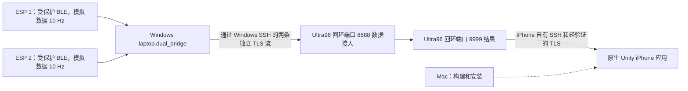

# 第 7 周：完整系统测试与演示指南

> 中文版整理日期：2026-09-26。本指南完整翻译自[英文原版](week7-testing-and-demo-guide.md)，保留原文中的 2026-09-21 测试证据及其限制。本次中文整理未开展新的实物测试。为保证可直接复用，命令、代码块中的注释及交互提示保留英文原文。

本指南适用于当前的**两块实体 ESP32 → Windows → Ultra96 → 原生 Unity iPhone** 系统。每块 ESP 按获准方案以 **10 Hz** 生成模拟数据包。目标是演示通信、身份认证、数据包核算和手机实时显示。真实传感器、训练模型的推理准确率、双手套时间对齐以及 ARKit 行为属于其他工作范围。

9 月 21 日的结果见[当前实物验收报告](phone-post-update-test-2026-09-21.md)。旧版操作手册包含有用的配置细节，但其中的单 ESP 命令、iSH 接收器、部署目录及历史 PID 不适用于下文的日常启动流程。

有关架构、协议和逐文件说明，请阅读配套的[系统技术报告（中文版）](week7-system-technical-report.zh-CN.md)。

设备已配置好时，直接使用[日常启动检查清单](#4-daily-launch-checklist)。首次使用时，先完成 [Windows 准备](#2-prepare-a-checkout-and-evidence-folder-on-windows)和[一次性配置](#3-one-time-esp-and-iphone-setup)。后续章节依次介绍[板端检查](#5-check-the-board-without-redeploying-or-stopping-it)、[隧道](#6-start-and-verify-the-windows-ingestion-tunnel)、[采集与验收](#7-capture-a-complete-physical-run-and-save-its-outcome)、[测试矩阵](#8-test-matrix-what-to-run-and-what-it-establishes)、[离线彩排](#9-offline-rehearsal-and-command-reference)、[教授演示](#10-five-to-seven-minute-professor-demonstration)、[常见问题](#11-common-problems)和[结束清理](#12-finish-safely-and-retain-the-evidence)。

<a id="1-what-runs-where"></a>
## 1. 各设备运行什么



| 机器/组件 | 运行内容 | 观察要点 |
|---|---|---|
| ESP 1，原有设备 | 受保护的 `firebeetle32-left` 固件；设备 ID **1**，BLE **38:18:2B:19:82:AE** | 已供电并处于无线覆盖范围内；Windows 中设备 1 的计数持续增加。 |
| ESP 2，较新的设备 | 受保护的 `firebeetle32-right` 固件；设备 ID **2**，BLE **38:18:2B:18:9D:6A** | 已供电并处于无线覆盖范围内；Windows 中设备 2 的计数持续增加。 |
| Windows 终端 A | 在前台运行的数据接入 SSH 隧道 | 保持终端打开；本地 **127.0.0.1:18889** 转发至板端 **127.0.0.1:8888**。 |
| Windows 终端 B | `python -m laptop.dual_bridge` | 两个设备的进度行，以及随后保存的最终 JSON 和退出码。 |
| Windows 终端 C，可选 | 持续查看进度文件 | 采集期间，两条路径的进度均持续推进。 |
| Ultra96 | 已在运行的 `python3 -m ultra96.server` | 回环地址上的 8888/9999 监听端口，以及正确的进程和源码身份。通常让服务继续运行。 |
| iPhone | 已更新并安装的 Unity 应用，**Week 7 Connect** | `Subscribed`、持续变化的结果 ID/标签，以及递增的 `Received` 计数。 |
| Mac | 更新时执行 Swift 测试、Xcode 构建/签名/安装 | 更新应用时需要；日常运行中无需用它中继数据包。 |

两条 SSH 路由均先经过 `yanjie@stujump.comp.nus.edu.sg`，再到达 `xilinx@makerslab-fpga-35.ddns.comp.nus.edu.sg`，使用 **TCP 22**。应用端口 8888 和 9999 始终位于板端回环接口。手机通过自己的原生 SSH/TLS 连接访问 9999，不连接 Windows 隧道。即使客户端套接字连接的是回环地址，TLS 服务端身份仍为 **`ultra96.week7.internal`**。

**原生手机演示期间，不要让 `laptop.phone_simulator`、`phone.receiver` 或 `tools.rehearse_remote_week7` 接入同一会话。** 它们会成为额外的订阅者。板端仅允许一个当前手机接收端占有订阅；新的订阅者会替换现有订阅者。

USB 可用于给 ESP 供电。正常的已配对运行不需要 USB 串口监视器、串口日志、Mac，也不需要重新烧录 ESP。数据通过 BLE 传输，而非 USB。

### 需要了解的文件

以下路径均相对于仓库根目录。请从根目录运行命令，不要在 `laptop/` 或 `tools/` 内运行。

| 文件或目录 | 用途 |
|---|---|
| `firmware/esp32/platformio.ini`、`firmware/esp32/src/main.cpp` | 两个受保护固件配置，以及数据源生成器。 |
| `laptop/windows_pairing.py` | Windows 认证配对；用于初次配置或有意执行的绑定恢复。 |
| `laptop/dual_bridge.py` | 正常的双设备采集命令。 |
| `laptop/bridge.py`、`laptop/source_audit.py`、`laptop/reporting.py` | 每台设备的 BLE/TLS 路径、当前使用的 `RawInbox` 有界通知队列、源端对账和报告保存。 |
| `laptop/bounded_telemetry_queue.py` | 单独测试的队列基础模块；当前实时桥接使用自己的 `RawInbox`，并未使用此模块。 |
| `tools/ssh_tunnel.py` | 生成执行严格信任校验的 SSH 命令；可选的密钥/SSH agent 认证进程监督。 |
| `ultra96/server.py`、`ultra96/protocol.py`、`ultra96/diagnostics.py` | 板端数据接入、模拟结果、手机订阅和可选的事件证据。 |
| `ios-visualizer/Week7Native/` | 原生 iPhone 的 SSH、TLS、分帧、生命周期、校验及显示桥接。 |
| `ios-visualizer/xcode-export/Unity-iPhone.xcodeproj` | 实际使用的 Unity iPhone Xcode 工程。 |
| `phone/unity/Week7PhoneCore.cs`、`phone/tests/` | 可移植 C# 核心，以及独立的 Python 接收器测试；不能替代对已安装原生应用的测试。 |
| `tools/week7_demo.py`、`docs/week7-demo-pack/` | 离线数据包说明、已保存的演示，以及旧版单设备跟踪工具。 |

<a id="2-prepare-a-checkout-and-evidence-folder-on-windows"></a>
## 2. 在 Windows 上准备仓库副本和证据目录

Windows BLE 需要 Python **3.10 或更高版本**；本项目使用 Python 3.12 测试过。如果尚未安装，请安装 Git、Python 和 OpenSSH Client。**本指南中的所有 Windows 命令都必须使用 PowerShell 7.3 或更高版本（`pwsh`）。** 该版本可正确保留下文传递给原生 Python 进程的带引号参数；Windows PowerShell 5.1 对这些参数的处理不同。仅在构建/烧录固件时需要 PlatformIO。板端运行时使用 Python 3.8+ 标准库模块，不需要 Windows 蓝牙软件包。

从终端启动 `pwsh`，然后在新 shell 中检查版本：

```powershell
pwsh
```

```powershell
$PSVersionTable.PSVersion
if ($PSVersionTable.PSVersion -lt [version]'7.3') { throw 'Use PowerShell 7.3 or newer for these commands.' }
```

在已有仓库副本或新克隆的仓库中打开 PowerShell。首先确认 `README.md`、`laptop`、`tools` 和 `ultra96` 均存在。以下命令不依赖 `D:\LetThemCook-builds` 或已归档的 worktree：

```powershell
$week7Repo = (Get-Location).Path
if (-not (Test-Path -LiteralPath (Join-Path $week7Repo 'laptop\dual_bridge.py'))) {
    throw 'Open PowerShell in the Let-Them-Cook repository root first.'
}
$week7Local = Join-Path $week7Repo '.week7-local'
New-Item -ItemType Directory -Path $week7Local -Force | Out-Null
$week7Python = Join-Path $week7Local 'venv\Scripts\python.exe'
if (-not (Test-Path -LiteralPath $week7Python)) {
    python -m venv (Join-Path $week7Local 'venv')
    if ($LASTEXITCODE -ne 0) { throw 'Virtual environment creation failed.' }
}
& $week7Python --version
& $week7Python -m pip install -r laptop/requirements.txt -r requirements-dev.txt
if ($LASTEXITCODE -ne 0) { throw 'Dependency installation failed.' }

$week7Stamp = (Get-Date).ToUniversalTime().ToString('yyyyMMddTHHmmssfffZ')
$week7Evidence = Join-Path $week7Local ('system-test-' + $week7Stamp)
New-Item -ItemType Directory -Path $week7Evidence -ErrorAction Stop | Out-Null
git rev-parse HEAD | Set-Content -LiteralPath (Join-Path $week7Evidence 'revision.txt')
$week7Ca = Join-Path $env:USERPROFILE '.codex\private\cg4002-week7-20260906\ca-cert.pem'
$week7Port = 18889
$week7Left = '38:18:2B:19:82:AE'
$week7Right = '38:18:2B:18:9D:6A'
if (-not (Test-Path -LiteralPath $week7Ca)) { throw 'Locate the existing trusted public CA certificate.' }
Write-Host "Evidence directory: $week7Evidence"
```

在当前笔记本上，CA 路径解析为 `C:\Users\Yanjie Wang\.codex\private\cg4002-week7-20260906\ca-cert.pem`。在其他机器上，应将 `$week7Ca` 设为你获授权持有的**同一张公开证书**的副本。新克隆的 Git 仓库不包含私密配置材料或 SSH 信任记录。请从现有配置获取已验证的公开 CA 证书和经独立核验的 SSH 主机密钥。不要为了修复普通演示而重新生成 CA。

检查公开 CA 时不要显示任何私钥：

```powershell
& $week7Python -c 'import sys; from cryptography import x509; from cryptography.hazmat.primitives import hashes; c=x509.load_pem_x509_certificate(open(sys.argv[1],"rb").read()); print("CA SHA256:",c.fingerprint(hashes.SHA256()).hex()); print("Valid until:",c.not_valid_after_utc)' $week7Ca
```

已登记 CA 的 SHA-256 为 `4dfba4905c171e68c3623dbc952154149076ed89004b85d475e858cc550760ec`。证书有效期和机器时钟同样需要正确。单独签发的服务端证书也必须有效；下文的常规 TLS 预检会检查这一点。证书续期需要协调配置，不能因此关闭验证。

`.week7-local/` 已被 Git 忽略。每个顶层证据目录都应新建，不使用 `-Force`；下文的每次采集也都使用新的子目录。成功和失败的尝试都要保留。只保存安全的应用报告，不保存输入密码的终端记录、私钥或配对过程的原始串口输出。输入凭据或查看配对口令时，不要使用 `Start-Transcript`。

上述变量不会自动带入新开的 PowerShell 终端。请重新设置仓库位置和 `$week7Python`，或粘贴第一个终端输出的所需绝对路径。

<a id="3-one-time-esp-and-iphone-setup"></a>
## 3. ESP 和 iPhone 的一次性配置

如果 ESP 已烧录并配对、手机也已安装更新后的应用，可跳过本节。日常测试不应清除绑定或重新构建应用。

### 在 Windows 上烧录并配对两块 ESP

使用已安装的 PlatformIO 可执行文件，或已激活的 PlatformIO 环境。继续之前先确认其可用：

```powershell
$week7Pio = Join-Path $env:USERPROFILE '.platformio\penv\Scripts\platformio.exe'
& $week7Pio --version
& $week7Pio device list
& $week7Pio run --project-dir firmware/esp32 -e firebeetle32-left
& $week7Pio run --project-dir firmware/esp32 -e firebeetle32-right
```

每次仅连接/检查一块板，以确认各板实际使用的 COM 端口。给设备贴好标签并记录对应关系。**不要假定端口是 COM3，也不要为两块板照抄同一个上传端口。** 确认后再设置以下变量；交互提示分别要求输入已核实的 ESP 1/左侧和 ESP 2/右侧 COM 端口：

```powershell
$week7LeftCom = Read-Host 'Verified COM port for ESP 1 / left'
$week7RightCom = Read-Host 'Verified COM port for ESP 2 / right'
& $week7Pio run --project-dir firmware/esp32 -e firebeetle32-left --target upload --upload-port $week7LeftCom
if ($LASTEXITCODE -ne 0) { throw 'ESP 1 upload failed.' }
& $week7Pio run --project-dir firmware/esp32 -e firebeetle32-right --target upload --upload-port $week7RightCom
if ($LASTEXITCODE -ne 0) { throw 'ESP 2 upload failed.' }
```

两个构建都必须包含受保护的源端统计特征。`firebeetle32-left` 将设备 ID 设为 1，`firebeetle32-right` 将 ID 设为 2。不含源端统计的旧固件即使能产生通知，也无法通过双设备采集验收。

首次配对时，在一个终端打开该设备的串口监视器，但不要保存输出：

```powershell
& $week7Pio device monitor --port $week7LeftCom --baud 115200
```

在另一个终端中，使用已配置的 `$week7Python` 可执行文件运行 `python -m laptop.windows_pairing --address 38:18:2B:19:82:AE`。仅在隐藏输入提示中输入本地显示的六位配对口令。随后对右侧 COM 端口和地址 `38:18:2B:18:9D:6A` 重复操作。每块设备都必须得到 `authenticated_bond: true`；可安全保存的固件认证证据为 `success=1 auth_mode=13 approved=1 current_peer=1`。正常演示前关闭串口监视器。不要将 `PAIR LOCALLY:` 行记录到日志或截图中。

使用已准备好解释器的配对命令如下：

```powershell
& $week7Python -m laptop.windows_pairing --address $week7Left
& $week7Python -m laptop.windows_pairing --address $week7Right
```

只有已诊断出的绑定问题确实需要恢复时，才使用[有意执行的绑定恢复流程](week7-runbook.md#deliberate-bond-recovery)。正常使用已存储绑定重连时无需清除绑定。无保护的诊断固件和 `--diagnostic-unprotected` 不能作为受保护实物测试通过的依据。

### 需要时在 Mac 上更新、构建并安装

遵循[空闲修复的 Mac 交接说明](phone-idle-fix-mac-handoff-2026-09-21.md)及[原生集成说明](../ios-visualizer/NATIVE-INTEGRATION.md)。保留本地签名配置修改。在 Mac 仓库副本中执行：

```sh
git status --short
git switch main
git pull --ff-only origin main
git merge-base --is-ancestor 724f3995f41120640b13711637ba8ab58f7b3ffe HEAD
git lfs pull
git lfs fsck
swift test --package-path ios-visualizer/Week7Native
python3 ios-visualizer/tools/patch_export.py
python3 ios-visualizer/tools/configure_xcode.py
```

只有上一条命令成功后，才能执行下一步。祖先检查用于确认空闲修复已包含在当前版本中。如果 Git 报告冲突或分叉，应保留当前状态，不要通过重置丢弃本地签名工作。打开 `ios-visualizer/xcode-export/Unity-iPhone.xcodeproj`，选择 **Unity-iPhone**、已连接并解锁的实体 iPhone 和你自己的开发团队，然后点击 **Run**。完成正常的设备信任、Developer Mode 和签名提示。仅重新打开已安装的旧应用不会安装更新。记录构建的仓库修订、构建结果以及设备/iOS 版本。

在 iPhone 上开启所需 VPN，打开 Unity，点击 **Week 7 Connect**；如有需要，导入现有公开 CA，保持 **Use campus jump host** 启用，并在应用中输入获授权的板端/跳板机凭据。密码只保存在内存中。应用会独立检查已登记的 CA、TLS 主机名和固定的 SSH 主机密钥。开始一次受控的新会话采集前，等待显示 **`Subscribed, Received: 0`**。

正常采集期间，始终让 Unity 保持前台。锁定手机、切换应用或打开使 Unity 失去活跃状态的系统界面，都会暂停接收并清除凭据。返回应用后，点击 Connect 并重新输入凭据，以显式建立新会话。不要将此流程描述为自动后台恢复。

<a id="4-daily-launch-checklist"></a>
## 4. 日常启动检查清单

1. 给两块已配置好的 ESP 供电。开启 Windows 蓝牙，关闭连接这些设备的其他 BLE 客户端。
2. 在 **Windows 和 iPhone 两端**开启所需 VPN。按第 5 节检查现有板端服务器；正常服务应继续运行。
3. 按第 6 节启动 Windows 数据接入隧道，使用本地端口 **18889**。保持该终端打开。
4. 打开已更新的 iPhone 应用并执行 Connect。确认 `Subscribed`，记录接收计数的起始值。不要启动桌面端结果订阅者。
5. 在准备好的 Windows 终端中，按第 7 节运行 **60 秒**采集。观察两个设备和手机。
6. 等待命令正常结束。要求源端到 ACK 的结果满足 clean 条件，且手机计数增量一致。保存报告和观察记录。
7. 教授演示前，单独运行一次 **600 秒不间断长时间测试**。在五至七分钟的讲解中，展示一次新的短时现场运行，以及已保存的长时间测试结果。

如果板端、固件和应用均已准备就绪，日常操作就是供电/VPN → 隧道 → 手机 Connect → 双设备采集。以下各节给出这些步骤对应的具体检查与命令。

<a id="5-check-the-board-without-redeploying-or-stopping-it"></a>
## 5. 检查板端，不重新部署或停止服务

在 Windows **控制终端**中打开交互式板端 shell。不要将该终端重定向到日志。以下选项分别对两跳保留严格的信任校验：

```powershell
$week7Proxy = 'ssh -o StrictHostKeyChecking=yes -o BatchMode=no -o ConnectTimeout=20 -o ServerAliveInterval=15 -o ServerAliveCountMax=3 -W "[%h]:%p" yanjie@stujump.comp.nus.edu.sg'
$week7SshOptions = @('-o', 'Port=22', '-o', 'StrictHostKeyChecking=yes', '-o', 'BatchMode=no', '-o', 'ConnectTimeout=60', '-o', 'ServerAliveInterval=15', '-o', 'ServerAliveCountMax=3', '-o', "ProxyCommand=$week7Proxy")
ssh @week7SshOptions xilinx@makerslab-fpga-35.ddns.comp.nus.edu.sg
```

仅在 OpenSSH 的交互式提示中输入密码。以下是在 **Ultra96 shell** 中执行的只读检查：

```sh
week7_root=/var/tmp/cg4002-week7-yanjie-20260907
id
hostname
cat "$week7_root/evidence/server.pid"
ss -ltnp
ps -u "$(id -u)" -o pid=,args=
```

本次授权管理的部署根目录即上述路径。最后核实的源码目录是 **`source-observer-20260921T080754Z`**，其中包含已启用观测记录功能的服务器。更新后报告记载，9 月 21 日测试结束时留下运行的 PID 为 **90538**。该数字属于历史记录：**绝不要直接将它用于停止命令**。经过受控的服务轮换后，历史 `server.pid` 也可能已经过期。

应结合当前 PID 文件与监听端口/进程输出判断。针对你实际观察到的数字 PID，检查其属主、命令、工作目录和日志去向。下列占位符必须替换为当前观察到的 PID：

```sh
# Replace the example token with the current, observed numeric PID.
week7_pid=REPLACE_WITH_OBSERVED_PID
ps -p "$week7_pid" -o pid=,uid=,args=
readlink -f "/proc/$week7_pid/cwd"
tr '\000' ' ' < "/proc/$week7_pid/cmdline"
printf '\n'
readlink "/proc/$week7_pid/fd/1"
readlink "/proc/$week7_pid/fd/2"
```

必须确认属主为获授权的 `xilinx` 用户，命令为预期的 `ultra96.server`，使用现有 `$week7_root/tls/server-cert.pem` 和 `server-key.pem`，且位于预期源码目录。确认 **127.0.0.1:8888** 和 **127.0.0.1:9999** 均由**这一进程**持有。监听 `0.0.0.0` 或由无关进程持有端口都不符合预期。如果 PID 文件与实际情况不一致，应记录差异并识别真正的端口占用进程；不要为了腾出端口而随意终止进程。

命令行中可能包含 `--event-log-dir`。若存在，请记录其准确路径。运行中观测器的 `events.partial.jsonl` 只是临时记录；初始 `status.json` 也不是实时显示“一切正常”的计数面板。完成定稿的明细账要求服务器正常关闭，并具备相互匹配的最终文件/回执。日常采集无需仅为此而轮换正常运行的服务。

### 仅在本次管理的服务不存在且两个端口都空闲时

在已核实的板端 shell 中使用下面的条件式**前台**启动命令。它复用现有代码和 TLS 身份，不部署文件，也不终止任何进程：

```sh
week7_root=/var/tmp/cg4002-week7-yanjie-20260907
week7_source="$week7_root/source-observer-20260921T080754Z"
if ss -ltnH | awk '$4 ~ /:(8888|9999)$/ {found=1} END {exit !found}'; then
    printf '%s\n' 'A required port is occupied. Inspect its owner; do not start another server.'
else
    week7_stamp=$(date -u +%Y%m%dT%H%M%SZ)
    week7_observer="$week7_root/evidence/manual-observer-$week7_stamp"
    cd "$week7_source" &&
    /usr/bin/python3 -u -m ultra96.server \
        --cert "$week7_root/tls/server-cert.pem" \
        --key "$week7_root/tls/server-key.pem" \
        --ingest-port 8888 --gateway-port 9999 \
        --event-log-dir "$week7_observer"
fi
```

观测记录的目标目录必须是新目录；记录器会拒绝使用已存在的目录。必须看到 `listening` 事件，并从第二个控制 shell 验证监听端口。测试期间保持此前台终端打开。手动启动不会更新旧 PID 文件：请在记录中写明新观察到的 PID/路径，之后每次停止服务前都重新验证。如果预期源码/TLS 文件缺失，或服务器报错，应保留错误并解决部署状态问题，不要退回旧源码目录。

<a id="6-start-and-verify-the-windows-ingestion-tunnel"></a>
## 6. 启动并验证 Windows 数据接入隧道

在仓库根目录的**终端 A** 中，使用同一 Python 环境。该辅助工具会输出命令，供检查：

```powershell
& $week7Python -m tools.ssh_tunnel --local-port 18889 --remote-port 8888
```

输出命令不等于执行命令。以下封装实际将辅助工具生成的参数列表交给交互式 OpenSSH 进程执行，避免将 Windows 命令行字符串复制后再经另一层解析器处理：

```powershell
& $week7Python -c 'import subprocess; from tools.ssh_tunnel import tunnel_command; raise SystemExit(subprocess.run(tunnel_command("yanjie@stujump.comp.nus.edu.sg","xilinx@makerslab-fpga-35.ddns.comp.nus.edu.sg",18889,8888)).returncode)'
```

交互式输入凭据，并让进程保持运行。成功启动的 `ssh -N -T` 可能没有输出。辅助工具的 `--run` 模式用于监督已具备**密钥/SSH agent 认证**的连接；它使用批处理模式，无法回答密码提示。它不是上面的密码登录命令。

在**终端 B** 中，检查本地监听端口及持有该端口的 SSH 命令：

```powershell
Get-NetTCPConnection -State Listen -LocalPort 18889 |
    Select-Object LocalAddress,LocalPort,OwningProcess
Get-CimInstance Win32_Process -Filter "Name='ssh.exe'" |
    Select-Object ProcessId,ParentProcessId,CommandLine
```

必须使用回环地址 127.0.0.1 和预期的 `-L 127.0.0.1:18889:127.0.0.1:8888` 路由。如果监听端口已存在，应检查现有进程，不要重复启动，也不要盲目终止占用进程。仅有监听端口并不能证明目标正确。完成上文板端身份检查后，在采集**之前**执行以下带验证的 TLS 连接：

```powershell
& $week7Python -c 'import socket,sys; from common.tls import client_context,TLS_SERVER_NAME; raw=socket.create_connection(("127.0.0.1",18889),timeout=8); tls=client_context(sys.argv[1]).wrap_socket(raw,server_hostname=TLS_SERVER_NAME); print("Verified ingestion TLS:",tls.version()); tls.close()' $week7Ca
if ($LASTEXITCODE -ne 0) { throw 'Ingestion TLS preflight failed.' }
```

此探测不发送传感器帧，也不申请手机订阅。不要为了通过预检而修改 CA、主机名或严格主机密钥选项。下文所有实物采集命令都明确使用 **`--port 18889`**；CLI 默认端口是 18888，省略该选项会连接到另一端口。

<a id="7-capture-a-complete-physical-run-and-save-its-outcome"></a>
## 7. 完成一次完整实物采集并保存结果

先准备手机。记录其状态、接收计数、设备/iOS 版本、应用安装来源，以及是否始终保持前台。需要独立测量一个会话时，通过 Connect 获取从零开始的新计数。对于空闲后恢复测试，应保留现有 Connect 会话，改用计数增量。

完成第 2 节后，将以下便捷函数粘贴到**终端 B**。它只调用仓库代码，并在本会话的证据目录中保存文件。最后的交互提示要求输入采集开始前一刻的手机 `Received` 计数：

```powershell
function Invoke-Week7Capture {
    param([string]$Name, [int]$Seconds = 60)
    $captureDir = Join-Path $week7Evidence $Name
    New-Item -ItemType Directory -Path $captureDir -ErrorAction Stop | Out-Null
    $reportPath = Join-Path $captureDir 'final-report.json'
    $progressPath = Join-Path $captureDir 'progress.stderr.txt'
    Write-Host "Capturing for $Seconds seconds plus startup and normal drain."
    Write-Host "Progress file: $progressPath"
    & $week7Python -m laptop.dual_bridge `
        --ca $week7Ca --port $week7Port `
        --left-address $week7Left --right-address $week7Right `
        --duration $Seconds --ack-window 32 --progress-interval 1 `
        --report $reportPath `
        1> (Join-Path $captureDir 'final.stdout.json') 2> $progressPath
    $captureExit = $LASTEXITCODE
    $captureExit | Set-Content -LiteralPath (Join-Path $captureDir 'exit-code.txt')
    Write-Host "Capture exit code: $captureExit"
    [pscustomobject]@{ Directory=$captureDir; Report=$reportPath; ExitCode=$captureExit }
}

$phoneBefore = [long](Read-Host 'Phone Received count immediately before capture')
$week7Capture = Invoke-Week7Capture -Name 'baseline-60s' -Seconds 60
$week7Capture
```

两台设备都必须启动后，采集才会开始共同观测时段。启动和正常关闭所用的时间不包含在 `--duration` 内，因此总耗时会更长。每台设备都有独立的 BLE 连接、有界通知队列、TLS 写入器和 ACK 读取器。窗口 32 表示**每台设备**最多允许 32 个尚未确认的帧；这是当前双设备命令的默认值。旧版单设备桥接默认窗口为 1。双设备命令接受的窗口范围为 1–64；正常无故障演示期间不要调参。

进度通过 **stderr** 保存。若要在运行期间查看，请打开**终端 C**，粘贴上面输出的完整进度文件路径，然后使用：

```powershell
Get-Content -LiteralPath 'PASTE_THE_PRINTED_PROGRESS_FILE_PATH' -Tail 20 -Wait
```

将占位符替换为实际路径。在**终端 C** 中按 Ctrl+C 只会停止查看日志。不要提前停止终端 B。典型进度行如下；这些数字只是示例，不是测试证据：

```text
progress mode=physical phase=observation device=1 received=100 processed=100 acked=100 queue=0 drops=0 errors=0
progress mode=physical phase=observation device=2 received=100 processed=100 acked=100 queue=0 drops=0 errors=0
```

两行进度都应持续推进。队列或 ACK 计数的短暂差异不自动代表丢失；应以最终对账为准。进度中的 `received` 统计已接纳的回调，`processed` 统计从队列取出的数据包，`acked` 统计已验证的板端 ACK。最终 JSON 中，历史沿用的 `received` 字段表示已处理数据包，而 `callback_received` 才统计到达数。队列为零并不证明所有在途 ACK 均已完成。

数据生产端运行期间，观察不断变化的 `REST`、`FIST`、`OPEN`、`POINT` 标签，并确认观察到的结果 ID 分别来自设备 **1** 和设备 **2**。手机仅显示最新值，视觉上可能跳过中间标签；它不是逐数据包的屏幕记录。连续性测试期间，不要为了记笔记而离开 Unity；请使用笔记本或由第二位观察者记录。

等待终端 B 返回。它必须停止通知、读取最终源端快照、排空已接纳的数据包/ACK，并正常关闭。`--report` 会在连接前预留一个新文件，并拒绝覆盖已有文件。运行期间，文件包含明确的 `incomplete` 标记；正常完成后，再以原子替换方式写入最终 JSON。程序崩溃、报告不完整或缺少最终报告都不能判定为通过。

### 读取已保存的结果

以下代码读取最终报告，计算源端预期总数与手机增量，并保存手机观察记录。交互提示依次要求输入：采集结束且最后的数据传输稳定后的手机 `Received` 计数、采集后的手机状态，以及 Unity 是否全程保持前台（填写 yes/no/unknown，并记录任何中断）：

```powershell
$week7Report = Get-Content -LiteralPath $week7Capture.Report -Raw | ConvertFrom-Json
$week7Report | Select-Object clean,mock_input,report_saved,progress_error,common_observation_seconds
$week7Report.run | Format-List
$week7Report.devices.PSObject.Properties | ForEach-Object {
    $d = $_.Value
    [pscustomobject]@{
        Device=$_.Name; Clean=$d.clean; Generated=$d.source.generated
        SourceReceived=$d.source.received; SourceACKed=$d.source.acked
        MissingReceived=$d.source.missing_received; MissingACKed=$d.source.missing_acked
        Queue=$d.queue_size; Unfinished=$d.unfinished; SourceIssue=$d.source_issue
    }
} | Format-Table
if ($week7Capture.ExitCode -ne 0 -or $week7Report.clean -ne $true -or
    $week7Report.mock_input -ne $false -or $week7Report.report_saved -ne $true) {
    throw 'This is not a completed clean physical capture. Preserve the report and diagnose it; do not declare a Phone-count pass.'
}
$week7ExpectedPhone = [long](($week7Report.devices.PSObject.Properties |
    ForEach-Object { $_.Value.source.generated } | Measure-Object -Sum).Sum)
$phoneAfter = [long](Read-Host 'Phone Received count after capture and final delivery settle')
$phoneDelta = $phoneAfter - $phoneBefore
[pscustomobject]@{
    ExpectedFromSources=$week7ExpectedPhone; PhoneIncrease=$phoneDelta
    AggregatePhoneMatch=($phoneDelta -eq $week7ExpectedPhone)
} | Format-List
@{
    observed_at_utc=(Get-Date).ToUniversalTime().ToString('o')
    phone_before=$phoneBefore; phone_after=$phoneAfter; phone_delta=$phoneDelta
    expected_from_sources=$week7ExpectedPhone
    phone_status=(Read-Host 'Observed Phone status after capture')
    foreground_observation=(Read-Host 'Did Unity stay foregrounded throughout? Record yes/no/unknown and any interruption')
} | ConvertTo-Json | Set-Content -LiteralPath (Join-Path $week7Capture.Directory 'phone-observation.json') -Encoding utf8
```

只有两个源端报告都完整且满足 clean 条件时，才使用 **`devices.*.source.generated` 的总和**作为预期手机增量。不要假定 60 秒就恰好是 1,200 个数据包，或 600 秒就恰好是 12,000 个：启动/订阅边界和关闭阶段都会贡献实际计入的包。历史上的更新后运行分别生成了 1,202、1,206、621 和 12,003 个包。

这个汇总只是便于查看，不能替代对完整报告的检查。不间断实物运行的验收清单如下：

| 报告字段/证据 | 必须满足的结果 |
|---|---|
| 进程与报告 | 退出码 **0**，`clean: true`、`mock_input: false`、`report_saved: true`、`progress_error: false`；最终报告存在，且不是 `incomplete`。 |
| `run` | 仓库修订正确，`mode: "physical"`、请求的持续时间、预期速率 10、ACK 窗口 32、会话 `week7-demo`、UTC 开始/结束时间均正确。 |
| `devices."1"` 和 `devices."2"` 两者 | `clean: true`、`protected_ble: true`、`input: "physical"`、`runtime_failures: []`、`source_issue: null`、`unfinished: false`，最终 `queue_size: 0`。 |
| 每个 `source` | `complete: true`、`clean: true`、`source_consistent: true`；boot 保持稳定；generated > 0；generated = source_submitted = received = acked。 |
| 源端错误字段 | `source_failures`、`missing_received`、`missing_acked`、`sequence_anomalies`、`ack_sequence_anomalies`、`identity_mismatches`、`boot_mismatches`、`interruptions`、`snapshot_errors` 均为零。 |
| 设备异常字段 | 全部为零：`malformed`、`stale_dropped`、`generation_dropped`、`duplicate_acks`、`ack_errors`、`ambiguous_dropped`、`transport_errors`、`ble_errors`、`cleanup_errors`、`identity_mismatches`、`source_stats_errors`、`disconnects`、`queue_dropped`、`callback_generation_dropped`、`gaps`、`duplicates`、`out_of_order`、`new_boots`。 |
| 持续产出 | `sustained_coverage: true`、`silence_ok: true`；`observation_received` 满足 90% 速率阈值，且 `observation_max_silence` 位于配置的两秒新鲜度限制内。 |
| 手机 | 已确认订阅，没有竞争的数据生产端/订阅者，已记录开始/结束计数；计数增量等于完整的源端总数；传输期间观察到结果 ID/标签。 |

速率阈值用于容忍计时波动；它**不允许丢失 10% 的数据包**。在测量的源端区间内实际生成的每个样本都必须对账一致。`source.start_next_seq` 为包含的起点，`source.end_next_seq` 为不包含的终点，并处理 uint32 回绕。联合检查计数和序列边界，可以发现仅检查内部序列缺口时可能漏掉的尾部样本丢失。

满足 clean 条件的笔记本/源端报告，证明的是测得的实体源端到接入 ACK 路径。手机计数对比增加的是**手机汇总接收证据**。它不保存手机按结果 ID 逐条记录的接收明细账，也不证明在所有故障下均能恰好接收一次。即使笔记本报告满足 clean 条件，也必须记录任何手机计数短缺。

### 需要更强故障定位时的板端证据

当前服务器支持 `--event-log-dir NEW_DIRECTORY`。事件可区分 `result_accepted`、`result_enqueued`、`result_send_started`、`result_write_complete`、无订阅者、过期/溢出丢弃及发送失败。接入 ACK 表示已接纳；**服务端写入完成不等于手机接收确认**。

在受控诊断实验中，应记录准确的观测目录和采集边界。完成定稿的记录包括 `events.jsonl`、`status.json`，以及匹配的服务端 `observation_stopped` 回执。要求 `finalized: true`、`complete: true`、`incomplete: false`、`close_timed_out: false`，事件文件 SHA-256/计数相符，且 dropped/lost/overflow/callback/file-cap/writer 错误均为零。针对指定的采集窗口，检查订阅者代次，以及精确的 `(session_id, device_id, boot_id, seq)` 身份集合；仅使用共享服务器长期运行期间的总数并不足够。不要仅为生成日常演示证据而停止正常运行的共享服务。观测记录的定稿操作应安排在手机连续性区间之外，并使用下文经过核验的本次管理进程清理流程。

9 月 21 日的调查使用了 `D:\LetThemCook-builds\phone-recovery-20260921` 下额外的本地阶段跟踪和逐条最终去向审计辅助工具。这些历史工具及其环境**不是已纳入版本控制的项目入口**。新克隆仓库可以运行本指南中的命令，收集标准双设备报告及手机观察记录，并检查服务端诊断信息；但不能仅凭某个已归档辅助工具的名称就复现那些专用审计回执。`tools.week7_demo audit` 处理的是其文档定义的 JSONL 跟踪格式；它不能接收双设备汇总 JSON，也不能把原生手机计数转换为逐 ID 明细账。

<a id="8-test-matrix-what-to-run-and-what-it-establishes"></a>
## 8. 测试矩阵：执行内容与证明范围

接触实物配置前先运行软件检查。测试首次运行时可能需要获取依赖，但不需要校园板卡。被跳过的平台/编译器测试**不等于**实物测试通过；应保留测试汇总和跳过原因。

| 测试 | 机器与命令/步骤 | 通过条件与限制 |
|---|---|---|
| Python 回归测试套件 | Windows：`& $week7Python -m pytest laptop/tests tests phone/tests -q -ra` | 退出码 0，无非预期失败；检查跳过项。使用测试对端覆盖编解码、双设备协调、队列、ACK 窗口、源端报告、信任/分帧、清理和观测器行为。不能证明实体 BLE/VPN/手机交付。 |
| 可移植 C# 核心 | Windows PowerShell 7：`pwsh -NoProfile -File phone/tests/run_core_tests.ps1` | 退出码 0/自测成功。测试可复用的 C# 逻辑，不测试已安装的原生 Swift/Unity 构建。 |
| 原生 Swift | Mac：`swift test --package-path ios-visualizer/Week7Native` | 测试套件成功，包括可运行的 Apple 桥接测试。传输测试使用本地对端；真实板端/手机检查仍需另行执行。 |
| 固件构建/主机侧检查 | 第 3 节的 PlatformIO 构建；具备 C++ 编译器时，Python 套件会包含主机侧固件测试 | 两个受保护配置都能构建；检查与编译器有关的跳过项。仅固件构建不包含烧录或硬件认证。 |
| 本地合成数据传输 | Windows，见第 9 节 | 本地彩排得到 `passed: true`，退出码 0。不能据此声称验证了 ESP、校园路由或实体手机。 |
| 短时实物基线 | 所有实时组件：`Invoke-Week7Capture -Name 'baseline-60s' -Seconds 60` | 满足第 7 节完整的 clean 检查清单，且手机增量一致。 |
| 前台静默/恢复 | clean 基线通过后，停止发送至少 120 秒；不要点击 Connect、锁屏、离开 Unity 或替换订阅者。随后执行一次新的 60 秒采集 | 观察时手机保持 `Subscribed`，恢复后收到新结果，累计计数/增量与两个源端报告一致。记录实际空闲时长和任何状态变化。若要声称板端证明了静默时长/连续性，应像验收报告那样保留订阅者代次/写入时间戳。 |
| 十分钟长时间测试 | 确认手机订阅后执行 `Invoke-Week7Capture -Name 'soak-600s' -Seconds 600` | 两条路径全程满足 clean 条件，最终源端计数对账一致，手机增量匹配。本次运行不混入人为故障。 |
| 单块 ESP 断电 | 独立的 120 秒故障采集：两个设备均开始推进后，移除某块已识别 ESP 的唯一电源约 10 秒，再恢复供电 | 正常设备继续推进；中断设备明显停止，随后重连并提供新数据/按实际情况产生新 boot。记录操作时间。预期整次运行 `clean: false`；不要声称会重放中断期间数据。之后另做一次新的 clean 采集。 |
| 手机锁屏/恢复 | 无发送端运行时记录计数；锁屏、解锁、返回 Unity，记录 `paused`；显式执行 Connect，重新输入凭据，要求新计数为零；随后进行新的 30/60 秒采集 | 证明手动前台恢复，以及恢复后满足 clean 条件且计数一致。不测试锁屏期间的交付。 |
| 手机 VPN/恢复 | 独立实验，发送端已停止：切换手机 VPN 时记录操作时间；恢复 VPN，返回应用，若处于暂停状态则显式执行 Connect；再次采集 | 记录实际操作/状态和恢复后的 clean 计数。不要据此推断自动重连或中断期间交付。 |
| Windows 隧道故障 | 可选的独立故障采集：只对本次管理的前台数据接入隧道按 Ctrl+C，然后交互式重新启动 | 故障可见；新流量可恢复；未解决的写入/丢弃仍计入统计。之后另做一次不间断验收采集。 |
| 信任校验拒绝 | 先运行自动化回归测试；可选地使用 CA/主机名错误的隔离本地对端 | 连接被拒绝，且不显示有效结果。不要为了演示而修改正式环境的信任配置。 |

每次尝试都应保存运行模式、仓库修订、固件/设备地址、手机配置/构建来源、板端源码/观测器路径、UTC/操作时间、最终报告、stderr 进度、退出码和手机观察记录。每次使用不同采集名称，例如 `idle-resume-60s`、`fault-left-power-120s`、`after-lock-30s`、`post-fault-clean-60s`。

重复实物采集封装时，重新设置起始计数，并使用新名称。以下交互提示要求输入本次尝试开始前一刻的手机 `Received` 计数；完成后，对新的 `$week7Capture` 再次执行第 7 节读取报告及手机计数的代码块：

```powershell
$phoneBefore = [long](Read-Host 'Phone Received count immediately before this attempt')
$week7Capture = Invoke-Week7Capture -Name 'soak-600s' -Seconds 600
# Repeat the section 7 report/Phone-reading block for this new $week7Capture.
```

静默时段测试应与手机锁屏测试区分开。更新后的接收器允许健康的空闲状态。约**两秒没有新结果**后显示 `No live result`，是最新显示值按设计过期；这与 `Subscribed` 状态和保留的接收计数并不矛盾。`Paused`、传输错误或反复执行 Connect 则具有不同含义。

缓冲区有上限：每设备默认通知容量为 64，ACK 窗口为 32，板端手机队列为 32，并采用两秒新鲜度策略。中断期间的数据不会重放。由于未添加心跳，静默黑洞故障可能要等到操作系统判定传输失败才会显现。这些是运行限制，并不表示所有人为丢失都能被隐藏或修复。

<a id="9-offline-rehearsal-and-command-reference"></a>
## 9. 离线彩排与命令参考

### 查看支持的接口

以下命令仅显示当前选项，不连接硬件：

```powershell
& $week7Python -m laptop.dual_bridge --help
& $week7Python -m laptop.windows_pairing --help
& $week7Python -m tools.ssh_tunnel --help
& $week7Python -m ultra96.server --help
& $week7Python -m tools.generate_week7_pki --help
& $week7Python -m tools.rehearse_week7 --help
& $week7Python -m tools.rehearse_remote_week7 --help
& $week7Python -m tools.week7_demo --help
& $week7Python -m tools.week7_demo sender --help
& $week7Python -m tools.week7_demo audit --help
```

所选实物路径使用 `laptop.dual_bridge`。`tools.week7_demo sender` 是带有数据包/ACK 跟踪且不启动订阅者的**单设备**受保护发送端。`tools.rehearse_remote_week7` 是自带结果订阅者的**桌面端彩排**；它的加入会改变手机订阅的归属。该工具的 `--confirmed-remote-topology` 标志表示操作者已在核实两条真实转发后作出确认，不是自动远程路由测试。不要将其作为原生手机演示命令。

### 隔离的本地合成数据彩排

此流程使用临时测试证书运行本地软件。由于 PKI 生成器会创建一次性的**私钥**，它有意拒绝 Git 仓库/worktree 内的路径，包括 `.week7-local`。将测试 PKI 放在仓库副本**之外**的新临时目录中；普通报告仍保存在 `.week7-local` 下：

```powershell
$week7TestPki = Join-Path $env:TEMP ('week7-test-pki-' + [guid]::NewGuid().ToString('N'))
& $week7Python -m tools.generate_week7_pki --output-dir $week7TestPki
if ($LASTEXITCODE -ne 0) { throw 'Isolated test PKI generation failed.' }
& $week7Python -m tools.rehearse_week7 --pki-dir $week7TestPki --target 100 --duration 30 `
    1> (Join-Path $week7Evidence 'local-synthetic.json') `
    2> (Join-Path $week7Evidence 'local-synthetic.stderr.txt')
$week7SyntheticExit = $LASTEXITCODE
$week7SyntheticExit | Set-Content -LiteralPath (Join-Path $week7Evidence 'local-synthetic.exit.txt')
Get-Content -LiteralPath (Join-Path $week7Evidence 'local-synthetic.json')
```

该彩排运行其自己的本地服务器和本地订阅者。要求退出码 0、`passed: true`、`source: "synthetic"`，且拓扑表明仅使用本地 TLS。其模拟源的速率/计数时间安排与实体双设备测量是分开的。

如需执行可选的**双路合成数据**协调器检查，请在另一个终端使用相同临时 PKI 和未占用的回环端口运行本地服务器：

```powershell
& $week7Python -m ultra96.server `
    --cert (Join-Path $week7TestPki 'server-cert.pem') `
    --key (Join-Path $week7TestPki 'server-key.pem') `
    --ingest-port 28888 --gateway-port 29999
```

随后，在原终端中执行：

```powershell
& $week7Python -m laptop.dual_bridge --mock --port 28888 `
    --ca (Join-Path $week7TestPki 'ca-cert.pem') --duration 10 `
    --report (Join-Path $week7Evidence 'dual-synthetic.json') `
    1> (Join-Path $week7Evidence 'dual-synthetic.stdout.json') `
    2> (Join-Path $week7Evidence 'dual-synthetic.stderr.txt')
$week7DualSyntheticExit = $LASTEXITCODE
$week7DualSyntheticExit | Set-Content -LiteralPath (Join-Path $week7Evidence 'dual-synthetic.exit.txt')
```

要求 `clean: true`、`mock_input: true` 和退出码 0。此检查验证双流源端到 ACK 的软件路径，不启动手机观察端。只通过 Ctrl+C 关闭这个前台本地服务器。绝不要将其临时 CA 导入正式使用的手机，也不要把其密钥复制到板端。

### 可移植的已录制备用演示

以下操作无需 VPN，也无需正在运行的服务器：

```powershell
& $week7Python -m tools.week7_demo packet
& $week7Python -m tools.week7_demo audit docs/week7-demo-pack/recorded-demo100.jsonl --minimum-count 100
Get-Content -LiteralPath docs/week7-demo-pack/recorded-demo100.jsonl -TotalCount 8
```

第一条命令解释数据包/分帧示例，使用的是固定测试样例。第二条检查**之前录制的** 100 包演示，应报告 `audit_passed: true`。展示时，应将其明确标为录制证据，并使用[演示包](week7-demo-pack/README.md)中的原始数据源/拓扑说明，不能称为当天的双 ESP/原生手机现场测试。旧版可打印简报和讲稿早于最新原生应用验收；说明当前状态时，请使用下文的最新结论。

<a id="10-five-to-seven-minute-professor-demonstration"></a>
## 10. 五至七分钟的教授演示

会前完成 600 秒实物长时间测试并保存全部结果，确认 iPhone 已安装更新后的应用，再彩排一次新的 60 秒采集。预先打开本指南、[更新后实物报告](phone-post-update-test-2026-09-21.md)、数据包示例以及已保存的基线/长时间测试结果。不要把演示时间用在首次配对、Mac 签名或密码排障上。

| 时间 | 操作 | 建议讲解 |
|---|---|---|
| 0:00–0:45 | 展示两块已贴标签的 ESP、笔记本、板端路由和实体手机 | “这是两个通过受保护 BLE 连接的实体数据源，每个都以 10 Hz 生成模拟包。笔记本通过各自独立的 TLS 流转发数据。手机通过自己的 SSH/TLS 连接直接从板端接收结果。” |
| 0:45–1:15 | 展示 `Subscribed`、手机起始计数、终端 A 的监听端口和预期端点名称 | “板端对外开放的是 22 端口上的 SSH。应用端口是私有的回环目标。SSH 主机身份与 TLS 证书/主机名分别独立校验。” 录制时避开密码/配置界面。 |
| 1:15–2:30 | 启动新的 `professor-live-60s`；展示两个进度行和手机 | “两台设备的计数各自独立推进。结果 ID 保留了设备、boot 和序列身份。确定性的 REST/FIST/OPEN/POINT 映射用于演示传输，而非训练模型推理。” |
| 2:30–3:30 | 等待正常关闭完成；展示满足 clean 条件的源端报告、已保存退出码和手机增量 | “我们比较 ESP 实际生成的数量、接收数量和接入确认数量。本次生成了 **[读出实际总数]** 个包；手机计数增加了 **[读出实际增量]**。数字来自已保存的报告，而不是用假定时长乘以速率。” |
| 3:30–4:30 | 展示不间断 600 秒测试证据及 9 月 21 日验收表 | “已保存的长时间测试覆盖了比这次短讲更长的持续运行。板端写入核算和手机汇总计数具有不同的证据边界。” |
| 4:30–5:30 | 停止发送，展示静默时仍订阅的行为；结合保留的故障证据解释恢复流程 | “没有输入两秒后，最新值标签会过期，但订阅可以保持健康。锁屏或切到后台会暂停应用；我们需要手动再次 Connect。队列容量和新鲜度均有限，因此中断期间的包不会重放。” |
| 5:30–6:30 | 总结测得的结果与剩余工作范围；仅在时间允许时展示另行标注的故障演示 | “所测试的通信路径通过了这些限定范围内的采集验收。真实传感器、模型准确率，以及任意中断下的保证交付，不在该结果的证明范围内。” |

现场步骤中，使用同一采集函数并换用新名称。交互提示要求输入教授演示采集前的手机计数；随后执行第 7 节读取报告及手机计数的代码块：

```powershell
$phoneBefore = [long](Read-Host 'Phone count before professor live capture')
$week7Capture = Invoke-Week7Capture -Name 'professor-live-60s' -Seconds 60
# Then run the section 7 report/Phone-reading block.
```

如果手机计数或报告不匹配，应如实说明并保留记录。不要在运行中重置计数、隐藏失败报告，或不加说明地以模拟输入替换实物测试。可切换到明确标注的已录制备用演示或隔离合成数据彩排，并说明哪一段链路不可用。人为故障应安排为独立运行，在保存 clean 通过结果后再执行，记录操作时间及预期的不满足 clean 条件的结果。

### 准确引用当前证据

[9 月 21 日更新后报告](phone-post-update-test-2026-09-21.md)记录了：

| 实物采集 | 满足 clean 条件的源端/BLE/ACK 总数 | 观察到的手机计数 | 板端证据 |
|---|---:|---:|---|
| 基线，60 秒 | 1,202 | 1,202 | 每个预期 ID 恰好对应一次写入完成。 |
| 测得 129.286 秒板端无写入静默时段后恢复 | 1,206 | 累计 2,408；增量 1,206 | 基线/空闲/恢复期间订阅者代次相同；全部 2,408 个预期 ID 各写入一次。 |
| 提出手机 VPN 切换要求后，显式手动 Connect，30 秒 | 621 | 新会话中为 621 | 全部预期 ID 各写入一次；VPN 操作/时序未独立测量。 |
| 锁屏/解锁并显式 Connect 后，600 秒 | 12,003 | 新会话中为 12,003 | 全部预期 ID 各写入一次；采集期间订阅者稳定。 |
| **合计** | **15,032** | **各会话/增量合计 15,032** | **15,032 个 ID 的板端写入最终去向均已精确核对**。 |

这些测试使用的是实体设备、受保护连接和模拟数据源。手机计数/状态来自操作者观察，不是已保存的 iPhone 逐 ID 接收明细账。已安装更新构建的来源由操作者报告；应用没有提供可提取的修订号。历史空闲时段中，并未明确确认手机始终保持前台，但板端独立证实了订阅者连续性。说明结果时，应区分已测量和未测量的事项。

更早出现的手机**少收 109 个结果**仍未得到解释。另一次修复前的空闲后恢复测试，在没有订阅者时丢失了 **16 个结果**，这促成了空闲计时器更新。两项问题均保留在[较早的完整系统报告](dual-esp-iphone-test-2026-09-21.md)和[恢复报告](phone-recovery-test-2026-09-21.md)中。复测通过不会抹去这些问题，也不能证明在所有情形下都能完美交付。本文未包含教授的正式评分标准；本指南描述的是工程演示及其证据。

<a id="11-common-problems"></a>
## 11. 常见问题

| 现象 | 检查与后续操作 |
|---|---|
| `No module named laptop` / 找不到辅助工具 | 从仓库根目录操作，并使用为该仓库准备的解释器。不要指向已归档构建目录中的辅助工具。 |
| CA 缺失 / 指纹不同 | 找到现有且已核验的公开 CA。不要重新生成正式环境的信任根。 |
| 主机密钥验证失败 | 检查端点和经独立核验的 known-host 条目。不要使用 `StrictHostKeyChecking=no`，也不要删除无关信任记录。 |
| 尚未出现板端提示就发生 SSH 超时 | 检查 Windows VPN 和跳板机可达性；在所设超时内回答交互式提示。辅助工具的 `--run` 模式不能处理密码。 |
| 18889 地址已被占用 | 检查 `Get-NetTCPConnection` 及占用进程。复用正确的现有隧道，或只停止你已核实属本次管理的进程。确保 `--port` 与所选本地转发一致。 |
| 本地监听存在，但 TLS 失败 | 核实远程板端进程/端口、CA/服务端证书有效期、时钟和 SNI。仅有本地监听并不代表校园路由已成功连通。 |
| 只有一块 ESP 推进 | 确认两块设备都有电，使用不同的明确 BLE 地址和 ID 1/2，固件为正确的受保护版本，且无竞争 BLE 客户端。保留每设备的失败记录。 |
| 缺少源端统计特征 / 出现 `source_issue` | 固件可能早于双设备源端审计功能。检查受保护的左/右构建；旧版通知流不足以通过验收。 |
| 认证绑定失败 | 使用准确地址和获准的配对流程。保持安全功能启用；只有诊断明确需要时才有意清理绑定。 |
| `Subscribed`、计数不变、`No live result` | 没有输入且两秒显示有效期已过时，这是正常现象。启动新的受控发送端；空闲连续性测试期间，不要下意识地再次 Connect。 |
| 锁屏/切换应用后显示 `Paused` | 返回 Unity，显式执行 Connect 并输入凭据；发送前建立新的计数基线。 |
| 启动桌面检查时手机断开 | 停止竞争的订阅者。同会话的新订阅者会替换手机。让手机重新连接，并开始一次标识清晰的新尝试。 |
| 笔记本报告满足 clean 条件，但手机计数短缺 | 同时保留两边观察结果。检查手机前台状态、订阅归属和服务端结果的最终去向。ACK 不能证明手机已接收。 |
| 出现队列/过期/不确定写入丢弃，或非零异常 | 该次运行不满足 clean 条件。诊断无线/网络/ACK 进度及过载。加大缓冲区/窗口无法保证任意中断期间的数据交付。 |
| 文件已存在 / 报告预留失败 | 选择新的采集名称/目录，不要覆盖此前尝试。预留失败会在建立连接前退出。 |
| 报告为 `incomplete` / `unfinished: true` | 采集未正常完成收尾。保留文件及退出/进度证据；解决原因后，以新尝试重跑。 |
| 手机认证错误指向 Board 或 Jump host | 在应用中修正对应一跳的凭据。认证失败后不会自动重试密码。 |
| Mac 测试/构建/安装失败 | 保留实际错误，使用链接中的 Mac 集成流程。Windows Python 测试不能验证 Apple 构建，也不能安装更新。 |

<a id="12-finish-safely-and-retain-the-evidence"></a>
## 12. 安全结束并保留证据

1. 让采集正常完成，保存其报告、进度、退出码和手机观察记录。复制证据前，确认没有采集仍在写入。失败尝试与通过记录一并保留。
2. 在进度文件查看器自己的终端中按 Ctrl+C 停止查看。结束后断开或离开手机应用；注意，这会结束前台会话。
3. 仅在**终端 A** 中按 Ctrl+C 停止本次管理的数据接入隧道。再次检查 `Get-NetTCPConnection -State Listen -LocalPort 18889`。如果只有这一条隧道，停止后预期应无匹配连接；若仍有监听，请先检查当前占用进程/命令再行动。不要终止所有 `ssh.exe` 或 Python 进程。
4. 保留现有正常运行的板端服务，供下一位操作者使用。如果你为本次隔离测试专门启动了前台服务器，并决定结束它，应在**该服务器终端**中按 Ctrl+C；启用诊断时，必须看到 `stopped` 和 `observation_stopped` 输出，并检查最终状态/端口。强制关闭终端不能证明观测器正常完成定稿。
5. 如果确需例外停止本次管理的后台服务器，应先读取其当前 PID 记录，重新检查当前属主、`/proc/PID/cwd`、`/proc/PID/cmdline` 和监听端口。只有这些信息均与预期的本次管理服务匹配后，才使用 `kill -TERM "$week7_pid"`。验证其正常停止回执及监听端口释放情况。不要复用历史 PID、调用 `pkill` 或停止无关板端服务。
6. 报告中只保留可安全公开的标识符/配置标识。不要提交密码、配对口令、私钥、测试 PKI 或原始串口记录。临时 PKI 应留在 Git 之外；演示不需要递归清理。保留其准确路径，仅在你明确停用这些本地测试凭据时，删除由本次操作创建的那个目录。

记录最终状态：ESP 供电/断电、手机断开/订阅、Windows 隧道停止/运行，以及板端服务保留运行/已停止和经核实的当前源码路径。下一位操作者应能根据这份记录启动系统，而不必猜测哪个历史进程仍然存活。
